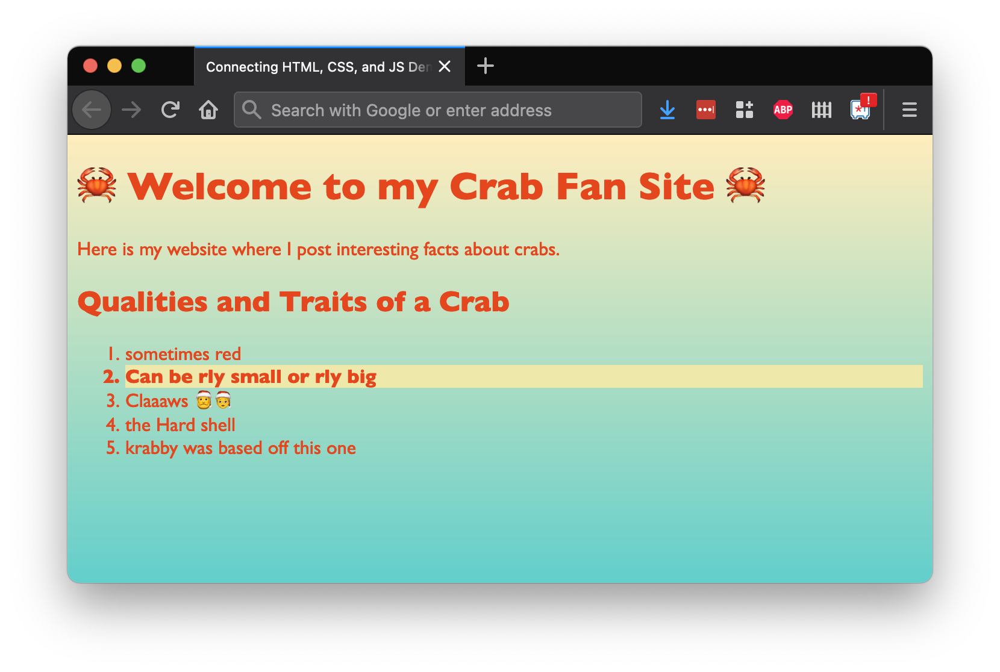
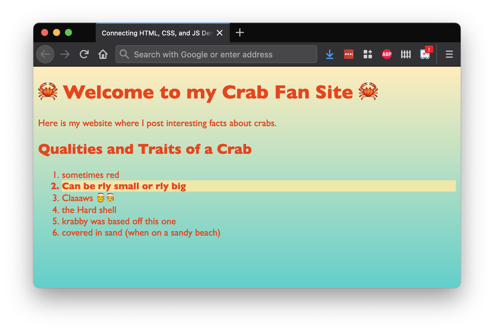

# Changing the DOM

<iframe src="https://adaacademy.hosted.panopto.com/Panopto/Pages/Embed.aspx?pid=0caa2a3a-ddfc-4b7a-b97c-addc0160432e&autoplay=false&offerviewer=true&showtitle=true&showbrand=false&captions=true&interactivity=all" height="405" width="720" style="border: 1px solid #464646;" allowfullscreen allow="autoplay"></iframe>

## Goals

The goal for this lesson is to display one of JavaScript's strengths: accessing and changing the DOM.

The skills we develop when learning how to use vanilla JavaScript to change the DOM will transfer to other front-end skills, such as working with React.

## Introduction

Keira is a crab enthusiast, and her enthusiasm for crustaceans goes as deep as the ocean. She's making a fan site for crabs. She's already made a draft website for it.

However, she's in a very strange situation—she knows what her `index.html` file will look like when it loads... but she wants to change how it will appear _after_ it loads. Keira needs to change the content and appearance of her site _after_ it loads in the browser, _without_ changing the HTML and CSS.

How can Keira accomplish her goal? She'll use JavaScript and her knowledge of the DOM to help her!

To change elements in the DOM, we'll need to learn two things:

- How to select HTML elements in the DOM
- How to specify the changes we want

## HTML Data in `document`

To work with the DOM, we need to learn how to access the DOM. To do that, let's run an experiment:

1. With _any_ website open, open the browser Dev Tools
1. Open the console
1. Type the statement `document`, and evaluate it by hitting `⏎ Return`

We should see the details of the document object print to the console.

  
_Fig. Using the browser Dev Tools to see the value of `document`_

The browser provides the global variable `document`. This variable represents the root node of the DOM.

The DOM represents all the HTML elements on a page. Because `document` is the root node of the DOM, we will use `document` to access and select other HTML elements.

Whenever we want to access the DOM, we'll start with the `document` object.

## Selecting Elements Using `document`

Before we can change a specific element, we first need to get a reference to the element by selecting it.

The `document` object has a number of methods that allow us to select specific HTML elements.

For example, the method `getElementById` will give us back the HTML element with a matching `id` attribute, or `null` if there are no matching elements.

```js
const fancyParagraphElement = document.getElementById("fancy-paragraph");
```

The above line initializes a `const` variable named `fancyParagraphElement`. It's set to the HTML element that has its `id` set to `fancy-paragraph`.

Here are a few built-in methods we can call using `document`, which are available to help us select HTML elements:

| <div style="min-width:250px;">Method</div>                   | Description                                                              |
| ------------------------ | ------------------------------------------------------------------------ |
| `getElementById`         | Returns the element that has the `id` attribute with the specified value   |
| `getElementsByClassName` | Returns a list containing all elements with the specified class name |
| `getElementsByTagName`   | Returns a list containing all elements with the specified tag name   |
| `querySelector`          | Returns the first element that matches the given CSS selector            |
| `querySelectorAll`       | Returns a list containing all elements that match the given CSS selector |

When we get back a list from `getElementsByClassName`, `getElementsByTagName`, or `querySelectorAll`, we'll need to access individual elements by using indexing or loops!

## Modifying Elements

Once we have our selected HTML element, we can modify it!

There are _many_ attributes and methods available for us to use on [HTML Element objects](https://www.w3schools.com/jsref/dom_obj_all.asp). The most appropriate ones to use will vary according to the needs of our situation.

Here are a few particularly useful built-in members of elements we might use:

| <div style="min-width:150px;">Attribute or Method</div> | Description                                                                                             |
| ------------------- | ------------------------------------------------------------------------------------------------------- |
| `textContent`       | Attribute. Sets or returns the textual content of a node and its descendants.                           |
| `className`         | Attribute. Sets or returns the CSS class attribute of an element.                              |
| `classList`         | Read-Only Attribute. A list of the CSS classes applied to the element. The list itself can be modified by using its `add()` and `remove()` methods. |
| `hasAttribute()`    | Method. Returns true if an element has the specified attribute, otherwise false.                        |
| `setAttribute()`    | Method. Sets or changes the specified attribute, to the specified value.                                |

### Example: Reading and Changing Text Content

Keira has [an `index.html` page that contains a heading with an `id` of `facts__heading`](https://replit.com/@adacore/Changing-the-DOM-Demo#index.html).

The text of this heading is incorrect. Keira knows that she could (and probably should!) simply edit the HTML, but she really wants to try out making changes through the DOM with JavaScript!

In her `index.js`, which she included with a `<script>` tag in her `index.html` file, she adds the following JavaScript to change the text content of the heading like so:

```js
const appearanceHeading = document.getElementById("facts__heading");

appearanceHeading.textContent = "Qualities and Traits of a Crab";
```

Here, she selects the desired heading element by its `id` using `document.getElementById()`. She stores this element in `appearanceHeading`.

Then, she sets its `textContent` attribute to `"Qualities and Traits of a Crab"`.

  
_Fig. Keira's crab fan site with an updated heading thanks to JavaScript!_

### Example: Changing Styles

How do we change the appearance of an element using JavaScript? We'll mix in our CSS skills, and add a CSS class to our selected element!

Keira's [`index.html` page](https://replit.com/@adacore/Changing-the-DOM-Demo#index.html) contains a very important fact in one element. This element has an `id` of `facts__fact--important`.

Keira wants to highlight this important fact by giving it a nice yellow background color, and making the text bolder.

She can create a new CSS class, `highlight`:

```css
.highlight {
  background-color: palegoldenrod;
  font-weight: bolder;
}
```

Then, she can select the important fact element and add this new class to the element:

```js
const importantFact = document.getElementById("facts__fact--important");

importantFact.className = `${importantFact.className} highlight`;
```

`className` is an attribute, not a method.

- To read the list of classes, we use the dot-operator
- To set the list of classes, we use the assignment operator

Note that she set `importantFact.className` to a string that interpolates the existing `importantFact.className` value! Since she wanted to _add_ the class `highlight`, and not _replace_ all the classes for the element, she included the current value of the element's classes.

  
_Fig. Keira's crab fan site showing off an important fact thanks to JavaScript!_

## Creating New Elements

Keira's crab fan site is really coming along! But there just aren't enough crab facts. _(Can there ever be?)_ Keira needs to add another fact to the list, stat!

Keira is getting a bunch of practice using JavaScript to work with the DOM, and now she wants to challenge herself to use the DOM to add entirely new content to the page!

She looks through the documentation for the `document` object and notices:

1. `document` has a method named `createElement`, which creates a new HTML element.
1. Every HTML element has a method named `appendChild`. This method adds a new child node to the element as the last child node.

With the `createElement` and `appendChild` methods in hand, now Keira can write [this code](https://replit.com/@adacore/Changing-the-DOM-Demo#scripts/index.js):

```js
const newAppearanceFact = document.createElement("li");

newAppearanceFact.textContent = "covered in sand (when on a sandy beach)";

const appearanceList = document.getElementById("facts__list");

appearanceList.appendChild(newAppearanceFact);
```

In [this example](https://replit.com/@adacore/Changing-the-DOM-Demo#scripts/index.js), after reloading the page, Keira is happy to see her new, sixth crab fact!

  
_Fig. Keira's crab fan site laying down the facts thanks to JavaScript!_

### !callout-info

## Keep Researching!

- How do we delete an element from the DOM?
- How do we select all the children of one specific element?
- How do we add a new element to the _beginning_ of the child list?
- Are there alternative approaches to what we accomplished in this lesson?

<br />

These are all valid questions that deserve research and experimentation using the DOM. Follow your curiosity!

### !end-callout

## Check for Understanding

<!-- Question 1 -->
<!-- prettier-ignore-start -->
### !challenge
* type: multiple-choice
* id: f92972c2
* title: Changing the DOM
##### !question

Every page can access the DOM through the global variable named:

##### !end-question
##### !options

* `dom`
* `document`
* `html`
* `index`

##### !end-options
##### !answer

* `document`

##### !end-answer
### !end-challenge
<!-- prettier-ignore-end -->

<!-- Question 2 -->
<!-- prettier-ignore-start -->
### !challenge
* type: multiple-choice
* id: a6eb83ae
* title: Changing the DOM
##### !question

We can access all HTML elements through the root node of the DOM because...

##### !end-question
##### !options

* The root node of a tree structure is the top node, and it can check all descending nodes
* The root node of a tree structure is the direct parent of all HTML elements on the page
* The root node is special and is the only HTML element we can put in a variable
* The root node has a lot of properties, and each HTML element is a property

##### !end-options
##### !answer

* The root node of a tree structure is the top node, and it can check all descending nodes

##### !end-answer
### !end-challenge
<!-- prettier-ignore-end -->

<!-- Question 3 -->
<!-- prettier-ignore-start -->
### !challenge
* type: multiple-choice
* id: ce1c5e9d
* title: Changing the DOM
##### !question

Which of the following best describes how we add a CSS class to an HTML element?

##### !end-question
##### !options

* The method, `className`
* The method, `appendChild`, but specify a CSS class
* The attribute, `className`
* The method, `querySelector`

##### !end-options
##### !answer

* The attribute, `className`

##### !end-answer
### !end-challenge
<!-- prettier-ignore-end -->
