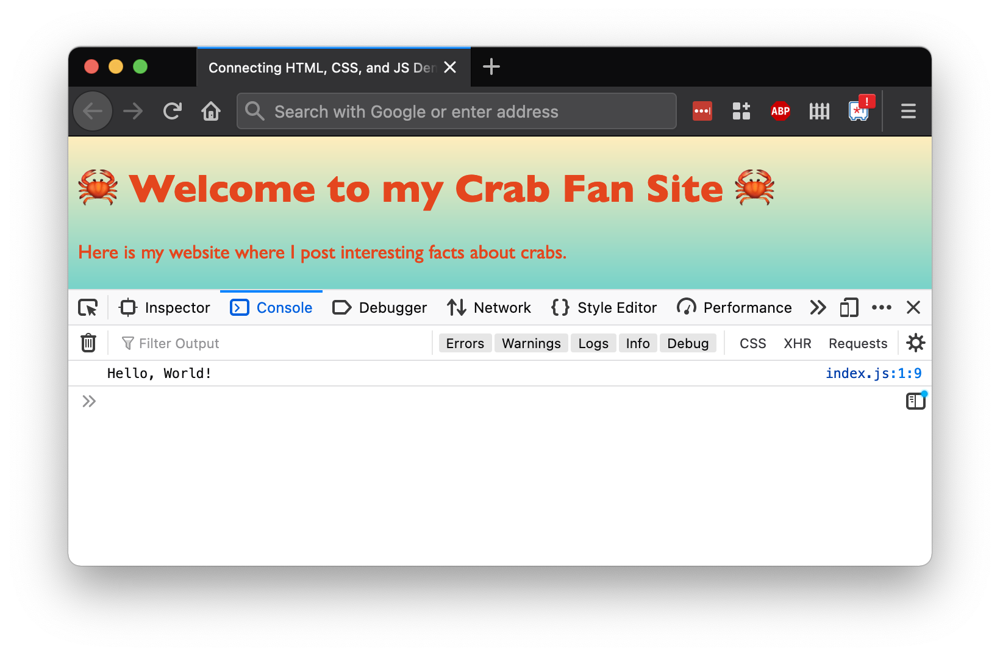
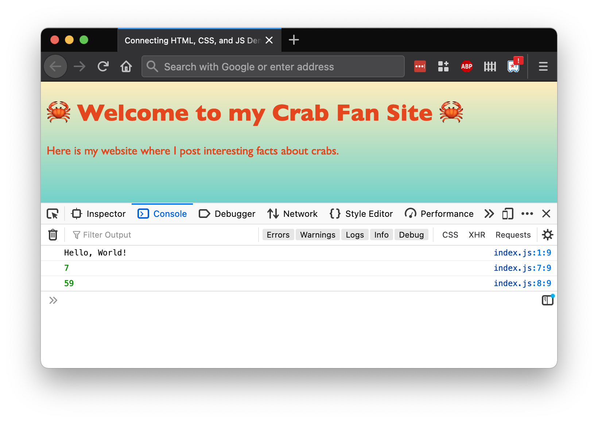
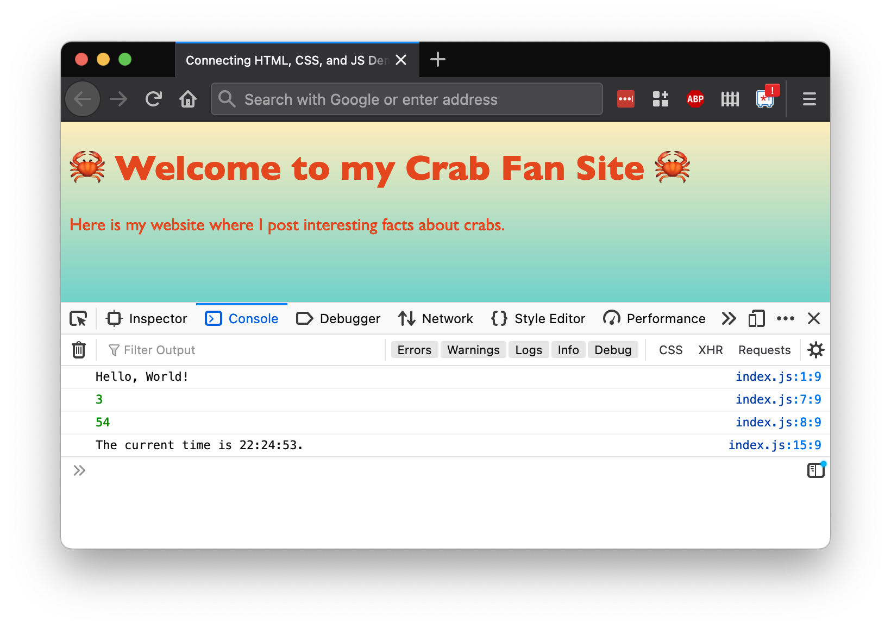

# Connecting HTML, CSS, and JS

<!-- SCRIPT_LOADING_UPDATES -->
<!-- <iframe src="https://adaacademy.hosted.panopto.com/Panopto/Pages/Embed.aspx?pid=9e30accc-216b-4a05-8e91-addc015fe713&autoplay=false&offerviewer=true&showtitle=true&showbrand=false&captions=true&interactivity=all" height="405" width="720" style="border: 1px solid #464646;" allowfullscreen allow="autoplay"></iframe> -->

### !callout-info

## This video uses an online JavaScript REPL

The video will walk through the same code in this lesson, however, in the video the instructor is using an online REPL tool rather than VS Code, so you will see some differences between how you run and view the project locally and how the instructor will run and view the project in the online tool. 

### !end-callout

## Goals and Introduction

JavaScript is special. It's a language that can run directly within web browsers, letting it access and modify the structure of any HTML being displayed! It is able to do this even for web pages that aren't served by a web server.

Over the years, other languages have tried to fulfill this function, but JavaScript has consistently remained the most popular browser-embedded language! This makes it our default programming language to use when adding behavior to websites.

Even though we won't need to start and run a server, we still need to connect our HTML, CSS, and JS files together before our JavaScript will run!

## Project Folder Structure

In our web projects, generally speaking, we can arrange our HTML, CSS, and JS files however we'd like. However, the following is a great structure to mimic:

```
.
├── src
│   └── index.js
├── styles
│   └── style.css
└── index.html
```

- We keep our main HTML file, `index.html`, in the root project folder.
  - Other HTML files can also be placed here, or in a folder named `pages`.
- We keep our CSS files in a folder named `styles`.
  - `style.css` is a great name for a generic CSS file.
  - If we made a CSS file for each HTML file, they files could share names (such as `index.css` to correspond to `index.html`).
- We keep our JS files inside a folder named `src`.
  - We can name our JS files based on their content, such as a `changeCursor.js` file to hold code that changes the mouse cursor, or a `scrollToTop.js` file to define scrolling behavior.
  - We can make a JS file for each HTML file, where the files could share names (such as `index.js` to correspond to `index.html`).

## Adding the Script Tag

In order for our website to load HTML, we add a link to our JavaScript file in our HTML using the `<script>` tag, similar to how we've included CSS. Just like CSS links, we can include multiple `<script>`s in one page, and by default the scripts will be loaded in order.

```html
<!-- index.html -->
...
<head>
  <!-- ... -->

  <script <optional async or defer attribute> src="src/index.js" type="text/javascript"></script>
</head>
```

Let's break down this line, which we'll place inside the head tag, usually right before the closing `</head>` tag.

| <div style="min-width:200px;"> Piece of Code </div> | Notes                                                                              |
| --------------------------------------------------- | ---------------------------------------------------------------------------------- |
| `<script`                                           | Begins a `<script>` tag, a tag used to embed JavaScript                            |
| <optional async or defer attribute>                 | We can optionally add the `async` or `defer` attributes to help us control how the script will load and execute |
| `src=`                                              | The `src` attribute holds the relative path to the JavaScript file we want to load |
| `"src/index.js"`                                    | **Replace this** with the relative path from this HTML file to the JS file         |
| `type="text/javascript">`                           | An attribute that specifies that we're linking a JS file                           |
| `</script>`                                         | A closing tag                                                                      |

A new twist with scripts, is that we need to consider how we want to load the script for the best user experience. The `<script>` tag in JavaScript has a couple optional attributes, `async` and `defer`, that we can use to change how our page will handle loading and then running a script.

When a browser encounters a `<script>` tag without `async` or `defer`, it stops loading the HTML document. The browser pauses to download the _entire_ script, which might take a long time to load, and then it executes the script. The browser continues rendering the page only after the script has finished downloading and running. This has 2 significant issues:
- The webpage may only be partially loaded when it pauses for the script, and the site will be unresponsive until the script has finished downloading and running.
- If the script needs to interact with the DOM, the DOM will not have finished loading and the script will encounter errors.

We don't want an unresponsive site or errors, so let's dive into what `async` and `defer` do, and how they can help us.

| Attribute | What is does | When it's useful |
| --------- | ------------ | ---------------- |
| `async` | Makes the script download asynchronously alongside the DOM being built, and once the script has finished loading, the DOM will pause for the script to run. If there are multiple `async` scripts, they will run in the order that they finish loading *not* the order that they are listed in the HTML. | When we have a script that might take some time to download, but does not require manipulating the DOM, since the DOM is not guaranteed to be completely loaded when the script runs.
| `defer` | Will also download the script asynchronously, but then waits until the DOM is complete before executing the script. If there are multiple `async` scripts, they will run in the order that they are listed in the HTML. | When we need a script to interact with the DOM or when we want our scripts execute in a specific order. |

```html
<!-- index.html -->
...
<head>
  <!-- ... -->

  <!-- Will download asynchronously, then pause DOM loading to execute. -->
  <!-- We don't know the order that these scripts will run. -->
  <!-- If index_2.js finishes loading before index_1.js, then index_2.js will run first.  -->
  <script async src="src/index_1.js" type="text/javascript"></script> 
  <script async src="src/index_2.js" type="text/javascript"></script> 

  <!-- Will download asynchronously, then execute once the DOM is complete -->
  <!-- index_1.js and index_2.js will always run before these scripts with `defer`. -->
  <!-- index_3.js will always run before index_4.js. -->
  <script defer src="src/index_3.js" type="text/javascript"></script>
  <script defer src="src/index_4.js" type="text/javascript"></script>
</head>
```

We will typically use either `async` or `defer` with our script tags. Which attribute we choose to use for any given script in our projects will depend on what the script does and the desired experience for users. 
- Feel free to follow your curiosity if you want to learn more about these attributes and loading scripts! We recommend [the MDN docs](https://developer.mozilla.org/en-US/docs/Web/HTML/Reference/Elements/script#async_and_defer) as a great place to start.

## Example: Hello, World!

Let's make a "Hello, World!" program that helps us see how HTML, CSS, and JS connect. We have [a scaffolded repo](https://github.com/AdaGold/connecting-html-css-js-demo) with the code for this lesson, but we encourage folks to follow along locally by practicing creating a project and the files necessary.

In a project, we can create the file, `src/index.js`:

```js
console.log('Hello, World!');
```

Then, we can create a minimal `index.html` file. The contents don't matter in this exercise, except that we need to keep the `<script>` tag:

```html
<!DOCTYPE html>
<html>
  <head>
    <meta charset="utf-8">
    <meta name="viewport" content="width=device-width">
    <title>Connecting HTML, CSS, and JS Demo</title>
    <link href="styles/style.css" rel="stylesheet" type="text/css" />
    <script async src="src/index.js"></script>
  </head>
  <body>
    <main>
      <h1>🦀 Welcome to my Crab Fan Site 🦀</h1>
      <p>Here is my website where I post interesting facts about crabs.</p>
    </main>
  </body>
</html>
```

### Observing the Console

When we [open our HTML file in our browser](https://github.com/AdaGold/connecting-html-css-js-demo/blob/main/index.html), we should see our beautiful crab fan site.

When our HTML page loads the JS file designated in the `<script>` tag, _the browser runs the JS file immediately_. Therefore, our `console.log('Hello, World!');` should have been executed.

We can look at the console by:

- Using the provided console, if the website is being built on Replit.com
- Using the browser Dev Tools, in the tab labeled "Console."

  
_Fig. Inspecting the browser console using the browser Dev Tools._

This experiment proves the following things to us:

1. We can connect our HTML, CSS, and JS files successfully
2. JS files run immediately after the script loads using the `<script>` tag
3. We can access the console through the browser Dev Tools

### !callout-info

## Refresh Often

If we cannot see the print statement in the console, try refreshing the page while the Dev Tools are open. Refreshing the page reloads the HTML page, and therefore also reloads and re-runs the JS file. We'll need to refresh the page any time we want to see changes in our HTML, CSS, or JS files.

### !end-callout

## Example: Random Number

We can put any valid JavaScript code we want in the script file, as long as our browser can run it. This includes making functions, calling them, creating objects, and so on.

For example, we can add in the following code to our `src/index.js` file:

```js
const getRandomNumber = (max) => {
    return Math.floor(Math.random() * (max + 1));
};

console.log(getRandomNumber(10));
console.log(getRandomNumber(100));
```

The above code creates a function `getRandomNumber`, which takes in a number `max`, and returns a random integer between 0 and `max` (inclusive).

Then, it calls that function, and prints out the result to the console. First, it calls the function after passing in `10`, and then again with the argument `100`.

When we reload our HTML page, our random numbers should print to the console. When we reload again, we'll (probably) get other random numbers.



## Example: Current Time

Let's extend our JavaScript with one more example.

We can add the following code to `src/index.js`:

```js
const getCurrentTime = () => {
    const currentDate = new Date();
    return currentDate.getHours() + ":" + currentDate.getMinutes() + ":" + currentDate.getSeconds();
};

console.log(`The current time is ${getCurrentTime()}.`);
```

This code creates a function `getCurrentTime`, which will return a formatted string of the current time when the function is called. Then, we call that function and print it to the console.

  
_Fig. The result of printing the current time in the console_

As we would expect, we see the time when the script executed printed to the console. As we refresh the page, we will see the updated time printed.

## Check for Understanding

<!-- prettier-ignore-start -->
### !challenge
* type: multiple-choice
* id: deff39a1
* title: Connecting HTML, CSS, and JS
##### !question

We are working on a site with a script that will load up some pieces of user data. The retrieved data doesn't need to be shown to the user until the user has interacted with a certain part of the page. 

Would `async` or `defer` be a better fit for the `<script>` tag in this example?

##### !end-question
##### !options

* `async`
* `defer`

##### !end-options
##### !hint

If a user needs to interact with the site before the data would be shown anywhere, does the DOM need to exist before the data is loaded?

##### !end-hint
##### !answer

* `async`

##### !end-answer
##### !explanation

In this case we can use `async`. The script is fetching data to use later, it doesn't need the DOM to be ready since we aren't trying to display that information anywhere yet.

##### !end-explanation
### !end-challenge
<!-- prettier-ignore-end -->

<!-- prettier-ignore-start -->
### !challenge
* type: multiple-choice
* id: deff39a1
* title: Connecting HTML, CSS, and JS
##### !question

We are working on a site with 2 scripts:
- `load_data.js` which handles loading data for the site 
- `process_data.js` which processes the data from the first script into a format that the website can display

The script tags in the HTML are ordered with `load_data.js` listed first and `process_data.js` listed second.

Would `async` or `defer` be a better fit for the `<script>` tags in this example?

##### !end-question
##### !options

* `async`
* `defer`

##### !end-options
##### !hint

`process_data.js` depends on the data from `load_data.js` to be available. How can we ensure that `load_data.js` executes first?

##### !end-hint
##### !answer

* `defer`

##### !end-answer
##### !explanation

We would want to use `defer` here. When we use `async` whichever script downloads first will execute first, so the scripts might not run in the correct order. If we use `defer` then since `load_data.js` is listed first, it will run first, ensuring the data will be available for `process_data.js`.

##### !end-explanation
### !end-challenge
<!-- prettier-ignore-end -->