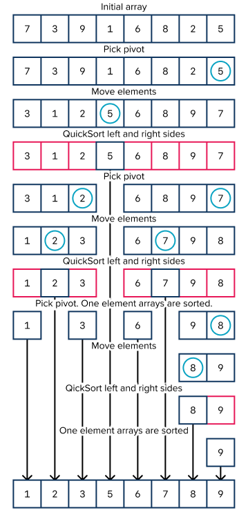

# Divide & Conquer

## Learning Goals

By the end of this less you should be able to:

- Explain what a divide & conquer solution is
- Write some divide & conquer solutions

## Overview

_Divide & Conquer_ is an algorithmic paradigm. This means it's an approach to problem solving. You have already seen such solutions previously. When we wrote a binary search, we we will revisit below we divided the problem into an easier-to-solve subproblem and then solved the subproblem. As we will see MergeSort works similarly.

When we write a divide & conquer solution we normally:

1. Break the problem into subproblems of the same type.
2. Recursively solve the subproblems
3. Combine the solved subproblems to solve the larger problem

## Terms

| Term             | Definition                                                                                                                                                                                                                                                                                                                                                                                                | How to Use in a Sentence |
| ---------------- | --------------------------------------------------------------------------------------------------------------------------------------------------------------------------------------------------------------------------------------------------------------------------------------------------------------------------------------------------------------------------------------------------------- | ------------------------ |
| Divide & Conquer | In computer science, divide and conquer is an algorithm design paradigm based on multi-branched recursion. A divide-and-conquer algorithm works by recursively breaking down a problem into two or more sub-problems of the same or related type, until these become simple enough to be solved directly. The solutions to the sub-problems are then combined to give a solution to the original problem. |                          |
| Pivot            | An element used in Quicksort to divide the array into two sections, one section less than the pivot and the other greater than the pivot. The choice of the pivot has enormous implications to the efficiency of QuickSort.                                                                                                                                                                               |                          |

## Example: Binary Search

We will start with a previously discussed algorithm, Binary Search.

With binary search we select the middle of the given range in an array. If we find the element we return it. Otherwise we determine if the element is in the left or right of the array and performs binary search in the proper half.

Each iteration divides the array in half and performs the binary search on a smaller subproblem.

```ruby
def recursive_binary_search(array, to_find, low = 0, high = array.length - 1)
  mid = (high + low) / 2

  return nil if high < low

  if array[mid] == to_find
    return mid
  elsif array[mid] > to_find
    return recursive_binary_search(array, to_find, low, mid - 1)
  else
    return recursive_binary_search(array, to_find, mid + 1, high)
  end
end
```

You can see a nice animation of Binary search on [Daniel Liang's website](http://www.cs.armstrong.edu/liang/animation/web/BinarySearch.html).

## Example: QuickSort

QuickSort is a sorting algorithm which takes a divide & conquer approach to solving these steps.

1. If the array is only one element or empty, you are done, the array is sorted.
1. Pick an element from the array as a _pivot_.
1. Move all elements smaller than the pivot to the left and all elements larger than the piviot to the right. Note that the pivot is now in the correct index.
1. Perform QuickSort on the left and right sides of the pivot.



So in terms of Divide & Conquer, you pick a pivot and move elements smaller to the left and larger to the right and you have two smaller subproblems. Then you call quicksort on each section, which is a smaller subproblem.

If the pivot is relatively well chosen you will divide the list `log n` times, and shift at most `n` elements with each level of division arriving at an O(n log n) runtime.

**Weakness of QuickSort**: The Pivot

Notice however we said, **if** the pivot is well chosen. If the pivot does not break the list into two relatively equal subarrays it will not arrive at an O(n log n) runtime. Instead it will approach O(n<sup>2</sup>) runtime.

For example if with each iteration the pivot is the smallest remaining element in an array, rather than splitting the array into approximately n/2 sized pieces, instead you have one subarray of size n-1.

You can see an animation of quicksort on [hackerearth.com](https://www.hackerearth.com/practice/algorithms/sorting/quick-sort/visualize/)

## Example: MergeSort

Merge sort is a _divide-and-conquer_ algorithm. It involves the following three stages:

1. **Divide** the array into two sub-arrays at each step until each sub-array is of size one.
1. **Sort** each sub-array. (An array of size one is sorted by default.)
1. **Merge** the sub-arrays into one array by combining two sub-arrays into one at each step.

This is usually done by keeping track of three indices in the array: _starting index_, _ending index_ and _midway index_ as shown in the image below.


As you can see in the image above, in the first _divide_ step, the original array of size eight gets divided into two sub-arrays of size four each. This is done by setting _starting index_ to _0_, the index of the first element in the array and the _ending index_ set to the index of the last element in the array. The _midway index_ is then computed using the formula:
&nbsp;&nbsp;&nbsp;&nbsp;_midway index_ = (_starting index_ + _ending index_)/2

For the first _divide_ step, the _midway index_ will be _(0+7)/2_ i.e. _3_ (by considering the floor of _3.5_).
In the next _divide_ step, we have two sub-arrays, one ranging in index from _0_ to _3_ and the other ranging in index from _4_ to _7_. The sub-arrays are not yet of size one. So, the same action gets repeated to compute the _midway index_. This _divide_ stage continues until the original array of size _n_ is reduced to sub-arrays of size _1_ each.

A sub-array of size one is trivially, and by default sorted.

The _merge_ stage starts by combining two sub-arrays at a time. While combining the sub-arrays containing _7_ and _2_ respectively, the values in each is compared, the smaller value i.e. _2_ is written to the lower index, and the higher value i.e. _7_ is written to the higher index. The mergining process continues in this manner. An auxiliary array of size _n_ is often used to faciliate the merge steps.

Consider the two sub-arrays _[1, 2, 7, 8]_ and _[3, 5, 6, 9]_ in the final merge step in our example image above.

- We start with comparing _1_ with _3_. The smaller value, _1_ gets written to the auxiliary array. (Auxiliary array: _[1]_)
- Next, we compare _2_ with _3_. _2_ gets written to the auxiliary array. (Auxiliary array: _[1, 2]_)
- Next, we compare _7_ with _3_. _3_ gets written to the auxiliary array. (Auxiliary array: _[1, 2, 3]_)
- Next, we compare _7_ with _5_. _5_ gets written to the auxiliary array. (Auxiliary array: _[1, 2, 3, 5]_)
- Next, we compare _7_ with _6_. _6_ gets written to the auxiliary array. (Auxiliary array: _[1, 2, 3, 5, 6]_)
- Next, we compare _7_ with _9_. _7_ gets written to the auxiliary array. (Auxiliary array: _[1, 2, 3, 5, 6, 7]_)
- Next, we compare _8_ with _9_. _8_ gets written to the auxiliary array. (Auxiliary array: _[1, 2, 3, 5, 6, 7, 8]_)
- At this point, all elements of the first sub-array have been merged. So, all remaining elements of the second sub-array get copied over linearly to the auxiliary array. In this case, only one element is left in the second sub-array. So, _9_ gets copied over to the auxiliary array. (Auxiliary array: _[1, 2, 3, 5, 6, 7, 8, 9]_)

This two-way merging continues until there are no more sub-arrays and the orignal array is completely soorted. Finally, the auxiliary array gets linearly copied back to the original array.

**Analysis:** The time complexity of merge sort is _(n log n)_. Let's look closer to understand this.

- **Divide**: Finding the midway index is a straightforward computation (_midway index_ = (_starting index_ + _ending index_)/2). This takes constant time regardless of the subarray.
- **Merge**: Merging a total of _n_ elements takes _O(n)_ time. If there are two sub-arrays of size _n/2_ each, then we will compare one element from one sub-array with another element from the second sub-array and one of the two will get copied. This step will continue until all are copied, taking a total of _O(n)_ time.
- As the sub-problems get smaller, the number of sub-problems doubles at each level, but the merging time halves. The doubling and halving cancel each other out and so the merging takes _O(n)_ time at each level of the merge steps (as seen in the image above).
- **Base case**: In the base case, we have sub-arrays of size _1_ and a total of _n_ subarrays. It takes _O(1)_ time to sort an array of size one. Overall, merging at base level is _O(n)_ time, just like any other level.
- **Count of levels**: Starting with _n_ elements and reducing by half at each level, until we reach one element sized array takes _log n_ steps. Similarly, starting with sub-arrays of one element each and combining two sub-arrays at a time until we reach an array of _n_ elements also takes _log n_ steps.
  Overall, each level takes _O(n)_ time. There are _O(log n)_ such levels. Resulting in an overall time complexity of O(n log n) for merge sort.

Note: We will look closer at merge sort and its implementation when we discuss _Recursive algorithms_ in the future.

For small arrays insertion sort performs better than merge sort, but as the size of the array grows merge sort becomes much more performant. There are other O(n log n) sorting algorithms, notably [Quick Sort](https://www.geeksforgeeks.org/quick-sort/), and [Heap Sort](https://medium.com/@allegranzia/heap-sort-in-ruby-acab02b57d44).

## Exercise - Merging Two Sorted Arrays

[To be worked on together in repl.it](https://repl.it/@ChrisMcAnally/MergeSortedArrays#main.rb)

Given two sorted integer arrays nums1 and nums2, merge nums2 into nums1 as one sorted array.

**Note:**

The number of elements initialized in nums1 and nums2 are m and n respectively.

You may assume that nums1 has enough space (size that is greater or equal to m + n) to hold additional elements from nums2.

**Example:**

**Input:**
nums1 = [1,2,3,0,0,0], m = 3
nums2 = [2,5,6], n = 3

**Output:**
[1,2,2,3,5,6]

## Summary

Divide & Conquer is an algorithmic strategy which involves breaking down a large problem into easier-to-solve subproblems.

In a divide and conquer solution we break a large problem into one or more smaller subproblems and then use the solution to the subproblems to solve the larger problem.  

## Resources

- [Wikipedia: Divide & Conquer](https://en.wikipedia.org/wiki/Divide-and-conquer_algorithm)
- [Geeks for Geeks: Python Program for QuickSort](https://www.geeksforgeeks.org/python-program-for-quicksort/)
