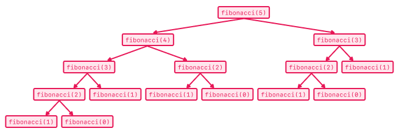

# Dynamic Programming

Dynamic programming is a way to optimize a recursive or iterative solution.  When we see a problem that repeatably involves solving the same problem repeatably we can optimize it by using Dynamic programming.  The key concept is to recognize subproblems we solve repeatably and store the solutions to those problems, also called _memoizing_, to use the stored solutions in solving larger problems.

Dynamic Programming is in some ways similar to Divide & Conquer.  A Dynamic Programming problem breaks the problem into subproblems and saves the solutions to those subproblems.  The key difference is that in dynamic programming the subproblems are often overlapping and stored.  In a divide and conquer problem the larger problems is divided into two non-overlapping subproblems and the solutions to each subproblem is used to solve the larger problem.

## Fibonacci

The classic Fibonacci sequence is inherently recursive, but also inefficient to solve in a straightforward recursive manner.  

In the Fibonacci sequence Fib(n):

Fib(0) = 0, for n = 0
Fib(1) = 1, for n = 1
Fib(n) = Fib(n-1) + Fib(n-2), for n > 1

We could code the Fibonacci sequence as follows:

```ruby
def fibonacci(n)
  if n == 0 || n == 1
    return n
  end

  return fibonacci(n-1) + fibonacci(n-2)
end
```

However this is widely inefficient.  Note below for the Fibonacci of 5, how `Fibonacci(2)` is called 3 times.  `Fibonacci(1)` is called 5 times.  As `n` grows larger, this occurs more and more often.  For any n > 1, we end up making 2<sup>n</sup> method calls!  



Instead of solving the same problems over and over again we can solve these problems by storing them  in a `memo` and using the stored subproblems to make calculating the larger problem more efficient.

Below we have dynamic programming solutions, both iterative & recursive.

```ruby
 Iterative Solution
def fibonacci(n)
  if n == 0 || n == 1
    return n
  end

  solutions = [0, 1]
  current = 2

  while current < n
    solutions << solutions[current - 1] + solutions[current - 2]
    current += 1
  end

  return solutions[current - 1] + solutions[current - 2]
end

 Recursive Solution

def fibonacci_recursive(n)
  return fib_helper([0, 1], 2, n)
end

def fib_helper(solutions, current, n)
  return n if n == 0 || n == 1

  if current == n
    return solutions[n - 1] + solutions[n-2]
  end

  solutions << solutions[current - 1] + solutions[current -2]
  return fib_helper(solutions, current + 1, n)
end
```

**Question** Note how to solve Fibonacci(n) we only need Fibonacci(n-1) and Fibonacci(n-2).  Can we reduce our space complexity from O(n) to O(1).  Discuss with your neighbor how you can do so for the iterative solution.

## Dynamic Programming in a Nutshell

This is taken from Quora's [How to explain Dynamic Programming to a 4-year-old?](https://www.quora.com/How-should-I-explain-dynamic-programming-to-a-4-year-old/answer/Jonathan-Paulson)

```
*writes down "1+1+1+1+1+1+1+1 =" on a sheet of paper*
"What's that equal to?"
*counting* "Eight!"
*writes down another "1+" on the left*
"What about that?"
*quickly* "Nine!"
"How'd you know it was nine so fast?"
"You just added one more"
"So you didn't need to recount because you remembered there were eight! Dynamic Programming is just a fancy way to say 'remembering stuff to save time later'"
```

## Problem:  Longest Common Subsequence

**With your neighbor attempt to solve the following problem:**

Given two strings `text1` and `text2`, return the length of their longest common subsequence.

A subsequence of a string is a new string generated from the original string with some characters(can be none) deleted without changing the relative order of the remaining characters. (eg, "ace" is a subsequence of "abcde" while "aec" is not). A common subsequence of two strings is a subsequence that is common to both strings.

If there is no common subsequence, return 0.

### Example 1:


**Input:** text1 = "abcde", text2 = "ace" 

**Output:** 3 

**Explanation:** The longest common subsequence is "ace" and its length is 3.
 
### Example 2:

**Input:** text1 = "abc", text2 = "abc"

**Output:** 3

**Explanation:** The longest common subsequence is "abc" and its length is 3.

### Example 3:

**Input:** text1 = "abc", text2 = "def"

**Output:** 0

**Explanation:** There is no such common subsequence, so the result is 0.
 
