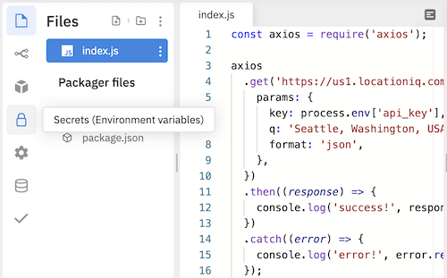

# GET Requests With axios

## Goals

- Request data from an API to render client-side using JavaScript
- Render data from server without reloading a page
- Use axios to make HTTP GET requests

## Introduction

Jamel is working on the JavaScript front-end of his app called DogSpotter, in which he records the locations of dogs he spots in the neighborhood where he lives.

Jamel needs to get a source of dog breeds. He's not an expert on dogs, but he learns that there's an API that will help him get this data: [The Dog CEO API](https://dog.ceo/dog-api/documentation/).

He's made API calls in other programming languages before, but he needs to get up to speed on how to call this one now. What can Jamel do to learn how to make API calls?

After doing some research, Jamel learns two things:

- He will choose to use a package named `axios` to make API calls. He needs to learn the syntax for using this library.
- API calls in JavaScript typically execute _asynchronously_. Jamel will learn a little bit about what that means to help him understand his code.

<!-- To make a `GET` request, our goal is to answer the following questions:

1. What is the library/tool that will help us make `GET` requests in JavaScript?
1. How do we make the `GET` request, which is now an asynchronous call?
1. What will happen if the `GET` request finishes successfully, and gives us back a successful response?
1. What will happen if the `GET` request does **not** finish successfully, and gives us back a failure response code? -->

## Our tool, `axios`

There are a lot of technologies and tools that enable JavaScript to make HTTP Requests. Of these choices, let's imagine that Jamel chooses to use the package [`axios`](https://github.com/axios/axios).

Jamel can read through the [`axios` documentation](https://github.com/axios/axios) to find the following:

1. How do we include/load the `axios` package into our JavaScript file?
1. How do we make the `GET` request?
1. How do we determine what to do if the `GET` request finishes successfully?
1. How do we determine what to do if the `GET` request fails?
1. What does "finish successfully" mean to `axios`?

Let's see what answers we can get when we observe [the following code that makes a `GET` request](https://replit.com/@adacore/GET-Requests-With-axios-Demo#index.js):

```js
const axios = require('axios');

axios
  .get('some URL')
  .then((response) => {
    // Code that executes with a successful response goes here
  })
  .catch((error) => {
    // Code that executes with an unsuccessful response goes here
  });
```

| <div style="min-width:170px;"> Piece of Code </div> | Notes                                                                                                                                                                                                                              |
| --------------------------------------------------- | ---------------------------------------------------------------------------------------------------------------------------------------------------------------------------------------------------------------------------------- |
| `const axios =`                                     | We will use the `const` variable `axios` to hold the axios library functionality.                                                                                                                                              |
| `require('axios');`                                 | The `require` function finds the exported objects defined in another module or file, and imports them. In this case, we are importing the exported objects defined in the `axios` module.                                           |
| `axios.get( ... )`                                  | This function call sends a `GET` request                                                                                                                                                                                           |
| `'some URL'`                                        | **Replace this** with the request URL                                                                                                                                                                                              |
| `.then( ... )`                                      | This function call, which is _chained_ off `axios.get()`, determines what happens if the `GET` request gives back a successful response. It takes in one argument: a function.                                                      |
| `(response) => { ... }`                             | We pass in a function as the argument to `then()`. Here, we are passing in an anonymous arrow function containing the logic to run when we get a response. This function can accept one parameter: a parameter that represents the HTTP response. We've named this `response` to help us remember its intended usage, but there's nothing special about the name `response` itself. |
| `.catch( ... )`                                     | This function call, which is _chained_ off of `axios.get().then()`, determines what happens if the request is _unsuccessful_ and throws an error. This function also expects one argument: a function.                           |
| `(error) => { ... }`                                | The function we pass into `catch` is an anonymous arrow function containing the logic to run when we encounter an error. This function can accept an argument that represents the error object. We've named this `error` to help us remember its intended usage, but there's nothing special about the name `error` itself.                                                                                      |

### !callout-info

## "Successful" Response Vs. "Unsuccessful"

`axios` defines "success" as any response with a `2XX` status code. Therefore, responses with a `2XX` status code will go into `then`, and all responses outside a `2XX` status code will go into `catch`.

### !end-callout

## Sending an HTTP Request

Now that Jamel has reviewed the syntax for making a `GET` request, Jamel wants to get [a list of all dog breeds from the Dog CEO API](https://dog.ceo/dog-api/documentation/).

He's figured out that his request should look like the following:

- `GET` request to `https://dog.ceo/api/breeds/list/all`
- No query params

He expects the response to look like:

```json
{
  "message": {
    "affenpinscher": [],
    "african": [],
    "airedale": [],
    "akita": [],
    "appenzeller": [],
    "australian": ["shepherd"]
    // ...
  },
  "status": "success"
}
```

### Verifying the Request Works

First, before Jamel implements his full API call, he wants to prove that he can get _some_ kind of response from the API call! If the response is successful, he'll print to the console, "success!" If it's unsuccessful, he'll print "error!"

We can apply the above pattern to write [this code](https://replit.com/@adacore/GET-Requests-With-axios-Demo#index.js):

```js
const axios = require('axios');

axios
  .get('https://dog.ceo/api/breeds/list/all')
  .then(() => {
    console.log('success!');
  })
  .catch(() => {
    console.log('error!');
  });
```

Assuming that the web API is currently working, we should get the following output from this code:

```
success!
```

### Diving Into Chaining `then` and `catch`

Note the `.` that is before `then` and `catch`. Let's pause on this syntax. Taking the time to think about it now will help us understand this pattern (and JavaScript!) more fully in the future.

Let's inspect the `then` and `catch` code with no newlines, and with some information taken away:

```js
axios.get( ... ).then( ... ).catch( ... );
```

With this spacing, we can more clearly see:

1. `get()` is a function that is called on the `axios` library object
1. `then()` is a function that is called on the result of `axios.get()`
1. `catch()` is a function that is called on the result of `axios.get().then()`

These function calls are chained onto each other. `axios` is written specifically to enable this usage pattern whenever we make an HTTP request.

This pattern may look different from how we have structured our code to this point, but each method is still returning a result, and that result is being used as the object for the next method call.

### !callout-info

## What's That Object?

Simply from looking at this code, we can't really tell what _kind_ of object is returned from the call to `axios.get()`, but we can tell that it must at least have a method called `then`. Similarly, we can't tell what _kind_ of object is return from the call to `axios.get().then()`, but we can tell that it must at least have a method called `catch`.

<br />

In fact, both objects are of a type called a `Promise`, which is a very important type for how JavaScript approaches asynchronous code. Follow your curiosity!

### !end-callout

### !callout-warning

## Chained Function Calls Are in the Same Statement

Be mindful to not accidentally put a `;` before calling `then()` or `catch()`!

### !end-callout

### `then` and `catch` Accept Anonymous or Named Functions

Let's also inspect the anonymous functions we wrote. The function that we pass into `then()` is responsible for determining what happens when we get a successful response. This function can accept one argument, which we expect to be the `response` from the previous `get()` call.

Similarly, the function we pass into `catch()` is responsible for handling unsuccessful responses. This function also can accept one argument, which we expect to be details about the `error` from the previous `get()` call.

We can provide anonymous functions:

```js
axios
  .get('https://dog.ceo/api/breeds/list/all')
  .then((response) => {
    // ...
  })
  .catch((error) => {
    // ...
  });
```

Or named functions:

```js
const axios = require('axios');

const printSuccess = (response) => {
  console.log('success!');
};
const printError = (error) => {
  console.log('error!');
};

axios
  .get('https://dog.ceo/api/breeds/list/all')
  .then(printSuccess)
  .catch(printError);
```

### The `response` and `error` Objects

The `response` and `error` objects in the callback functions contain a lot of great information. To understand more [about the response and error objects, we should check the documentation](https://github.com/axios/axios#response-schema). Below, we will also print the values of:

- `response`
- `response.status`
- `response.headers.date`
- `response.data`
- `error`
- `error.response.status`
- `error.response.data`

We can use these print statements to understand the shape of the `response` and `error` objects without the documentation.

```js
const axios = require('axios');

axios
  .get('https://dog.ceo/api/breeds/list/all')
  .then((response) => {
    console.log('The value of response is:', response);

    console.log('The value of status inside of response is:', response.status);

    console.log(
      'The date inside header inside response is:',
      response.headers.date
    );

    console.log('The data given back by the API response is:', response.data);
  })
  .catch((error) => {
    console.log('The value of error is:', error);

    console.log(
      'The value of status inside of response is:',
      error.response.status
    );

    console.log(
      'The data given back by the API response is:',
      error.response.data
    );
  });
```

<!-- Question 1 -->
<!-- prettier-ignore-start -->
### !challenge
* type: multiple-choice
* id: b27e89d8
* title: GET Requests With axios
##### !question

Which of the following options will give back the HTTP response body, which is the data that Jamel is expecting from the API?

##### !end-question
##### !options

* `response`
* `response.status`
* `response.headers.date`
* `response.data`

##### !end-options
##### !answer

* `response.data`

##### !end-answer
### !end-challenge
<!-- prettier-ignore-end -->

### Verifying the Error Handling

How can we check that an unsuccessful response goes into the `catch` block? One approach we can take is to send a request to an invalid URL.

Let's change the URL to `'https://dog.ceo/api/breeds/notarealendpoint/'`, so we can look at what happens when we get an error response.

<!-- Question 2 -->
<!-- prettier-ignore-start -->
### !challenge
* type: multiple-choice
* id: 7cbb2b75
* title: GET Requests With axios
##### !question

In the case of handling an unsuccessful request, which of the following options gives back the HTTP response body, which contains the data that the API sent back?

##### !end-question
##### !options

* `error`
* `error.response.status`
* `error.response.data`

##### !end-options
##### !answer

* `error.response.data`

##### !end-answer
### !end-challenge
<!-- prettier-ignore-end -->

### `finally`

`axios` supports a `finally` clause, which will run after either the `then` or `catch` no matter what.

The `finally` clause does not receive any parameters, so we should only use `finally` for logic that should _always_ run, regardless of the reason for success or failure, such as resetting some application state.

Using the `finally` clause looks like this:

```js
const axios = require('axios');

axios
  .get('https://dog.ceo/api/breeds/list/all')
  .then((response) => {
    console.log('success!');
  })
  .catch((error) => {
    console.log('error!');
  })
  .finally(() => {
    console.log('this is always executed, no matter what!');
  });
```

## Query Params

As part of Jamel's DogSpotter app, he needs to find the latitude and longitude of Seattle, Washington, USA. He'll use the [LocationIQ Geocoding API](https://locationiq.com/sandbox/geocoding/forward).

After looking at [the docs for Search/Forward Geocoding](https://locationiq.com/docs), Jamel determines that his request should look like this:

- `GET` request to `https://us1.locationiq.com/v1/search.php`
- Query Params:
  - `key`: the API key
  - `q`: A search term. In this case, `'Seattle, Washington, USA'`
  - `format`: `'json'`

He expects a response body that looks like:

```json
[
  {
    "place_id": "235549103",
    "licence": "https://locationiq.com/attribution",
    "osm_type": "relation",
    "osm_id": "237385",
    "boundingbox": [ "47.4810022", "47.7341357", "-122.459696", "-122.224433" ],
    "lat": "47.6038321",
    "lon": "-122.3300624",
    "display_name": "Seattle, King County, Washington, USA",
    "class": "place",
    "type": "city",
    "importance": 0.8929791735643791,
    "icon": "https://locationiq.org/static/images/mapicons/poi_place_city.p.20.png"
  },

  // possibly other matches
]
```

To figure out how to add query params to our `GET` request, Jamel can research the `axios` documentation.

He learns that to add query params, he utilizes `axios.get()`'s second parameter. This function takes in an optional "config" object.

Within this "config" object, there we can add in a key `params`. The value of `params` should be another object.

This `params` object should contain the key-value pairs we want to send as query params.

Jamel's code eventually looks [like this](https://replit.com/@adacore/GET-Requests-With-axios-Demo#index.js):

```js
const axios = require('axios');

axios
  .get('https://us1.locationiq.com/v1/search.php', {
    params: {
      key: process.env['api_key'],  // discussed below
      q: 'Seattle, Washington, USA',
      format: 'json',
    },
  })
  .then((response) => {
    console.log('success!', response.data);
  })
  .catch((error) => {
    console.log('error!', error.response.data);
  });
```

Before trying to run this code ourselves, we should examine how Jamel configured his LocationIQ API key.

Recall that we should always try to keep our API keys private. During local development, we have created `.env` files to hold these values to help avoid accidentally committing them to Git. Other environments have provided management consoles where we can set secrets so that they are kept safe from prying eyes!

Replit.com provides a UI for creating secrets, which we can then access through the `process.env` object.

To set up our secret in our REPL, we click the Secrets icon (shaped like a padlock).

  
_Fig. Locating the Secrets panel in Replit.com_

Then we fill in the key name with an appropriate name (we used `api_key`), paste our LocationIQ API key as the value, then click "Add new secret."

  
_Fig. Filling in our secret API key_

Now our API key will be accessible in our code through `process.env['api_key']`!

Following these steps, Jamel securely set up his API key. Now when he runs his code, he indeed gets back the successful response he hoped for!

## Observing Asynchronicity

This API call is made _asynchronously_. This asynchronous behavior will affect how Jamel approaches his project. But first, how can he observe the asynchronous nature of this code?

Let's run this code, which appears to make an API call and then prints some lyrics:

```js
const axios = require('axios');

axios.get('https://dog.ceo/api/breeds/list/all')
  .then(() => {
    console.log('success!');
  })
  .catch(() => {
    console.log('error!');
  });

console.log('I broke free on a Saturday morning');
console.log('I put the pedal to the floor');
console.log('Headed north on Mills Avenue');
console.log('And listened to the engine roar');
```

When we run this code, we should see this output:

```
I broke free on a Saturday morning
I put the pedal to the floor
Headed north on Mills Avenue
And listened to the engine roar
success!
```

Our console prints out the lyrics at the bottom first, **before** our API call prints "success!" But our song lyrics were written _below_ the lines where we made our API call.

Our JavaScript still gets executed from top to bottom. However, when we make our GET request, our program **does not wait for the HTTP response to come back**. Instead, after sending the `GET` request, the program **proceeds** and continues to execute the next lines of code.

### Working With Asynchronous Code

Because this is asynchronous, we sometimes need to tailor our code to anticipate that our response may come back _after_ the rest of our program executes.

Observe this bug:

```js
const axios = require('axios');

const dogGreeting = 'bark';
let dogImageURL;

axios
  .get('https://dog.ceo/api/breeds/image/random')
  .then((response) => {
    dogImageURL = response.data.message;
  })
  .catch((error) => {
    dogImageURL = 'There was an error';
  });

console.log(`My favorite dog greeting is ${dogGreeting}`);
console.log(`A random dog image URL is ${dogImageURL}`);
```

Reading through this code from top-to-bottom, without understanding asynchronicity, would lead us to believe that:

1. We declare `let dogImageURL` at the top
1. **Then,** we make an API call, and assign the value of the API's response data to `dogImageURL`
1. **After that**, we print the value of `dogImageURL` to the terminal using `console.log()`

However, because the API call happens asynchronously, our program doesn't wait for the API response to come back before proceeding with the program. The result is that when we try to output our `dogImageURL` it is still `undefined`!

When we need to solve problems with API calls, we should anticipate these scenarios, and consider what logic needs to be moved into our `then` and `catch` blocks.

### !callout-info

## Give Me More About Handling Asynchronous Code!

JavaScript features a lot of ways to work with asynchronous code. Different search terms to use to research more could be "JavaScript Promises" and "JavaScript async await." Follow your curiosity!

### !end-callout
