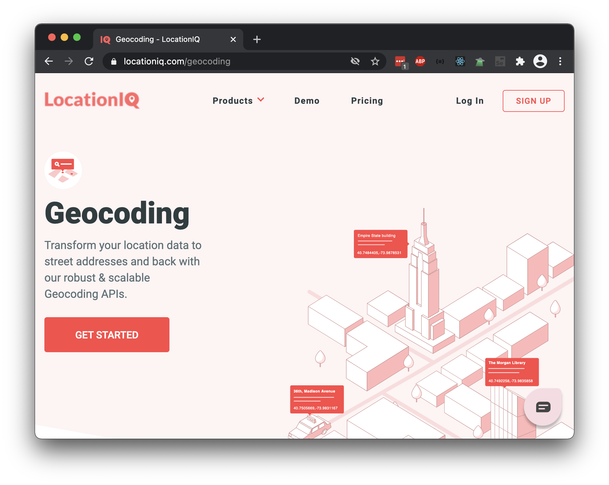

# Problem Set: Requests With JS

## Directions

Read the problem prompt, which will ask you to write JavaScript code to find certain answers.

Once you have found the answers, enter them into the answer prompts below.

## Preparation: LocationIQ Forward Geocoding API

Use the [LocationIQ's Forward Geocoding API](https://locationiq.com/geocoding). Before starting this problem prompt:

1. Obtain an API key for LocationIQ's Forward Geocoding API
1. Familiarize yourself with the LocationIQ API Documentation
1. Familiarize yourself with the `axios` library
1. Open Postman for manual testing



## Problem Prompt

Create a JavaScript program that finds the latitude and longitude coordinates for the [seven wonders of the New7Wonders of the World](https://en.wikipedia.org/wiki/New7Wonders_of_the_World), which are the following:

| Wonder              |
| ------------------- |
| Great Wall of China |
| Petra               |
| Colosseum           |
| Chichen Itza        |
| Machu Picchu        |
| Taj Mahal           |
| Christ the Redeemer |

Remember that many API providers will deactivate an API key if they detect too many requests within a short span of time. Since adding pauses or timeouts to JavaScript code can be tricky, it may be worth starting with a program that retrieves the data for a single location, and attempt the Extra Challenges after that is working.

### Extra Challenges

See if you can accomplish these extra challenges. These challenges are tricky and interesting! Implementing these extensions may require extra research around the following subjects: `setTimeout`, "JavaScript sleep," `async` and `await`, and (traditional) `for` loops.

1. Organize your code into functions and helper functions
1. Use a loop
1. Create this data structure to hold your answers

```js
{
    "Great Wall of China": {
        latitude: "...",
        longitude: "..."
    },
    "Petra: {
        latitude: "...",
        longitude: "..."
    },
    "Colosseum": {
        latitude: "...",
        longitude: "..."
    },
    "Chichen Itza": {
        latitude: "...",
        longitude: "..."
    },
    "Machu Picchu": {
        latitude: "...",
        longitude: "..."
    },
    "Taj Mahal": {
        latitude: "...",
        longitude: "..."
    },
    "Christ the Redeemer": {
        latitude: "...",
        longitude: "..."
    }
}
```

### !callout-warning

## Hint: Working with Rate Limits

Rapidly making several HTTP requests to the same endpoint may exceed our API rate limit. There are many ways to work with the rate limit. As a suggestion, one strategy is to consider the following:

1. How can we make requests more slowly?
1. Research the `setTimeout` function, or how to implement a "sleep" function. We recommend trying to make a program wait for 500 milliseconds as a starting point. This is also a good pause to use between API calls!

### !end-callout

## Answers

<!-- Question 1 -->
<!-- prettier-ignore-start -->
### !challenge
* type: short-answer
* id: 2819795f
* title: Requests with JS
##### !question
What is the latitude of the first result of "Great Wall of China"?
##### !end-question
##### !answer
/\d?\d\.\d+/
##### !end-answer
##### !explanation

It should be something similar to 40.3587621, but over time the coordinates can drift a bit.

##### !end-explanation

### !end-challenge
<!-- prettier-ignore-end -->

<!-- Question 2 -->
<!-- prettier-ignore-start -->
### !challenge
* type: short-answer
* id: a21964ba
* title: Requests with JS
##### !question
What is the longitude of the first result of "Great Wall of China"?
##### !end-question
##### !answer
/\d?\d\.\d+/
##### !end-answer
##### !explanation

It should be something similar to 116.0136394, but over time the coordinates can drift a bit.

##### !end-explanation

### !end-challenge
<!-- prettier-ignore-end -->

<!-- Question 3 -->
<!-- prettier-ignore-start -->
### !challenge
* type: short-answer
* id: 5d5b6f83
* title: Requests with JS
##### !question
What is the latitude of the first result of "Petra"?
##### !end-question
##### !answer
/\d?\d\.\d+/
##### !end-answer
##### !explanation

It should be something similar to 30.3273975, but over time the coordinates can drift a bit.

##### !end-explanation

### !end-challenge
<!-- prettier-ignore-end -->

<!-- Question 4 -->
<!-- prettier-ignore-start -->
### !challenge
* type: short-answer
* id: 7bd1170a
* title: Requests with JS
##### !question
What is the longitude of the first result of "Petra"?
##### !end-question
##### !answer
/\d?\d\.\d+/
##### !end-answer
##### !explanation

It should be something similar to 35.4464006, but over time the coordinates can drift a bit.

##### !end-explanation

### !end-challenge
<!-- prettier-ignore-end -->

<!-- Question 5 -->
<!-- prettier-ignore-start -->
### !challenge
* type: short-answer
* id: e0a8740f
* title: Requests with JS
##### !question
What is the latitude of the first result of "Colosseum"?
##### !end-question
##### !answer
/\d?\d\.\d+/
##### !end-answer
##### !explanation

It should be something similar to 41.8902614, but over time the coordinates can drift a bit.

##### !end-explanation

### !end-challenge
<!-- prettier-ignore-end -->

<!-- Question 6 -->
<!-- prettier-ignore-start -->
### !challenge
* type: short-answer
* id: 7f475b9a
* title: Requests with JS
##### !question
What is the longitude of the first result of "Colosseum"?
##### !end-question
##### !answer
/\d?\d\.\d+/
##### !end-answer
##### !explanation

It should be something similar to 12.4930871035955, but over time the coordinates can drift a bit.

##### !end-explanation

### !end-challenge
<!-- prettier-ignore-end -->

<!-- Question 7 -->
<!-- prettier-ignore-start -->
### !challenge
* type: short-answer
* id: 3fb19bea
* title: Requests with JS
##### !question
What is the latitude of the first result of "Chichen Itza"?
##### !end-question
##### !answer
/\d?\d\.\d+/
##### !end-answer
##### !explanation

It should be something similar to 20.68285195, but over time the coordinates can drift a bit.

##### !end-explanation

### !end-challenge
<!-- prettier-ignore-end -->

<!-- Question 8 -->
<!-- prettier-ignore-start -->
### !challenge
* type: short-answer
* id: 96c0bd5c
* title: Requests with JS
##### !question
What is the longitude of the first result of "Chichen Itza"?
##### !end-question
##### !answer
/\d?\d\.\d+/
##### !end-answer
##### !explanation

It should be something similar to -88.5687196355205, but over time the coordinates can drift a bit.

##### !end-explanation

### !end-challenge
<!-- prettier-ignore-end -->

<!-- Question 9 -->
<!-- prettier-ignore-start -->
### !challenge
* type: short-answer
* id: 6e3846ce
* title: Requests with JS
##### !question
What is the latitude of the first result of "Machu Picchu"?
##### !end-question
##### !answer
/\d?\d\.\d+/
##### !end-answer
##### !explanation

It should be something similar to -13.16441865, but over time the coordinates can drift a bit.

##### !end-explanation

### !end-challenge
<!-- prettier-ignore-end -->

<!-- Question 10 -->
<!-- prettier-ignore-start -->
### !challenge
* type: short-answer
* id: 3a1c4e06
* title: Requests with JS
##### !question
What is the longitude of the first result of "Machu Picchu"?
##### !end-question
##### !answer
/\d?\d\.\d+/
##### !end-answer
##### !explanation

It should be something similar to -72.5447639743184, but over time the coordinates can drift a bit.

##### !end-explanation

### !end-challenge
<!-- prettier-ignore-end -->

<!-- Question 11 -->
<!-- prettier-ignore-start -->
### !challenge
* type: short-answer
* id: 9e7a02cb
* title: Requests with JS
##### !question
What is the latitude of the first result of "Taj Mahal"?
##### !end-question
##### !answer
/\d?\d\.\d+/
##### !end-answer
##### !explanation

It should be something similar to 27.1750123, but over time the coordinates can drift a bit.

##### !end-explanation

### !end-challenge
<!-- prettier-ignore-end -->

<!-- Question 12 -->
<!-- prettier-ignore-start -->
### !challenge
* type: short-answer
* id: 42c5d257
* title: Requests with JS
##### !question
What is the longitude of the first result of "Taj Mahal"?
##### !end-question
##### !answer
/\d?\d\.\d+/
##### !end-answer
##### !explanation

It should be something similar to 78.0420968366132, but over time the coordinates can drift a bit.

##### !end-explanation

### !end-challenge
<!-- prettier-ignore-end -->

<!-- Question 13 -->
<!-- prettier-ignore-start -->
### !challenge
* type: short-answer
* id: e514e184
* title: Requests with JS
##### !question
What is the latitude of the first result of "Christ the Redeemer"?
##### !end-question
##### !answer
/\d?\d\.\d+/
##### !end-answer
##### !explanation

It should be something similar to -22.9519173, but over time the coordinates can drift a bit.

##### !end-explanation

### !end-challenge
<!-- prettier-ignore-end -->

<!-- Question 14 -->
<!-- prettier-ignore-start -->
### !challenge
* type: short-answer
* id: 30a61245
* title: Requests with JS
##### !question
What is the longitude of the first result of "Christ the Redeemer"?
##### !end-question
##### !answer
/\d?\d\.\d+/
##### !end-answer
##### !explanation

It should be something similar to -43.210495, but over time the coordinates can drift a bit.

##### !end-explanation

### !end-challenge
<!-- prettier-ignore-end -->
