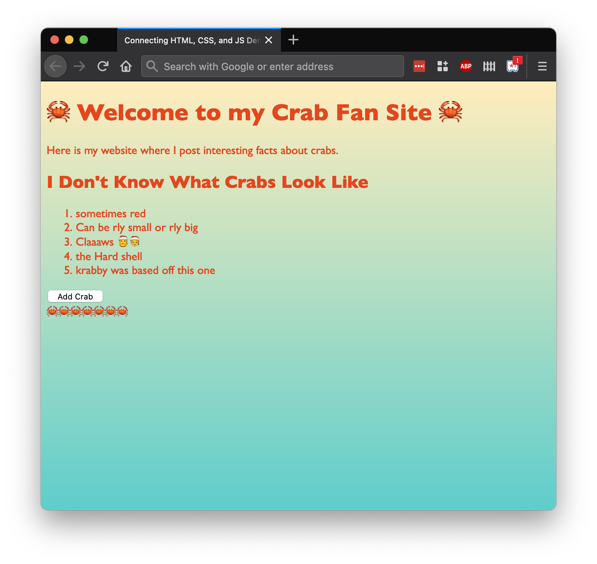

# Adding onclick Handling

## Goals

Our goals for this lesson is to implement event handling in JavaScript. 

## Introduction

Keira is a web developer creating [a website dedicated to the science and beauty of crabs](https://replit.com/@adacore/Adding-onclick-Handling-Demo#index.html). Keira wants to add crabs to her website every time the user clicks a button named "Add Crab."

Keira will need to do two things every time she wants to handle an event:

1. Build an event handler
1. Register the event handler to some HTML element(s)

## Vocabulary

| Vocab         | Definition                                                                                                           | How to Use in a Sentence                                                                                                                                                                                                            |
| ------------- | -------------------------------------------------------------------------------------------------------------------- | ----------------------------------------------------------------------------------------------------------------------------------------------------------------------------------------------------------------------------------- |
| Event Handler | A function whose responsibility is to perform necessary, required, or desired actions after a certain event is fired | "The function is a click event handler because we expect it to run after the button is clicked," "In order for something to happen after we scroll, we need to make an event handler for what should happen when the user scrolls." |

## Building Event Handler

In order to build this feature, let's first define an _event handler_ in [our JavaScript code](https://replit.com/@adacore/Adding-onclick-Handling-Demo#scripts/index.js). An **event handler** is a function whose responsibility is to perform necessary, required, or desired actions after a certain event is fired.

Let's make a function named `addCrab`. There's no specific pattern to follow, so we can code it in any style that works. This function:

- Creates an HTML element that contains a crab
- Finds the right HTML element to contain the new HTML element
- Adds the new crab element

```js
const addCrab = () => {
  const newCrab = document.createElement("span");
  const crabContainer = document.querySelector("section#crabContainer");
  newCrab.textContent = "🦀";
  crabContainer.appendChild(newCrab);
};
```

Note that this code relies on a very specific HTML element existing. The variable `crabContainer` is assigned to the first HTML element that matches the CSS selector `section#crabContainer`.

## Registering the Event Handler

Secondly, let's register the event handler to an HTML element.

To do that, let's inspect the main method we'll use to register an event: `addEventListener`.

```js
someElement.addEventListener("some event name", reactToEvent);
```

| <div style="min-width:200px;"> Piece of Code </div> | Notes                                                                                                                                                                                                              |
| --------------------------------------------------- | ------------------------------------------------------------------------------------------------------------------------------------------------------------------------------------------------------------------ |
| `someElement`                                       | **Replace this** with a reference to an HTML element on the DOM. This is the element that _receives_ the event we're waiting for.                                                                                  |
| `addEventListener(...);`                            | All HTML elements have this method. It takes in two arguments: an event name and an event-handling function. Its responsibility is to make `someElement` _listen_ for the given event, and react appropriately.    |
| `"some event name"`                                 | **Replace this** with the name of the event we're listening for. We can use [research and documentation](https://developer.mozilla.org/en-US/docs/Web/API/Element#events) to find the names of the events we need. |
| `reactToEvent`                                      | **Replace this** with a function that should execute whenever `someElement` receives a `"some event name"` event. This function can optionally take in a parameter `event` to represent the actual Event object.   |

### !callout-secondary

## `reactToEvent` Can Accept an Event Argument

In this introduction, we've mentioned that `reactToEvent` can expect an event parameter. Hold onto this thought: we won't look at it in the next section, but we'll revisit it later.

### !end-callout

### Example: Registering Handlers to Add Crabs

Let's dive into [our Crab Site example](https://replit.com/@adacore/Adding-onclick-Handling-Demo#scripts/index.js)! We want the `addCrab` handler to run every time we click an "Add Crab" button. Let's first create the HTML element:

```html
<button id="addCrabButton">Add Crab</button>
```

We should also ensure that we have our crab container HTML element somewhere on the page:

```html
<section id="crabContainer"></section>
```

Now, let's register our `addCrab` event handler with our Add Crab button. Observe how we'll have to do an extra step in this process: we'll need to register event handlers as part of handling a different event, "DOMContentLoaded."

```js
const addCrab = () => {
  const newCrab = document.createElement("span");
  const crabContainer = document.querySelector("section#crabContainer");
  newCrab.textContent = "🦀";
  crabContainer.appendChild(newCrab);
};

const registerEventHandlers = () => {
  const crabButton = document.querySelector("#addCrabButton");
  crabButton.addEventListener("click", addCrab);
};

document.addEventListener("DOMContentLoaded", registerEventHandlers);
```

| <div style="min-width:200px;"> Piece of Code </div> | Notes                                                                                                                                         |
| --------------------------------------------------- | --------------------------------------------------------------------------------------------------------------------------------------------- |
| `const registerEventHandlers = () => { ... }`       | First, we'll make a helper function named `registerEventHandlers`, whose responsibility will be to connect elements and their event handlers  |
| `const crabButton`                                  | We create a `const` variable to hold our crab button element                                                                                  |
| `document.querySelector(...)`                       | We use this function to find our crab button. We could have used `getElementById` or other similar method if we wanted.                       |
| `"#addCrabButton"`                                  | The method `querySelector` takes in a CSS selector. In this case, we _must_ ensure there's an element with the ID `addCrabButton` in the DOM. |
| `crabButton.addEventListener(...)`                  | We call `addEventListener` on `crabButton` because that's the element that should be clicked.                                                 |
| `"click"`                                           | The name for the click event to listen for is named "[click](https://developer.mozilla.org/en-US/docs/Web/API/Element#mouse_events)."         |
| `addCrab`                                           | We want the `addCrab` function to run when the `crabButton` is clicked.                                                                       |
| `document.addEventListener(...)`                    | After defining the `registerEventHandler` function, we call this function. We want the _document itself_ to react to an event.                |
| `"DOMContentLoaded"`                                | The name of the event that fires when the DOM has loaded completely is "DOMContentLoaded."                                                    |
| `registerEventHandlers`                             | This is the function that should execute when the `document` receives an event named "DOMContentLoaded."                                      |

### !callout-info

## Why Do We Listen for DOMContentLoaded?

We need to ask our document to wait and register the event handlers _after_ the DOM has been completely loaded. This is because the JavaScript file often loads faster than the DOM does! If we don't wait for the DOM to load, then our JS code will not find our `crabButton` in the DOM, and `crabButton` will be `null`. It's important to consider what's on the DOM whenever we search for an element.

<br/>

In other libraries, this problem may already be solved by the library, without us registering a DOMContentLoaded handler.

### !end-callout

### Verifying

Let's check our website now to see if we can add some crabs!



Ideally, we should see that clicking the "Add Crab" button adds a crab to the page.

If we don't have this result, different ways we can debug include:

- Checking the HTML and JS to make sure there is:
  - A valid "Add Crab" button that can be found
  - A valid "Crab" section that can be found
- The names of events are case-sensitive

### The Event Object

When we introduced the `addEventListener` function, we mentioned that the _event-handling_ _callback_ function we passed in could expect an _event_ argument.

"Events" _in themselves_ are objects. Event objects contain all the information about the event, such as what type of event it is, and where it happened. The following events would all separate event objects:

1. A click event that happens on the `addCrab` button at 12:00
1. A click event that happens on the `addCrab` button at 12:01
1. A click event that happens on the `addCrab` button at 12:02, and so on.

By default, our browser will pass in the event object (the object that represents the event) into every event-handler function.

Access to the Event object can give us extra details about the event, and can help us customize our event-handling.

[Let's change our JS code](https://replit.com/@adacore/Adding-onclick-Handling-Demo#scripts/index.js) to anticipate and access the event object that comes into every event-handler. Notice that we are only changing two things:

- The parameters for event-handling functions
- Accessing the events inside the functions in print statements

```js
const addCrab = (event) => {
  console.log("in addCrab:", event);
  // ... other addCrab functionality
};

const registerEventHandlers = (event) => {
  console.log("in registerEventHandlers:", event);
  // ... other registerEventHandler functionality
};

// ...
```

When we run this, we can see in the console that we get details about the "DOMContentLoaded" event when the page loads. Also, every time we add a crab, we get details about the "click" event (helpfully labeled as `MouseEvent` in the console).
