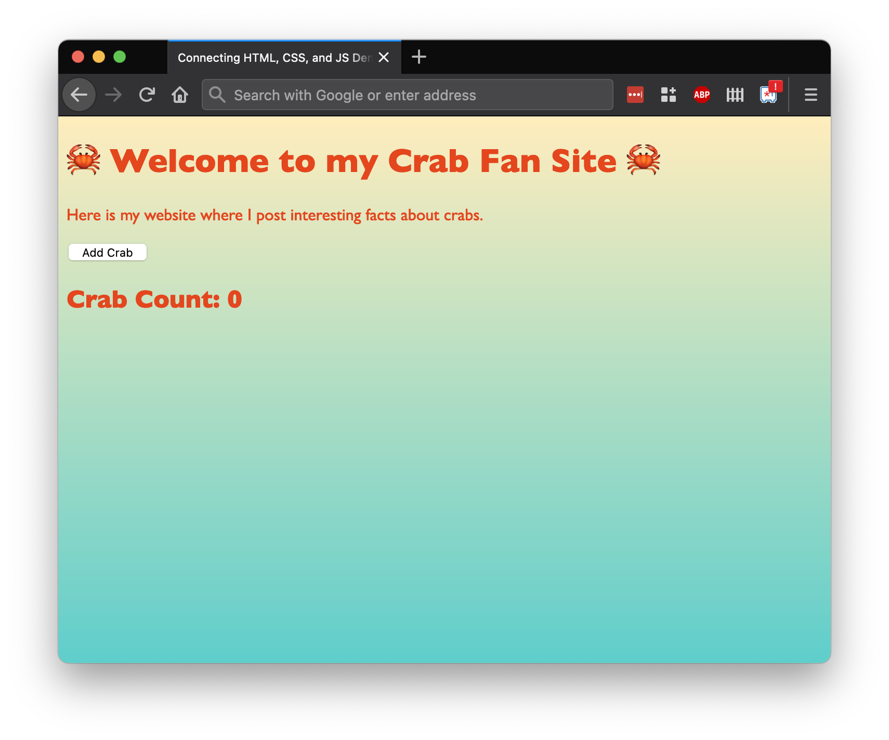
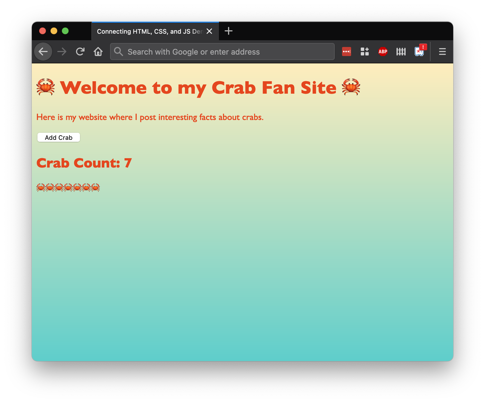

# Foreshadowing: "State"

## Introduction

Keira wants to build a crab counter feature on [the crab site](https://replit.com/@adacore/Foreshadowing-State-Demo), which will post how many crabs there are.





There are _many_ ways to accomplish this feature. We will demonstrate one version, because it will help us understand different challenges that front-end development often faces: sharing state between different parts of the website.

## "State"

**State** is a general term to describe the information held in a web app at one specific moment of time.

In object-oriented programming, we said that an object's _state_ is its attributes, which are accessible through the whole object. Similarly, we can say that a web app's state is the data that is accessible through the web app.

In this experiment, we'll create a global variable to keep track of state. Again, the goal for this section is to observe an interesting problem in front-end development. We'll learn one way to solve this problem, and anticipate better ways in other JavaScript environments.

### Modifying "State"

Our strategy to create a crab counter will follow these steps:

- In [our HTML](https://replit.com/@adacore/Foreshadowing-State-Demo), create the HTML element that will hold our crab counter
- In [our JS](https://replit.com/@adacore/Foreshadowing-State-Demo):
  - Create a `state` object that will hold the number of crabs on our site
  - Modify the `addCrab` event-handler to modify the crab count number on `state`
  - Modify the `addCrab` event-handler to add this content to the DOM

Let's do this!

First, let's add in our HTML element that holds our crab counter. We're choosing this HTML structure to exemplify a certain point, but this HTML could look like anything. The most important thing is that we have an element with the ID `crabCountContainer`.

```html
<!-- ... other content ...
      <section>
        <button id="addCrabButton">Add Crab</button>
      </section> -->

<section id="crabContainer">
  <h2 id="crabCount">Crab Count: 0</h2>
</section>
<!-- ... other content ... -->
```

Next, before the definition of the `addCrab` function, let's create an object in a variable named `state`. This object is accessible in all of our functions because variables defined outside a function are globally-scoped.

```js
const state = {
  crabCount: 0,
};

// const addCrab = (event) => { ...
```

Now let's modify our `addCrab` event-handler function to modify state, and then modify the DOM.

```js
  // ... other addCrab functionality ...

  state.crabCount += 1;
  const crabCountContainer = document.querySelector("#crabCount")
  crabCountContainer.textContent = `Crab Count: ${state.crabCount}`;
};
```

### Verify

When we reload our page, our crab counter feature should work! If we don't have this result, we can:

- Check the HTML and ensure there is a valid HTML element for our counter
- Check the JS and ensure we're selecting it correctly
- Check the location that `state` is defined, and it's key-value pair

## Global Variables

Our feature works! In some ways, it's a robust solution, too.

If we had more key-value pairs to add to keep track of, we can add them to the `state` object. We wouldn't need to make more variables, we'd just add a new key-value pair.

Also, this `state` object is accessible by all of our functions, so we can re-use it however we'd like!

The solution _isn't_ ideal because of the possibilities that open as the app expands. When we have twenty event-handler functions for twenty buttons, and 222 properties on `state`, this code may feel clunky and difficult to update and use.

For now, we can keep track of state through our global variables, and look forward to how other libraries and frameworks deal with this.

## Check for Understanding

<!-- Question 1 -->
<!-- prettier-ignore-start -->
### !challenge
* type: multiple-choice
* id: d25e045b
* title: Foreshadowing State
##### !question

In the example in the lesson, which of the following is the most accurate description of `state` in this example?

##### !end-question
##### !options

* `state` is the collection of attributes that the event handlers modify
* `state` is what we use as `crabCount`, and its value is the number of crabs
* `state` is the container of the `crabCount` element, event handler, and value
* `state` is an object that holds key-value pairs, such as `crabCount` and the number of crabs

##### !end-options
##### !answer

* `state` is an object that holds key-value pairs, such as `crabCount` and the number of crabs

##### !end-answer
### !end-challenge
<!-- prettier-ignore-end -->

<!-- Question 2 -->
<!-- prettier-ignore-start -->
### !challenge
* type: multiple-choice
* id: 303ddde1
* title: Foreshadowing State
##### !question

In the example in the lesson, which of the following is the most accurate description of how `state` is updated?

##### !end-question
##### !options

* We update state outside all the functions
* We update state as part of the `addCrab` event handler
* We update state as part of the `registerEventHandlers` event handler
* We attach state to our HTML element, and it updates automatically

##### !end-options
##### !answer

* We update state as part of the `addCrab` event handler

##### !end-answer
### !end-challenge
<!-- prettier-ignore-end -->
