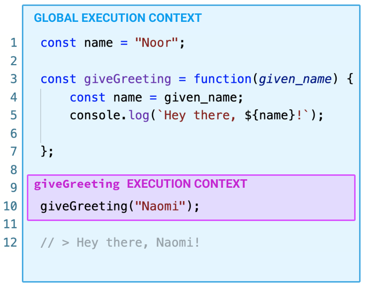
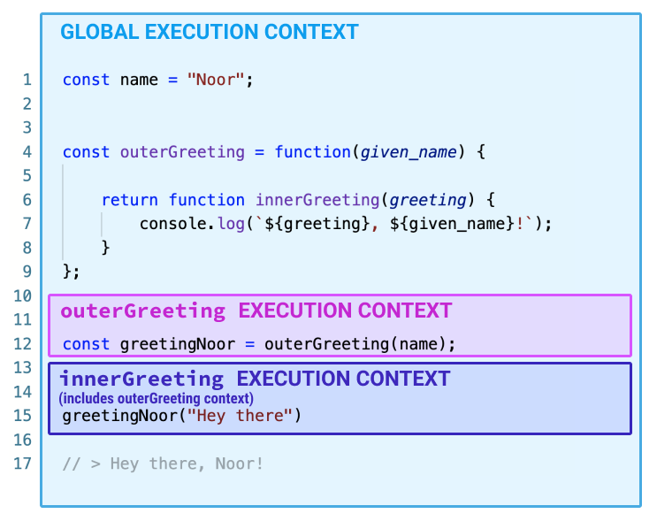

# Execution Context and Closures

## Goals

Our goals for this lesson is to introduce at a high-level how nested functions can share context variables in a particular scope, known as a "closure." By doing so, we will have a better understanding of what makes JavaScript functions and callback functions so powerful as we gear up for consuming APIs.

## Introduction

Before diving into closures, however, we need to begin with a little context. _Execution_ context, that is!  Below are a list of terms we will go over in detail throughout this lesson.

| Vocab             | Definition                       | How to Use in a Sentence                                             |
| ----------------- | -------------------------------- | -------------------------------------------------------------------- |
| Execution context | The current environment that JavaScript code is being run in. | "Everytime a function is called, an execution context is created that contains the function's variables." |
| Global execution context | An all-encompassing environment that surrounds every JavaScript code that is run. | "The global execution context comes with two variables already assigned: `window` and `this`." |
| Closure | Any nested function that has access to its parent function's execution context. | "Closures are commonly seen in callback functions and when calling APIs." |

The **execution context** describes the current environment within which JavaScript code is being run. By its very name, this environment can change depending on when the lines of code are run or where the lines of code are scoped. It's all about the _context_ of when and where JavaScript code is _executed_, which will define the scope of variables and function declarations.  

### !callout-info

## An Example

Fatima opens up her web browser to a new tab. This new tab holds an execution context containing global variables, built-in JavaScript methods, all of which she can inspect using her web browser's console tool.  

<br>

In this tab she logs into Ada's learn platform with a saved email and password. Information like passwords or site cookies are all part of this particular tab's execution context.  

<br>

Then she opens up a new, separate tab to check her email. The cookies and other global variables found in the new tab will be different than those of her first tab.  Each window in her web browser has its own individual execution context.

### !end-callout

## Local and Global Context

Much like globally and locally scoped variables, there are global and local execution contexts that are created when a function is called and deleted when a function is finished. Below is a visual example of two execution contexts in a JavaScript file:



The **global execution context** encompasses the entire environment of the executed code.
A local execution context is created when `giveGreeting` is called, and then deleted when `giveGreeting` finishes, along with any variables assigned within. 


## Closures

It gets intresting when a function shares its exeuction context with a function nested inside it. The inner function holds onto the outer function's execution context, even after the outer function finishes! A function that has access to its outer function's execution context is called a **closure**.

Let's look at an example!



`outerGreeting` is called and passed the argument "Noor." The return value is assigned to the variable `greetingNoor`. Once the outer function finishes, its execution context is closed and the code moves onto the next line.

The current value of `greetingNoor` is a function declaration, specifically a **closure**. This closure has its outer function's execution context "saved" inside of it. That includes the value "Noor." So when `greetingNoor` is called, we don't have to worry about passing in a `name` argument again. It remembers!

The closure goes ahead and prints the string `"Hey there, Noor!"` using a variable from its execution context and one variable from its outer function's execution context. Wowza!

## Making a Closure

To create a closure in JavaScript, we need to do three things:

1. Nest a function inside a function
1. Reference a variable from the outer function in the inner function
1. Make the inner function available outside the outer function
  * Usually this means we return the inner function to a variable

Let's take a deeper dive into the example below:

```JavaScript
// Here is the outer function
const buildIncrementer = () => {
  // callCount is defined in the outer function
  let callCount = 0;

  // Here is the inner function
  const callCountingFunction = () => {
    // callCount is used in the inner function
    callCount += 1;
    console.log(`This is call number ${callCount}`);
  }

  // Here we return the inner function, creating
  // a closure.
  return callCountingFunction;
};

const incrementer = buildIncrementer();

               // Each call prints out:
incrementer(); // This is call number 1
incrementer(); // This is call number 2
incrementer(); // This is call number 3
```

## Multiple Closures

The usefulness of this closure becomes especially clear when we need multiple incrementers:

```JavaScript
const buildIncrementer = () => {
  // ...same as before...
};

const firstInc = buildIncrementer();
const secondInc = buildIncrementer();

firstInc();  // This is call number 1
firstInc();  // This is call number 2
firstInc();  // This is call number 3

secondInc(); // This is call number 1
secondInc(); // This is call number 2

firstInc();  // This is call number 4
```

The two functions track their counts separately. Not only can we use a closure to attach extra information, but we can attach different information to each function.

## Practical Uses

This shared execution context will come in handy when a client begins interacting with our frontend. We can create secure data that cannot be accessed by outside functions. It's only the closure that can change or access the data. We will see this when we trigger browser events, call APIs, create callback functions, etc. moving forward.
