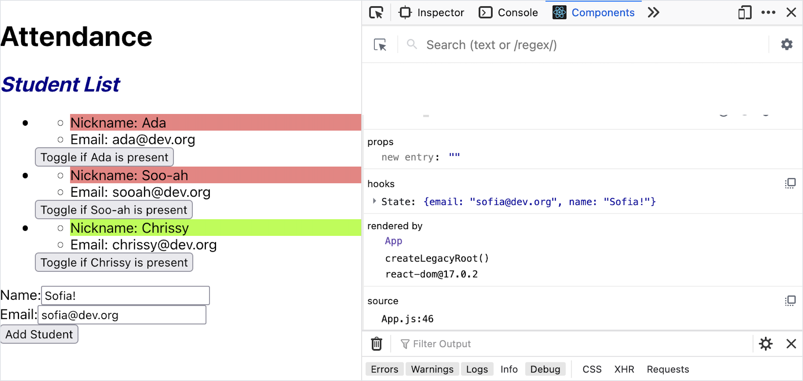

# Controlled Forms

## Introduction

Handling a button click within a React app can imply:

1. There's a button with an `onClick` event handler
1. If the button is inside a presentational component, it should invoke a function that updates another component's state. This function is usually passed through props.

However, form input fields can be an exception to this pattern.

Consider these different form inputs:

| Form Input Type | HTML Tag                  | Description                           |
| --------------- | ------------------------- | ------------------------------------- |
| Text            | `<input type="text">`     | Users can type in any text            |
| Checkbox        | `<input type="checkbox">` | Users can select zero or more options |
| Radio Button    | `<input type="radio">`    | Users can select exactly one option   |
| Number Field    | `<input type="number">`   | Users can only input numbers          |

All of these form inputs are more complex than a button click—they hold and maintain some data itself... they maintain their own state!

Because these form inputs maintain some of their own state, we need to apply a different design pattern to them.

React's _controlled component_ design pattern can help us here!

## More About `<input>` Elements

Before we consider React patterns, let's consider plain HTML `<input>` elements.

[MDN describes `<input>` elements with high praise](https://developer.mozilla.org/en-US/docs/Web/HTML/Element/Input):

> The `<input>` element is one of the most powerful and complex in all of HTML due to the sheer number of combinations of input types and attributes.

Each `<input>` element type (such as text, checkbox, radio button, or number field) has its own set of attributes and logic to work with, and benefit from research per feature.

Let's highlight a few examples:

Input Type | Attribute | Description of the Value
--- | --- | ---
[Text](https://developer.mozilla.org/en-US/docs/Web/HTML/Element/input/text) | `value` | Contains the current value of the text entered into the text field.
[Checkbox](https://developer.mozilla.org/en-US/docs/Web/HTML/Element/input/checkbox) | `checked` | Boolean which indicates whether the checkbox is currently checked.
[Radio Button](https://developer.mozilla.org/en-US/docs/Web/HTML/Element/input/radio) | `checked` | Boolean which indicates whether the radio button is currently checked.
[Number](https://developer.mozilla.org/en-US/docs/Web/HTML/Element/input/number) | `value` | Contains the current value of the number entered into the input.

When elements are clicked, they emit an event specifically named `"click"`.

When an `<input>` element is changed, it emits an event specifically named `"change"`. This emitted "change" event is an object that contains all details about the event.

### !callout-info

## The `<form>` Element

The `<form>` element itself is unique. This element usually contains one or more `<input>` elements.

<br/>

`<form>`s have default HTML behavior. If the `<form>` element ever receives [an event called "submit"](https://developer.mozilla.org/en-US/docs/Web/API/GlobalEventHandlers/onsubmit), it will bundle all of the form data together (looking through the `<input>` elements), and then **_send an HTTP request_**.

<br/>

This default behavior can be changed with attributes `method` and/or `action`, or with JavaScript.

### !end-callout

## Controlled Forms Control `<input>` Values

[**Controlled components**](https://reactjs.org/docs/forms.html#controlled-components) are a design pattern that states that a form's values should be controlled by _the component's state_, **not** by user interaction.

Instead, user interaction will update _the component's state_.

Therefore, we can summarize controlled forms as having these elements:

- The component holds state
- For every input, its value comes from the component's state
- For every input, every time it handles an event, it updates the component's state


### !callout-info

## The Alternative Requires Multiple Updates

Without using the controlled components, user interaction would need to update the component's state _and_ the `<input>`'s state. Surprisingly, this can get out of sync really quickly! In those cases, the component's state and what the user sees in the `<input>` fields can be different, which is dangerous for the user and the web app.

<br/>

We want a component's state and all form inputs to be as aligned as possible. The controlled form design pattern promotes a _single source of truth_.

### !end-callout

## Syntax Example: Generic Form

Let's see how this all plays out by creating a small example.

Let's create a component named `CityNameInput`. This component has a text input field, where users will be able to name a city. The city name will be displayed, too.

<!-- prettier-ignore-start -->
```js
import { useState } from 'react';

const CityNameInput = () => {
  const [cityName, setCityName] = useState('Seattle');

  return (<section>
    <h2>{cityName}</h2>
    <input type="text"></input>
  </section>)
}
```
<!-- prettier-ignore-end -->

In order to complete this form, we will do the following:

1. Ensure that our text input field's value comes from the component's state
1. Ensure that when our text input field changes, it updates the component's state

We set the text input field's value by using the `value` attribute:

<!-- prettier-ignore-start -->
```js
import { useState } from 'react';

const CityNameInput = () => {
  const [cityName, setCityName] = useState('Seattle');

  return (<section>
    <h2>{cityName}</h2>
    <input type="text" value={cityName}></input>
  </section>)
}
```
<!-- prettier-ignore-end -->

Because component's re-render every time state updates, we can trust that the appearance of the text field will always be aligned with state.

Next, we need to create an event handler for the "change" event that updates state.

<!-- prettier-ignore-start -->
```js
import { useState } from 'react';

const CityNameInput = () => {
  const [cityName, setCityName] = useState('Seattle');

  const renameCity = (changeEvent) => {
    console.log('Details about the element that fired the event:', changeEvent.target);
    console.log('The value of that element:', changeEvent.target.value);
    setCityName(changeEvent.target.value);
  }

  return (<section>
    <h2>{cityName}</h2>
    <input type="text" value={cityName} onChange={renameCity}></input>
  </section>)
}
```
<!-- prettier-ignore-end -->

In this example, we added the attribute `onChange` to our text field. Then, we created an event handler function named `renameCity`.

`renameCity` took in one argument, `changeEvent`. Every event-handling function will automatically be passed [an Event object](https://developer.mozilla.org/en-US/docs/Web/API/Event).

Event objects include all sorts of details about the event, and we can look through [the Event documentation](https://developer.mozilla.org/en-US/docs/Web/API/Event/target) to find anything we need.

Our goal is to update our `cityName` state to whatever the value of the text field is. To achieve this, we use our update function, `setCityName`, and pass in `changeEvent.target.value`.

### Verifying

When we run this app, we see our text field and component state all aligned!


The most important thing about this code is that the component's state changed. We can even use our React Dev Tools to check the component's state.


## Extended Example: The Attendance App

Sofia is developing some new features to her attendance app. She wants to be able to add a new student to her class whenever she wants!

Sofia's app currently has the following components:

<details>

<summary>An <code>App</code> component, responsible for managing all the student data</summary>

<!-- prettier-ignore-start -->
```js
import { useState } from 'react';
import StudentList from './components/StudentList';

function App() {
  const [studentData, setStudentData] = useState([
    {
      id: 1,
      nameData: 'Ada',
      emailData: 'ada@dev.org',
      isPresentData: false
    },
    {
      id: 2,
      nameData: 'Soo-ah',
      emailData: 'sooah@dev.org',
      isPresentData: false
    },
    {
      id: 3,
      nameData: 'Chrissy',
      emailData: 'chrissy@dev.org',
      isPresentData: true
    }
  ]);

  const updateStudentData = updatedStudent => {
    const students = studentData.map(student => {
      if (student.id === updatedStudent.id) {
        return updatedStudent;
      } else {
        return student;
      }
    });

    setStudentData(students);
  };

  return (
    <main>
      <h1>Attendance</h1>
      <StudentList
        students={studentData}
        onUpdateStudent={updateStudentData}
      ></StudentList>
    </main>
  );
}

export default App;
```
<!-- prettier-ignore-end -->

</details>

<details>

<summary>A <code>StudentList</code> component, responsible for displaying a list of students</summary>

<!-- prettier-ignore-start -->
```js
import './StudentList.css';
import PropTypes from 'prop-types';
import Student from './Student';

const StudentList = (props) => {
    const studentComponents = props.students.map((student, index) => {
        return (
            <li key={index}>
                <Student
                    id={student.id}
                    name={student.nameData}
                    email={student.emailData}
                    isPresent={student.isPresentData}
                    onUpdate={props.onUpdateStudent}
                ></Student>
            </li>
        );
    });

    return (
        <section>
            <h2>Student List</h2>
            <ul>
                {studentComponents}
            </ul>
        </section>
    );
}

StudentList.propTypes = {
    students: PropTypes.arrayOf(PropTypes.shape({
        id: PropTypes.number.isRequired,
        nameData: PropTypes.string.isRequired,
        emailData: PropTypes.string.isRequired,
        isPresentData: PropTypes.bool
    })),
    onUpdateStudent: PropTypes.func
};

export default StudentList;
```
<!-- prettier-ignore-end -->

</details>

<details>

<summary>A <code>Student</code> component, responsible for displaying the details of one student. It contains a button that toggles whether the student is present or not.</summary>

<!-- prettier-ignore-start -->
```js
import PropTypes from 'prop-types';
import './Student.css';

const Student = (props) => {

    const onAttendanceButtonClick = () => {
        const updatedStudent = {
            id: props.id,
            nameData: props.name,
            emailData: props.email,
            isPresentData: !props.isPresent
        }

        // Invoke the function passed in through the prop named "onUpdate"
        // This function is referenced by the name "updateStudentData" in App
        props.onUpdate(updatedStudent);
    }

    const nameColor = props.isPresent ? 'green' : 'red';

    return (
        <div>
            <ul>
                <li className={nameColor}>Nickname: {props.name}</li>
                <li>Email: {props.email}</li>
            </ul>
            <button onClick={onAttendanceButtonClick}>Toggle if {props.name} is present</button>
        </div>
    )
}

Student.propTypes = {
    id: PropTypes.number.isRequired,
    name: PropTypes.string.isRequired,
    email: PropTypes.string.isRequired,
    isPresent: PropTypes.bool,
    onUpdate: PropTypes.func.isRequired
};

export default Student;
```
<!-- prettier-ignore-end -->

</details>

### Sofia's Plan

Sofia is putting hew new student form into its own component: `NewStudentForm`.

Inside `src/components/NewStudentForm.js`, she begins this component:

<!-- prettier-ignore-start -->
```js
const NewStudentForm = () => {

    return (
        <form>
            <div>
                <label htmlFor="fullName">Name:</label>
                <input name="fullName"/>
            </div>
            <div>
                <label htmlFor="email">Email:</label>
                <input name="email"/>
            </div>
            <input
                type="submit"
                value="Add Student"
            />
        </form>
    );
}

export default NewStudentForm;
```
<!-- prettier-ignore-end -->

Each new student should have a name and an email. Her form contains one text input field for name, one for email, and a final submit button.

### !callout-info

## Labels and Names

What's up with the attributes `name` and `for` (mapped in React as `htmlFor`)? These attributes are used by default HTML form behavior. They aren't necessary for this curriculum, but they're a great research topic for creating valid HTML.

### !end-callout

Recall that the steps for creating a controlled form are:

1. Ensure that our text input field's value comes from the component's state.
1. Ensure that when our text input field changes, it updates the component's state.

Sofia will:

1. Create a new piece of state to hold all of her form data, and make all input values read from state.
1. Create an event handler for each input field. Each event handler will update state.

### New Piece of State: An Object of `formFields`

Sofia needs to introduce state into the `NewStudentForm` component.

She's made pieces of state that were strings and booleans before, but she's never put an object in state!

To practice that, she'll make one piece of state named `formFields`. It will be an object that will hold `name` and `email` as key-value pairs.

Her vision is that `formFields` will be an easy, nice way to organize the different form fields. By default, a new student's name and email should be blank. The initial state of `formFields` should be:

<!-- prettier-ignore-start -->
```js
{
    name: '',
    email: ''
}
```
<!-- prettier-ignore-end -->

Therefore, introducing this new piece of state will look like:

<!-- prettier-ignore-start -->
```js
import { useState } from 'react';

const NewStudentForm = () => {

    const [formFields, setFormFields] = useState({
        name: '',
        email: ''
    });
```
<!-- prettier-ignore-end -->

Now she needs to make the input fields read from this state. Since `formFields` is an object, we'll use dot-notation to access the `name` and `email` values.

<!-- prettier-ignore-start -->
```js
    return (
        <form>
            <div>
                <label htmlFor="fullName">Name:</label>
                <input
                    name="fullName"
                    value={formFields.name}/>
            </div>
            <div>
                <label htmlFor="email">Email:</label>
                <input
                    name="email"
                    value={formFields.email}/>
            </div>
            <input
                type="submit"
                value="Add Student"
            />
        </form>
    );
```
<!-- prettier-ignore-end -->

### Event Handling To Update `formFields`

Sofia's next step is to ensure that changes in an input field affect the component state.

She can create two event handlers, `onNameChange` and `onEmailChange`. These event handlers need to do two things:

- Read the current value inside the input field
- Update state to that current value

<!-- prettier-ignore-start -->
```js
    const onNameChange = (event) => {
        setFormFields({
            ...formFields,
            name: event.target.value
        })
    };

    const onEmailChange = (event) => {
        setFormFields({
            ...formFields,
            email: event.target.value
        })
    };
```
<!-- prettier-ignore-end -->

In this example, we're using [spread syntax](https://developer.mozilla.org/en-US/docs/Web/JavaScript/Reference/Operators/Spread_syntax#spread_in_object_literals) for a quick way to clone the original `formFields` object. Each event handler should add a specific key-value pair: `onNameChange` adds the key-value pair `name: event.target.value`, while `onEmailChange` adds `email`.

Now, Sofia needs to make sure that the input fields use these event handlers when they're changed:

<!-- prettier-ignore-start -->
```js
    return (
        <form>
            <div>
                <label htmlFor="fullName">Name:</label>
                <input
                    name="fullName"
                    value={formFields.name}
                    onChange={onNameChange}/>
            </div>
            <div>
                <label htmlFor="email">Email:</label>
                <input name="email"
                    value={formFields.email}
                    onChange={onEmailChange}/>
            </div>
            <input
                type="submit"
                value="Add Student"
            />
        </form>
    );
```
<!-- prettier-ignore-end -->

We did it! 🎉🎉

Sofia can verify that her form works as expected:



## Check for Understanding


<!-- Question Takeaway -->
<!-- prettier-ignore-start -->
### !challenge
* type: paragraph
* id: 73c92061
* title: Controlled Forms
##### !question

What was your biggest takeaway from this lesson? Feel free to answer in 1-2 sentences, draw a picture and describe it, or write a poem, an analogy, or a story.

##### !end-question
##### !placeholder

My biggest takeaway from this lesson is...

##### !end-placeholder
### !end-challenge
<!-- prettier-ignore-end -->