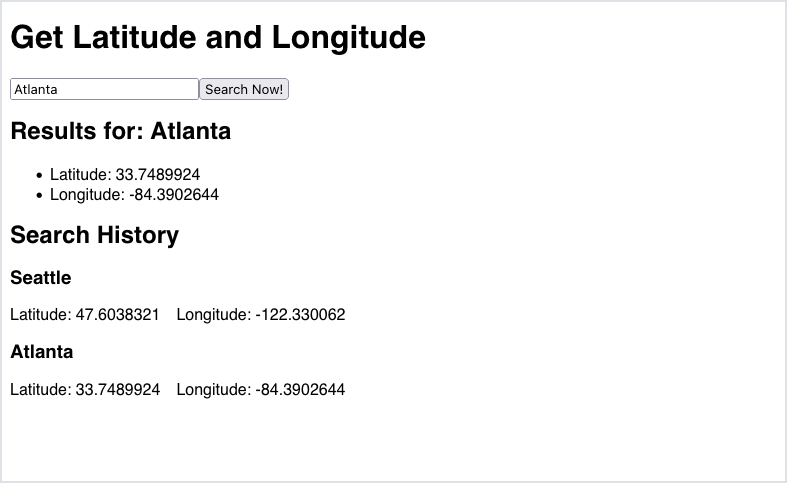
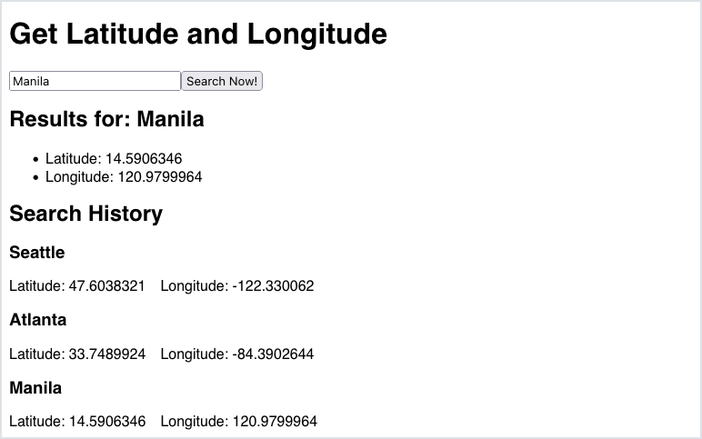
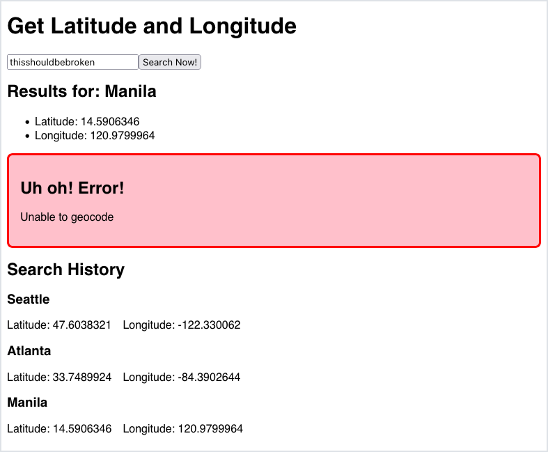
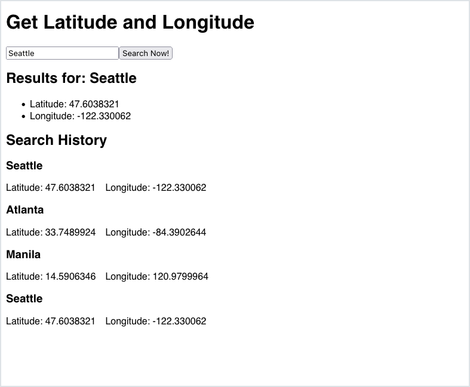

# Problem Set: Forms and APIs

## Directions

Create a small, practice React app named `react-geocoder`.

Run this command to create this practice project.

```
$ npx create-react-app react-geocoder
```

Change into this directory, and run the server.

Keep your work on your local machine. There is no submission for this problem set. Be prepared to share your work in small groups.

## Practice

Consider this user story:

> As a curious traveler, I want to type in the name of a location and see its latitude and longitude determined by [the LocationIQ API](https://locationiq.com/docs), so that I get accurate coordinates and avoid getting lost.

Create a web app that has a form. This form should include:

- A text input field, where users will type their search query
- A submit button, which users will press when they're ready to search

The web app should also display:

- The search query itself (repeated outside the text field)
- The latitudinal coordinate of the search query
- The longitudinal coordinate of the search query

### !callout-info

## Use the First Result of the Search/Forward Geocoding API

For this assignment, find the latitude and longitude using [the LocationIQ Search/Forward Geocoding API](https://locationiq.com/docs). Always use the first result of the response, if there is a successful response.

### !end-callout

An example implementation may look like this:


### Wave 2: Handle Unsuccessful Calls

If the API gives back an error, handle it by displaying an error message. The web app should _not_ crash.

An example implementation may look like this:


### Optional Enhancement: Search History

Consider this user story:

> As a user, I want to see a history of all locations I've searched before, so that I can easily remember what I've looked up.

Create a section that displays a list of _all_ search queries that have been made, and their latitude and longitude.

The web app should continue to handle errors, and _not_ crash.

An example implementation may look like this:









