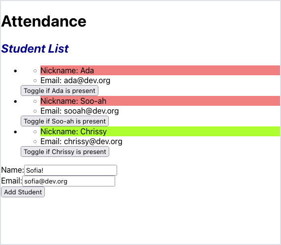

# Submitting Forms

<iframe src="https://adaacademy.hosted.panopto.com/Panopto/Pages/Embed.aspx?id=e78e6239-00cf-46a3-8214-ad53016c6174&autoplay=false&offerviewer=true&showtitle=true&showbrand=false&start=0&interactivity=all" height="405" width="720" style="border: 1px solid #464646;" allowfullscreen allow="autoplay"></iframe>

## Introduction

Sofia has been working on making a new student form in her attendance app. Consider her progress with this list of components:

<br/>

<details>

<summary>An <code>App</code> component, responsible for managing all the student data</summary>

<!-- prettier-ignore-start -->
```js
import { useState } from 'react';
import StudentList from './components/StudentList';
import NewStudentForm from './components/NewStudentForm';

function App() {
    const [studentData, setStudentData] = useState([
        {
            id: 1,
            nameData: 'Ada',
            emailData: 'ada@dev.org',
            isPresentData: false,
        },
        {
            id: 2,
            nameData: 'Soo-ah',
            emailData: 'sooah@dev.org',
            isPresentData: false,
        },
        {
            id: 3,
            nameData: 'Chrissy',
            emailData: 'chrissy@dev.org',
            isPresentData: true,
        },
    ]);

    const toggleStudentPresence = (studentId) => {
        const students = studentData.map(student => {
            if (student.id === studentId) {
                return { ...student, isPresentData: !student.isPresentData };
            } else {
                return student;
            }
        });

        setStudentData(students);
    };

    return (
        <main>
            <h1>Attendance</h1>
            <StudentList
                students={studentData}
                onStudentPresenceToggle={toggleStudentPresence}
                ></StudentList>
            <NewStudentForm></NewStudentForm>
        </main>
    );
}

export default App;
```
<!-- prettier-ignore-end -->

</details>

<details>

<summary>A <code>StudentList</code> component, responsible for displaying a list of students</summary>

<!-- prettier-ignore-start -->
```js
import './StudentList.css';
import PropTypes from 'prop-types';
import Student from './Student';

const StudentList = (props) => {
    const studentComponents = props.students.map(student => {
        return (
            <li key={student.id}>
                <Student
                    id={student.id}
                    name={student.nameData}
                    email={student.emailData}
                    isPresent={student.isPresentData}
                    onPresenceToggle={props.onStudentPresenceToggle}
                ></Student>
            </li>
        );
    });

    return (
        <section>
            <h2>Student List</h2>
            <ul>
                {studentComponents}
            </ul>
        </section>
    );
};

StudentList.propTypes = {
    students: PropTypes.arrayOf(PropTypes.shape({
        id: PropTypes.number.isRequired,
        nameData: PropTypes.string.isRequired,
        emailData: PropTypes.string.isRequired,
        isPresentData: PropTypes.bool.isRequired,
    })),
    onStudentPresenceToggle: PropTypes.func.isRequired,
};

export default StudentList;
```
<!-- prettier-ignore-end -->

</details>

<details>

<summary>A <code>Student</code> component, responsible for displaying the details of one student. Contains a button that toggles whether the student is present or not.</summary>

<!-- prettier-ignore-start -->
```js
import PropTypes from 'prop-types';
import './Student.css';

const Student = (props) => {
    const attendanceButtonClicked = () => {
        props.onPresenceToggle(props.id);
};

    const nameColor = props.isPresent ? 'green' : 'red';

    return (
        <div>
            <ul>
                <li className={nameColor}>Nickname: {props.name}</li>
                <li>Email: {props.email}</li>
            </ul>
            <button onClick={attendanceButtonClicked}>Toggle if {props.name} is present</button>
        </div>
    );
};

Student.propTypes = {
    id: PropTypes.number.isRequired,
    name: PropTypes.string.isRequired,
    email: PropTypes.string.isRequired,
    isPresent: PropTypes.bool.isRequired,
    onPresenceToggle: PropTypes.func.isRequired,
};

export default Student;
```
<!-- prettier-ignore-end -->

</details>

<details>

<summary>A <code>NewStudentForm</code> component, responsible for containing a form to add a new student.</summary>

<!-- prettier-ignore-start -->
```js
import { useState } from 'react';
import PropTypes from 'prop-types';

const NewStudentForm = () => {
    const [formFields, setFormFields] = useState({
        name: '',
        email: '',
    });

    const handleNameChange = (event) => {
        setFormFields({
            ...formFields,
            name: event.target.value,
        });
    };

    const handleEmailChange = (event) => {
        setFormFields({
            ...formFields,
            email: event.target.value,
        });
    };

    return (
        <form>
            <div>
                <label htmlFor="fullName">Name:</label>
                <input
                    id="fullName"
                    name="fullName"
                    value={formFields.name}
                    onChange={handleNameChange} />
            </div>
            <div>
                <label htmlFor="email">Email:</label>
                <input
                    id="email"
                    name="email"
                    value={formFields.email}
                    onChange={handleEmailChange} />
            </div>
            <input
                type="submit"
                value="Add Student" />
        </form>
    );
};

export default NewStudentForm;
```
<!-- prettier-ignore-end -->

</details>

The `NewStudentForm` component is off to a good start. It follows the controlled component pattern, so its state stays in sync with the input fields.

However, since all student data is managed in the `App` component, our new student form doesn't have a way to add an actual student yet!

When Sofia currently clicks the Add Student button, default browser form behaviors occur. The browser tries to send the form data as query parameters. She can see this in the URL bar, which updates to 
```txt
http://localhost:5173/?fullName=Sofia%21&email=sofia%40dev.org
```
when she tests the form using her own information (`%21` is the URL encoding for `!`, while `%40` is an `@`). The app also reloads itself, losing any attendance changes she's made to to the student list. This is not the behavior she wants!

The student data itself lives in state owned by the `App` component. The `NewStudentForm` component is a child of `App`, so it can't directly update the student data. Sofia needs to provide a way for the `NewStudentForm` to communicate with `App` so that it can add a new student.

From the work she did with the `Student` component, she knows that she can pass down event handlers as props, which can then be used to update state that lives higher up in the application. She can use this same approach to pass down a function that adds a new student to the student data.

## Sofia's Plan

Passing down event handlers in order to modify state stored higher in the component hierarchy follows the exact same process that she just did to modify the presence information for a student. The _only exception_ is that she needs to learn how to prevent the form's default submit behavior, which she didn't need to worry about when handling a button click.

Sofia's goal is to get the data from the `NewStudentForm` up to the `App` component.

The `App` component is already the single source of truth for her student data, so the remaining steps of her plan are:

1. Pass down event handlers from `App` to the `NewStudentForm`
1. Configure the form submission in `NewStudentForm` to use the received handler to update the student data in `App`.

## Passing Down New Student Handlers

Sofia starts by making a method in `App` that adds a new student to the student data:

<!-- prettier-ignore-start -->
```js
    const addStudentData = (newStudent) => {
        // Logic to generate the next valid student ID
        const nextId = Math.max(0, ...studentData.map((student) => student.id)) + 1;

        // Duplicate the student list
        const newStudentList = [...studentData];

        newStudentList.push({
            id: nextId,
            nameData: newStudent.nameData,
            emailData: newStudent.emailData,
            isPresentData: false,
        });

        setStudentData(newStudentList);
    };
```
<!-- prettier-ignore-end -->

There are no special rules about this `addStudentData` function. Sofia could have written this logic using any approach or code style that meets the needs of her project!

Sofia chose to implement `addStudentData` this way:

1. The function receives the data for a new student object, `newStudent`.
1. She generates a new ID number, `nextId`.
   - [`Math.max`](https://developer.mozilla.org/en-US/docs/Web/JavaScript/Reference/Global_Objects/Math/max) expects a variable number of numeric arguments, not a single array.
   - Sofia spreads the array generated by mapping the student list to their IDs to match this expectation.
   - The next ID is then one more than the max from this list.
   - The literal 0 is included in the arguments to `Math.max` to ensure that if the student list were empty, the next ID would be 1 (from adding `1` to the result of `Math.max`).
1. She duplicates the `studentData` array into a new array `newStudentList`, so that React will see the new value as a change in the state.
1. She pushes a new object into `newStudentList`. The shape of this object matches the other objects in `studentData`.
1. The `newStudentList` now contains an object with the `newStudent` data. She updates `studentData` in state with `setStudentData`.

### !callout-info

## The Implied Shape of `newStudent`

Consider this implementation of `addStudentData` and how Sofia accessed the name and email of the `newStudent`.

<br/>

This implementation reaches into `newStudent` and grabs the values of `nameData` and `emailData` specifically... not `name`, or `newName`, or anything else! When we reach the point where we are calling `addStudentData`, we'll keep in mind that this function expects its parameter `newStudent` to have the keys exactly named `nameData` and `emailData`.

<br/>

We didn't *have* to name the keys of `newStudent` this way. We could have named them anything we wanted! But naming the keys `nameData` and `emailData` matches the shape of our existing student data, and makes it easier to understand what the function expects.

### !end-callout

### !callout-info

## Other Implementation Possibilities for `addStudentData`

Sofia selected a clear, direct approach to implementing `addStudentData`. But there are many ways to write the same code. Think about some syntax variations she could have used in her own implementation, then expand the section below to see a possible approach.

<br />

<details>
<summary>Click to see a possible approach</summary>

```js
    // Use object destructuring on the parameter to make it explicitly clear
    // what keys are expected in the passed-in object argument. The function
    // still has only one parameter, but we can tell that the value is expected
    // to be an object with two keys: nameData, and emailData.
    const addStudentData = ({ nameData, emailData }) => {
        setStudentData(studentData => {
            // Duplicate the student list, adding a new record at the end.
            return [...studentData, {
                id: Math.max(0, ...studentData.map(student => student.id)) + 1,
                nameData,   // using a variable alone in object shorthand uses its 
                emailData,  // name as the key name, and its value as the value.
                isPresentData: false,
            }];
        });
    };
```

<br />

Writing things clearly should always be our goal. But as we gain experience, we'll find that what is "clear" may change, especially as we work with other developers. This version isn't necessarily any "better" than Sofia's original version. There are many ways to write code that is "clear", and we should always be ready to adapt our approach to meet the needs of our team.

</details>

### !end-callout

Now, Sofia needs to actually use her new function. She passes it into an instance of `NewStudentForm`, through a new prop named `onStudentAdd`.

As always, Sofia could have chosen any number of names for the prop, but here, she wishes to maintain the pattern of naming her handler props with the prefix `on` to mirror the typical DOM event handler naming convention. Her intuition is that when the `NewStudentForm` is ready to **add** a **student**, it will invoke the function supplied in `onStudentAdd`, just as when a button is clicked, it invokes the function supplied in `onClick`.

<!-- prettier-ignore-start -->
```js
    return (
        <main>
            <h1>Attendance</h1>
            <StudentList
                students={studentData}
                onStudentPresenceToggle={toggleStudentPresence}
            ></StudentList>
            <NewStudentForm
                onStudentAdd={addStudentData}
            ></NewStudentForm>
        </main>
    );
```
<!-- prettier-ignore-end -->

Sofia updates the PropTypes of `NewStudentForm` to now anticipate this prop:

<!-- prettier-ignore-start -->
```js
import PropTypes from 'prop-types';

const NewStudentForm = (props) => {
    // ...
};

NewStudentForm.propTypes = {
    onStudentAdd: PropTypes.func.isRequired,
};
```
<!-- prettier-ignore-end -->

## Handling Form Submissions 

Sofia's next step is to get `NewStudentForm` to call the supplied `onStudentAdd` prop when the form submits.

She starts by creating a new event handler function, `handleSubmit`. 

<!-- prettier-ignore-start -->
```js
    const handleSubmit = (event) => {
    };
```
<!-- prettier-ignore-end -->

And she sets it as the handler for the `onSubmit` event of the control's form.

<!-- prettier-ignore-start -->
```js
    return (
        <form onSubmit={handleSubmit}>
        ...
        </form>
    );
```
<!-- prettier-ignore-end -->

When a form is submitted, it passes a `SubmitEvent` to any registered handler. If the event doesn't get marked as being handled, then it will eventually end up in the browser's default form submit handler. Reloading the page is a side effect of this default behavior. So in her submit handler, Sophia needs to let the browser know that she's handled the event, and that it shouldn't do anything else.

She returns her attention to `handleSubmit`.

`handleSubmit` is being used as an event handler for the submit event. This means that an `Event` object (actually a `SubmitEvent` object) will be passed in as the first parameter, which Sofia has named `event`. Having access to the event object gives her a way to mark the event as handled.

With this in mind, Sofia writes the following implementation for `handleSubmit`:

<!-- prettier-ignore-start -->
```js
    const handleSubmit = (event) => {
        event.preventDefault();

        props.onStudentAdd({
            nameData: formFields.name,
            emailData: formFields.email,
        });

        setFormFields({
            name: '',
            email: '',
        });
    };
```
<!-- prettier-ignore-end -->

Her implementation of `handleSubmit` works like this:

1. She uses the passed in `event` object and calls `event.preventDefault()`. This lets the browser know that the event has been handled, preventing the unwanted default behavior of HTML forms.
1. She invokes the function that was passed in the `onStudentAdd` part of the `props` as `props.onStudentAdd()`. This prop was passed in by `App`, and holds a reference to `App`'s `addStudentData` function. She thinks of `onStudentAdd` as the way the form tells anyone who's interested that it has new student data available. This is the form control's main responsibility: to notify anyone who's interested when it has new student data ready to be used.
1. She knows that `props.onStudentAdd` (again, a reference to `App`'s `addStudentData` function) receives an object, `newStudent`. She knows that this object should have the keys `nameData` and `emailData`. She passes in an object literal, where the keys are `nameData` and `emailData`, with the values read from the `formFields` state.
1. She resets the form by updating the members of `formFields` to empty strings. Since the form inputs read their values from that state, when the component re-renders, the form inputs will be empty.

### !callout-danger

## Prevent the Form's Default Behavior

Be sure to include `event.preventDefault();` in any form submission event handler. Failure to do so will result in the browser attempting to submit the form using the default behavior, which will cause the page to reload.

### !end-callout

## Verify

Sofia's app is now ready to handle new student form submissions!

Her `App` is the single source of truth, and passes a callback down to `NewStudentForm` that can be used to add a new student to the student data. `NewStudentForm` creates an event handler, `handleSubmit`, that it provides to its `<form>` so that it knows when a new submission has occurred.

When the `<form>` gets submitted, it notifies `NewStudentForm` by calling the passed in event handler, `handleSubmit`. In the event handler, `NewStudentForm` uses the controlled form data to build a new student object that it passes up to the `App` using the callback it was given in `onStudentAdd`, which was `App`'s `addStudentData` function.

  
_Fig. The flow of callbacks down through `props`, and values back up through the callbacks_

Sofia's last step is to verify her work.

In celebration of her effort and work, she inputs her own name...

  
_Fig. Sofia is ready to click the Add Student button_ 

And bam! 💥 Sofia's name and email are added to the list of students! The new student form even got reset!

  
_Fig. Sofia! Successfully added to the student list!_

We should also take a moment to appreciate how the list of students updated without writing any additional code. By allowing one component, `App` in this case, to manage all of the student data, the other components could focus on displaying it. All Sofia had to do was get the student list in `App` to update, and the existing presentation components did what they do best: display the data!

## Check for Understanding

<!-- Question Takeaway -->
<!-- prettier-ignore-start -->
### !challenge
* type: paragraph
* id: 90fd1d15
* title: Submitting Forms
##### !question

What was your biggest takeaway from this lesson? Feel free to answer in 1-2 sentences, draw a picture and describe it, or write a poem, an analogy, or a story.

##### !end-question
##### !placeholder

My biggest takeaway from this lesson is...

##### !end-placeholder
### !end-challenge
<!-- prettier-ignore-end -->

<!-- Question 1 -->
<!-- prettier-ignore-start -->
### !challenge
* type: paragraph
* id: d7afd88b
* title: Submitting Forms
##### !question

This is the end of Sofia's journey. What message or advice would you like to give her?

##### !end-question
##### !placeholder

My message for Sofia is...

##### !end-placeholder
### !end-challenge
<!-- prettier-ignore-end -->
