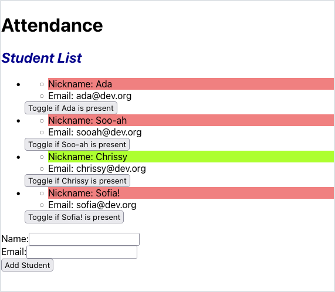

# Submitting Forms

## Introduction

Sofia has been working on making a new student form in her attendance app. Consider her progress with this list of components:

<br/>

<details>

<summary>An <code>App</code> component, responsible for managing all the student data</summary>

<!-- prettier-ignore-start -->
```js
import { useState } from 'react';
import StudentList from './components/StudentList';
import NewStudentForm from './components/NewStudentForm';

function App() {
  const [studentData, setStudentData] = useState([
    {
      id: 1,
      nameData: 'Ada',
      emailData: 'ada@dev.org',
      isPresentData: false
    },
    {
      id: 2,
      nameData: 'Soo-ah',
      emailData: 'sooah@dev.org',
      isPresentData: false
    },
    {
      id: 3,
      nameData: 'Chrissy',
      emailData: 'chrissy@dev.org',
      isPresentData: true
    }
  ]);

  const updateStudentData = updatedStudent => {
    const students = studentData.map(student => {
      if (student.id === updatedStudent.id) {
        return updatedStudent;
      } else {
        return student;
      }
    });

    setStudentData(students);
  };

  return (
    <main>
      <h1>Attendance</h1>
      <StudentList
        students={studentData}
        onUpdateStudent={updateStudentData}
      ></StudentList>
      <NewStudentForm></NewStudentForm>
    </main>
  );
}

export default App;
```
<!-- prettier-ignore-end -->

</details>

<details>

<summary>A <code>StudentList</code> component, responsible for displaying a list of students</summary>

<!-- prettier-ignore-start -->
```js
import './StudentList.css';
import PropTypes from 'prop-types';
import Student from './Student';

const StudentList = (props) => {
    const studentComponents = props.students.map((student, index) => {
        return (
            <li key={index}>
                <Student
                    id={student.id}
                    name={student.nameData}
                    email={student.emailData}
                    isPresent={student.isPresentData}
                    onUpdate={props.onUpdateStudent}
                ></Student>
            </li>
        );
    });

    return (
        <section>
            <h2>Student List</h2>
            <ul>
                {studentComponents}
            </ul>
        </section>
    );
}

StudentList.propTypes = {
    students: PropTypes.arrayOf(PropTypes.shape({
        id: PropTypes.number.isRequired,
        nameData: PropTypes.string.isRequired,
        emailData: PropTypes.string.isRequired,
        isPresentData: PropTypes.bool
    })),
    onUpdateStudent: PropTypes.func
};

export default StudentList;
```
<!-- prettier-ignore-end -->

</details>

<details>

<summary>A <code>Student</code> component, responsible for displaying the details of one student. Contains a button that toggles whether the student is present or not.</summary>

<!-- prettier-ignore-start -->
```js
import PropTypes from 'prop-types';
import './Student.css';

const Student = (props) => {

    const onAttendanceButtonClick = () => {
        const updatedStudent = {
            id: props.id,
            nameData: props.name,
            emailData: props.email,
            isPresentData: !props.isPresent
        }

        // Invoke the function passed in through the prop named "onUpdate"
        // This function is referenced by the name "updateStudentData" in App
        props.onUpdate(updatedStudent);
    }

    const nameColor = props.isPresent ? 'green' : 'red';

    return (
        <div>
            <ul>
                <li className={nameColor}>Nickname: {props.name}</li>
                <li>Email: {props.email}</li>
            </ul>
            <button onClick={onAttendanceButtonClick}>Toggle if {props.name} is present</button>
        </div>
    )
}

Student.propTypes = {
    id: PropTypes.number.isRequired,
    name: PropTypes.string.isRequired,
    email: PropTypes.string.isRequired,
    isPresent: PropTypes.bool,
    onUpdate: PropTypes.func.isRequired
};

export default Student;
```
<!-- prettier-ignore-end -->

</details>

<details>

<summary>A <code>NewStudentForm</code> component, responsible for containing a form to add a new student.</summary>

<!-- prettier-ignore-start -->
```js
import { useState } from 'react';

const NewStudentForm = () => {

    const [formFields, setFormFields] = useState({
        name: '',
        email: ''
    });

    const onNameChange = (event) => {
        setFormFields({
            ...formFields,
            name: event.target.value
        })
    };

    const onEmailChange = (event) => {
        setFormFields({
            ...formFields,
            email: event.target.value
        })
    };

    return (
        <form>
            <div>
                <label htmlFor="fullName">Name:</label>
                <input
                    name="fullName"
                    value={formFields.name}
                    onChange={onNameChange}/>
            </div>
            <div>
                <label htmlFor="email">Email:</label>
                <input name="email"
                    value={formFields.email}
                    onChange={onEmailChange}/>
            </div>
            <input
                type="submit"
                value="Add Student"
            />
        </form>
    );
}

export default NewStudentForm;
```
<!-- prettier-ignore-end -->

</details>

The `NewStudentForm` component is all well and good. It follows the controlled component pattern, so its state is in sync with the input fields.

However, all student data is managed in the `App` component. Our new student form doesn't actually add a student!

To handle form submissions, and bring the data to the `App` component, we need to lift state up.

## Sofia's Plan

Passing down event handlers and lifting state up follows exact same process that she's done before in React development. The _only exception_ is she needs to learn how to prevent default form behavior.

Sofia's goal is to get the data from the `NewStudentForm` up to the `App` component.

The `App` component is already the single source of truth for her student data, so the remaining steps of her plan are:

1. Pass down event handlers from `App` to the `NewStudentForm`
1. Configure the form submission in `NewStudentForm` to lift state up

## Passing Down New Student Handlers

Sofia starts by making a method in `App` that adds a new student to the student data:

<!-- prettier-ignore-start -->
```js
    const addStudentData = newStudent => {
        // Duplicate the student list
        const newStudentList = [...studentData];

        // Logic to generate the next valid student ID
        const nextId = Math.max(...newStudentList.map(student => student.id)) + 1;

        newStudentList.push({
            id: nextId,
            nameData: newStudent.nameData,
            emailData: newStudent.emailData,
            isPresentData: false,
        });

        setStudentData(newStudentList);
    };
```
<!-- prettier-ignore-end -->

There are no rules about this `addStudentData` function, and Sofia could have written this logic using any approach or code style!

Sofia chose to implement `addStudentData` this way:

1. The function receives a new student object, `newStudent`.
1. She duplicates the `studentData` array into `newStudentList`, which will help React detect a change.
1. She generates a new ID number, `nextId`.
1. She pushes a new object into `newStudentList`. The shape of this object matches the other objects in `studentData`.
1. The `newStudentList` now contains an object with the `newStudent` data. She updates `studentData` in state with `setStudentData`.

### !callout-info

## The Implied Shape of `newStudent`

Consider this implementation of `addStudentData` and how Sofia accessed the name and email of the `newStudent`.

<br/>

This implementation reaches into `newStudent` and grabs the values of `nameData` and `emailData` specifically... not `name`, or `newName`, or anything else! We should keep in mind that this function expects `newStudent` to have the keys exactly named `nameData` and `emailData`.

<br/>

If we want to change the name of the expected keys, we should refactor `App`'s definition of `addStudentData`.

### !end-callout

Now, Sofia needs to actually use her new function. She passes it into an instance of `NewStudentForm`, through a new prop named `addStudentCallback`.

<!-- prettier-ignore-start -->
```js
    return (
        <main>
            <h1>Attendance</h1>
            <StudentList
                students={studentData}
                onUpdateStudent={updateStudentData}
            ></StudentList>
            <NewStudentForm
                addStudentCallback={addStudentData}
            ></NewStudentForm>
        </main>
    );
```
<!-- prettier-ignore-end -->

Sofia updates the PropTypes of `NewStudentForm` to now anticipate this prop:

<!-- prettier-ignore-start -->
```js
import PropTypes from 'prop-types';

const NewStudentForm = (props) => {
// ...

NewStudentForm.propTypes = {
    addStudentCallback: PropTypes.func
};
```
<!-- prettier-ignore-end -->

## Handling Form Submissions 

Sofia's next step is to get `NewStudentForm` to add student data when the form submits.

She starts by creating a new function, `onFormSubmit`:

<!-- prettier-ignore-start -->
```js
    const onFormSubmit = (event) => {
        event.preventDefault();

        props.addStudentCallback({
            nameData: formFields.name,
            emailData: formFields.email
        });

        setFormFields({
            name: '',
            email: '',
        });
    };
```
<!-- prettier-ignore-end -->

Sofia's implementation of `onFormSubmit` looks like this:

1. She uses the passed in `event` object and calls `event.preventDefault()`. This prevents the unwanted default behavior of HTML forms.
1. She invokes the function `props.addStudentCallback()`. This prop was passed in by `App`, with the value `addStudentData`.
1. She knows that `props.addStudentCallback` receives an object, `newStudent`. She knows that this object should have the keys `nameData` and `emailData`. She passes in an object literal, where the keys are `nameData` and `emailData`, and the values read from the `formFields` state.
1. She resets the form by updating the members of `formFields` to empty strings.

### !callout-danger

## Prevent the Form's Default Behavior

HTML forms have default behavior: when a form receives a "submit" event, it will make a GET request. This creates an effect where our web app reloads every time we submit a form! Be sure to include `event.preventDefault();` in any form submission event handler.

### !end-callout

## Verify

Sofia's app now handles the new student form submission!


Her last step is to verify her work.

In celebration of her effort and work, she inputs her own name...


and bam! 💥 A new student showed up! The form even got reset, too!



We can appreciate how the list of students updated, too. By allowing one component, `App` in this case, manage all of the student data, the other components could focus on displaying it.

## Check for Understanding

<!-- Question Takeaway -->
<!-- prettier-ignore-start -->
### !challenge
* type: paragraph
* id: 90fd1d15
* title: Submitting Forms
##### !question

What was your biggest takeaway from this lesson? Feel free to answer in 1-2 sentences, draw a picture and describe it, or write a poem, an analogy, or a story.

##### !end-question
##### !placeholder

My biggest takeaway from this lesson is...

##### !end-placeholder
### !end-challenge
<!-- prettier-ignore-end -->

<!-- Question 1 -->
<!-- prettier-ignore-start -->
### !challenge
* type: paragraph
* id: d7afd88b
* title: Submitting Forms
##### !question

This is the end of Sofia's journey. What message or advice would you like to give her?

##### !end-question
##### !placeholder

My message for Sofia is...

##### !end-placeholder
### !end-challenge
<!-- prettier-ignore-end -->
