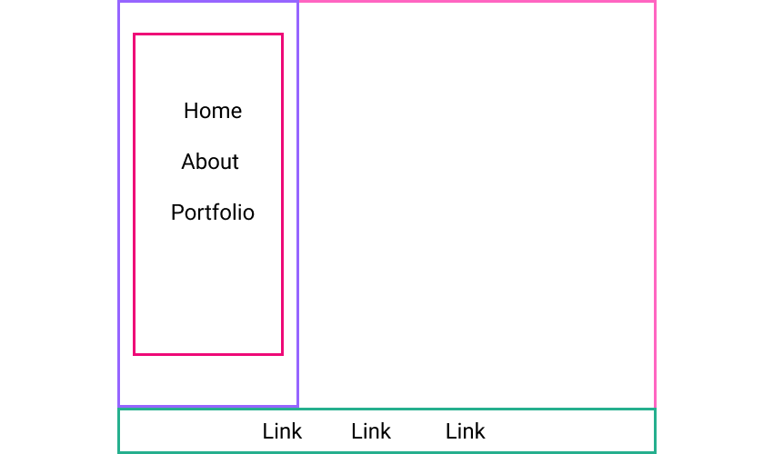

# Activity: Structuring Personal Portfolio

## Goals

Our coding skills improve with repetition.

In the final activity, we will finish up our personal portfolio website by laying out our elements on the page using the box model, `display` properties, flexbox, and/or grid.

## Activity Instructions

### Requirements

Present the elements on the page as you see fit by using the following at least once:
* a grid container with a few grid items
* a flexbox container with a few flex items

Both of these containers do not need to be on the same page. Try using one for one page, and the other for another page!

If you need some inspiration, here are two common layouts you can replicate:

  

  

### !callout-info

## A Word of Caution (Again)
A lot of developers find their initial foray into CSS frustrating. Every browser implements the CSS standard a little (or a lot) differently. Learning to manipulate elements and understand the box model takes time. Layout can be especially challenging to developers new to CSS. 

For this project, focus on understanding the mechanics and semantics of HTML and CSS, and how the two work together.

### !end-callout

<!-- prettier-ignore-start -->
### !challenge
* type: tasklist
* id: 2d7e2968-dc13-4930-b738-fb05dedd7920
* title: Finishing Up Personal Portfolio Website
##### !question

Check off that you have completed personal portfolio activities and have submitted your `pull request URL` to the Personal Portfolio topic in Projects.

##### !end-question
##### !options

* Submitted pull request to Personal Portfolio in Projects

##### !end-options
### !end-challenge
<!-- prettier-ignore-end -->
