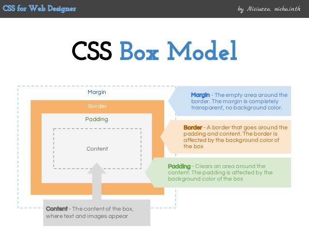

# Box Model

## Learning Goals

- Identify the key pieces of the box model: margin, border, padding, content

## Every Element Is a Box

Every element on a page is a rectangular box.

Understanding the structure of an element's box will help us understand its size and position.

In CSS, each of these rectangular boxes are described using the _box model_. This model describes the space taken by an element.

All elements have four parts:

| Part    | Description                                                                                                                                                                                              |
| ------- | -------------------------------------------------------------------------------------------------------------------------------------------------------------------------------------------------------- |
| Content | The most inner portion of the element.                                                                                                                                                                   |
| Padding | The space between the content and the border.                                                                                                                                                            |
| Border  | The space between padding and the margin, and typically the most outer visible portion of the element.                                                                                                   |
| Margin  | The most outer portion of the element, and the space between this element and the surrounding elements. Depending on context, margins between elements may overlap (and the larger margin is preserved). |


[Image source](http://www.slideshare.net/niciuzza/css-box-model-25142045)

### Observe the Box Model

Let's quickly observe how the box-model applies to our existing HTML. With a site we've already created, let's add the following CSS:

```css
* {
  border: red 1px solid;
}
```

This syntax will help us clearly see the boxes of each HTML element.

In the long run, the best method of observing and debugging widths, heights, and the boxes of each element is to use our browser's Dev Tools.

## Determining the Size of an Element

There are several properties that determine the size of that box. The core of the box is defined by the width and height of an element, which may be determined by the display property, by the contents of the element, or by specified width and height properties.

Padding and then border expand the dimensions of the box outward from the element’s width and height. Lastly, any margin we have specified will follow the border.

According to the box model, the total width of an element can be calculated using the following formula:

```
margin-right + border-right + padding-right + width + padding-left + border-left + margin-left
```

And this formula for the height:

```
margin-top + border-top + padding-top + height + padding-bottom + border-bottom + margin-bottom
```

This is important to consider when setting an element's width. Even if we have two elements with a width of 50%, they will not show up side by side if there is any padding, margin or border adding to the widths.
