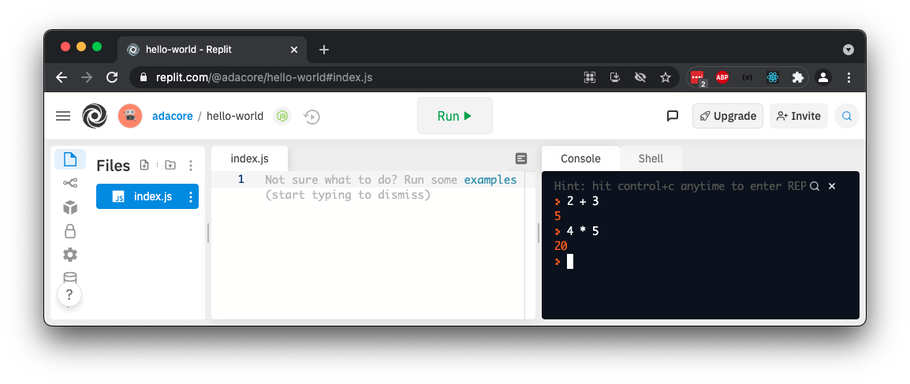
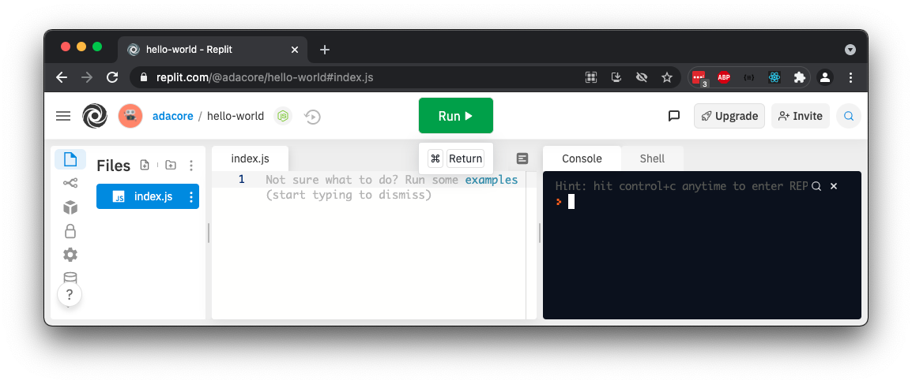

# Hello, World!

## Introduction

A well-known exercise to accomplish when learning another programming language is "Hello, World!" We'll know we're successful if we see the text `Hello, World!` appear somewhere after running the code.

## Running Code in the REPL

To run JavaScript code, we need to consider its _runtime environment_. A **runtime environment** is a set of technologies that determine _how_ to execute the code.

Some examples of runtime environments that can run JavaScript:

- The runtime environment of a web browser like Mozilla Firefox and Google Chrome
- [Node.js](https://nodejs.org/en/)
- REPLs like [replit.com](https://replit.com/)

For this portion of the curriculum, we will use [replit.com](https://replit.com/).

The following steps will let us create and run JavaScript programs with ease:

1. Create an account on [replit.com](https://replit.com/) and log-in
1. Visit [the Hello, World! REPL](https://replit.com/@adacore/hello-world#index.js)

On the right side, we see the _console_. We can use this console to execute small, quick JavaScript snippets, such as `2 + 3`, `4 * 5`, or any other valid code.



On the left side, we see a file explorer, and `index.js`. We can write JavaScript code within this file.

Then, we can run this code using the green "Run" button on the top.



There are more features in replit.com that are worth exploring! For now, let's begin working on our Hello, World program.

## Implementation

To print `Hello, World!` in JavaScript, [we can write](https://replit.com/@adacore/hello-world#index.js):

<!-- prettier-ignore-start -->
```js
console.log('Hello, World!');
```
<!-- prettier-ignore-end -->

[When we run our code](https://replit.com/@adacore/hello-world#index.js), we should see `Hello, World!` in the console.

| <div style="min-width:200px;"> Piece of Code </div> | Notes                                                                                                             |
| --------------------------------------------------- | ----------------------------------------------------------------------------------------------------------------- |
| `console`                                           | A variable. The word "console" usually refers to the Terminal, command line, or wherever output logs get printed. |
| `console.log( ... )`                                | A function call that takes in some arguments.                                                                    |
| `'Hello, World!'`                                   | A string literal. This string is surrounded by single-quotes (`'`).                                               |
| `;`                                                 | A semicolon.                                                                                                      |

Let's debrief in slightly more detail.

### The Console

`console` seems a little random here. It's lowercase, like Python variables, but there seems to be no variable assignment. We don't see any `import`s or anything like that, so where did `console` come from?

`console` is a variable that references a specific object: the console! This console object gives us access to wherever the program prints out output.

It seems that `console` is within scope of our JavaScript file by default.

At this moment, at the beginning of our JavaScript journey, we won't go deeper into this.

### Calling a Function

`console.log()` is calling a function. We might not know all the details about this function, but we know that it's responsible for printing objects to the console.

We may make guesses that:

1. The function being called here is named `log`
1. The function `log` is a member of `console` (hence the dot-operator)
1. We use the dot-operator to access members of objects
1. The parens `()` is how we call and invoke the function

### Single Quotes for Strings

The string literal `'Hello, World!'` is surrounded by single-quotes, instead of double-quotes.

If we experiment and replace it with double-quotes (`console.log("Hello, World!");`), we'll see that our code still runs as expected!

In JavaScript, we can create string literals with either syntax.

### !callout-info

## This Curriculum Will Prefer Single-Quotes

The text in this curriculum will prefer single-quotes. In the grand scheme of things, the most important thing is consistency within a team.

### !end-callout

### Ends With a Semicolon

This line of code ends with a semicolon (`;`).

In JavaScript, semicolons are used to conclude statements.

### !callout-info

## Statements

In programming, a statement is a unit of code that contains an action to execute. We use statements mainly to _perform an action with side effects_. The following are examples of statements:

- `foo = 'A value for foo';`
- `return foo;`
- `if` statements

### !end-callout

Many modern JavaScript flavors, standards, and teams are beginning to prefer _excluding_ semicolons, relying on "Automatic Semicolon Insertion."

We can get deeper into JavaScript's semicolon and Automatic Semicolon Insertion later!

### !callout-info

## This Curriculum Will Use Semicolons

The text in this curriculum will prefer to include semicolons at the end of every statement. In the grand scheme of things, the most important thing is consistency within a team.

### !end-callout

## Check for Understanding

<!-- Question 1 -->
<!-- prettier-ignore-start -->
### !challenge
* type: multiple-choice
* id: 2dc59ebe
* title: Hello, World!
##### !question

True or False: We can use replit.com JavaScript REPLs and other online JavaScript REPLs to run JavaScript.

##### !end-question
##### !options

* True
* False

##### !end-options
##### !answer

* True

##### !end-answer
### !end-challenge
<!-- prettier-ignore-end -->

<!-- Question 2 -->
<!-- prettier-ignore-start -->
### !challenge
* type: multiple-choice
* id: 05776350
* title: Hello, World!
##### !question

True or False: We must import `console` before we use it.

##### !end-question
##### !options

* True
* False

##### !end-options
##### !answer

* False

##### !end-answer
### !end-challenge
<!-- prettier-ignore-end -->

<!-- Question 3 -->
<!-- prettier-ignore-start -->
### !challenge
* type: multiple-choice
* id: 3332d0a3
* title: Hello, World!
##### !question

True or False: The name of the function we called is `console.log`

##### !end-question
##### !options

* True
* False

##### !end-options
##### !answer

* False

##### !end-answer
##### !explanation

The name of the function we called is `log`. We accessed it through the `console` object.

##### !end-explanation
### !end-challenge
<!-- prettier-ignore-end -->

<!-- Question 4 -->
<!-- prettier-ignore-start -->
### !challenge
* type: multiple-choice
* id: 067fa65a
* title: Hello, World!
##### !question

True or False: We used parens `()` to invoke the function `log`.

##### !end-question
##### !options

* True
* False

##### !end-options
##### !answer

* True

##### !end-answer
### !end-challenge
<!-- prettier-ignore-end -->

<!-- Question 5 -->
<!-- prettier-ignore-start -->
### !challenge
* type: multiple-choice
* id: 03e1a54e
* title: Hello, World!
##### !question

True or False: We used can use single-quotes and double-quotes to create string literals.

##### !end-question
##### !options

* True
* False

##### !end-options
##### !answer

* True

##### !end-answer
### !end-challenge
<!-- prettier-ignore-end -->

<!-- Question 6 -->
<!-- prettier-ignore-start -->
### !challenge
* type: multiple-choice
* id: a704ffc1
* title: Hello, World!
##### !question

True or False: Semicolons are used to conclude statements.

##### !end-question
##### !options

* True
* False

##### !end-options
##### !answer

* True

##### !end-answer
### !end-challenge
<!-- prettier-ignore-end -->
