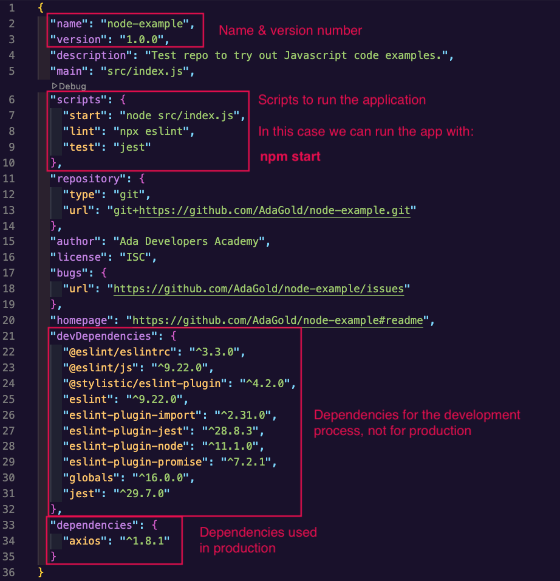

# Writing JavaScript Locally

Most of our initial examples of JavaScript will reside in the browser running in [repl.it](https://replit.com/). However JavaScript can also be written locally, and run using the [Node.js](https://nodejs.org/en/) runtime environment. This is useful for writing code that is not dependent on the browser, and can be run on a server, but our focus will remain on front-end web development.

## Installing Node

To install Node.js, we can use Homebrew. 

```bash
$ brew install node
$ brew install yarn
```

With these commands we can now run Node.js and `yarn`. Node.js is a framework for running JavaScript in the terminal and `yarn` is a package manager for Node.js, similar to `pip` for Python.

By installing node we can now run the following command to run the Node.js REPL:

```bash
$ node       
Welcome to Node.js v16.8.0.
Type ".help" for more information.
> 
```

Just like the Python REPL we can now write and run JavaScript code. For example:

```javascript
node       
Welcome to Node.js v16.8.0.
Type ".help" for more information.
> const x = 42;
undefined
> console.log(x);
42
undefined
> 
```

The REPL will execute each JavaScript statement as we enter them and print the result to the console. 

The REPL will continue to run until we exit it. We can exit the REPL by typing `Ctrl-D` or `.exit`.


### Running JavaScript Files

We can also create and run JavaScript files. For example we can create this file and name it `hello.js`.

```javascript
const helloWorld = function(name) {
    if (name === undefined) {
        name = "World";
    }
    console.log(`Hello ${name}!`)
};

helloWorld(); // Hello World!
helloWorld('Naya Spence'); // Hello Naya Spence!
```

We can then run the file with

```bash
$ node hello.js 
Hello World!
Hello Naya Spence!
```

## Setting Up VS Code

Like Python, Visual Studio Code can be used to write and run JavaScript. VS Code also has a number of great extension for use with JavaScript.

You should install the following extensions:

### Prettier

[Prettier](https://marketplace.visualstudio.com/items?itemName=esbenp.prettier-vscode) is an automatic code formatter for JavaScript. It is useful for formatting your code consistently. It can take some getting used to, but once you get used to it you will find it very useful.

After installing the extension you can set it up to run automatically as the default formatter for JavaScript.

To have Prettier run automatically hit `cmd-,` (command-comma) and click on the Configuation File icon. 


Then add the following `[javascrpt]` section:

```
  "[javascript]": {
    "editor.insertSpaces": true,
    "editor.tabSize": 2,
    "editor.defaultFormatter": "esbenp.prettier-vscode",
    "editor.formatOnSave": true
  },
```

This just tells VS Code to use Prettier as the default formatter for JavaScript and to indent with 2 spaces. It will also run Prettier on each save. 


### Eslint

[Eslint](https://marketplace.visualstudio.com/items?itemName=dbaeumer.vscode-eslint) is an extension that can be used to check your JavaScript code for errors. It is useful for ensuring that your code is well-written and follows best practices. You can give Eslint a configuration file to have it enforce a specific style guide, more on this later.

### !callout-info

## There Are A LOT of Extensions

The JavaScript community is very active. There are many extensions for JavaScript. You are encouraged to experiment and explore, but we will only be requiring these extensions.

### !end-callout

## Style Guides


*Source: [XKCD](https://xkcd.com/927/)*

Many software teams adhere to a set of rules which serve as guidelines for how to write and organize code. Linters can be an integral part of a team's style conventions.

### Why use a style guide?

Style guides are a common way for a group of people to create consistently formatted documents. Like MLA or the Chicago Manual of Style, a code style guide helps us find the information we are looking for as quickly as possible.

In a large team, with programmers from a lot of different language backgrounds, it's easy to fall into whatever habits your first programming language encouraged. A Python whiz might default to using indentation alone to show where a code block begins and ends, where a C programmer at heart might feel more comfortable surrounding code blocks in curly braces. With small differences like these, one slight difference between two programmers may go unnoticed, but as teams get bigger and more and more styles mix, code becomes increasingly ugly and unreadable. 

Simply put, style guides help us keep code formatted consistently between developers, making for fewer context switches, and hopefully fewer silly mistakes.

Some common style guides include:

- [AirBNB](https://github.com/airbnb/javascript) has a well documented coding standard that is very popular.
- [Google](https://google.github.io/styleguide/jsguide.html) also has a popular coding style guide.

We will use the linting setting [ESLint Standard](https://eslint.org/docs/rules/), [eslint-config-prettier](https://github.com/prettier/eslint-config-prettier) and [ESLint-react](https://github.com/yannickcr/eslint-plugin-react) which have a rather minimal set of linting rules to highlight common JavaScript problems and will continue to apply when we begin working with React.

## Typical Node Project Structure

A typical Node.js project will have the following structure:

```
.
├── src
│   ├── index.js
│   ├── [other files & folders]
├── node_modules
│   ├── [folders with dependencies]
├── README.md
├── package.json
├── .prettierrc
└── .eslintrc.json
```

The `src` directory will contain our application code.

The `node_modules` folder holds packages installed with a package manager like `yarn`. Similar to how `pip` downloads and installs packages in Python, `yarn` can download packages for you to use and places them in the `node_modules` folder. This folder can grow very large as you install more packages. Make sure to add it to a `.gitingore` file so that it is ignored by Git.

The `package.json` file will contain information about the project including the dependencies (libraries required) and scripts to run the app.

The (optional) `.prettierrc` file will contain information about the Prettier plugin will format our code.

The `.eslintrc.json` file will contain information about the linting rules. Essentially they tell the Eslint plugin in VS Code what code style rules to enforce.


### An Example Node Project

Clone the [node-example](https://github.com/AdaGold/node-example) repository. Then run `yarn install` to install the dependencies.

Examine the `package.json` file and look at the key-value pairs in the json file. 



The `scripts` key contains a list of commands that can be run from the command line. For example, `yarn run start` will run the `start` script.

Examine the `.eslintrc.json` file and look at the key-value pairs in the json file. These are the rules that Eslint will enforce and information about what version of JavaScript to use.


### !callout-secondary

## npm command

Yarn is not the only package manager in the JavaScript world. Another common command you will see (and comes with Node.js) is `npm`. It is a package manager for JavaScript. It functions very similarly to `yarn` in that it can download packages for you to use and places them in the `node_modules` folder.

Because `create-react-app` uses `yarn` to manage dependencies, we will stick to using `yarn` in our examples, but you can use `npm` if you prefer and you will see many examples of the `npm` command online.

### !end-callout

### [Optional] Setting Up A Node Project From Scratch

To create a `package.json` file you can create a folder to house the project and use `yarn init` to create a `package.json` file:

```bash
$ mkdir <project-folder-name>
$ cd <project-folder-name>
$ yarn init
```

Yarn will take you through a series of questions to generate a `package.json` file. You can then add dependencies with `yarn add <dependency>` for example you can add the [underscore](https://underscorejs.org/) library (a common utility library) with:

```bash
$ yarn add underscore
```

You can also add dependencies which will only be used during development with `yarn add --dev <dependency>`

For example adding prettier and eslint libraries:

```bash
$ yarn add --dev eslint eslint-config-prettier eslint-config-standard eslint-plugin-import eslint-plugin-node eslint-plugin-prettier eslint-plugin-react prettier
```

If you want to use Eslint, you would need to do the following to create the `.eslintrc.json` file:

In the project directory type:

```bash
$ npx eslint --init
```

Eslint will take you through several options to set up your project for linting. You can then edit the `.eslintrc.json` file to add the rules you want to enforce.

Now you have the basic building blocks of a Node.js project. You can start working on your project by creating a `src` directory and a `index.js` file. You can also create scripts in the `package.json` file to run your application. For example, you can create a `start` script to run your application:

```json
  "scripts": {
    "start": "node index.js"
  }
```

Congratulations!  You have created a Node.js project. You can now run your application with `yarn start`. 

## Resources

- [ESLint Rules](https://eslint.org/docs/rules/)
- [Prettier Options](https://prettier.io/docs/en/options.html)
- [Youtube Video Traversty Media on Linting](https://www.youtube.com/watch?v=SydnKbGc7W8)