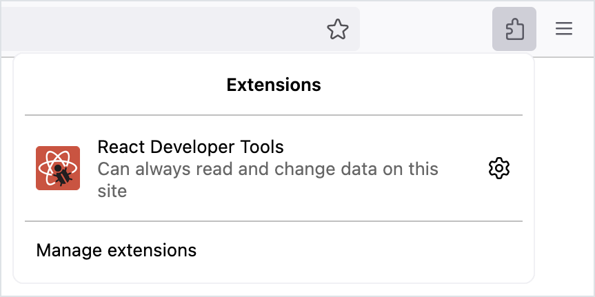
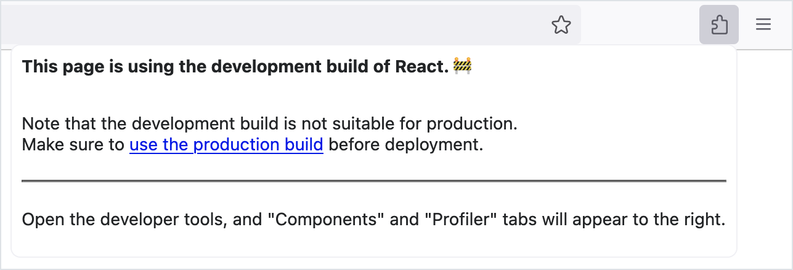
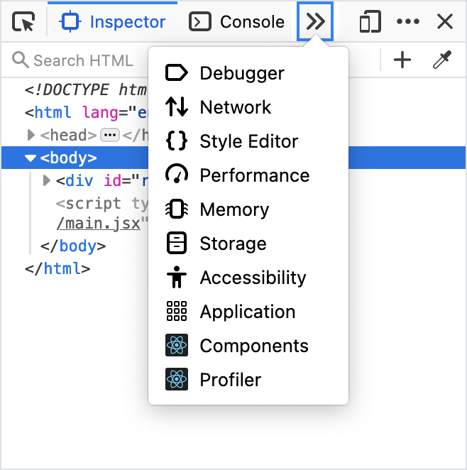
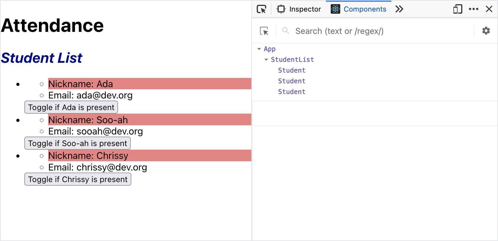

# Inspecting React State

<!-- VITE-UPDATE -->
<!-- <iframe src="https://adaacademy.hosted.panopto.com/Panopto/Pages/Embed.aspx?pid=5374b8d4-3d22-4283-8e39-ad51002407cf&autoplay=false&offerviewer=true&showtitle=true&showbrand=false&start=0&interactivity=all" height="405" width="720" style="border: 1px solid #464646;" allowfullscreen allow="autoplay"></iframe> -->

>As in the previous lesson, all subsequent code examples and screen shots will omit the `ClassInfo` component to focus on the `StudentList` part of the application. However, the `ClassInfo` component will still appear in the reference branches found in GitHub.

Sofia is creating an attendance app for her classroom.

She has been working hard and learning a lot! She has built the following components:

<br/>

<details>

<summary>An <code>App</code> component that holds student data and renders a <code>StudentList</code> component</summary>

`src/App.jsx`

<!-- prettier-ignore-start -->
```js
import StudentList from './components/StudentList';

function App() {
    const studentData = [
        {
            nameData: 'Ada',
            emailData: 'ada@dev.org',
        },
        {
            nameData: 'Soo-ah',
            emailData: 'sooah@dev.org',
        },
        {
            nameData: 'Chrissy',
            emailData: 'chrissy@dev.org',
        },
    ];

    return (
        <main>
            <h1>Attendance</h1>
            <StudentList students={studentData}></StudentList>
        </main>
    );
}

export default App;
```
<!-- prettier-ignore-end -->

</details>

<details>

<summary>A <code>StudentList</code> component that renders a <code>Student</code> component for each student in the student data</summary>

Notice the PropTypes declared for this component. `StudentList` expects a prop named `students`.

The `students` prop should be an array of objects. Each object in this array should have a `nameData` and an `emailData` field.

`src/components/StudentList.jsx`

<!-- prettier-ignore-start -->
```js
import './StudentList.css';
import PropTypes from 'prop-types';
import Student from './Student';

const StudentList = (props) => {
    const studentComponents = props.students.map((student, index) => {
        return (
            <li key={index}>
                <Student name={student.nameData} email={student.emailData}></Student>
            </li>
        );
    });

    return (
        <section>
            <h2 className="student-list__heading">Student List</h2>
            <ul>{studentComponents}</ul>
        </section>
    );
};

StudentList.propTypes = {
    students: PropTypes.arrayOf(
        PropTypes.shape({
            nameData: PropTypes.string.isRequired,
            emailData: PropTypes.string.isRequired,
        })
    ),
};

export default StudentList;
```
<!-- prettier-ignore-end -->

</details>

<details>

<summary>A <code>Student</code> component that renders student information, and contains a button that toggles the student's attendance</summary>

`src/components/Student.jsx`

<!-- prettier-ignore-start -->
```js
import { useState } from 'react';
import PropTypes from 'prop-types';
import './Student.css';

const Student = (props) => {
    const [isPresent, setIsPresent] = useState(false);

    const togglePresence = () => {
        setIsPresent(!isPresent);
    };

    const nameColor = isPresent ? 'green' : 'red';

    return (
        <div>
            <ul>
                <li className={nameColor}>Nickname: {props.name}</li>
                <li>Email: {props.email}</li>
            </ul>
            <button onClick={togglePresence}>
                Toggle if {props.name} is present
            </button>
        </div>
    );
};

Student.propTypes = {
    name: PropTypes.string.isRequired,
    email: PropTypes.string.isRequired,
};

export default Student;
```
<!-- prettier-ignore-end -->

</details>

In Sofia's app, each `Student` component manages a piece of state named `isPresent`. When the button is clicked, we update `isPresent`. When `isPresent` is updated, the component re-renders.

Sofia already _sees_ what she wants to see! When she clicks the button, the appearance of her app changes, and a student's name toggles between red and green.

However, when she considers her student data, Sofia sees a problem.

## Debugging State With React Developer Tools

Sofia's `App` component is responsible for holding and managing all student data. However, when she marks a student as present or absent, _it doesn't affect the student data at all_!

She can prove this by debugging with React Developer Tools.

React Developer Tools is a browser extension available for several browsers.

- [React Developer Tools for Mozilla Firefox](https://addons.mozilla.org/en-US/firefox/addon/react-devtools/)
- [React Developer Tools for Google Chrome](https://chrome.google.com/webstore/detail/react-developer-tools/fmkadmapgofadopljbjfkapdkoienihi)
- [React Developer Tools for Microsoft Edge](https://microsoftedge.microsoft.com/addons/detail/react-developer-tools/gpphkfbcpidddadnkolkpfckpihlkkil)

We can use the browser-specific links above to install the extension to our browser. After installing, the extension will appear under the browser Extensions toolbar. If the icon appears in color, this indicates that the extension has detected a React application at the current browser location. A grayed-out icon indicates the browser location does not refer to a React application.

  
_Fig. React Developer Tools extension visible under the Extensions toolbar. It appears in color, indicating the extension has detected a React application at the current browser location._

This extension expands the browser Dev Tools whenever we inspect a page built with React. The extension gives us two new views, "Components" and "Profiler." We'll use this extension to inspect the component structure in a React app, and observe state and `props` in each component.

Let's use the Dev Tools to inspect the state and `props` of Sofia's current web app.

After installing the React Dev Tools, we can visit our running React app at `localhost:5173`. Clicking on the "React Developer Tools" extension icon, a prompt reminds us that in order to access the extension functionality, we need to "Open the developer tools, and "Components" and "Profiler" tabs will appear to the right."

  
_Fig. React Developer Tools extension telling us to access its functionality through the developer tools_

When we open our Dev Tools, we can indeed see the new tabs, "Components" and "Profiler." If they are not immediately visible, then we might not have the correct browser location open (verify the browser is open to a running React application), or the additional tabs may be grouped under the overflow tab group, usually displayed as a double right chevron `»`.

Going forward, we can always start using the React Developer Tools through the Dev Tools. There's not really any reason we will need to access the React Developer Tools extension icon itself.

  
_Fig. React Developer Tools added to the browser developer tools_

When we view the Components tab, we see the component structure of our web app! We see an `App` component, a `StudentList` component, and three `Student` components.

  
_Fig. Component view of Sofia's attendance app_

We can select any of the components. The panels will update to reflect the `props` and state of each component.

  
_Fig. Displaying the `props` and state of the component holding Ada's data. Notice that React doesn't actually know the name of the state variable. It only knows that there is a state value set to true._

We can use the arrows to expand or collapse the different pieces of information.

  
_Fig. The `students` prop in the `StudentList` component is collapsed_

  
_Fig. The `students` prop in the `StudentList` component is expanded_

After playing around with these Dev Tools, we can observe:

- When we press the attendance button, the styles indeed change...
- But our student data does not!

  
_Fig. Changes to the `isPresent` status of each `Student` component have no effect on the original data_

Sofia would like any user interactions to actually update the student data.

## Applying Design Patterns

Let's consider how container component and presentational component design patterns appear in Sofia's app:

| <div style="min-width:150px;">Component</div>     | Description                                                                                             |
| ------------- | ------------------------------------------------------------------------------------------------------- |
| `App`         | Container component, because it holds and manages student data and passes it to its children components |
| `StudentList` | Presentational component, because it's responsible for rendering many students                          |
| `Student`     | Presentational component, because it's responsible for rendering student data. But it also owns the `isPresent` data for each student!                          |

Sofia's app currently manages toggling `isPresent` in the `Student` component, **_but this data has no way to get back up to the `App` component_**.

Sofia wants to make sure that the `App` component is handling and updating the student data. Additionally, Sofia wants to make sure that the two presentational components, `StudentList` and `Student`, are _not_ managing student data.

## Process

To refactor Sofia's attendance feature, we will follow these steps:

1. Create a "single source of truth" by "lifting state up" out of the `Student` component
2. Pass down student data and event handlers to presentational components
3. Connect the passed down data and event handlers in the presentational component to complete the feature

### !callout-success

## Don't Lose Sight of the Goal

Our goal is to ensure that `App` is managing each student's `isPresent` data.

<br/>

Whenever we need to remember what we're doing and why during this process, we should recall this bigger picture.

### !end-callout

<!-- >>>>>>>>>>>>>>>>>>>>>> BEGIN CHALLENGE >>>>>>>>>>>>>>>>>>>>>> -->

### !challenge

* type: multiple-choice
* id: ec3596bc-ef20-4eef-a5cf-17b1ad82a3e7
* title: Inspecting React State

##### !question

The React Developer Tools are

##### !end-question

##### !options

a| a VS Code extension to help us write clean JSX and use hooks appropriately
b| a browser extension to help us debug our component hierarchy and state
c| a development environment with tools to visually design React applications

##### !end-options

##### !answer

b|

##### !end-answer

### !end-challenge

<!-- ======================= END CHALLENGE ======================= -->

<!-- >>>>>>>>>>>>>>>>>>>>>> BEGIN CHALLENGE >>>>>>>>>>>>>>>>>>>>>> -->

### !challenge

* type: tasklist
* id: 038fe13b-804f-4aa9-b2aa-023b27f07e3b
* title: Inspecting React State

##### !question

Following Sofia's journey, I have

##### !end-question

##### !options

* installed the React Developer Tools for my preferred browser
* confirmed the React Developer Tools are active when I visit a running React application
* observed the change in pieces of state while interacting with the React application

##### !end-options

### !end-challenge

<!-- ======================= END CHALLENGE ======================= -->