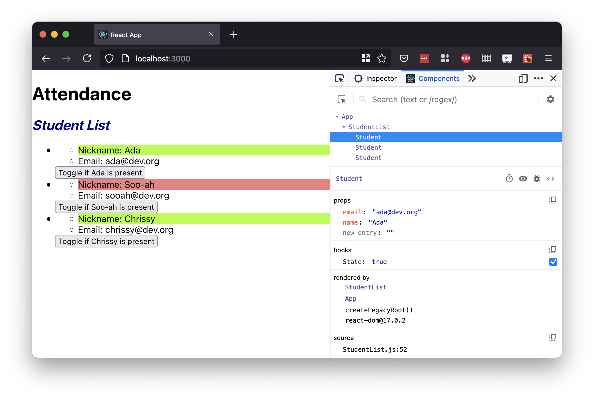
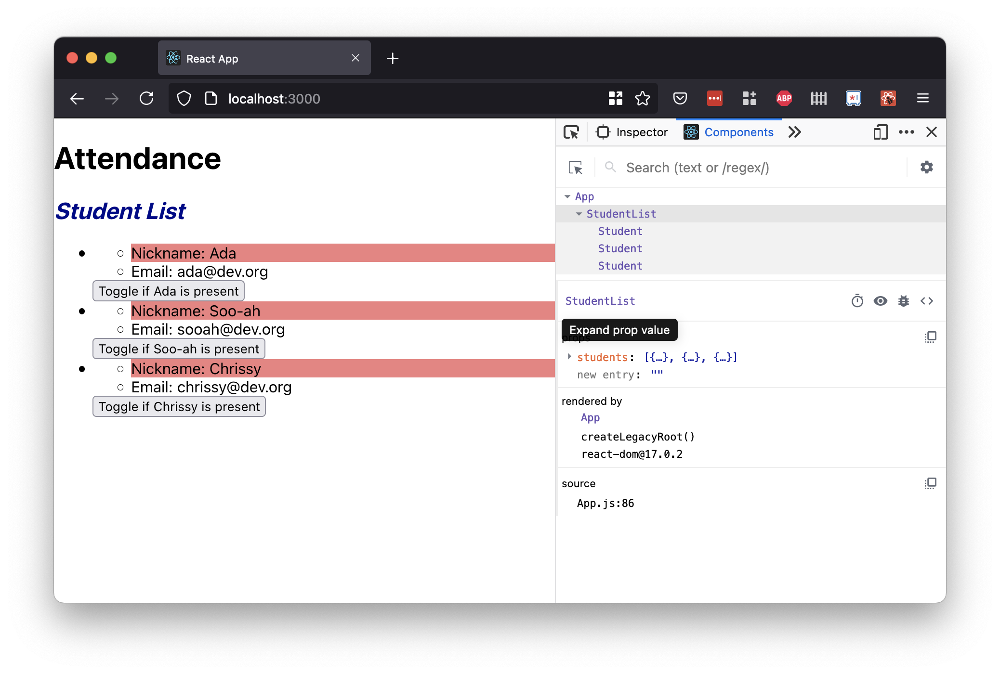
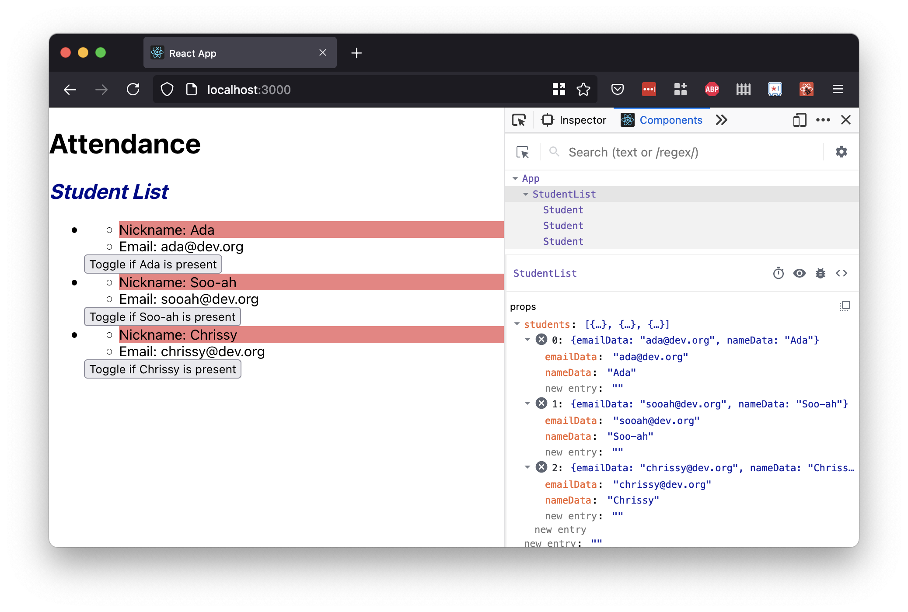
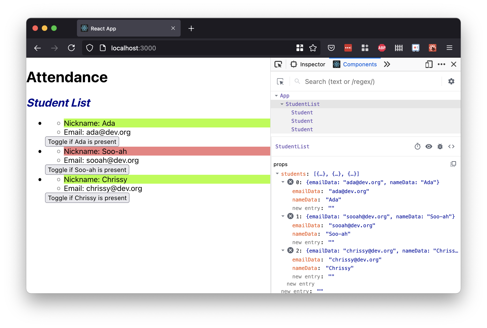

## Introduction

Sofia is creating an attendance app for her classroom.

The state of her app is the following:

<details>

<summary>An <code>App</code> component that holds student data and renders a <code>StudentList</code> component</summary>

`src/App.js`

<!-- prettier-ignore-start -->
```js
import StudentList from './components/StudentList';

function App() {
  const studentData = [
    {
      nameData: 'Ada',
      emailData: 'ada@dev.org'
    },
    {
      nameData: 'Soo-ah',
      emailData: 'sooah@dev.org'
    },
    {
      nameData: 'Chrissy',
      emailData: 'chrissy@dev.org'
    }
  ]

  return (
    <main>
      <h1>Attendance</h1>
      <StudentList students={studentData}></StudentList>
    </main>
  );
}

export default App;
```
<!-- prettier-ignore-end -->

</details>

<details>

<summary>A <code>StudentList</code> component that renders a <code>Student</code> component for each student in the student data</summary>

`src/components/StudentList.js`

Notice the PropTypes declared for this component. `StudentList` expects a prop named `students`.

The `students` prop should be an array of objects. Each object in this array should have a `name` and an `email`.

<!-- prettier-ignore-start -->
```js
import './StudentList.css';
import PropTypes from 'prop-types';
import Student from './Student';

const StudentList = (props) => {

    const studentComponents = props.students.map((student, index) => {
        return (
            <li key={index}>
                <Student name={student.nameData} email={student.emailData}></Student>
            </li>
        );
    });

    return (
        <section>
            <h2>Student List</h2>
            <ul>
                {studentComponents}
            </ul>
        </section>
    )
}

StudentList.propTypes = {
    students: PropTypes.arrayOf(PropTypes.shape({
        nameData: PropTypes.string.isRequired,
        emailData: PropTypes.string.isRequired
    }))
};

export default StudentList;
```
<!-- prettier-ignore-end -->

</details>

<details>

<summary>A <code>Student</code> component that renders student information, and contains a button that toggles the student's attendance</summary>

`src/components/Student.js`

<!-- prettier-ignore-start -->
```js
import { useState } from 'react';
import PropTypes from 'prop-types';
import './Student.css';

const Student = (props) => {
    const [isPresent, setIsPresent] = useState(false);

    const togglePresence = () => {
        setIsPresent(!isPresent);
    }

    const nameColor = isPresent ? 'green' : 'red';

    return (
        <div>
            <ul>
                <li className={nameColor}>Nickname: {props.name}</li>
                <li>Email: {props.email}</li>
            </ul>
            <button onClick={togglePresence}>Toggle if {props.name} is present</button>
        </div>
    )
}

Student.propTypes = {
    name: PropTypes.string.isRequired,
    email: PropTypes.string.isRequired
};

export default Student;
```
<!-- prettier-ignore-end -->

</details>

In Sofia's app, each `Student` component manages a piece of state named `isPresent`. When the button is clicked, we update `isPresent`. When `isPresent` is updated, the component re-renders.

Sofia already _sees_ what she wants to see! When she clicks the button, the appearance of her app changes, and a student's name toggles between red and green.

However, when she considers her student data, Sofia sees a problem.

## Debugging State With React Developer Tools

Her `App` component is responsible for holding and managing all student data. However, when she marks a student as present or absent, _it doesn't affect the student data at all_!

She can prove this by debugging with React Developer Tools.

React Developer Tools is a browser extension available on Firefox and Chrome.

- [React Developer Tools for Mozilla Firefox](https://addons.mozilla.org/en-US/firefox/addon/react-devtools/)
- [React Developer Tools for Google Chrome](https://chrome.google.com/webstore/detail/react-developer-tools/fmkadmapgofadopljbjfkapdkoienihi)

This extension expands the browser Dev Tools whenever we inspect a page built with React. The extension gives us two new views, "Components" and "Profiler." We'll use this extension to inspect the component structure in a React app, and to observe state and `props` in each component.

Let's use the Dev Tools to inspect the state and `props` of Sofia's current web app.

After installing and enabling the React Dev Tools, we can visit our running React app at `localhost:3000`. When we click on the "React Developer Tools" icon, a prompt will tell us to "Open the developer tools, and "Components" and "Profiler" tabs will appear to the right."


When we open our Dev Tools, we can indeed see the new tabs, "Component" and "Profiler."


When we view the Components tab, we'll see the component structure of our web app! We see an `App` component, a `StudentList` component, and three `Student` components.


We can select any of the components. The panels should update to reflect the `props` and state of each component.



We can use the arrows to expand or collapse the different pieces of information.





After playing around with these Dev Tools, we can observe:

- When we press the attendance button, the styles indeed change...
- But our student data does not!



Sofia wants to refactor her app so that user interactions update the student data.

## Applying Design Patterns

Let's consider how container component and presentational component design patterns appear in Sofia's app:

| Component     | Description                                                                                             |
| ------------- | ------------------------------------------------------------------------------------------------------- |
| `App`         | Container component, because it holds and manages student data and passes it to its children components |
| `StudentList` | Presentational component, because it's responsible for rendering many students                          |
| `Student`     | Presentational component, because it's responsible for rendering student data                           |

Sofia's app currently manages toggling `isPresent` in the `Student` component, **_but this data has no way to get back up to the `App` component_**.

Sofia wants to make sure that the `App` component is handling and updating the student data. Additionally, Sofia wants to make sure that the two presentational components, `StudentList` and `Student`, are _not_ managing student data.

## Process

To refactor Sofia's attendance feature, we will follow these steps:

1. Create a "single source of truth"
1. Pass down data and event handlers to presentational components
1. Ensure that our event handlers "lift state up"

### !callout-success

## Don't Lose Sight of the Goal

Our goal is to ensure that `App` is managing each student's `isPresent` data.

<br/>

Whenever we need to remember what we're doing and why during this process, we should recall this bigger picture.

### !end-callout
