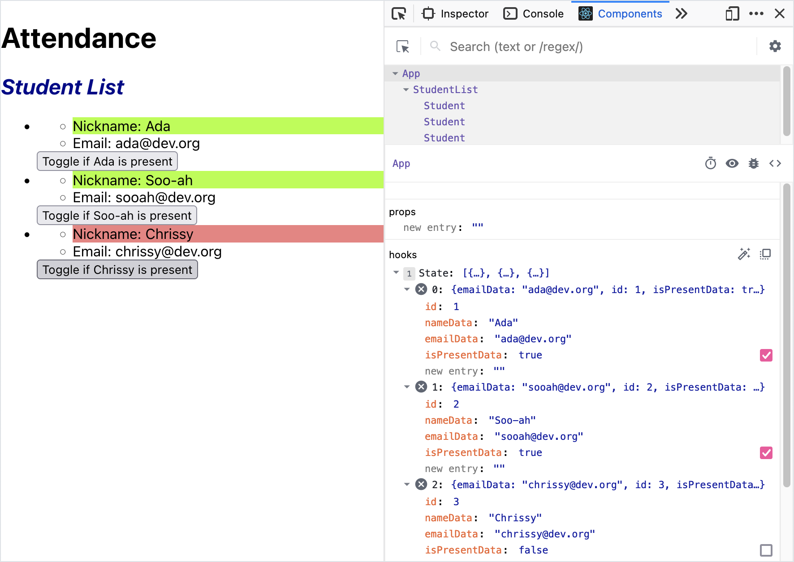
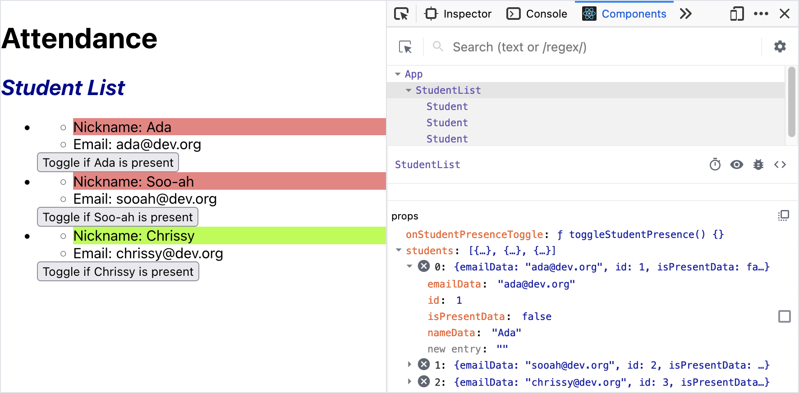
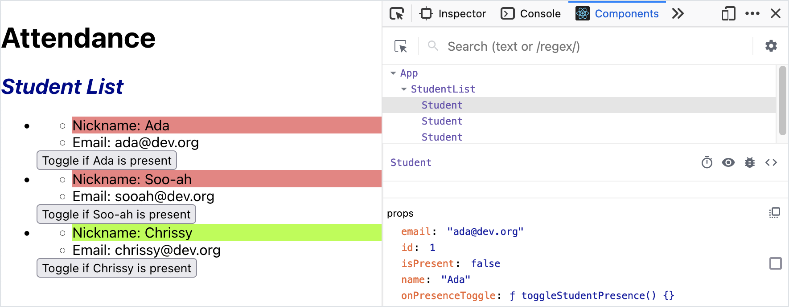

# Lifting State Up

We've made `App` manage our student data, and we've passed down some event handlers. Let's make our attendance button do something!

Again, our goal is to make the attendance button in `Student` update the `studentData` in `App`.

## Creating a New `onClick` Handler in `Student`

When we click the attendance button in one `Student` component, we should update that student's data.

The `prop` named `onUpdate` references a function that updates a student's data. We can look at `App`'s `updateStudentData` function if we need to see the implementation.

<details>

<summary>Review our current implementation of <code>App</code>.</summary>

<!-- prettier-ignore-start -->
```js
import { useState } from 'react';
import StudentList from './components/StudentList';

function App() {
  const [studentData, setStudentData] = useState([
    {
      id: 1,
      nameData: 'Ada',
      emailData: 'ada@dev.org',
      isPresentData: false
    },
    {
      id: 2,
      nameData: 'Soo-ah',
      emailData: 'sooah@dev.org',
      isPresentData: false
    },
    {
      id: 3,
      nameData: 'Chrissy',
      emailData: 'chrissy@dev.org',
      isPresentData: true
    }
  ]);

  const updateStudentData = updatedStudent => {
    const students = studentData.map(student => {
      if (student.id === updatedStudent.id) {
        return updatedStudent;
      } else {
        return student;
      }
    });

    setStudentData(students);
  }

  return (
    <main>
      <h1>Attendance</h1>
      <StudentList
        students={studentData}
        onUpdateStudent={updateStudentData}
      ></StudentList>
    </main>
  );
}

export default App;
```
<!-- prettier-ignore-end -->

</details>

<br/>

<!-- prettier-ignore-start -->
```js
const Student = (props) => {

    const onAttendanceButtonClick = () => {
        const updatedStudent = {
            id: props.id,
            nameData: props.name,
            emailData: props.email,
            isPresentData: !props.isPresent
        }

        // Invoke the function passed in through the prop named "onUpate"
        // This function is referenced by the name "updateStudentData" in App
        props.onUpdate(updatedStudent);
    }

    // ... other rendering logic
}
```
<!-- prettier-ignore-end -->

| <div style="min-width:200px;"> Piece of Code </div> | Notes                                                                                                                                                                                                                                                          |
| --------------------------------------------------- | -------------------------------------------------------------------------------------------------------------------------------------------------------------------------------------------------------------------------------------------------------------- |
| `const onAttendanceButtonClick = () => { ... }`     | We're creating an event-handling function named `onAttendanceButtonClick`.                                                                                                                                                                                     |
| `const updatedStudent = { ... }`                    | We create a variable, `updatedStudent`, to hold our updated student data.                                                                                                                                                                                      |
| `id: props.id, ... emailData: props.email,`         | The key-value pairs in this object should match exactly what is required in `App`'s `updateStudentData` function. In that function, we're looking for the keys `id`, `nameData`, `emailData`, and `isPresentData`, to match the existing `studentData` format. |
| `isPresentData: !props.isPresent`                   | When we click on the attendance button, the value of `isPresentData` should be the negation of `props.isPresent`.                                                                                                                                              |
| `props.onUpdate(...);`                              | The value of `props.onUpdate` is a function. We invoke this function using parentheses `()`.                                                                                                                                                                   |
| `updatedStudent`                                    | The function `props.onUpdate` ultimately accepts one argument, an updated student object. We can pass in our new `updatedStudent` object here.                                                                                                                 |

## Attaching `onAttendanceButtonClick` to the Attendance Button

Now that we have an event handler, let's ensure that we're _using_ this event handler!

We need to attach our function to the attendance button's `onClick` attribute:

<!-- prettier-ignore-start -->
```js
const Student = (props) => {

    const onAttendanceButtonClick = () => {
        const updatedStudent = {
            id: props.id,
            nameData: props.name,
            emailData: props.email,
            isPresentData: !props.isPresent
        }

        // Invoke the function passed in through the prop named "onUpate"
        // This function is referenced by the name "updateStudent" in App
        props.onUpdate(updatedStudent);
    }

    const nameColor = props.isPresent ? 'green' : 'red';

    return (
        <div>
            <ul>
                <li className={nameColor}>Nickname: {props.name}</li>
                <li>Email: {props.email}</li>
            </ul>
            <button onClick={onAttendanceButtonClick}>Toggle if {props.name} is present</button>
        </div>
    )
}
```
<!-- prettier-ignore-end -->

## Verifying

Let's see if our app works still!

Let's verify that user interactions affect the state of the app using React Dev Tools.

We should first observe that the `App` component indeed keeps `studentData` on state.


And clicking on the attendance buttons updates the state in `App`!




We did it! 🎉🎉

Let's observe two more things:

`StudentList` indeed has two `props`: a `students` array with the student data, and `onUpdateStudent`, which is a function.



Each `Student` component has five props:

1. `email`
1. `id`
1. `isPresent`
1. `name`
1. `onUpdate`, whose value is a function originally named `updateStudentData`



## Did We Accomplish "Single Source of Truth"?

We've accomplished the following:

1. We set `App` as the "single source of truth" of student data, and removed state from `Student`
1. We created a function that updates the state of `studentData` in `App`. Then, we passed that function down to `Student` through `props`.
1. We created an `onClick` event handler in `Student`. When the attendance button is called, it invokes the function that updates the state of `studentData` in `App`.

From these steps, our `App`, `StudentList`, and `Student` components follow the container component and presentational component design pattern better.

### !callout-info

## Remove Unused Imports

Now is a great time to read through our code and delete any unused imports. In particular, the `Student` component should not import `useState` anymore.

### !end-callout

## Check for Understanding

<!-- Question 1 -->
<!-- prettier-ignore-start -->
### !challenge
* type: multiple-choice
* id: 8ffcf3b5
* title: Lifting State Up
##### !question

Which of the following options best describes why this step is called "Lifting State Up"?

##### !end-question
##### !options

* The button for changing a student's attendance is rendered in the `Student` component, but the student data is managed in the state of the `App` component. Event handling that happens in `Student` needs to "bubble up" and affect the `App` component.
* The `Student` component stores the state of `isPresent`. The state of `isPresent` needs to be synchronized with the state of `isPresent` in the `App` component.

##### !end-options
##### !answer

* The button for changing a student's attendance is rendered in the `Student` component, but the student data is managed in the state of the `App` component. Event handling that happens in `Student` needs to "bubble up" and affect the `App` component.

##### !end-answer
### !end-challenge
<!-- prettier-ignore-end -->
