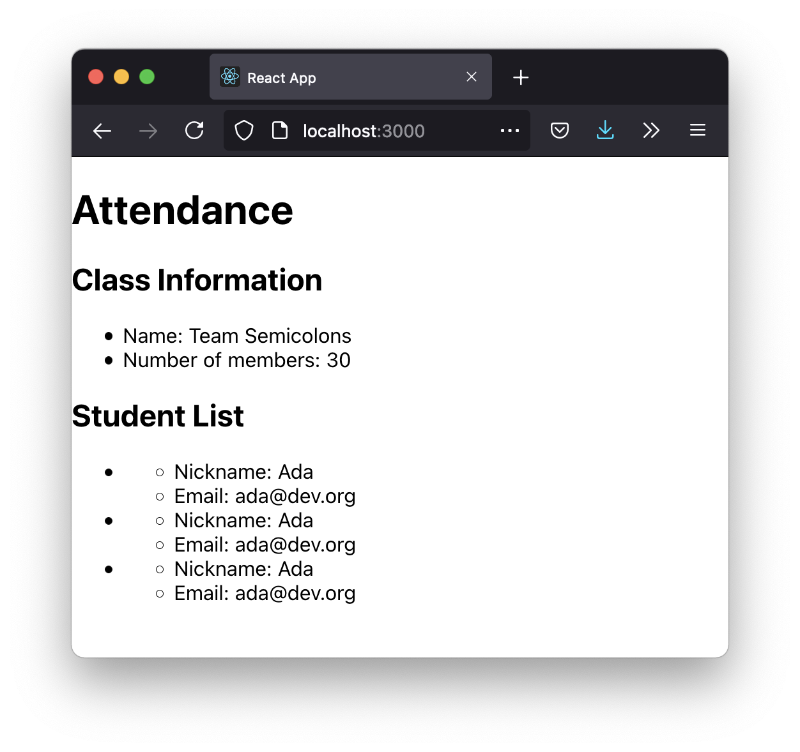

# Nested Components

## Goals

In order to increase the complexity of our React webapps, we should practice nesting components.

Nested components share a relationship that is different from sibling components.

We can apply a design pattern for components that will help us distinguish what our components do.

## Format

This lesson will take the following steps:

1. Introduce two design patterns for components:
   - presentational components
   - container components
1. Follow Sofia's journey on creating an attendance app, applying these design patterns

## Nested Components

When components are rendered, they can contain one or more elements or _other components_.

For example, consider this definition of an `App` component:

<!-- prettier-ignore-start -->
```js
function App() {
  return (
    <main>
      <h1>Attendance</h1>
      <ClassInfo></ClassInfo>
      <StudentList></StudentList>
    </main>
  );
}
```
<!-- prettier-ignore-end -->

When an `App` component is rendered, it begins with a `<main>` element.

The `App` component has two _nested_ components, or components rendered inside it:

1. One instance of a `ClassInfo` component
1. One instance of a `StudentList` component

The `ClassInfo` and `StudentList` components are _siblings_ to each other.

As React webapps increase in complexity, more and more components are defined and rendered.

Deciding how to design a React webapp and its components can be challenging. We can learn about and apply two design patterns to help us:

1. Presentational components
1. Container components

These are design patterns; these labels don't affect the syntax used to define them. The difference between these two kinds of components is the nature of their responsibilities, and how we use them.

## Presentational Components

Presentational components are components that are responsible for displaying data.

Presentational components are not responsible for modifying data.

## Container Components

Container components are components responsible for:

- Using presentation components
- Holding data
- Modifying and managing data
- Sending data to presentation components

Container components often have presentation components _nested_ inside them.

## Example: `StudentList` and `Student` Components

Sofia is a teacher creating an attendance app. Her app should display a list of students. At this moment, she starts with this implementation of a `StudentList` component in `src/components/StudentList.js`.

(Class names have been omitted from this code snippet for clarity)

<!-- prettier-ignore-start -->
```js
import React from 'react';
import './StudentList.css';

const StudentList = () => {
    return (
        <section>
            <h2>Student List</h2>
            <ul>
                <li>Student A</li>
                <li>Student B</li>
                <li>Student C</li>
            </ul>
        </section>
    )
}

export default StudentList;
```
<!-- prettier-ignore-end -->

This component displays a list of students, where each student is in an `<li>` element.

However, Sofia knows that each student list item should display a lot of data, such as their name and email address.

Sofia can apply the container and presentational component design patterns, and:

1. Create a `Student` component, which will act as a presentational component
1. Use the `Student` component in `StudentList`, which will act as a container component

### `Student` Component

Sofia's `Student` component should display a student's name and email address. She'll create a new file, `src/components/Student.js`, and write this code:

<!-- prettier-ignore-start -->
```js
import React from 'react';

const Student = () => {
    return (
        <li>
            <ul>
                <li>Nickname: Ada</li>
                <li>Email: ada@dev.org</li>
            </ul>
        </li>
    )
}

export default Student;
```
<!-- prettier-ignore-end -->

### Rendering `Student`s in `StudentList` Component

Now, Sofia can update her `StudentList` component.

First, she needs to import the `Student` component into `src/components/StudentList.js` with `import Student from './Student';`.

Then, she should replace the contents of the `<ul>` element.

<!-- prettier-ignore-start -->
```js
const StudentList = () => {
    return (
        <section>
            <h2>Student List</h2>
            <ul>
                <Student></Student>
                <Student></Student>
                <Student></Student>
            </ul>
        </section>
    )
}
```
<!-- prettier-ignore-end -->

(Imports, exports, and class names have been omitted from this code snippet for clarity)

Sofia's app now looks like this, which includes three rendered `Student` components! (This image also includes a previously implemented `ClassInfo` component.)



## Summary

Sofia has applied the presentational and container component design pattern to her project.

- The `Student` component is a presentational component, responsible for display student data (name and email)
- The `StudentList` component is a container component, responsible for using presentational components

The `StudentList` component will soon _hold_ and _manage_ the student data. It will _pass_ this data _into_ the presentational components.

## Check for Understanding

<!-- Question Takeaway -->
<!-- prettier-ignore-start -->
### !challenge
* type: paragraph
* id: a131b999
* title: Nested Components
##### !question

What was your biggest takeaway from this lesson? Feel free to answer in 1-2 sentences, draw a picture and describe it, or write a poem, an analogy, or a story.

##### !end-question
##### !placeholder

My biggest takeaway from this lesson is...

##### !end-placeholder
### !end-challenge
<!-- prettier-ignore-end -->
