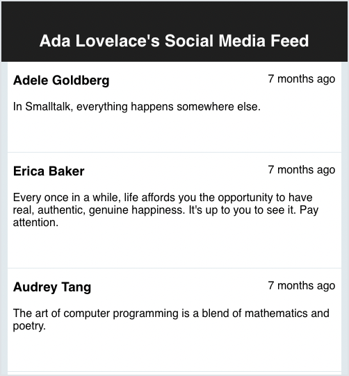

# (Optional) Problem Set: Timeline

## Directions

Follow the directions below.

Keep your work on your local machine, and be prepared to share your progress in small groups.

Answer the Check for Understanding questions at the end of this lesson.

## Goal

Our goal is to create a social media web app. In this web app, there is a timeline, which lists many timeline events. Timeline events are small posts that include a status message, an author, and a timestamp.

  
_Fig. Social media feed where a few influential folx have come together to share some wisdom!_

This document covers:

1. Setup Directions
1. Required Files
1. Feature Requirements
1. Check for Understanding

## Setup Directions

In your projects folder, create a new React app named `timeline`:

```bash
$ yarn create react-app timeline
```

Add the [`luxon` package](https://moment.github.io/luxon/#/) to your project using this command:

```bash
$ yarn add luxon
```

## Required Files

This project uses four components:

1. `App`
1. `Timeline`
1. `TimelineEvent`
1. `TimeStamp`

And one JSON file: `src/data/timeline.json`.

Read through each code snippet. Then, create these exact same files in your own project.

<br/>

<details>

<summary>
    Replace your <code>src/App.js</code> with this
</summary>

<!-- prettier-ignore-start -->
```js
import './App.css';
import timelineData from './data/timeline.json';
import Timeline from './components/Timeline';

function App() {
  console.log('The value of timelineData is', timelineData);
  console.log('We should use timelineData in our project somehow...');

  return <div></div>;
}

export default App;
```
<!-- prettier-ignore-end -->

</details>

<details>

<summary>
    Replace your <code>src/App.css</code> with this
</summary>

```css
.App-header {
  background-color: #222;
  padding-bottom: 0.5rem;
  color: white;
  position: fixed;
  width: 100%;
}

.App-title {
  text-align: center;
  font-size: 1.5em;
}

.App-main {
  padding-top: 7rem;
  background-color: #e6ecf0;
}
```

</details>

<details>

<summary>
    <code>src/data/timeline.json</code>
</summary>

```json
{
  "person": "Ada Lovelace",
  "events": [
    {
      "person": "Adele Goldberg",
      "status": "In Smalltalk, everything happens somewhere else.",
      "timestamp": "2021-05-18T22:12:03Z"
    },
    {
      "person": "Erica Baker",
      "status": "Every once in a while, life affords you the opportunity to have real, authentic, genuine happiness. It's up to you to see it. Pay attention.",
      "timestamp": "2021-05-18T22:19:40Z"
    },
    {
      "person": "Aubrey Tang",
      "status": "The art of computer programming is a blend of mathematics and poetry.",
      "timestamp": "2021-05-18T22:41:19Z"
    },
    {
      "person": "Julia Evans",
      "status": "no seriously what if we replaced tech books with informative concise 30 page zines though",
      "timestamp": "2021-05-18T23:02:44Z"
    },
    {
      "person": "Stephanie Hurlburt",
      "status": "I don’t think you can do good work if you’re not at least occasionally talking to a person you’re building for.",
      "timestamp": "2021-05-18T23:09:38Z"
    },
    {
      "person": "Yan Zhu",
      "status": "//for a good time, paste this into twitter page console: c=new AudioContext;n=setInterval(\"for(n+=7,i=k,P='▲.\\\n';i-=1/k;P+=P[i%2?(i%2*j-j+n/k^j)&1:2])j=k/i;doc.innerHTML=P;with(c.createOscillator())frequency.value=200*(j+n/k^j),connect(c.destination),start(),stop(n/k)\",k=64)",
      "timestamp": "2021-05-18T23:51:01Z"
    }
  ]
}
```

</details>

<details>

<summary>
    <code>src/components/Timeline.js</code>
</summary>

<!-- prettier-ignore-start -->
```js
import './Timeline.css';
import TimelineEvent from './TimelineEvent';

const Timeline = () => {};

export default Timeline;
```
<!-- prettier-ignore-end -->

</details>

<details>

<summary>
    <code>src/components/Timeline.css</code>
</summary>

```css
.timeline {
  width: 30%;
  margin: auto;
  text-align: left;
}
```

</details>

<details>

<summary>
    <code>src/components/TimelineEvent.js</code>
</summary>

<!-- prettier-ignore-start -->
```js
import './TimelineEvent.css';
import TimeStamp from './TimeStamp';

const TimelineEvent = () => {};

export default TimelineEvent;
```
<!-- prettier-ignore-end -->

</details>

<details>

<summary>
    <code>src/components/TimelineEvent.css</code>
</summary>

```css
.timeline-event {
  display: grid;
  grid-template: 2rem auto 2rem / 1fr 1fr;
  padding: 0.5rem;
  border-bottom: 1px solid #e6ecf0;
  background-color: #fff;
}

.timeline-event:hover {
  background-color: #f5f8fa;
}

.event-person {
  grid-area: 1 / 1 / span 1 / span 1;
  margin-top: 0.5rem;
  font-weight: bolder;
}

.event-status {
  grid-area: 2 / 1 / span 1 / -1;
}

.event-time {
  grid-area: 1 / 2 / span 1 / span 1;
  margin-top: 0.5rem;
  text-align: right;
}
```

</details>

<details>

<summary>
    <code>src/components/TimeStamp.js</code>
</summary>

<!-- prettier-ignore-start -->
```js
import { DateTime } from "luxon";

const TimeStamp = (props) => {
  const time = DateTime.fromISO(props.time);
  const absolute = time.toFormat("MMMM Do YYYY, h:mm:ss a");
  const relative = time.toRelative();

  return <span title={absolute}>{relative}</span>;
};

export default TimeStamp;
```
<!-- prettier-ignore-end -->

</details>

## Feature Requirements

In this assignment, modify the following three components:

1. `App`
1. `Timeline`
1. `TimelineEvent`

The `TimeStamp` component is **_already fully implemented_**. You will _not_ need to modify it during this assignment.

  
_Fig. The timeline output reproduced here for convenience_

### `App` Component

The `App` component is a container component. It is responsible for:

- Holding the data about the timeline, which contains all timeline events.
- Rendering one instance of the `Timeline` component.
- Passing the timeline data to the `Timeline` component.

Notice that our modified `App` component imports a JSON object, and declares the object in a variable named `timelineData`:

```js
import timelineData from "./data/timeline.json";
```

### `Timeline` Component

The `Timeline` component is also a container component. It's responsible for:

- Receiving the timeline data from `App`
- Rendering a list of `TimelineEvent` components based on the timeline data.
- Passing person, status, and timestamp data to each `TimelineEvent` component.

In other words, the `Timeline` component should receive the timeline data from `App`. For each object in the timeline data, it should render an appropriate `TimelineEvent` component.

### `TimelineEvent` Component

The `TimelineEvent` component is a presentational component. Its responsibilities include:

- Rendering the event's status message
- Rendering the event's author (person)
- Rendering the event's timestamp

#### The `TimeStamp` Component

The `TimelineEvent` component should use an instance of the `TimeStamp` component.

The `TimeStamp` component expects one `prop`: `time`.

If this component receives `time` through `props` correctly, it will render the time in a nice format!

## CSS Requirement

There are no requirements around CSS and styling. The CSS classes that the sample solution uses are placed in these files:

- `src/App.css`
- `src/components/Timeline.css`
- `src/components/TimelineEvent.css`

You are **_encouraged_** to use these class names in your project.

## Check for Understanding

<!-- Question 1 -->
<!-- prettier-ignore-start -->
### !challenge
* type: paragraph
* id: b050b166
* title: Timeline
* points: 3
* topics: js, react
##### !question

In this assignment, which components were container components, and which components were presentational components? What are the similarities and differences of the container components and presentational components?

What was the `TimeStamp` component, and why?

##### !end-question
### !end-challenge
<!-- prettier-ignore-end -->

<!-- Question 2 -->
<!-- prettier-ignore-start -->
### !challenge
* type: paragraph
* id: 59d2e083
* title: Timeline
* points: 3
* topics: js, react
##### !question

In your own notes, create a diagram where there are four boxes labeled:

1. `App`
1. `Timeline`
1. `TimelineEvent`
1. `TimeStamp`

Every time a `ComponentA` renders and instance of a `ComponentB`, draw an arrow between `ComponentA` and `ComponentB`. 

Label each arrow. Next to each arrow, list all properties in `props` that `ComponentA` passes to `ComponentB`.

Then, describe the diagram you've created in 2-4 sentences.

##### !end-question
### !end-challenge
<!-- prettier-ignore-end -->

### !callout-info

## Optional Challenge: Consider the DOM

In your own notes, create a diagram that expresses what the DOM (which has a tree structure) might look like.

### !end-callout

<!-- Question 3 -->
<!-- prettier-ignore-start -->
### !challenge
* type: paragraph
* id: 0caf80ae
* title: Timeline
* points: 3
* topics: js, react
##### !question

In 1-3 sentences, write advice and tips for this assignment. Address it to your past self.

##### !end-question
### !end-challenge
<!-- prettier-ignore-end -->
