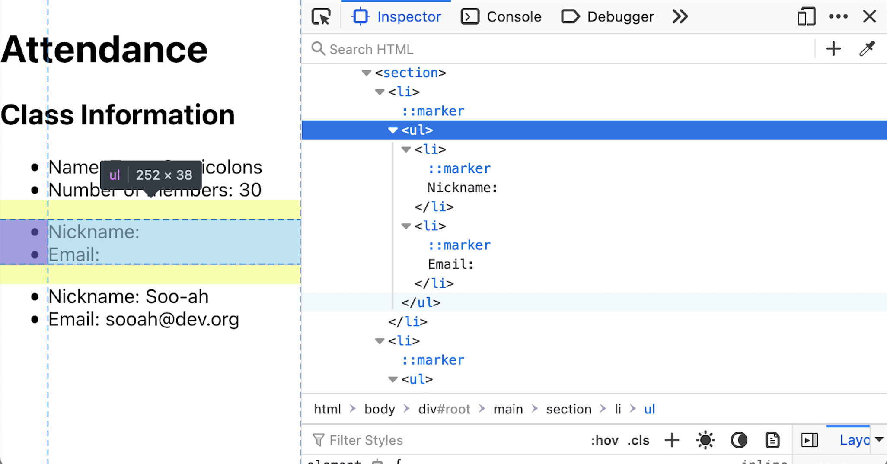
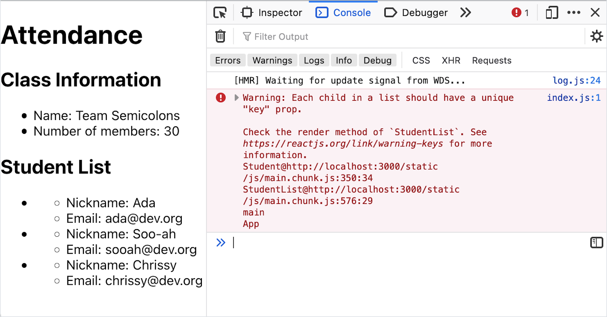

# Props

## Goals

- Define `props`
- Apply `props` by setting them in one component, and using them in another

## Format

This lesson will take the following steps:

1. Define `props`
1. Learn the syntax for passing props into one nested component
1. Learn the syntax for reading props that are passed into a component
1. Follow Sofia's journey
   - Put student data in the `StudentList` component
   - Pass props from the `StudentList` component into the `Student` component
   - Read props in the `Student` component
1. Refactor the `StudentList` component to iterate over data
1. Practice using props by passing student data from `App` to `StudentList`

## Passing Data To a Component With `props`

**Props** are pieces of data that a component can read. They are one of the two ways that React components manage and share their data. "Props" is short for _properties_.

Props are passed from one component into another component. In other words, one component _receives_ props from another component.

### !callout-info

## Example: Library and Books

We can imagine creating two components, `Library` and `Book`. `Library` is a container component responsible for displaying books. `Book` is a presentational component responsible for displaying a book's title and author.

<br/>

`Library` could hold all the data about books. The `Library` component can pass data about a book title and an author to each `Book` component using _`props`_.

### !end-callout

When a component _receives_ props data from another component, this data is _read-only_. Props data cannot be modified within a component.

Props are name-value pairs. These props can be named and represent anything, as long as it's appropriate to the project!

### !callout-info

## Example: Books Data Props

Some examples of name-value pairs that `Library` can pass to `Book` include:

| Prop name | Example value 1    | Example value 2         |
| --------- | ------------------ | ----------------------- |
| `title`   | `"Hello Web App"`  | `"JavaScript Cookbook"` |
| `author`  | `"Tracy Osborn"`   | `"Shelley Powers"`      |
| `isbn`    | `"978-0986365911"` | `"9781491901885"`       |

### !end-callout

The values of props can any data type! They can be strings, numbers, booleans, objects, or functions.

## Syntax

### Passing `props` from `ComponentA` to `ComponentB`

We pass props into `ComponentB` when we use `ComponentB` in a JSX object.

For example, the following code passes the property `varName` with the value `"value goes here"` to one instance of `ComponentB`.

<!-- prettier-ignore-start -->
```js
import ComponentB from './ComponentB';

const ComponentA = () => {
  return <ComponentB varName="value goes here"></ComponentB>;
};

export default ComponentA;
```
<!-- prettier-ignore-end -->

| <div style="min-width:200px;"> Piece of Code </div> | Notes                                                                                         |
| --------------------------------------------------- | --------------------------------------------------------------------------------------------- |
| `import ComponentB from './ComponentB';`            | We must import `ComponentB` before we use it within this file.                                |
| `const ComponentA ... return`                       | We define `ComponentA`. It returns a JSX object to determine how it's rendered.               |
| `<ComponentB`                                       | This begins the opening tag of `ComponentB`.                                                  |
| `varName`                                           | **Replace this** with the name of the prop we are passing into this instance of `ComponentB`. |
| `=`                                                 | An equal sign `=` separates the prop name and the prop value, much like an HTML attribute.    |
| `"value goes here"`                                 | **Replace this** with the value of the `varName` prop.                                        |
| `></ComponentB>;`                                   | As with all valid JSX, we need to close the `ComponentB` tag.                                 |

### !callout-info

## Example: Passing `title`s, `author`s, and `ISBN`s into `Book`s

Here is one way we can pass data from `Library` to `Book`s using `props`:

<!-- prettier-ignore-start -->
```js
const Library = () => {
  return (
    <div>
      <Book title="Hello Web App" author="Tracy Osborn" isbn="978-0986365911"></Book>
      <Book title="JavaScript Cookbook" author="Shelley Powers" isbn="9781491901885"></Book>
    </div>
  )
};
```
<!-- prettier-ignore-end -->

### !end-callout

### Reading `props` in ComponentB

Within the `ComponentB` definition, we can read props by taking these steps:

1. Change the function signature of `ComponentB` to accept one argument, an object named `props`
1. Access values in the `props` object using dot notation or square-bracket notation

For example, this `ComponentB` will read a prop named `varName`:

<!-- prettier-ignore-start -->
```js
const ComponentB = (props) => {
  return <div>The value of varName: {props.varName}</div>;
};
```
<!-- prettier-ignore-end -->

| <div style="min-width:200px;"> Piece of Code </div> | Notes                                                                                                                                                                           |
| --------------------------------------------------- | ------------------------------------------------------------------------------------------------------------------------------------------------------------------------------- |
| `const ComponentB = (props) => {`                   | In order for this component to receive props, we need to adjust the function to expect one argument. This argument can take any name, but the conventional name is `props`.     |
| `<div>The value of varName: { ... }</div>`          | This component still returns a JSX object. We want to embed the value of our prop, so we should use curly braces `{}` in our JSX.                                               |
| `props.varName`                                     | **Replace this** with the name of the prop we are accessing. This name must match the name of the prop passed-in from `ComponentA`, or any component that renders `ComponentB`. |

Instead of `props.varName`, we could alternatively use `props["varName"]`.

Of course, we can access the `props` object anywhere in the function, even outside a JSX object:

<!-- prettier-ignore-start -->
```js
const ComponentB = (props) => {
  const valueOfVarName = props.varName;
  return <div>The value of varName: {valueOfVarName}</div>;
};
```
<!-- prettier-ignore-end -->

### !callout-info

## Example: Reading `title`s, `author`s, and `ISBN`s in `Book`

Here is one way we can read the props inside the `Book` component:

<!-- prettier-ignore-start -->
```js
const Book = (props) => {
  return (
    <section>
      <h2>{props.title}</h2>
      <ul>
        <li>by {props.author}</li>
        <li>ISBN: {props.isbn}</li>
      </ul>
    </section>
  )
};
```
<!-- prettier-ignore-end -->

### !end-callout

## Sofia's Journey: `props` From `StudentList` to `Student`

Sofia's `StudentList` currently renders three `Student`s.

(Imports, exports, and class names have been omitted from these code snippets for clarity)

<!-- prettier-ignore-start -->
```js
const StudentList = () => {
    return (
        <section>
            <h2>Student List</h2>
            <ul>
                <Student></Student>
                <Student></Student>
                <Student></Student>
            </ul>
        </section>
    )
}
```
<!-- prettier-ignore-end -->

<!-- prettier-ignore-start -->
```js
const Student = () => {
    return (
        <li>
            <ul>
                <li>Nickname: Ada</li>
                <li>Email: ada@dev.org</li>
            </ul>
        </li>
    )
}
```
<!-- prettier-ignore-end -->

However, as-is, all `Student`s render with the same name and email, "Ada" and "ada@dev.org."

Her goal is to put student data, including names and emails, in `StudentList`, and then _pass the data_ into `Student` components using `props`.

### `StudentList` Passing In `name` and `email`

Sofia wants to pass a name and an email to each `Student` component. Therefore, her two props are `name` and `email`.

<!-- prettier-ignore-start -->
```js
const StudentList = () => {
    return (
        <section>
            <h2>Student List</h2>
            <ul>
                <Student name='Ada' email='ada@dev.org'></Student>
                <Student name='Soo-ah' email='sooah@dev.org'></Student>
                <Student name='Chrissy' email='chrissy@dev.org'></Student>
            </ul>
        </section>
    )
}
```
<!-- prettier-ignore-end -->

For her three instances of `Student` components, she's passed in three different `name`s and `email`s.

### `Student`: Reading `name` and `email`

Sofia's `Student` component should read and use these props. She must:

- Add `props` as an expected parameter for the `Student` component function
- Modify her code to embed `props.name` and `props.email` wherever they should be rendered

<!-- prettier-ignore-start -->
```js
const Student = (props) => {
    return (
        <li>
            <ul>
                <li>Nickname: {props.name}</li>
                <li>Email: {props.email}</li>
            </ul>
        </li>
    )
}
```
<!-- prettier-ignore-end -->

Hooray! Her web app now shows Ada, Soo-ah, and Chrissy's names and emails.

  
_Fig. An attendance web app with a list of three students. One student's information is "Nickname: Ada, Email: ada@dev.org." The second student's information is "Nickname: Soo-ah, Email: sooah@dev.org." The third student's information is "Nickname: Chrissy, Email: chrissy@dev.org"_

### !callout-info

## Undefined Properties Are `undefined`

Now that the `Student` component expects `props`, what happens if we don't pass in a `name` or `email` prop? Imagine this implementation of `StudentList`, where the first `Student` component isn't given a value for `name` or `email`:

<!-- prettier-ignore-start -->
```js
const StudentList = () => {
    return (
        <section>
                <Student></Student>
                <Student name='Soo-ah' email='sooah@dev.org'></Student>
        </section>
    )
}
```
<!-- prettier-ignore-end -->

In this case, in the `Student` component, `props.name` will be `undefined`. `props.email` will also be undefined. When React renders an `undefined` value, it will become an empty string.

  
__Fig. An attendance web app with a list of two students. One student reads "Nickname: , Email: ." The second student reads "Nickname: Soo-ah, Email: sooah@dev.org"_

  
_Fig. An attendance web app with a list of two students. The browser dev tools are open, showing the HTML of a student with no name or email._

### !end-callout

## Rendering Arrays of JSX Objects

Sofia isn't satisfied yet. She's grateful she can use `props` to set the names and emails of these three students, but what happens when her class is a size of 30? Or 300?

Before we proceed, we should learn that JSX objects can embed and render arrays of JSX objects.

Observe this code, which creates an array of `<Student></Student>` JSX objects, and then embeds it.

<!-- prettier-ignore-start -->
```js
const StudentList = () => {
    const studentComponents = [
        <Student name='Ada' email='ada@dev.org'></Student>,
        <Student name='Soo-ah' email='sooah@dev.org'></Student>,
        <Student name='Chrissy' email='chrissy@dev.org'></Student>
    ]

    return (
        <section>
            <h2>Student List</h2>
            <ul>
                {studentComponents}
            </ul>
        </section>
    )
}
```
<!-- prettier-ignore-end -->

In this scenario, the variable `studentComponents` is a comma-separated array of JSX objects.

We embed `studentComponents` in curly braces `{}` in the returned JSX. Our resulting webapp looks identical to our webapp from before!

  
_Fig. An attendance web app that looks identical to an earlier web app, which listed three different students._

## Iterating Over Data Structures

Sofia would ultimately like to have her student data in a nice data structure:

<!-- Simon note: I've picked the keys "nameData" and "emailData"
to help distinguish it from the props "name" and "email" -->

<!-- prettier-ignore-start -->
```js
[
    {
        nameData: 'Ada',
        emailData: 'ada@dev.org'
    },
    {
        nameData: 'Soo-ah',
        emailData: 'sooah@dev.org'
    },
    {
        nameData: 'Chrissy',
        emailData: 'chrissy@dev.org'
    }
]
```
<!-- prettier-ignore-end -->

Can Sofia use this data structure to create `Student` components inside her `StudentList` component?

Yes! She'll iterate through this data and create an array of JSX objects with the correct `props`. Then, she'll embed that array of objects.

<!-- prettier-ignore-start -->
```js
const StudentList = () => {
    const studentData = [
        {
            nameData: 'Ada',
            emailData: 'ada@dev.org'
        },
        {
            nameData: 'Soo-ah',
            emailData: 'sooah@dev.org'
        },
        {
            nameData: 'Chrissy',
            emailData: 'chrissy@dev.org'
        }
    ]
    const studentComponents = studentData.map(student => {
        return <Student name={student.nameData} email={student.emailData}></Student>
    });

    return (
        <section>
            <h2>Student List</h2>
            <ul>
                {studentComponents}
            </ul>
        </section>
    )
}
```
<!-- prettier-ignore-end -->

The function call `studentData.map(...)` sets `studentComponents` to an array of JSX objects. It does this by looking at each object in `studentData`, referring to each object as `student` one at a time.

Each `student` object has the keys `nameData` and `emailData`. We read these values with `student.nameData` and `student.emailData`. We embed those values into a new JSX object, which is a `Student` component with the properties `name` and `email`.

Our resulting webapp looks identical to before! However, now Sofia's `StudentList` component is more robust, and can easily render all students, even if `studentData` grows.

## More Practice: Passing `studentData` From `App` to `StudentList`

Let's practice using `props` one more time!

Right now, `studentData` is defined and used in the `StudentList` component.

Sofia anticipates that, actually, her `App` component should hold and manage the `studentData`... but `StudentList` should continue to use it.

She can move `studentData` into `App`, and pass it to `StudentList` through `props`!

### Sending `props` From `App`

The `App` component can define `studentData`, and then send it as a property.

<!-- prettier-ignore-start -->
```js
function App() {
  const studentData = [
    {
      nameData: 'Ada',
      emailData: 'ada@dev.org'
    },
    {
      nameData: 'Soo-ah',
      emailData: 'sooah@dev.org'
    },
    {
      nameData: 'Chrissy',
      emailData: 'chrissy@dev.org'
    }
  ]

  return (
    <main>
      <h1>Attendance</h1>
      <ClassInfo></ClassInfo>
      <StudentList students={studentData}></StudentList>
    </main>
  );
}
```
<!-- prettier-ignore-end -->

In this situation, `StudentList` is receiving a prop named `students`.

### Reading `props` in `StudentList`

Like before, in order for `StudentList` to read props, Sofia must:

- Add `props` as an expected parameter for the `StudentList` component function
- Modify her code to use `props.students`

<!-- prettier-ignore-start -->
```js
const StudentList = (props) => {
    const studentComponents = props.students.map(student => {
        return <Student name={student.nameData} email={student.emailData}></Student>
    });

    return (
        <section>
            <h2>Student List</h2>
            <ul>
                {studentComponents}
            </ul>
        </section>
    )
}
```
<!-- prettier-ignore-end -->

Even after this refactor, Sofia's webapp looks the same as before. Great!

### !callout-warning

## Addressing "Warning: Each child in a list should have a unique "key" prop."

If we check our console, we may see the warning "Warning: Each child in a list should have a unique "key" prop."

  
_Fig. An attendance web app with the browser dev tools open. The console of the dev tools reads "Warning: Each child in a list should have a unique "key" prop."_

This is a warning, and doesn't break our React code. If we follow the recommended React resources, we'll learn about the `key` prop, what it's used for, and best practices for how to set it.

<br/>

We won't address this in this curriculum, but following this best practice will help our React apps become perform better. Follow your curiosity!

<br/>

<details>

  <summary>One possible fix for the <code>key</code> prop warning</summary>

  We could possibly change our `map` function in `StudentList` to this:

  ```js
  const studentComponents = props.students.map((student, index) => {
      return (<Student
          name={student.nameData}
          email={student.emailData}
          key={index}
      ></Student>)
  });
  ```

</details>

### !end-callout

## Check for Understanding

Recreate Sofia's app on your own machine.

Then, consider the `App` and `ClassInfo` components.

<!-- prettier-ignore-start -->
```js
import React from 'react';

const ClassInfo = () => {
    return (
        <section>
            <h2>Class Information</h2>
            <ul>
                <li>
                    Name: Team Semicolons
                </li>
                <li>
                    Number of members: 30
                </li>
            </ul>
        </section>
    )
}

export default ClassInfo;
```
<!-- prettier-ignore-end -->

`ClassInfo` is supposed to list the number of class members, which is the number of students.

Extend your app in the following ways:

- In `App`, create a `prop` to send to `ClassInfo`. The `prop`'s value should be some data related to the number of students in `studentData`.
- In `ClassInfo`, begin to accept `props`. This component should read this new `prop`, and replace `30` with the actual number of students.

  
_Fig. An attendance web app with class information and a student list. The class information reads "Number of members: 3"_

<details>

  <summary>Click here to view an example solution to this problem.</summary>

<!-- prettier-ignore-start -->
```js
function App() {
  const studentData = [
    {
      nameData: 'Ada',
      emailData: 'ada@dev.org'
    },
    {
      nameData: 'Soo-ah',
      emailData: 'sooah@dev.org'
    },
    {
      nameData: 'Chrissy',
      emailData: 'chrissy@dev.org'
    }
  ]

  return (
    <main>
      <h1>Attendance</h1>
      <ClassInfo memberCount={studentData.length}></ClassInfo>
      <StudentList students={studentData}></StudentList>
    </main>
  );
}
```
<!-- prettier-ignore-end -->

<!-- prettier-ignore-start -->
```js
const ClassInfo = (props) => {
    return (
        <section>
            <h2>Class Information</h2>
            <ul>
                <li>
                    Name: Team Semicolons
                </li>
                <li>
                    Number of members: {props.memberCount}
                </li>
            </ul>
        </section>
    )
}
```
<!-- prettier-ignore-end -->

</details>

<!-- Question Takeaway -->
<!-- prettier-ignore-start -->
### !challenge
* type: paragraph
* id: b57dc5a5
* title: props
##### !question

What was your biggest takeaway from this lesson? Feel free to answer in 1-2 sentences, draw a picture and describe it, or write a poem, an analogy, or a story.

##### !end-question
##### !placeholder

My biggest takeaway from this lesson is...

##### !end-placeholder
### !end-challenge
<!-- prettier-ignore-end -->
