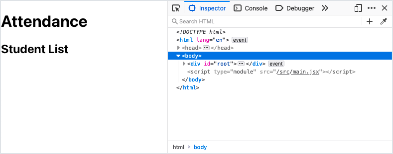
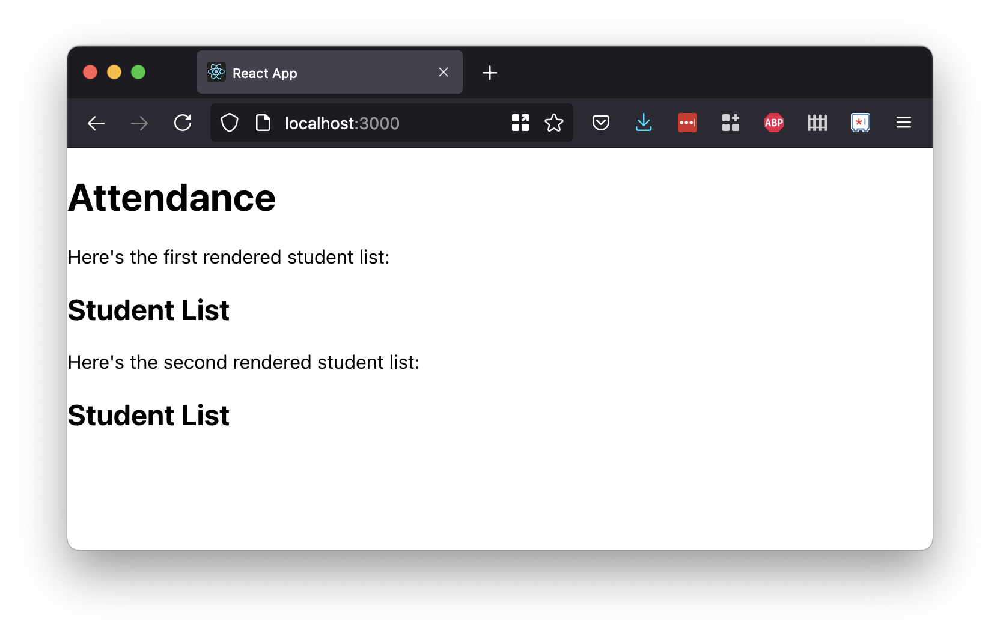
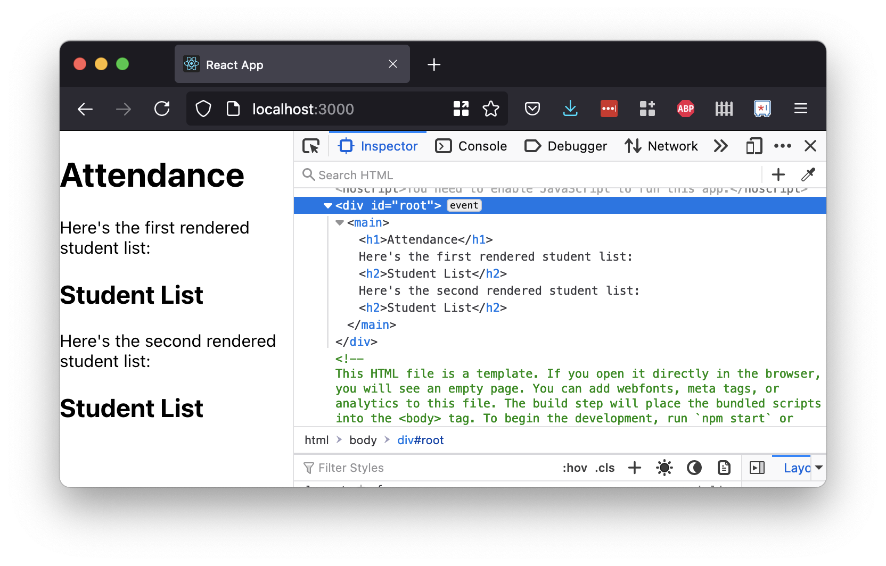

# Components

<!-- VITE-UPDATE -->
<!-- <iframe src="https://adaacademy.hosted.panopto.com/Panopto/Pages/Embed.aspx?pid=ec880a7f-575f-4105-8b4c-ad4900104c21&autoplay=false&offerviewer=true&showtitle=true&showbrand=false&start=0&interactivity=all" height="405" width="720" style="border: 1px solid #464646;" allowfullscreen allow="autoplay"></iframe> -->

## Introduction

Sofia is a teacher, and she's creating a digital attendance webapp to help her at work. She wants to list all the students in her class.

She knows that React will help her create the UI of her attendance webapp. But how does she turn her idea into React components?

This lesson will follow the story of Sofia, who will learn the syntax to create and use two components.

### !callout-info

## Sofia's React App

We will use Sofia's web app throughout the Learn React lessons. There is a companion [Student App repository](https://github.com/AdaGold/student-app) with branches for each of the features added in the Learn lessons. This repository allows us to see all the parts working together. 

<br>

The Student App already has the React project structure created by running `npm create -y vite@latest student-app -- --template react`. The semicolon linting rule has already been added and the template code has been modified accordingly. To run the app, we first need to install the dependencies using `npm install` within the project directory, and then we can run the app using `npm run dev`. The `main` branch contains only the initial template code, but we can switch to other branches to see the app running as new features are added.

<br>

Switching between branches can be problematic if we are following along with our own implementation. Expand the following section for our recommendations on how to use the sample repository.

<br>

<details><summary>Expand for our <code>student-app</code> repository recommendations</summary>

<br/>

There are a few **Check For Understanding** prompts in the React lessons that ask us to recreate Sofia's app and add new features. We can either complete these **Check For Understanding** prompts in a brand new React app that we make ourself, or by using a fork of the [Student App repository](https://github.com/AdaGold/student-app) as a baseline.

<br/>

When working along with Sofia, our recommendation is to do any work solely in the `main` branch, and to use the other branches as a reference, primarily through the GitHub web interface rather than by switching between branches in our local repository.

<br/>

  
_Fig. Use the project branches as a reference viewed through the GitHub web view rather than switching among them while working. ([Full size image](../assets/react-components_components_branches-in-github.png))_

<br/>

If a local copy of the completed branches is desired, we can clone a second copy of the repository to another working directory. As long as we make no changes to this second clone, we'll be able to switch branches easily, and changing branches here will not affect the active branch in our main clone. To clone to a different location, we use

```bash
$ git clone <repository-url> <directory-name>
```
<br/>

where `<repository-url>` is the URL of the repository we want to clone (the Student App repository), and `<directory-name>` is the name of the directory we want to create to hold the repository contents.

<br/>

Typically, we leave off the `<directory-name>` and let `git` create a directory with the same name as the repository. But in this case, we can make another clone adjacent to our working clone, perhaps called `student-app-branches`. Then, we can switch between branches using `git` commands or the VS Code UI in this second clone without affecting our ongoing work in the first clone.

</details>

### !end-callout

## Our Current Definition of Component

**Components** in React are the building blocks of our UI.

All components can be rendered to the page, hold data, manage their own state, handle events, and contain other elements and components.

Our understanding and definition of what a React component is and can do will grow over time. For now, let's focus on the following core ideas.

All components are:

- Functions
- Responsible for returning one JSX object, which determines how it's rendered

## Using Components

In order to "use" a component, there are three steps:

1. Plan the component
1. Define the component
1. Render that component at least once

## Planning the Component

Sofia wants her attendance webapp to have the following UI displayed on one single page:

- Information about the class
- A list of students and their details (e.g., name, birthday, etc.)

Both of these features can make great React components! Sofia will plan to create two components.

She'll start with creating the component that displays a list of students and their details. While she's planning, Sofia will pick the name of her component.

Conventionally, React components are named with CapitalCamelCase. Sofia will name this component `StudentList`.

## Defining a Component

To define a component, we will follow these steps:

1. Create a new file
1. Import any dependencies
1. Create a function
1. Export the component

### Create a New File

Sofia anticipates that she'll create many components throughout this project. She'll follow these guidelines:

- Each component definition will have its own `.jsx` file
- Each file will be named using the name of the component
- All component definitions besides `App` will live in a new folder, `src/components`

In order to make this `components` folder and a new file for the `StudentList` component, she'll run these commands:

```bash
$ mkdir src/components
$ touch src/components/StudentList.jsx
```

### !callout-info

## This is a Recommendation

The React library does not require or enforce any sort of folder structure, how to name our components (other than that they must start with a capital letter), or rule about how many files there should be in a project. This folder structure is a recommendation, and we should adapt it to whatever best suits our particular situation.

### !end-callout

### Import Dependencies

For the moment, Sofia doesn't need to import any dependencies. Various kinds of resources can be imported into a component, including:

- Other JavaScript files/components
- CSS files
- Images
- Data

As Sofia is just starting out, she doesn't need to import any of these resources at the moment.

### Create a Function

Each component begins with a function. Components can be defined as arrow functions or regular functions, but we'll prefer arrow functions.

Each component function should:

- be named after the component
- return one JSX object that represents how to render this component

Sofia can define the `StudentList` component like so:

```js
const StudentList = () => {
  return <h2>Student List</h2>;
};
```

She could have defined it using different coding techniques. For example, she could have wrapped the JSX object in parentheses, allowing the `return` expression to be safely spread over several lines:

<!-- prettier-ignore-start -->
```js
const StudentList = () => {
  return (
    <h2>Student List</h2>
  );
}
```
<!-- prettier-ignore-end -->

She could even have put the JSX object into a variable rather than returning it directly:

<!-- prettier-ignore-start -->

```js
const StudentList = () => {
  const studentListHeader = <h2>Student List</h2>;
  return studentListHeader;
}
```

Sofia understands that first storing JSX into a variable is more useful if she needs to conditionally include part of her markup, or if a section of markup is difficult to read when embedded in the rest of the JSX being returned. She most frequently sees React code returning the JSX object directly, so until she needs more than a single line for her markup, she'll stick to the direct, non-wrapped approach. But she's comfortable with all of these techniques, and she'll use them as needed.

### Export the Component

In order to use the `StudentList` component in other files, we'll need to _export_ it. JavaScript requires that we specifically designate which symbols within a file are available to be imported by other files. To export the component, we make an `export` statement, and specify the name of our component function.

This line goes at the _bottom_ of our file.

```js
export default StudentList;
```

### !callout-info

## Export `default`

`export default` is one of a few ways to export our `StudentList` component function, and when we're exporting a single main thing from a file, it's usually the most straightforward. Follow your curiosity!

### !end-callout

## Rendering a Component Once

1. Determine where and when we want to show the component
1. Import the component
1. Use the component at least once

### Where to Render `StudentList`

Sofia began her project by using `npm create` in the usual fashion (then adding the linter rule to enforce the use of semicolons and updating the template files accordingly). At this moment, when Sofia runs `npm run dev`, her webapp at `localhost:5173` looks like the default splash screen.

She's traced her code through `src/main.jsx` and `src/App.jsx`, and Sofia knows that **currently, her webapp renders one component:** one instance of **the `App` component**.

Sofia knows that **a JSX object can contain other elements _and components_**.

She wants her webapp to render the `StudentList` component she just created, so her plan is to render the `StudentList` component within the existing `App` component.

### Import the Component

In order to use the `StudentList` component in the `App` component, first we need to import `StudentList`.

At the top of `src/App.jsx`, she'll include:

<!-- prettier-ignore-start -->
```js
import StudentList from './components/StudentList';
```
<!-- prettier-ignore-end -->

| <div style="min-width:280px;"> Piece of Code </div> | Notes                                                                                                                                                                         |
| --------------------------------------------------- | ----------------------------------------------------------------------------------------------------------------------------------------------------------------------------- |
| `import`                                            | The import keyword begins an import statement                                                                                                                                 |
| `StudentList`                                       | **Replace this** with the name of the object we want to import. The specific object imported will be whatever was _exported_ from the source file.                            |
| `from`                                              | The `from` keyword lets us determine the source of our import.                                                                                                                |
| `'./components/StudentList'`                        | **Replace this** with a string containing the relative path between _this current file_ and the file we're importing. We can exclude the file extension for JavaScript files. |
| `;`                                                 | Conclude this import statement with a semicolon.                                                                                                                              |

<!-- available callout types: info, success, warning, danger, secondary  -->

### !callout-info

## More About `import`ing and `export`ing

Need more information about importing and exporting? Follow your curiosity and do some more research! A great search engine term is "javascript import export."

### !end-callout

Because the `App` component is located in `src/App.jsx`, and `StudentList` is in `src/components/StudentList.jsx`, the relative path from `App.jsx` to `StudentList.jsx` is `./components/StudentList`.

<!-- available callout types: info, success, warning, danger, secondary, star  -->
### !callout-warning

## Local Component Imports Must Begin with a Path Character

Usually, the paths `./path/to/file` and `path/to/file` are equivalent. Both would indicate to start by looking for a directory called `path` within the current directory, then continuing from there. However, when importing a component defined within our project (as opposed to being loaded from another Node.js package), the path must begin with a "path" character, such as `./` (start from the current directory), `../` (start from the parent directory), or `/` (start from the project root).

<br/>

In the example above, this is why we must use `'./components/StudentList'` rather than `'components/StudentList'`.

### !end-callout

### Use the Component At Least Once

Now, we're ready to render our `StudentList` component.

To render this component, we can include it in any JSX object. If a component returns a JSX object that includes this component, then the component will _render_ it.

To include a component once in a JSX object, we use the following syntax:

```js
<ComponentName></ComponentName>
```

| <div style="min-width:200px;"> Piece of Code </div> | Notes                                                                               |
| --------------------------------------------------- | ----------------------------------------------------------------------------------- |
| `<...>`                                             | We create something that looks like an opening HTML tag, using angle brackets `<>`. |
| `ComponentName`                                     | **Replace this** with the name of the component that needs to be rendered.          |
| `</...>`                                            | Valid JSX requires that all tags be closed.                                      |
| `ComponentName`                                     | Our closing tag uses the name of the component again.                             |

Using this syntax, we can update our `App` component:

```js
import StudentList from './components/StudentList';

function App() {
  return (
    <main>
      <h1>Attendance</h1>
      <StudentList></StudentList>
    </main>
  );
}

export default App;
```

Note that Sofia has replaced `App`'s returned JSX with something more minimal and appropriate to her project. She's also deleted any unused import statements.

### Verify

Sofia can verify that her `App` and `StudentList` components are rendered successfully by:

- Ensuring that the server is running with `npm run dev`
- Checking the appearance of `localhost:5173`

Success! Sofia successfully renders both the `App` and `StudentList` components once.

  
_Fig. Sofia's updated webapp making use of her new `StudentList` component_

<!-- available callout types: info, success, warning, danger, secondary, star  -->
### !callout-warning

## Update `index.css` to Remove Default Styling

The Vite template has some "aggressive" styling applied by default. In order to get the same result as shown in the screenshots, we'll need to remove this styling. The modified `index.css` can be copied from any of the other project branches.

<br/>

Alternatively, the modified `index.css` contents are provided here.

<br/>

<details><summary>Expand for the modified <code>index.css</code> contents</summary>

```css
:root {
  font-family: Inter, system-ui, Avenir, Helvetica, Arial, sans-serif;

  font-synthesis: none;
  text-rendering: optimizeLegibility;
  -webkit-font-smoothing: antialiased;
  -moz-osx-font-smoothing: grayscale;
  -webkit-text-size-adjust: 100%;
}

body {
  margin: 0;
}
```
</details>


### !end-callout

Let's check what the rendered HTML ultimately looks like using our browser's Dev Tools.

  
_Fig. The browser Dev Tools showing the rendered HTML_

```html
<div id="root">
  <main>
    <h1>Attendance</h1>
    <h2>Student List</h2>
  </main>
</div>
```

Take a moment to appreciate this. The `<main>` and `<h1>` elements were referenced in the `App` component. The `<h2>` element was referenced inside the `StudentList` component.

Because our `App` component referenced the `StudentList` component, we can see that, ultimately, our components render as plain HTML elements, with the markup generated by our own components being merged into the overall markup of the page.

## Rendering More Than One

Our `App` component can render our `StudentList` component more than once!

We render a component more than once by declaring it in multiple places.

<!-- prettier-ignore-start -->
```js
import StudentList from './components/StudentList';

function App() {
  return (
    <main>
      <h1>Attendance</h1>
      Here&apos;s the first rendered student list:
      <StudentList></StudentList>
      Here&apos;s the second rendered student list:
      <StudentList></StudentList>
    </main>
  );
}

export default App;
```
<!-- prettier-ignore-end -->

With this code, `localhost:5173` will display `StudentList` twice.

  
_Fig. We can add two copies of Sofia's `StudentList` component to the `App`_

  
_Fig. The browser Dev Tools showing the rendered HTML now showing two sets of HTML from the `StudentList` component_

<!-- available callout types: info, success, warning, danger, secondary, star  -->
### !callout-info

## React Linter Rules Prefer HTML Entities

Notice in this example, we used the HTML entity `&apos;` to represent an apostrophe. This is because the React linter rules prefer HTML entities over literal characters in the text content of our components. The linter rules are set up this way because it's easy to "fall out" of a tag or embedded JavaScript expression in the middle of JSX by accidentally writing a closing `>` or `}` character in the wrong place. Using HTML entities when those characters appear in our text helps the linter detect when this occurs and alert us to the problem.

<br/>

If we prefer, we can disable this linter rule by adding the following line to the `rules` section of our `.eslintrc.cjs` file:

```js
    "react/no-unescaped-entities": 0,
```

### !end-callout

## A Second Component: `ClassInfo`

Sofia also wanted to display information about the class.

To practice, let's make another component!

### Defining `ClassInfo`

Sofia creates a new file, `src/components/ClassInfo.jsx`.

Within this file, she will:

1. Define a function named `ClassInfo`
1. Export `ClassInfo`

<!-- prettier-ignore-start -->
```js
const ClassInfo = () => {
  return (
    <section>
      <h2>Class Information</h2>
      <ul>
        <li>Name: Team Semicolons</li>
        <li>Number of members: 30</li>
      </ul>
    </section>
  );
};

export default ClassInfo;
```
<!-- prettier-ignore-end -->

Recall that valid JSX objects have _one parent element_. If Sofia's markup didn't already have a single root element (the outer `<section>` element), she would have needed to surround it in a single tag or Fragment to avoid getting an error.

### Use `ClassInfo`

Sofia wants to render one instance of the `ClassInfo` component inside the `App` component.

She will:

1. Import `ClassInfo` in `App`
1. Adjust the returned JSX to include one instance of `ClassInfo`

<!-- prettier-ignore-start -->
```js
import StudentList from './components/StudentList';
import ClassInfo from './components/ClassInfo';

function App() {
  return (
    <main>
      <h1>Attendance</h1>
      <ClassInfo></ClassInfo>
      <StudentList></StudentList>
    </main>
  );
}

export default App;
```
<!-- prettier-ignore-end -->

<!-- available callout types: info, success, warning, danger, secondary, star  -->
### !callout-danger

## Imports Are a Common Source of Bugs

While using `export default` in our component files is the most common practice, it can lead to puzzling bugs if we're not careful about how we import our components. In the above example, if we had copy-pasted the first `import` line, then accidentally only partially updated the copy to refer to `ClassInfo`, we might have ended up with the following:

```js
import StudentList from './components/StudentList';
import ClassInfo from './components/StudentList';
```

<br/>

What do you think the result of this would be? 

<br/>

<details><summary>Expand this section to find out.</summary>

<br/>

We would receive no indication that anything was amiss, but our display would show two copies of `StudentList` rather than one copy of `ClassInfo` and one copy of `StudentList`. This is because the `import` statement is not actually importing the `ClassInfo` component, but rather importing the same `StudentList` component a second time, and assigning it to a different variable name. In this example, it would be fairly easy to track down the problem, but in a larger project, it could be much more difficult.

<br/>

When we use `export default` to export something from a file, it essentially becomes nameless, and takes on the name that we use in the `import` statement. The `import` name effectively declares a variable and assigns the exported default object to that variable.

<br/>

We should always be careful to make sure our `import` statements are correct to save ourselves from many headaches!

</details>

### !end-callout

Sofia's webapp now looks like this:

  
_Fig. Sofia's webapp now shows her `ClassInfo` component and her `StudentList` component_

## Check for Understanding

<!-- Question Takeaway -->
<!-- prettier-ignore-start -->
### !challenge
* type: paragraph
* id: 93761e7b
* title: Components
##### !question

What was your biggest takeaway from this lesson? Feel free to answer in 1-2 sentences, draw a picture and describe it, or write a poem, an analogy, or a story.

##### !end-question
##### !placeholder

My biggest takeaway from this lesson is...

##### !end-placeholder
### !end-challenge
<!-- prettier-ignore-end -->
