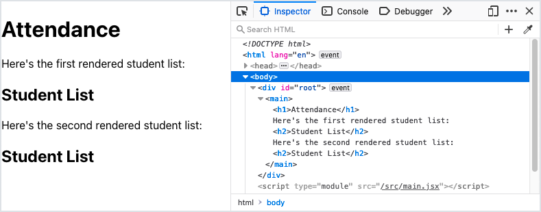

# Components

<iframe src="https://adaacademy.hosted.panopto.com/Panopto/Pages/Embed.aspx?pid=ec880a7f-575f-4105-8b4c-ad4900104c21&autoplay=false&offerviewer=true&showtitle=true&showbrand=false&start=0&interactivity=all" height="405" width="720" style="border: 1px solid #464646;" allowfullscreen allow="autoplay"></iframe>

## Introduction

Sofia is a teacher, and she's creating a digital attendance webapp to help her at work. She wants to list all the students in her class.

She knows that React will help her create the UI of her attendance webapp. But how does she turn her idea into React components?

This lesson will follow the story of Sofia, who will learn the syntax to create and use two components.

### !callout-info

## Sofia's React App

We will use Sofia's web app throughout the Learn React lessons. There is a companion [Student App repository](https://github.com/AdaGold/student-app) with branches for each of the features added in the Learn lessons. This repository allows us to see all the parts working together. 

<br>

The Student App already has the React project structure created by running `yarn create react-app student-app`. To run the app, we first need to install the dependencies using `yarn install`, and then we can run the app using `yarn start`.

<br>

There are a few **Check For Understanding** prompts in the React lessons that ask us to recreate Sofia's app and add new features. We can either complete these **Check For Understanding** prompts in a brand new React app that we make ourself, or by using a fork of the [Student App repository](https://github.com/AdaGold/student-app) as a baseline.

### !end-callout

## Our Current Definition of Component

**Components** in React are the building blocks of our UI.

All components can be rendered to the page, hold data, manage their own state, handle events, and contain other elements and components.

Our understanding and definition of what a React component is and can do will grow over time. For now, let's focus on the following core ideas.

All components are:

- Functions
- Responsible for returning one JSX object, which determines how it's rendered

## Using Components

In order to "use" a component, there are three steps:

1. Plan the component
1. Define the component
1. Render that component at least once

## Planning the Component

Sofia wants her attendance webapp to have the following UI displayed on one single page:

- Information about the class
- A list of students and their details (e.g., name, birthday, etc.)

Both of these features can make great React components! Sofia will plan to create two components.

She'll start with creating the component that displays a list of students and their details. While she's planning, Sofia will pick the name of her component.

Conventionally, React components are named with CapitalCamelCase. Sofia will name this component `StudentList`.

## Defining a Component

To define a component, we will follow these steps:

1. Create a new file
1. Import React, and any other dependencies
1. Create a function
1. Export the component

### Create a New File

Sofia anticipates that she'll create many components throughout this project. She'll follow these guidelines:

- Each component definition will have its own `.js` file
- Each file will be named after the name of the component
- All component definitions besides `App` will live in a new folder, `src/components`

In order to make this `components` folder and a new file for the `StudentList` component, she'll run these commands:

```bash
$ mkdir src/components
$ touch src/components/StudentList.js
```

### !callout-info

## This is a Recommendation

The React library does not require or enforce any sort of folder structure, naming convention, or rule about how many files there should be in a project. This folder structure is a recommendation, and we should adapt it to whatever best suits our particular situation.

### !end-callout

### Import React

At the top of `src/components/StudentList.js`, Sofia will import the React library. Importing React in this file makes the built-in React functionality available through an object named `React`.

<!-- prettier-ignore-start -->
```javascript
import React from 'react';
```
<!-- prettier-ignore-end -->

### Create a Function

Each component begins with a function. Components can be defined as arrow functions or regular functions, but we'll prefer arrow functions.

Each component function should:

- be named after the component
- return one JSX object that represents how to render this component

Sofia can define the `StudentList` component like so:

```js
const StudentList = () => {
  return <h2>Student List</h2>;
};
```

She could have defined it using different coding techniques. For example, she could have wrapped the JSX object in parentheses if that helps her see it better:

<!-- prettier-ignore-start -->
```js
const StudentList = () => {
  return (
    <h2>Student List</h2>
  );
}
```
<!-- prettier-ignore-end -->

She also could have put the JSX object in a variable:

<!-- prettier-ignore-start -->

```js
const StudentList = () => {
  const studentListHeader = <h2>Student List</h2>;
  return studentListHeader;
}
```

### Export the Component

In order to use the `StudentList` component in other files, we'll need to _export_ it. To export the component, we make an `export` statement, and specify the name of our component function.

This line goes at the _bottom_ of our file.

```js
export default StudentList;
```

### !callout-info

## Export `default`

`export default` is one of a few ways to export our `StudentList` component function, and at the moment, it's the most straightforward. Follow your curiosity!

### !end-callout

## Rendering a Component Once

1. Determine where and when we want to show the component
1. Import the component
1. Declare the component at least once

### Where to Render `StudentList`

Sofia just began her project by using `create-react-app`. At this moment, when Sofia runs `yarn start`, her webapp at `localhost:3000` looks like the default splash screen.

She's traced her code through `src/index.js` and `src/App.js`, and Sofia knows that **currently, her webapp renders one component:** one instance of **the `App` component**.

Sofia knows that **a JSX object can contain other elements _and components_**.

She wants her webapp to render this `StudentList` component, so her plan is to render the `StudentList` component within the existing `App` component.

### Import the Component

In order to use the `StudentList` component in the `App` component, first we need to import `StudentList`.

At the top of `src/App.js`, she'll include:

<!-- prettier-ignore-start -->
```js
import StudentList from './components/StudentList';
```
<!-- prettier-ignore-end -->

| <div style="min-width:280px;"> Piece of Code </div> | Notes                                                                                                                                                                         |
| --------------------------------------------------- | ----------------------------------------------------------------------------------------------------------------------------------------------------------------------------- |
| `import`                                            | The import keyword begins an import statement                                                                                                                                 |
| `StudentList`                                       | **Replace this** with the name of the object we want to import. The specific object imported will be whatever was _exported_ from the source file.                            |
| `from`                                              | The `from` keyword lets us determine the source of our import.                                                                                                                |
| `'./components/StudentList'`                        | **Replace this** with a string containing the relative path between _this current file_ and the file we're importing. We can exclude the file extension for JavaScript files. |
| `;`                                                 | Conclude this import statement with a semicolon.                                                                                                                              |

Because the `App` component is located in `src/App.js`, and `StudentList` is in `src/components/StudentList.js`, the relative path from `App.js` to `StudentList.js` is `./components/StudentList`.

<!-- available callout types: info, success, warning, danger, secondary  -->

### !callout-info

## More About `import`ing and `export`ing

Need more information about importing and exporting? Follow your curiosity and do some more research! A great search engine term is "javascript import export."

### !end-callout

### Declare the Component At Least Once

Now, we're ready to render our `StudentList` component.

To render this component, we can include it in any JSX object. If a component returns a JSX object that includes this component, then the component will _render_ it.

To include a component once in a JSX object, we use the following syntax:

```js
<ComponentName></ComponentName>
```

| <div style="min-width:200px;"> Piece of Code </div> | Notes                                                                               |
| --------------------------------------------------- | ----------------------------------------------------------------------------------- |
| `<...>`                                             | We create something that looks like an opening HTML tag, using angle brackets `<>`. |
| `ComponentName`                                     | **Replace this** with the name of the component that needs to be rendered.          |
| `</...>`                                            | Our component in JSX needs a closing tag, too.                                      |
| `ComponentName`                                     | Valid JSX has a matching closing tag for the component.                             |

Using this syntax, we can update our `App` component:

```js
import StudentList from './components/StudentList';

function App() {
  return (
    <main>
      <h1>Attendance</h1>
      <StudentList></StudentList>
    </main>
  );
}

export default App;
```

Note that Sofia has replaced `App`'s returned JSX to something more minimal and appropriate to her project. She's also deleted any unused import statements.

She could also use a variable and embed the variable:

<!-- prettier-ignore-start -->
```js
import StudentList from './components/StudentList';

function App() {
  const studentList = <StudentList></StudentList>;
  return (
    <main>
      <h1>Attendance</h1>
      {studentList}
    </main>
  );
}

export default App;
```
<!-- prettier-ignore-end -->

### Verify

Sofia can verify that her `App` and `StudentList` components are rendered successfully by:

- Ensuring that the server is running with `yarn start`
- Checking the appearance of `localhost:3000`

Success! Sofia successfully renders both the `App` and `StudentList` components once.

  
_Fig. Sofia's updated webapp making use of her new `StudentList` component_

Let's check what the rendered HTML ultimately looks like using our browser's Dev Tools.

  
_Fig. The browser Dev Tools showing the rendered HTML_

```html
<div id="root">
  <main>
    <h1>Attendance</h1>
    <h2>Student List</h2>
  </main>
</div>
```

Take a moment to appreciate this. The `<main>` and `<h1>` elements were declared in the `App` component. The `<h2>` element was declared inside the `StudentList` component.

Because our `App` component also declared the `StudentList` component, we can see that, ultimately, our components render as plain HTML elements.

## Rendering More Than One

Our `App` component can render our `StudentList` component more than once!

We render a component more than once by declaring it in multiple places.

<!-- prettier-ignore-start -->
```js
import StudentList from './components/StudentList';

function App() {
  return (
    <main>
      <h1>Attendance</h1>
      Here's the first rendered student list:
      <StudentList></StudentList>
      Here's the second rendered student list:
      <StudentList></StudentList>
    </main>
  );
}

export default App;
```
<!-- prettier-ignore-end -->

With this code, `localhost:3000` will display `StudentList` twice.

  
_Fig. Sofia's webapp now shows two copies of her `StudentList` component_

  
_Fig. The browser Dev Tools showing the rendered HTML now showing two sets of HTML from the `StudentList` component_

## A Second Component: `ClassInfo`

Sofia also wanted to display information about the class.

To practice, let's make another component!

### Defining `ClassInfo`

Sofia creates a new file, `src/components/ClassInfo.js`.

Within this file, she will:

1. Import React
1. Define a function named `ClassInfo`
1. Export `ClassInfo`

<!-- prettier-ignore-start -->
```js
import React from 'react';

const ClassInfo = () => {
  return (
    <section>
      <h2>Class Information</h2>
      <ul>
        <li>Name: Team Semicolons</li>
        <li>Number of members: 30</li>
      </ul>
    </section>
  );
};

export default ClassInfo;
```
<!-- prettier-ignore-end -->

Valid JSX objects have _one parent element_. If Sofia didn't wrap this content with an outer `<section>` element, she would have gotten an error.

### Use `ClassInfo`

Sofia wants to render one instance of the `ClassInfo` component inside the `App` component.

She will:

1. Import `ClassInfo` in `App`
1. Adjust the returned JSX to include one instance of `ClassInfo`

<!-- prettier-ignore-start -->
```js
import StudentList from './components/StudentList';
import ClassInfo from './components/ClassInfo';

function App() {
  return (
    <main>
      <h1>Attendance</h1>
      <ClassInfo></ClassInfo>
      <StudentList></StudentList>
    </main>
  );
}

export default App;
```
<!-- prettier-ignore-end -->

Her webapp now looks like this:

  
_Fig. Sofia's webapp now shows her `ClassInfo` component and her `StudentList` component_

## Check for Understanding

<!-- Question Takeaway -->
<!-- prettier-ignore-start -->
### !challenge
* type: paragraph
* id: 93761e7b
* title: Components
##### !question

What was your biggest takeaway from this lesson? Feel free to answer in 1-2 sentences, draw a picture and describe it, or write a poem, an analogy, or a story.

##### !end-question
##### !placeholder

My biggest takeaway from this lesson is...

##### !end-placeholder
### !end-challenge
<!-- prettier-ignore-end -->
