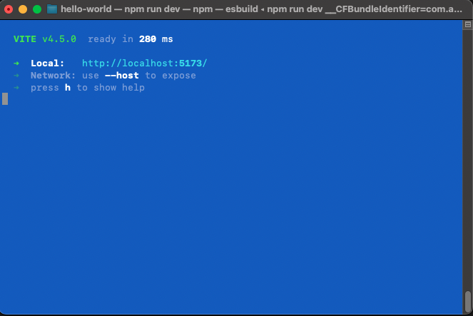
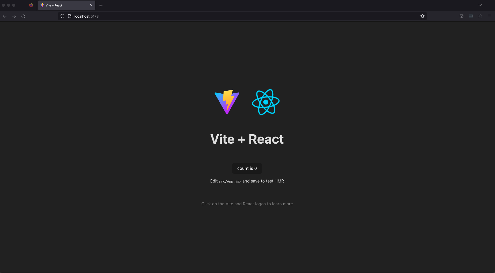

# Hello, World!

<iframe src="https://adaacademy.hosted.panopto.com/Panopto/Pages/Embed.aspx?pid=f3cbbee6-04d2-4da7-a5b6-ad4900114b87&autoplay=false&offerviewer=true&showtitle=true&showbrand=false&start=0&interactivity=all" height="405" width="720" style="border: 1px solid #464646;" allowfullscreen allow="autoplay"></iframe>

## Goals

Our goal is to practice diving into a new library. By creating a Hello, World! project, we'll gain knowledge about how to start and run a React web app.

## Format

To jump into front-end development with React, we will create a Hello, World! app.

We'll take the following steps:

1. Introduce the tool that will create an initial React app on our machine
1. Run a local server to look at our React app
1. Read through React code, namely the `App` component

## Using a Toolchain

We will use a specific tool to help us create a minimal React app: the [Vite](https://vitejs.dev/guide/#getting-started) build tool. Vite is a web development framework for building applications with JavaScript or Typescript. We use it in our curriculum to quickly set up a Javascript application with the React framework.

Vite creates a new project, which includes starter HTML, CSS, and JS files, the React library, a recommended folder structure, and useful packages.

To use Vite, we use this command:

```bash
$ npm create -y vite@latest hello-world -- --template react
```

| <div style="min-width:200px;"> Piece of Code </div> | Notes                                                                                                                            |
| --------------------------------------------------- | -------------------------------------------------------------------------------------------------------------------------------- |
| `npm create -y vite@latest`                                               | This command directs npm to create a new project using the latest Vite template, automatically accepting any requirements.    This enables us to save time and effort in setting up a new project from scratch so that we can focus on writing code.                   |                                 |
| `hello-world`                                       | **Replace this** with the name of your new React project. This will be the name of the project and the generated project folder. |
| `--`                               | It's easy to overlook these extra two dashes, but they separate the arguments that are given to the `npm` command from those that are given to `vite` |
| `--template react`                               | This command line option is passed to `vite` and indicates that a standard React project template should be used when creating our project. There are also several other supported template presets that can be used in addition to React.|

If you're interested in reading more about npm CLI commands, try running `npm help` in your terminal for further investigation.

After running `npm create -y vite@latest hello-world -- --template react`, we'll have a new project folder. We should `cd` into our project folder before we do anything else!

```bash
$ cd hello-world
```

## Running A Server

Let's look at what Vite has given us!

As part of using Vite, we'll begin to use `npm` more regularly. With the `npm` CLI, we'll be able to run scripts that are defined in `package.json`, a file also generated by Vite. These scripts can run servers that load and reload our React app, which simplifies our development workflow.

In our project root, we'll install our dependencies and then start a server with the following two commands in the terminal:

```bash
$ npm install
```

After running `npm install`, we'll see a new directory at the root level called `node_modules` with the installed dependencies. Now we're ready to start the server by running the following command in the terminal:

```bash
$ npm run dev
```

After the server has started up, we'll see an address with port `5173` that we can visit in our browser to see our newly generated React app.
 *Fig. Terminal after successful startup* 

To view the app we can right click on `http://localhost:5173` in the terminal and select the option to open the link or copy and paste the address into our browser's address bar.

  
*Fig. Default React application created by Vite* 

### !callout-info

## 5173 Spells Vite!

By default, our front-end is viewable at `localhost:5173`. 5 is a letter "V" in Roman numerals and 173 looks like "ITE" so together 5173 spells VITE. 

### !end-callout

Every time we make a change in a file and save it, our server will detect the changes and then reload the app immediately.

### !callout-info

## VSCode Autosave, Meet React Autoload

It's often convenient to have our editor automatically save our files as we're working to help us avoid needless hours spent debugging an issue that was ultimately caused by forgetting to save a file. However, this help can become a hindrance when we are working with a program like React that watches for changes and then reloads. Since VSCode saves constantly, even while in the middle of typing a line of code, it's possible (actually common!) for React to try reloading our code when it's not syntactically correct, causing errors in our project.

<br />

When working with React, or other autoloading programs, it's a good idea to disable the VSCode autosave feature. Under the File menu, simply uncheck Auto Save!

### !end-callout

### !callout-warning

## Server Not Reloading? Stop and Restart It

If the auto-reload feature does not work (we're editing code, but not seeing any changes in the browser) then it might be necessary to completely stop the server with ctrl-C in the terminal window where it's running, then restarting it again with `npm run dev`.

### !end-callout

<!-- Question 1 -->
<!-- prettier-ignore-start -->
### !challenge
* type: short-answer
* id: 0b2e499f
* title: Hello, World!
##### !question

In one sentence, describe the _UI elements_ you see on `localhost:5173`.

##### !end-question
##### !answer

/.+/

##### !end-answer
##### !explanation

An example list of visible UI elements include:

- One spinning logo ⚛️ in the center
- The text `Edit src/App.js and save to reload.`
- A link labeled "Learn React" that directs us to the React website

##### !end-explanation
### !end-challenge
<!-- prettier-ignore-end -->

## Inspecting the Code

Our project should have the following structure:

```
├── node_modules
├── public
├── src
│   ├── assets
│   ├── App.css
│   ├── App.jsx
│   ├── index.css
│   └── main.jsx
├── .eslint.cjs
├── index.html
├── package-lock.json
├── package.json
├── README.md
└── vite.config.js

```

In this curriculum, we will intentionally not cover every individual file so feel free to follow your curiosity and explore the files and directories that come with a React app created with Vite.

There are two files that are the most important to understand when developing with React for the first time:

1. `src/main.jsx`
2. `src/App.jsx`

### Exploring `main.jsx`

Let's go ahead and open this project up in our text editor to examine the files that have been created for us. We'll begin with `src/main.jsx` and practice our reading skills.

<!-- prettier-ignore-start -->
```js
import React from 'react'
import ReactDOM from 'react-dom/client'
import App from './App.jsx'
import './index.css'

ReactDOM.createRoot(document.getElementById('root')).render(
  <React.StrictMode>
    <App />
  </React.StrictMode>,
)
```
<!-- prettier-ignore-end -->

<!-- Question 2 -->
<!-- prettier-ignore-start -->
### !challenge
* type: checkbox
* id: e447ec71
* title: Hello, World!
##### !question

`src/main.jsx` imports several resources. Select the resources that are imported.

##### !end-question
##### !options

* `React` from `'react'`
* `ReactDOM` from `'react-dom/client'`
* `'./index.css'`
* `App` from `'./App.jsx'`
* `react` from `'./assets/react.svg'`
* `'../index.html'`

##### !end-options
##### !answer

* `React` from `'react'`
* `ReactDOM` from `'react-dom/client'`
* `'./index.css'`
* `App` from `'./App.jsx'`

##### !end-answer
### !end-challenge
<!-- prettier-ignore-end -->

<!-- Question 3 -->
<!-- prettier-ignore-start -->
### !challenge
* type: multiple-choice
* id: 855add45
* title: Hello, World!
##### !question

`ReactDOM.createRoot( ... );` is a...

##### !end-question
##### !options

* variable
* function call
* class

##### !end-options
##### !answer

* function call

##### !end-answer
### !end-challenge
<!-- prettier-ignore-end -->

<!-- Question 4 -->
<!-- prettier-ignore-start -->
### !challenge
* type: multiple-choice
* id: b56db597
* title: Hello, World!
##### !question

The following code snippet is in `src/main.jsx`.

```js
<React.StrictMode>
  <App />
</React.StrictMode>,
```

This code is...

##### !end-question
##### !options

* An import statement
* A comment in React
* The first argument when calling the `render()` method 
* An object literal

##### !end-options
##### !answer

* The first argument when calling the `render()` method

##### !end-answer
### !end-challenge
<!-- prettier-ignore-end -->

### `main.jsx` Is the Starting Point

`main.jsx` is responsible for being the starting point of our webapp.

It is the entry point of our project; our app is configured to look for this file first when we run the app.

This file renders our first _JSX_ (described in another lesson).

```js
<React.StrictMode>
  <App />
</React.StrictMode>
```

This code indicates that when we start our React webapp, it will _render_ an `App` component using `<App />`.

Aside from seeing that this is how the `App` component gets loaded, we will rarely visit `src/main.jsx` in this curriculum, even though there are lines of code in this file that are worth exploring with bigger projects.

Instead, we'll focus on working with the `App` component.

### Exploring `App.jsx`

Consider the contents of `src/App.jsx`.

<!-- prettier-ignore-start -->
```js
import { useState } from 'react'
import reactLogo from './assets/react.svg'
import viteLogo from '/vite.svg'
import './App.css'

function App() {
  const [count, setCount] = useState(0)

  return (
    <>
      <div>
        <a href="https://vitejs.dev" target="_blank">
          
        </a>
        <a href="https://react.dev" target="_blank">
          
        </a>
      </div>
      <h1>Vite + React</h1>
      <div className="card">
        <button onClick={() => setCount((count) => count + 1)}>
          count is {count}
        </button>
        <p>
          Edit <code>src/App.jsx</code> and save to test HMR
        </p>
      </div>
      <p className="read-the-docs">
        Click on the Vite and React logos to learn more
      </p>
    </>
  )
}

export default App
```
<!-- prettier-ignore-end -->

### !callout-warning

## Remember to Use Semicolons!

The default template that Vite provides does not include semicolons. While there are a variety of styles when it comes to writing JavaScript and creating JSX objects, we encourage you to continue using semicolons!

<br />

We can add a line to the `.eslint.cjs` linter rule file to help remind us where they go! Within the `rules` section, add the following after any other rules specified by the template:

```js
semi: ['warn', 'always'],
```

<details>
<summary>Expand for an example of how the rules section could look after modification</summary>

<br />

There could be different rules depending on the version of the Vite tool used during the project setup. We added the semi rule to the end of the rules block.

```js  
  rules: {
    'react-refresh/only-export-components': [
      'warn',
      { allowConstantExport: true },
    ],
    semi: ['warn', 'always'],
  },
```
</details>

### !end-callout

From reading `src/App.jsx`, answer the questions below. If a question involves an expression that hasn't been discussed yet, we can hypothesize what it might do based on what we know about other languages, or from what a natural language reading might imply.

<!-- Question 5 -->
<!-- prettier-ignore-start -->
### !challenge
* type: checkbox
* id: 429bf219
* title: Hello, World!
##### !question

`src/App.jsx` imports several resources. Select the resources that are imported.

##### !end-question
##### !options

* `{ useState }` from `'react'`
* `'./index.js'`
* `App from './App.jsx'`
* `reactLogo` from `'./assets/react.svg'`
* `viteLogo` from `'/vite.svg'`
* `'./App.css'`

##### !end-options
##### !answer
* `{ useState }` from `'react'`
* `reactLogo` from `'./assets/react.svg'`
* `viteLogo` from `'/vite.svg'`
* `'./App.css'`

##### !end-answer
### !end-challenge
<!-- prettier-ignore-end -->

<!-- Question 6 -->
<!-- prettier-ignore-start -->
### !challenge
* type: multiple-choice
* id: cde06659
* title: Hello, World!
##### !question

There is an object named `App`. `App` is a...

##### !end-question
##### !options

* variable
* function call
* class
* function

##### !end-options
##### !answer

* function

##### !end-answer
### !end-challenge
<!-- prettier-ignore-end -->

<!-- Question 7 -->
<!-- prettier-ignore-start -->
### !challenge
* type: checkbox
* id: 6d8a4864
* title: Hello, World!
##### !question

Check all options that are true about `src/App.jsx`.

##### !end-question
##### !options

* `App` is a function, and it returns something
* The `<a>` elements have a `rel` attribute
* The button element has an `onSubmit` event handler
* The `export default App;` statement is used to make `App` available to other files

##### !end-options
##### !answer

* `App` is a function, and it returns something
* The `export default App;` statement is used to make `App` available to other files

##### !end-answer
### !end-challenge
<!-- prettier-ignore-end -->

### `App.jsx` Defines Our `App` Component

The `App` function defines a component named `App`.

The responsibility of the `App` function is to return _how_ to render the `App` component whenever the `App` component is declared and used.

### !callout-info

## Explore!

Now is a great time to explore our webapp. We can change the headers and text, and observe how any changes get reflected in our browser.

<br />

Notice that Vite created a `.gitignore` file automatically, but it did **not** automatically initialize a Git repository in our directory. We will need to do so ourselves so if something breaks during our exploration we can always get back to the initial version of the files using our Git skills! 

<br />

As a reminder, to initialize a Git repository in a project we run the following command in our project directory:
```bash
$ git init
```
<br />

To ensure that our default branch is called 'main' instead of 'master', we should run:
```bash
$ git init --initial-branch=main
```
### !end-callout
