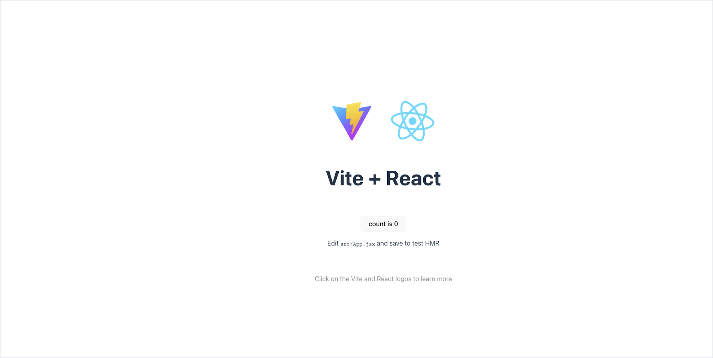

# Hello, World!

## Goals

Our goal is to practice diving into a new library. By creating a Hello, World! project, we'll gain knowledge about how to start and run a React webapp.

## Format

To jump into front-end development with React, we will create a Hello, World app.

We'll take the following steps:

1. Introduce the tool that will create an initial React app on our machine
1. Run a local server to look at our React app
1. Read through React code, namely the `App` component

## Using a Toolchain

We will use a specific tool to help us begin a minimal React app: the [Create React App](https://create-react-app.dev/) tool.

Create React App creates a new project, which includes starter HTML, CSS, and JS files, the React library, a recommended folder structure, and useful packages.

To use Create React App, we use this command:

```bash
$ npx create-react-app hello-world
```

| <div style="min-width:200px;"> Piece of Code </div> | Notes                                                                                                                            |
| --------------------------------------------------- | -------------------------------------------------------------------------------------------------------------------------------- |
| `npx`                                               | A CLI tool that runs packages. In this curriculum, we will use this infrequently.                                                |
| `create-react-app`                                  | A package that includes the command for Create React App, which creates a minimal React app.                                     |
| `hello-world`                                       | **Replace this** with the name of your new React project. This will be the name of the project and the generated project folder. |

If `npx` isn't available, we should follow directions to install the latest version of [Node.js](https://nodejs.org/en/). Node.js includes `npm`. `npm` 5.2+ includes `npx`.

After running `create-react-app`, we'll have a new project folder. We should `cd` into our project folder before we do anything else!

```bash
$ cd hello-world
```

## Running A Server

Let's look at what the `create-react-app` tool has given us!

As part of using Create React App, we'll begin to use the `yarn` CLI tool. With `yarn` CLI, we'll be able to run scripts that are defined in `package.json`, a file also generated by Create React App. These scripts can run servers that load and reload our React app, which simplifies our development workflow.

In our project root, we start a server with this command in the terminal:

```bash
$ yarn start
```

By default, our front-end is viewable at `localhost:3000`.

Every time we make a change in a file and save it, our server will detect changes and then reload the app immediately.



<!-- Question 1 -->
<!-- prettier-ignore-start -->
### !challenge
* type: short-answer
* id: 0b2e499f
* title: Hello, World!
##### !question

In one sentence, describe the _UI elements_ you see on `localhost:3000`.

##### !end-question
##### !answer

/.+/

##### !end-answer
##### !explanation

An example list of visible UI elements include:

- One spinning logo ⚛️ in the center
- The text `Edit src/App.js and save to reload.`
- A link labeled "Learn React" that directs us to the React website

##### !end-explanation
### !end-challenge
<!-- prettier-ignore-end -->

## Inspecting the Code

Our project should have the following structure:

```
├── public
│   └── index.html
├── src
│   ├── App.css
│   ├── App.js
│   ├── App.test.js
│   ├── index.css
│   ├── index.js
│   ├── logo.svg
│   ├── reportWebVitals.js
│   └── setupTests.js
├── package.json
├── README.md
└── yarn.lock
```

In this curriculum, we will intentionally not cover the following files:

- The contents of `public` besides `index.html`
- `logo.svg`
- `reportWebVitals.js`
- `setupTests.js`

There are two files that are the most important to understand when developing React for the first time:

1. `src/index.js`
1. `src/App.js`

### Exploring `index.js`

Let's go ahead and open this project up in our text editor to examine the files that have been created for us. We'll begin with `src/index.js` and practice our reading skills.

```js
import React from "react";
import ReactDOM from "react-dom";
import "./index.css";
import App from "./App";
import reportWebVitals from "./reportWebVitals";

ReactDOM.render(
  <React.StrictMode>
    <App />
  </React.StrictMode>,
  document.getElementById("root")
);

// If you want to start measuring performance in your app, pass a function
// to log results (for example: reportWebVitals(console.log))
// or send to an analytics endpoint. Learn more: https://bit.ly/CRA-vitals
reportWebVitals();
```

<!-- Question 2 -->
<!-- prettier-ignore-start -->
### !challenge
* type: checkbox
* id: e447ec71
* title: Hello, World!
##### !question

`src/index.js` imports several files. Select the files that are imported.

##### !end-question
##### !options

* `React`
* `ReactDOM`
* `'./index.css'`
* `App` from `'./App'`
* `logo` from `'./logo.svg'`
* `'./index.js'`

##### !end-options
##### !answer

* `React`
* `ReactDOM`
* `'./index.css'`
* `App` from `'./App'`

##### !end-answer
### !end-challenge
<!-- prettier-ignore-end -->

<!-- Question 3 -->
<!-- prettier-ignore-start -->
### !challenge
* type: multiple-choice
* id: 855add45
* title: Hello, World!
##### !question

`ReactDOM.render( ... );` is a...

##### !end-question
##### !options

* variable
* function call
* class

##### !end-options
##### !answer

* function call

##### !end-answer
### !end-challenge
<!-- prettier-ignore-end -->

<!-- Question 4 -->
<!-- prettier-ignore-start -->
### !challenge
* type: multiple-choice
* id: b56db597
* title: Hello, World!
##### !question

The following code snippet is in `src/index.js`.

```js
<React.StrictMode>
  <App />
</React.StrictMode>
```

This code is...

##### !end-question
##### !options

* An import statement
* A comment in React
* The first argument when calling `ReactDOM.render()`
* An object literal

##### !end-options
##### !answer

* The first argument when calling `ReactDOM.render()`

##### !end-answer
### !end-challenge
<!-- prettier-ignore-end -->

`index.js` is responsible for being the starting point of our webapp.

It is the entry point of our project; our app is configured to look for this file first when we run the app.

This file renders our first _JSX_ (described in another lesson).

```js
<React.StrictMode>
  <App />
</React.StrictMode>
```

This code indicates that when we start our React webapp, it will _render_ an `App` component using `<App />`.

In this curriculum, we will rarely touch `src/index.js`. Additionally, there are other lines of code in this file that is worth exploring with bigger projects.

Instead, we'll focus on leveraging the `App` component.

### Exploring `App.js`

Consider the contents of `src/App.js`.

```js
import logo from "./logo.svg";
import "./App.css";

function App() {
  return (
    <div className="App">
      <header className="App-header">
        
        <p>
          Edit <code>src/App.js</code> and save to reload.
        </p>
        <a
          className="App-link"
          href="https://reactjs.org"
          target="_blank"
          rel="noopener noreferrer"
        >
          Learn React
        </a>
      </header>
    </div>
  );
}

export default App;
```

From reading `src/App.js`, answer the questions below.

<!-- Question 5 -->
<!-- prettier-ignore-start -->
### !challenge
* type: checkbox
* id: 429bf219
* title: Hello, World!
##### !question

`src/App.js` imports several files. Select the files that are imported.

##### !end-question
##### !options

* `React`
* `'./index.js'`
* `'./App.js'`
* `App` from `'./App'`
* `logo` from `'./logo.svg'`
* `'./App.css'`

##### !end-options
##### !answer

* `logo` from `'./logo.svg'`
* `'./App.css'`

##### !end-answer
### !end-challenge
<!-- prettier-ignore-end -->

<!-- Question 6 -->
<!-- prettier-ignore-start -->
### !challenge
* type: multiple-choice
* id: cde06659
* title: Hello, World!
##### !question

There is an object named `App`. `App` is a...

##### !end-question
##### !options

* variable
* function call
* class
* function

##### !end-options
##### !answer

* function

##### !end-answer
### !end-challenge
<!-- prettier-ignore-end -->

<!-- Question 7 -->
<!-- prettier-ignore-start -->
### !challenge
* type: checkbox
* id: 6d8a4864
* title: Hello, World!
##### !question

Check all options that are true about `src/App.js`.

##### !end-question
##### !options

* `App` is a function, and it returns something
* `App` is an arrow function
* `logo` is not actually used in this file
* The `export default App;` statement is used to make `App` available to other files

##### !end-options
##### !answer

* `App` is a function, and it returns something
* The `export default App;` statement is used to make `App` available to other files

##### !end-answer
### !end-challenge
<!-- prettier-ignore-end -->

The `App` function defines a component named `App`.

The responsibility of `App` function is to return _how_ to render the `App` component whenever the `App` component is declared and used.

### !callout-info

## Explore!

Now is a great time to explore our webapp. We can change the headers and text, and observe how they get reflected in our app.

### !end-callout
