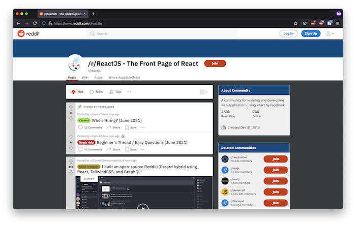

# Intro to React JS

## Learning Goals

- Define what React is
- Understand why we learn React
- Discuss who is using React
- Acquire introductory understanding of React Components

## Introduction

Consider a social media website, such as [Reddit.com](https://www.reddit.com/r/reactjs/). Every web page on that site needs to do soooo many things! For example, each web page needs to:

- List posts, including the numbers of upvotes and comments
- Display upvote and downvote buttons
- Handle upvote and downvote buttons
- List related communities
- Handle the buttons to "join" those communities
- Display and handle the UI to create a new post

  
_Fig. The /r/ReactJS subreddit. The self-styled "Front Page of React"_

Imagine creating all of this functionality using HTML and vanilla JavaScript. It wouldn't be impossible, but our resulting code would probably be:

- Huge! There's a lot of code in that logic to write!
- Unorganized. Is there one file that holds all the JS? Are there multiple files? How are they organized?
- Full of repetition. We need to create many, many event handlers. Is there a way to simplify this repetition?

Great software is maintainable, functional, and performs well. How can we strive towards those values in our front-end code?

## Vocabulary and Synonyms

| Vocab               | Definition                                                                                                                                                                                               | How to Use in a Sentence                                                                                                                                                                                               |
| ------------------- | -------------------------------------------------------------------------------------------------------------------------------------------------------------------------------------------------------- | ---------------------------------------------------------------------------------------------------------------------------------------------------------------------------------------------------------------------- |
| User Interface (UI) | The elements with which a user interacts in order to make a machine do something. UI elements are usually visual, but UI also describes _how_ a user interacts with a webapp, such as buttons, text fields, or sliders. | "This UI was easy to use and enjoyable, because the text was readable, and the buttons were intuitive," "This UI was difficult to use, because I didn't understand the navigation menu, and the data was unorganized." |
| Components (React)  | Independent, reusable pieces of UI.                                                                                                                                                                      | "My recipe webapp has a `Recipe` component, which renders a recipe," "I created a `RedButton` component to reuse. All `RedButton` components are red and animate on click."                                            |

## Create Complex UIs with React Components

React is an open-source JavaScript library for building user interfaces. Because it is open-source, we can view its source code in the [React GitHub repository](https://github.com/facebook/react).

The React library gives users the ability to manage UI complexity by creating React _components_.

**Components** are rendered UI elements. Components in React may contain:

- Styles
- Complex logic
- Data
- State
- Event-handling

Components are intended to be flexible and reusable, too! A single web page can render many components inside it.

### !callout-info

## Component Is an Over-Used Programming Term

We run into the term _component_ a lot when programming. It doesn't always mean exactly the same thing in every situation. When we are discussing React, we should focus on components as being independent, reusable pieces of UI, regardless of what component might mean in other contexts.

### !end-callout

## Who is using React?

React launched in 2013, and grew in popularity beginning in 2016.

As of June 2021, the following webapps use React:

- Netflix
- Khan Academy
- Asana
- Facebook
- Airbnb
- Reddit
- UberEats
- PayPal
- Twitter
- Instacart
- OkCupid

## Resources

Like any new technology, it's great to have some resources handy.

- [Official React website](https://reactjs.org/)
- [Official React documentation](https://reactjs.org/docs/getting-started.html)
- [React's list of React communities](https://reactjs.org/community/support.html)
- [React community code of conduct](https://github.com/facebook/react/blob/master/CODE_OF_CONDUCT.md)

## Check for Understanding

<!-- Question Takeaway -->
<!-- prettier-ignore-start -->
### !challenge
* type: paragraph
* id: ca52c8b2
* title: Intro to React JS
##### !question

What was your biggest takeaway from this lesson? Feel free to answer in 1-2 sentences, draw a picture and describe it, or write a poem, an analogy, or a story.

##### !end-question
##### !placeholder

My biggest takeaway from this lesson is...

##### !end-placeholder
### !end-challenge
<!-- prettier-ignore-end -->
