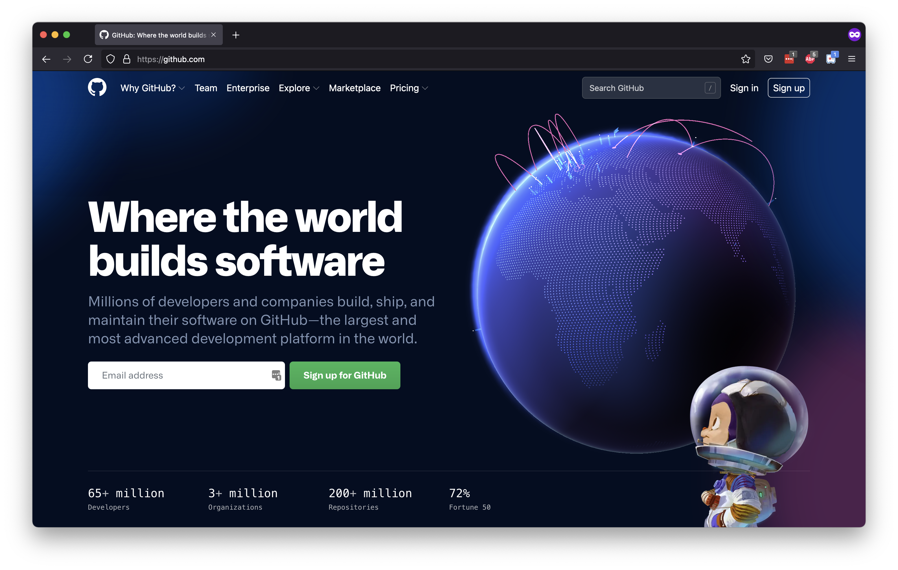
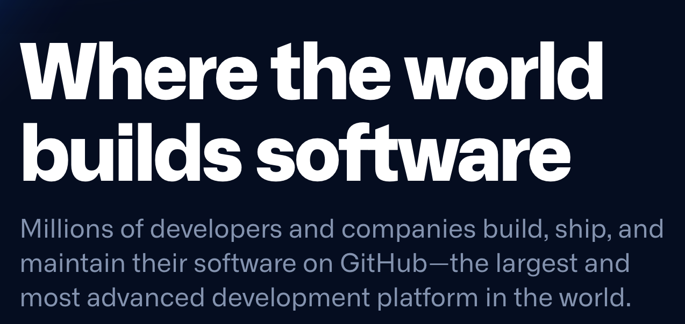
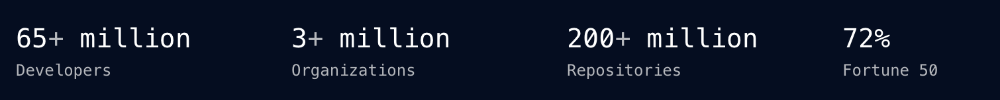

# Problem Set: Recreating Components

## Directions

This problem set will ask you to create several components. To do this, we will create a practice React app named `recreate-github`.

Run this command to create this practice project.

```bash
$ npx create-react-app recreate-github
```

Change into this directory, and run the server.

There is no submission for this problem set. Be prepared to share your work in small groups.

## Practice

Create a simplified version of the GitHub landing page using React components.



You _must_ create the following components with these names:

- `NavigationBar`
- `SearchBar`
- `LoginControls`
- `HeroSection`
- `NewsletterForm`
- `StatsBar`

The `App` component must render all of these components once.

### Prioritize Content, Deprioritize Layout

For this exercise, creating the components with the correct content and rendering them is the highest priority.

Setting the layout is the lowest priority.

### Add Zero Behavior

For this exercise, all links should go nowhere, and all buttons should do nothing. Text input fields should do nothing.

### Do Not Recreate Animations

The goal of this assignment is to practice creating components. Do not recreate any animations or advanced styles for this exercise.

Otherwise, be creative and bring in any other styles you want.

<!-- Simon Note: I want to emphasize it, so here's some straight-up repetition! -->
### !callout-danger

## Prioritize Content, Deprioritize Layout

For this exercise, creating the components with the correct content and rendering them is the highest priority. Setting the layout is the lowest priority.

### !end-callout

### `NavigationBar`


This component should list the following navigation items:

- Why GitHub?
- Team
- Enterprise
- Explore
- Marketplace
- Pricing

### `SearchBar`

Components can be small! This component should include a text input field with the placeholder text "Search GitHub."

### `LoginControls`


This component should include these links:

- Sign in
- Sign up

### `HeroSection`



This component should include the following text:

- Where the world builds software 
- Millions of developers and companies build, ship, and maintain their software on GitHub—the largest and most advanced development platform in the world.

### `NewsletterForm`


This component should include:

- a text input field for an email address
- a button that says "Sign up for GitHub."

### `StatsBar`



This component should include the following text:

- 65+ million Developers
- 3+ million Organizations
- 200+ million Repositories
- 72% Fortune 50
