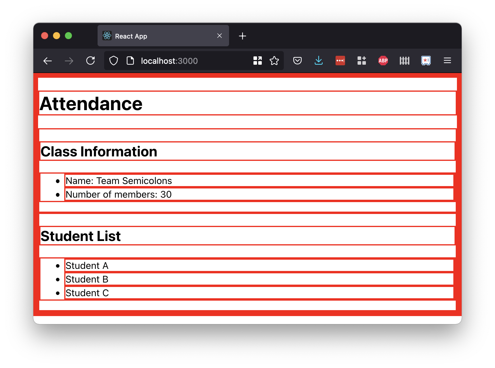
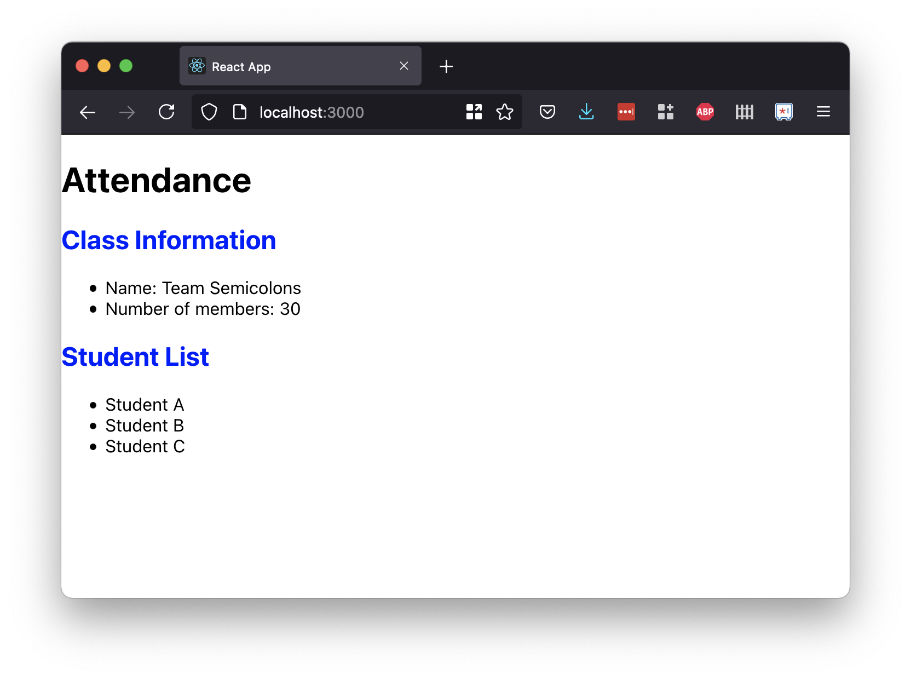
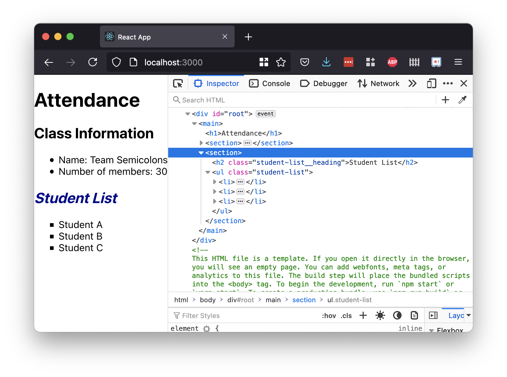

# Styling Components

## Goals

Ultimately, React is used to create compelling and usable UIs. We've seen how defining and using components affects our HTML structures.

How do we actually add styles to our React front-end?!

## Adding Attributes to Components

Before we add styles to components, we should cover how to add attributes to components.

Whenever we render a component in a JSX object, we can add as many attributes to that instance of a rendered component as we'd like.

Every attribute-value pair is declared inside a component's opening tag, much like HTML attributes.

```js
<SomeComponent some-attr="some value"></SomeComponent>
```

This example code adds an attribute named `some-attr` to a `SomeComponent` component.

The value of the `some-attr` attribute is the string `"some value"`.

## Sofia's Story

Sofia is a teacher creating a React front-end for her attendance app.

She has three components in her app:

- `App`
- `ClassInfo`
- `StudentList`

She wants to add some simple styles right now, to help her future development look a little more realistic.

## Adding CSS

There are two ways we can add styles to a component:

1. Create and import an external CSS file, and use attributes like `className`
1. Create inline style objects, and use the `style` attribute

## Using External CSS Files

The first method of attaching styles to a React component is to use an external CSS stylesheet.

Sofia will create a separate CSS file for each styled component.

This CSS file will share the name of the component, and will live in the same folder as the component.

Following these guidelines, to style her `StudentList` component, she'll create a file `src/components/StudentList.css`.

### !callout-info

## CSS File Recommendations

Like other parts of React, the name and location of this file isn't mandatory, but a useful recommended pattern.

### !end-callout

### Populate the CSS File

At this moment, Sofia can populate `src/components/StudentList.css` with the following style. This style will apply a bright red box to every element, and it's an effective way to check that CSS is working.

```css
* {
  border: solid 2px red;
}
```

### Import CSS File

To include the new CSS file, Sofia should import it into the `StudentList` component file.

```js
import "./StudentList.css";
```

While Sofia is in this file, she'll add some student content to make this app more interesting.

In order to return only _one_ JSX object, Sofia needs to wrap her content into a new outer element.

```js
import React from "react";
import "./StudentList.css";

const StudentList = () => {
  return (
    <section>
      <h2>Student List</h2>
      <ul>
        <li>Student A</li>
        <li>Student B</li>
        <li>Student C</li>
      </ul>
    </section>
  );
};

export default StudentList;
```

We see our CSS is applied, just by importing the CSS file!



### Using `class`/`className`

Sofia should replace her CSS with some reasonable styles.

We can use any valid CSS selectors, such as element selectors, classes, or IDs.

```css
h2 {
  color: darkblue;
  font-style: oblique;
}
```



However, there is one exception: in order to set the `class` attribute to any element in JSX, we must use the attribute `className`.

Sofia can modify her `StudentList` component to include some classes with `className`:

<!-- prettier-ignore-start -->
```js
const StudentList = () => {
    return (
        <section>
            <h2 className="student-list__heading">Student List</h2>
            <ul className="student-list">
                <li>Student A</li>
                <li>Student B</li>
                <li>Student C</li>
            </ul>
        </section>
    )
}
```
<!-- prettier-ignore-end -->

And create CSS rule-sets that select those classes:

```css
.student-list__heading {
  color: darkblue;
  font-style: oblique;
}

.student-list {
  list-style-type: square;
}
```

We can even check our browser Dev Tools and inspect the rendered HTML. The `className` attribute defined in JSX has turned into the `class` attribute in rendered HTML.



## More CSS

We can apply our current React and CSS knowledge to our projects.

<!-- I'm emphasizing this in order to pave the way for conditional logic -->

### Embedding Classes

Just like components, we can also embed our class values.

<!-- prettier-ignore-start -->
```js
const StudentList = () => {
    const headingClass = 'student-list__heading';
    const listClass = 'student-list';

    return (
        <section>
            <h2 className={headingClass}>Student List</h2>
            <ul className={listClass}>
                <li>Student A</li>
                <li>Student B</li>
                <li>Student C</li>
            </ul>
        </section>
    )
}
```
<!-- prettier-ignore-end -->

### Multiple Classes

To give an element multiple classes, we can continue to space-separate class names.

```js
<h2 className="student-list__heading yellow-bg">Student List</h2>
```

This would give the `h2` element the classes `student-list__heading` and `yellow-bg`.

## Inline Style Object

Instead of importing an external CSS file, another way to include CSS is to use the built-in `style` attribute.

The `style` attribute takes in a JavaScript object. This JS object should contain the property-value pairs, where the property name is the CSS equivalent, but camelCase.

<!-- prettier-ignore-start -->
```js
const helloWorldStyle = {
  color: 'blue',
  backgroundImage: 'url(' + imgUrl + ')',
};

const someComponent = () => {
  return <h1 style={helloWorldStyle}>Hello World!</h1>;
}
```
<!-- prettier-ignore-end -->

This method of adding styles is commonly written online (particularly in documentation and tutorials) because it's convenient to condense the code in this way.

**This form of including CSS is _discouraged_**. To read and learn more, we can visit [React docs on the use of inline styles](https://reactjs.org/docs/dom-elements.html#style).

## Check for Understanding

<!-- Question Takeaway -->
<!-- prettier-ignore-start -->
### !challenge
* type: paragraph
* id: e9397589
* title: Styling Components
##### !question

What was your biggest takeaway from this lesson? Feel free to answer in 1-2 sentences, draw a picture and describe it, or write a poem, an analogy, or a story.

##### !end-question
##### !placeholder

My biggest takeaway from this lesson is...

##### !end-placeholder
### !end-challenge
<!-- prettier-ignore-end -->