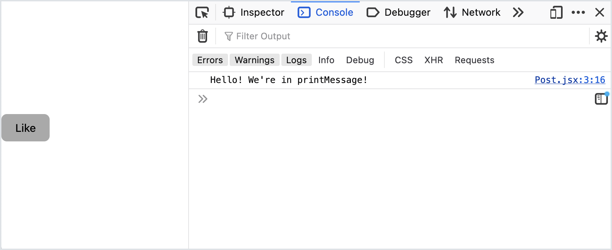

# Event Handling

<!-- VITE-UPDATE -->
<!-- <iframe src="https://adaacademy.hosted.panopto.com/Panopto/Pages/Embed.aspx?pid=21ab1425-6193-451d-b804-ad49005948df&autoplay=false&offerviewer=true&showtitle=true&showbrand=false&start=0&interactivity=all" height="405" width="720" style="border: 1px solid #464646;" allowfullscreen allow="autoplay"></iframe> -->

## Goals

Our React web apps become more capable when they handle user events. To handle events in React, we must learn the React conventions.

## Handling Events

As with general web development, handling events in React requires:

- A way for an element to listen to events
- Behavior that should happen when the event occurs

In React, we'll add event listeners by using special attributes in our JSX.

## Event Listeners

For any element to listen to an event, we set an attribute on the element.

For click events, we set the `onClick` attribute.

When submitting a form, for submit events, we set the `onSubmit` attribute. To handle when an `<input type="text">` element changes, we set the `onChange` attribute.

In general, to handle events in React, the proper attribute follows the pattern of "on`<blank>`" in camelCase, where `<blank>` is the name of the event. To confirm, we should research the correct attribute in the React docs, though!

Consider this example JSX, where a `SomeElement` element will listen for click events.

<!-- prettier-ignore-start -->
```js
<SomeElement onClick={...}></SomeElement>
```
<!-- prettier-ignore-end -->

## Event Handling Functions

The value of our event listener should be a function.

This function will be invoked whenever the appropriate event occurs.

Consider this `Post` component. It defines a function named `printMessage`. Then, it returns JSX that includes a "like" button.

The "like" button listens for click events. By setting the value of `onClick` to `printMessage`, our web app invokes `printMessage` whenever we click the like button.

<!-- prettier-ignore-start -->
```js
const Post = () => {
    const printMessage = () => {
        console.log('Hello! We\'re in printMessage!');
    };

    return (
        <section>
            <button onClick={printMessage}>Like</button>
        </section>
    );
};
```
<!-- prettier-ignore-end -->

  
_Fig. Clicking the Like button calls `printMessage`, with our message appearing in the console_

Every time we click our "Like" button, we'll see our message in the console!

```
Hello! We're in printMessage!
```

### !callout-warning

## A Note on Accessibility

You can add "click" event handlers to *any* html element.  However, it is strongly recommended that you use the `onClick` attribute only for elements which are normally expected to interact with the user, such as `button`, `a` elements.  This makes the site more accessible to users with disabilities and performs better with screen reading apps.

For example this is not a good use of the `onClick` attribute:

```html
<div class="clickable-div" onClick="somefunction">
    <p>Click me!</p>
<div>
```

The fact that this `div` element is clickable is not a good indication that it is expected to interact with the user.  It is better to use the `onClick` attribute on a `button` or an anchor (`a`) element.

### !end-callout

### Event Handling Functions Can Accept `event`

We can get details in our event-handling functions about the event that occurred.

If our event-handling function accepts arguments, React will pass an event object as the first argument.

As with vanilla JavaScript event handling, we usually name this parameter `event` to remind us what to expect in that parameter. Also like vanilla JavaScript, this is merely convention, and we can name the parameter whatever we would like.

Consider this code, where `printMessage` accepts an event object, and then prints it.

<!-- prettier-ignore-start -->
```js
const Post = () => {
    const printMessage = (event) => {
        console.log('Hello! We\'re in printMessage!');
        console.log('This event object contains details about the event:', event);
    };

    return (
        <section>
            <button onClick={printMessage}>Like</button>
        </section>
    );
};
```
<!-- prettier-ignore-end -->

This is what prints to the browser console. (Your results may vary depending on your browser.)

```
Hello! We're in printMessage!
This event object contains details about the event: 
Object { _reactName: "onClick", ...
```

### Event Handling Functions Are Functions

It's helpful to know that our event handling functions are still, in every way, normal functions.

They can call other functions inside them, and pass arguments to them, too.

Consider this `Post` component. It:

- Defines a function, `printName`, which takes in a `name` argument
- Defines another function, `printMessage`. It calls `printName` with the argument `"Ada Lovelace"`.
- Sets `printMessage` as the click event handler for a "Like" button

<!-- prettier-ignore-start -->
```js
const Post = () => {
    const printName = (name) => {
        console.log('We\'re in printName!');
        console.log(`Hello, ${name}!`);
    };

    const printMessage = () => {
        printName('Ada Lovelace');
        console.log('Now, we\'re in printMessage!');
    };

    return (
        <section>
            <button onClick={printMessage}>Like</button>
        </section>
    );
};
```
<!-- prettier-ignore-end -->

Our output proves that our `printMessage` event handler can invoke other functions.

```
We're in printName!
Hello, Ada Lovelace!
Now, we're in printMessage!
```

## Pattern: Anonymous Functions

Our event handlers can be _anonymous functions_.

Consider our `printMessage` and `printName` example. Let's refactor our `printMessage` into an inline, anonymous function:

<!-- prettier-ignore-start -->
```js
const Post = () => {
    const printName = (name) => {
        console.log('We\'re in printName!');
        console.log(`Hello, ${name}!`);
    };

    return (
        <section>
            <button onClick={() => printName('Ada Lovelace')}>Like</button>
        </section>
    );
};
```
<!-- prettier-ignore-end -->

This code produces the output:

```
We're in printName!
Hello, Ada Lovelace!
```

Every time we click on our "like" button, our anonymous function will fire. This, in turn, invokes `printName('Ada Lovelace')`!

Using anonymous functions for event handlers is a common pattern in React, especially when the function we want to call needs us to pass in some parameters.

A common mistake when trying to call a function that takes an argument as an event handler is to try to write the function call, in this case `printName('Ada Lovelace')`, directly as the even handler.

But this does not have the desired result! Instead, it:
1. Calls `printName('Ada Lovelace')` as the button is being rendered rather than when it is clicked. This causes the output message to appear while the page is still being rendered. Not what we wanted!
1. Sets the _result_ of calling `printName('Ada Lovelace')` as the click handler. Since `printName` returns nothing, the result is `undefined`. So no event handler is registered for `onClick`, and the button does nothing when it is clicked. Also not what we wanted!

So when our desired behavior takes at least one parameter, we can use this technique of wrapping it in an anonymous function.

An anonymous function lets us call arbitrary code exactly where the event registration occurs, which can be good for understandability. But we may find that, if we need to do more than one or two things in the event handler, then using a named function may still be more understandable.

### !callout-info

## Foreshadowing: Event Handlers With a Parameter

Instead of passing in `'Ada Lovelace'` to `printName`, what would happen if we passed in a variable?

<br/>

Look forward to handling events based on an input variable!

### !end-callout
