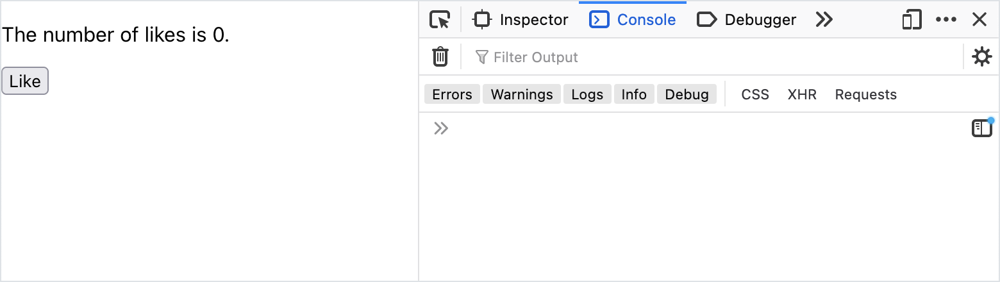
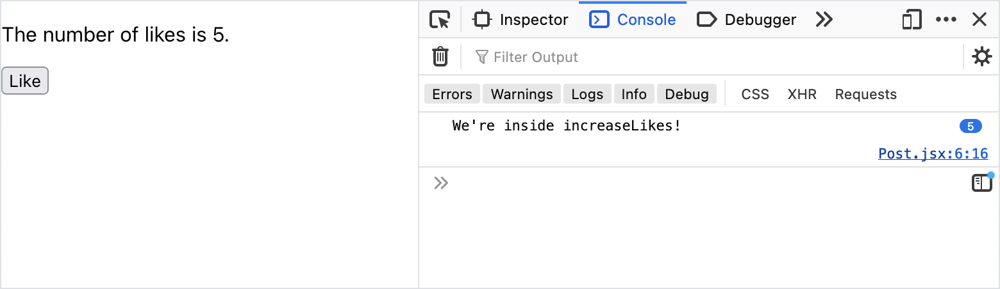
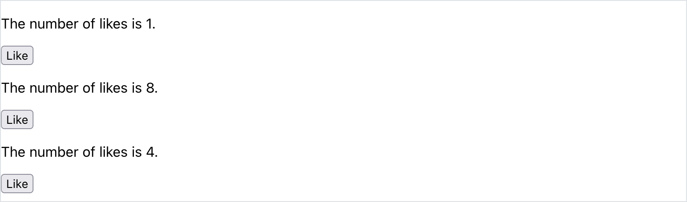
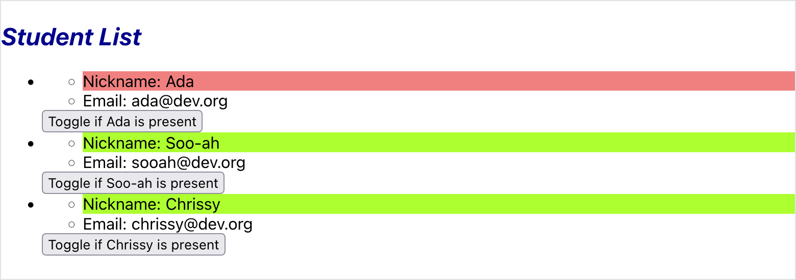
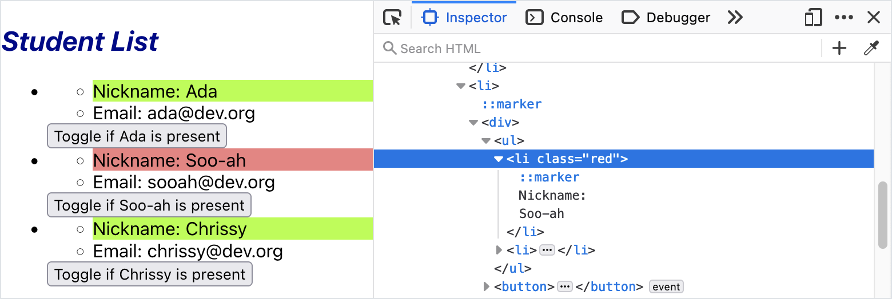

# Updating State

<iframe src="https://adaacademy.hosted.panopto.com/Panopto/Pages/Embed.aspx?pid=3834aa1a-033f-44ad-a01b-ad4900598858&autoplay=false&offerviewer=true&showtitle=true&showbrand=false&start=0&interactivity=all" height="405" width="720" style="border: 1px solid #464646;" allowfullscreen allow="autoplay"></iframe>

## Goals

As a continuation of managing state in React components, the goal of this lesson is to learn how to update state. This lesson will also apply our knowledge about handling events in React.

## Updating State

Let's assume that we have a component that has initialized a piece of state named `pieceOfState`:

<!-- prettier-ignore-start -->
```js
const [pieceOfState, setPieceOfState] = useState('Initial value for pieceOfState.');
```
<!-- prettier-ignore-end -->

In order to update state, we call the update function, and pass in the new value.

<!-- prettier-ignore-start -->
```js
setPieceOfState('New value of pieceOfState.');
```
<!-- prettier-ignore-end -->

| <div style="min-width:200px;"> Piece of Code </div> | Notes                                                                |
| --------------------------------------------------- | -------------------------------------------------------------------- |
| `setPieceOfState(...)`                              | **Replace this** with the function that was created with `useState`. |
| `'New value of pieceOfState.'`                      | **Replace this** with the new value for the piece of state.          |

This code will update a piece of state named `pieceOfState`, and its new value will be `'New value of pieceOfState.'`.

### Updating State Re-Renders the Component

Recall that pieces of state are responsible for managing how one piece of the component looks. For example, they can control if an element shows or hides or the classes that an element has.

**Every time a piece of state is updated, the component re-renders**.

### !callout-warning

## Working With State and Re-Rendering

Wrapping our heads around state and rendering can be challenging!

<br />

Firstly, setting state is _asynchronous_. Not asynchronous in exactly the same way as making `axios` calls, but asynchronous in the sense that setting the value won't be visible to our logic until after React re-renders. For example, logging the value of a piece of state variable immediately after calling its set function will look like nothing has changed, because it hasn't. And it won't until React re-renders.

<br />

Secondly, to repeat, _updating state causes a component to re-render_, but not until our logic completes. If we update multiple pieces of state, the component will not get to render until our code that contained those updates fully completes. Each time the component re-renders, any values and functions defined within the component will be re-initialized. Only values read from state persist between the renders.

<br />

Remembering these two facts will aid us when debugging state. After we become comfortable with these ideas, our debugging of React code will be much less confusing, though this will take time. Be patient!

### !end-callout

## Updating State As Part of Event Handling

The best time to update state is in response to _handling user events_.

We can use our update functions inside an event handler.

### Example: Increasing Like Count

Let's imagine a `Post` component. It's responsible for displaying the number of likes that a post has.

Each post starts with zero likes. When we click the "like" button, the number of likes increases.

Let's consider the code we need to write for this:

1. The `Post` component should have a piece of state, `likesCount`. `likesCount` is data that changes within the component, so we should represent it with a piece of state rather than a `prop`.
1. We should get a reference to the update function for this piece of state, and store it in a variable with a good name like `setLikesCount`.
1. The "like" button should listen for click events, using the attribute `onClick`.
1. When the "like" button is clicked, we should call an event handler function. We can name this function `increaseLikes`.
1. When our component increases likes in `increaseLikes`, we should update our state using `setLikesCount`.

<!-- prettier-ignore-start -->
```js
import { useState } from 'react';

const Post = () => {
    const [likesCount, setLikesCount] = useState(0);
    const increaseLikes = () => {
        console.log('We\'re inside increaseLikes!');
        setLikesCount(likesCount + 1);
    };

    return (
      <section>
        <p>The number of likes is {likesCount}.</p>
        <button onClick={increaseLikes}>Like</button>
      </section>
    );
};

export default Post;
```
<!-- prettier-ignore-end -->

When we look at our web app, our count of likes starts at zero:

  
_Fig. A Post just waiting to be liked!_

When we click the "like" button once, we see that `increaseLikes` gets invoked... and the number of likes increases! Our state has been updated, and our component has been re-rendered.

Even though our `useState` is still passing `0` for the initial value, the value that `likesCount` gets on each following render is the updated value!

  
_Fig. The console message shows that the button called our event handler, and ultimately increased the like count._

Clicking on the "like" button four more times continues to update the component state!

  
_Fig. The like count is up to five, and the console message was also printed 5 times, denoted by the 5 beside it._

<!-- available callout types: info, success, warning, danger, secondary, star  -->
### !callout-info

## We can pass functions to React update methods

If we closely review the default `App.jsx` that Vite provides in a new application, we'll see a slightly different way to make use of the update method for a piece of state, one that that involves passing a function reference rather than a value to the update method.

<br />

To summarize the discussion, it's a little less confusing to use our update functions with a value, as shown in the example above. However, it's a little safer to call update methods as shown by the Vite template code (passing a function). We can use the value-passing style shown above as we're gaining comfort with React overall, but we should look for opportunities to practice using the function-passing style discussed here to write more robust code.

<br />

<details>

<summary>Expand this section for a look at the function-passing approach.</summary>

<br /> 

The code in question is in the default Vite-supplied `App.jsx`

```js
function App() {
  const [count, setCount] = useState(0);

  return (
    /* markup omitted */
        <button onClick={() => setCount((count) => count + 1)}>
          count is {count}
        </button>
    /* markup omitted */
  );
};

export default App;
```

<br /> 

One difference we observe is that an anonymous method is being supplied as the `onClick` handler. We've seen this before, being more a choice of style when the logic of our handler is very short, rather than a difference of substance. Instead, we can focus on the call to `setCount` as compared to the call to `setLikesCount` in our example above.

<br />

In the case of `setLikesCount`, we passed the result of a calculation, that of adding `1` to the current value of `likesCount`. This yields a number, which is passed to `setLikesCount` and will update the value of our piece of state. Note, this does *not* update the value of `likesCount`. It updates the piece of state from which `likesCount` was initialized during the current render. `likesCount` will not appear to change until after the event handler completes, React re-renders the component, and the updated value of the piece of state is assigned to `likesCount` when the  `useState` assignment runs again.

<br />

In the Vite-supplied call to `setCount` we are *not* passing a number, we are passing a function. It happens to be anonymous (not a requirement), has one parameter `count` and returns (implicitly, due to arrow function semantics) the result of adding `1` to the `count` parameter. The value passed in for the parameter (the name did not need to be `count`, but it's not uncommon to use the same name for the parameter as the variable we used in the `useState` destructuring assignment) is the current value of the piece of state this update function `setCount` is related to, *not* the value it had at the time of the most recent render. The value we return is used to update the value of the piece of state. As with `setLikesCount` above, this will not immediately update the `count` destructured variable. But *unlike* with `setLikesCount`, this updated value *would* be passed in to any other function-based calls to `setCount`.

<br />

For simple cases like these examples, there won't be much difference in how these two calling styles behave. However, in more complex scenarios where a single piece of state ends up being updated multiple times in the same area of logic, or if asynchronous API calls result in the possibility of additional renders occurring between when the API call started and when it completes, then the function style is preferred.

<br />


Consider the following examples and compare their results.

```js
// value-passing style
// assume likesCount started the current render with a value of 1

// sets the piece of state value to 2, likesCount is still 1
setLikesCount(likesCount + 1);

// sets the piece of state value to 2, likesCount is still 1
setLikesCount(likesCount + 1);

// sets the piece of state value to 2, likesCount is still 1
setLikesCount(likesCount + 1);

// after this code, React will re-render, and likesCount
// will get the value 2 at its useState assignment.
```

```js
// function-passing style
// assume count started the current render with a value of 1

// sets the piece of state value to 2, count is still 1
setCount(count => count + 1);

// sets the piece of state value to 3, count is still 1
setCount(count => count + 1);

// sets the piece of state value to 4, count is still 1
setCount(count => count + 1);

// after this code, React will re-render, and count
// will get the value 4 at its useState assignment.
```

<br />

Since `likesCount` only gets updated at the `useState` assignment, each of the `likesCount + 1` expressions evaluates to `1 + 1` each time, resulting in calling `setLikesCount(2)` three times. This has the effect of setting the value of the piece of state to `2`. This will cause the component to re-render after our code has completed, and finally, `likesCount` will get the value `2` from the piece of state on that render.

<br />

On the other hand, the `count` parameter to the anonymous functions is *not* the same `count` as the variable that was assigned at its `useState` call. It's a parameter that receives the current value of its piece of state. In the first call, the piece of state is still `1`, still agreeing with the value of the `count` variable anywhere else it might appear in the code emitted during the current render. In the second call, the piece of state has already been set to `2` (the return value from the previous call), so `2` is the value received by the `count` parameter, with `3` being returned. And in the third call, `3` is passed in, and `4` is returned, updating the piece of state value accordingly. So at the end of these three calls, the `count` variable would *still* have the value `1`, while the piece of state itself has been updated to `4`. On the render that runs after our code completes, the `count` variable will get the updated value.

<br />

In general, there's very little reason *not* to use the Vite style (function style) other than it taking a little more time to become comfortable with the syntax. For that reason, we can continue to use the value-based approach for the time being, but we should make sure we at least recognize the function-based approach as well, and gradually start practicing it so that we can use it ourselves.

</details>

### !end-callout

### Seeing Multiple `Post`s Manage Their Own State

Each instance of a component manages its own state, separate from other components.

Imagine this `App` component, which renders three `Post` components.

<!-- prettier-ignore-start -->
```js
function App() {
  return (
    <main>
      <Post></Post>
      <Post></Post>
      <Post></Post>
    </main>
  );
}
```
<!-- prettier-ignore-end -->

Our web app renders three posts, which all manage their own `likesCount` state.

  
_Fig. Three different Posts with three different like counts that update independently_

Here, we've clicked "like" on the first post once, the second post eight times, and the third post four times.

## Sofia's Journey: Changing Student Styles On Presence

Sofia is a teacher creating an attendance web app in React. She has the following components:

| <div style="min-width:200px;">Component</div> | Description                                                                                                                               |
| ---------------------------------------------- | ----------------------------------------------------------------------------------------------------------------------------------------- |
| `App`                                          | Holds the data of all students. Renders an instance of `ClassInfo` and an instance of `StudentList`, passing the needed student data to each component. |
| `ClassInfo`                                    | Presents information about the class.                                                                                                     |
| `StudentList`                                  | Renders a list of `Student`s, based on the student data.                                                                                  |
| `Student`                                      | Presents information about a single student: their `name` and `email`.                                                                    |

<br/>

<details>

<summary>Recall this initial implementation of the <code>Student</code> component.</summary>

```js
import PropTypes from 'prop-types';

const Student = (props) => {
  return (
    <ul>
      <li>Nickname: {props.name}</li>
      <li>Email: {props.email}</li>
    </ul>
  );
};

Student.propTypes = {
  name: PropTypes.string.isRequired,
  email: PropTypes.string.isRequired,
};

export default Student;
```

</details>

Sofia wants to add a feature of toggling the presence of a student.

When a student is present, their name is green. When a student is absent, their name is red.

For each student, there is a button to toggle if the student is present or not.

> Throughout the remainder of this lesson, the `ClassInfo` component output will be omitted for clarity.

  
_Fig. Sofia's ideal end result. Ada has a red name because they are absent. Soo-ah and Chrissy have green names because they are present._

She'll need to update her app in the following ways:

1. Create two CSS classes: one that sets the name to green, and another to set the name to red
2. Create a piece of state in `Student` to hold whether the student is present
3. Create a button in `Student` to toggle whether the student is present
4. Create an event handler that updates state whenever the button is clicked
5. Use the CSS class in `Student`. One CSS class should be applied if the student is present, and the other CSS class should be applied if they're absent.

### 1. CSS Classes

In `src/components/Student.css`, Sofia adds these two classes:

```css
.green {
  background-color: greenyellow;
}

.red {
  background-color: lightcoral;
}
```

<!-- available callout types: info, success, warning, danger, secondary, star  -->
### !callout-warning

## Prefer style names that describe their role, not their appearance

If we were working with Sofia on this project, we might provide feedback that while the CSS class names `green` and `red` are descriptive, what they describe is the appearance itself rather than the reason for applying them to an element. Names more descriptive of their role in the application might be `present` and `absent`, rather than `green` and `red`.

### !end-callout


In `src/components/Student.js`, Sofia adds these two lines to create `isPresent` state:

<!-- prettier-ignore-start -->
```js
import { useState } from 'react';
```
<!-- prettier-ignore-end -->

This line is in the `Student` component function, before the return statement:

<!-- prettier-ignore-start -->
```js
    const [isPresent, setIsPresent] = useState(false);
```
<!-- prettier-ignore-end -->

<!-- available callout types: info, success, warning, danger, secondary, star  -->
### !callout-warning

## State representing application data rarely lives in UI components

In the next topic, we'll look more critically about where the pieces of state should be stored in a React application. For now, we're keeping things more basic by having the state live near the events that modify it, but soon we'll see that this is atypical.

<br />

Because of how `props` flow down the React component tree, we'll find that state more commonly lives near the *top* of the application. We'll be moving this state shortly!

### !end-callout


Sofia updates the returned JSX in `Student`. She adds this `<button>` just after the `</ul>` tag, with an appropriate label.

<!-- Simon note: I added the indentation to clue to the student that it is likely indented? -->
<!-- prettier-ignore-start -->
```js
    <button>Toggle if {props.name} is present</button>
```
<!-- prettier-ignore-end -->

### !callout-danger

## Adjacent JSX elements must be wrapped in an enclosing tag

React tries to update the running web app as Sofia saves her changes, but after saving the `<button>`, React displays the error, "Adjacent JSX elements must be wrapped in an enclosing tag." Sofia realizes that she has violated the rule that React components must return a single parent JSX element!

<br/>

She knows that if she really didn't want to modify her JSX structure further, she could make use of React [Fragments](https://reactjs.org/docs/fragments.html) to group her elements, but instead, she decides to fix this situation by introducing an additional tag.

### !end-callout

To deal with the enclosing tag requirement, Sofia decides to wrap the `Student` JSX in a `<div>` tag, updating the `return` as follows:

```js
    return (
        <div>
            <ul>
                <li>Nickname: {props.name}</li>
                <li>Email: {props.email}</li>
            </ul>
            <button>Toggle if {props.name} is present</button>
        </div>
    );
```

### 3. Create the Event Handler

Sofia now creates the event handler, which updates the `isPresent` state. This function is in the `Student` component function, before the return statement.

<!-- Simon note: I added the indentation to clue to the student that it is likely indented? -->
<!-- prettier-ignore-start -->
```js
    const togglePresence = () => {
        setIsPresent(!isPresent);
    };
```
<!-- prettier-ignore-end -->

#### 4. Attach the Event Handler to the Button

She modifies her `<button>` JSX to include this click event listener:

<!-- Simon note: I added the indentation to clue to the student that it is likely indented? -->
<!-- prettier-ignore-start -->
```js
    <button onClick={togglePresence}>Toggle if {props.name} is present</button>
```
<!-- prettier-ignore-end -->


<!-- available callout types: info, success, warning, danger, secondary, star  -->
### !callout-info

## An opportunity to practice function-passing style updates!

After completing this lesson, consider refactoring the `togglePresence` function to use a function-passing style call to `setIsPresent`.

<br />

<details>

<summary>Click here to see our refactor.</summary>

```js
    const togglePresence = () => {
        setIsPresent(isPresent => !isPresent);
    };
```

<br />

Notice that the only change we needed to make was to add the `isPresent =>`, converting the expression into an anonymous arrow function. Recall that for arrow functions, a body made of a single expression is implicitly returned..

### !end-callout

### 5. Modify the JSX to Use Conditional CSS Classes

Now, Sofia needs to conditionally select which CSS class to apply to the student's name.

In her `Student` component, she will create a variable to hold the value of the appropriate CSS class. This value will use:

- The value of `isPresent`
- The names of the CSS classes she created earlier

First, she ensures that her CSS file is imported:

<!-- prettier-ignore-start -->
```js
import './Student.css';
```
<!-- prettier-ignore-end -->

Then, she creates a variable that holds the name of the (CSS) classes. She uses a ternary to express this. If `isPresent` is `true`, the variable should be `'green'`. If `isPresent` is `false`, it should be `'red'`.

This variable is in the `Student` component function, before the return statement.

<!-- Simon note: I added the indentation to clue to the student that it is likely indented? -->
<!-- prettier-ignore-start -->
```js
    const nameColor = isPresent ? 'green' : 'red';
```
<!-- prettier-ignore-end -->

Finally, she ensures that this variable is used as a class name in her JSX.

<!-- Simon note: I added the indentation to clue to the student that it is likely indented? -->
<!-- prettier-ignore-start -->
```js
    <li className={nameColor}>Nickname: {props.name}</li>
```
<!-- prettier-ignore-end -->

### Sofia's Result

Here is Sofia's final `Student` component:

<!-- prettier-ignore-start -->
```js
import { useState } from 'react';
import PropTypes from 'prop-types';
import './Student.css';

const Student = (props) => {
    const [isPresent, setIsPresent] = useState(false);

    const togglePresence = () => {
        setIsPresent(!isPresent);
    };

    const nameColor = isPresent ? 'green' : 'red';

    return (
        <div>
            <ul>
                <li className={nameColor}>Nickname: {props.name}</li>
                <li>Email: {props.email}</li>
            </ul>
            <button onClick={togglePresence}>Toggle if {props.name} is present</button>
        </div>
    );
};

Student.propTypes = {
    name: PropTypes.string.isRequired,
    email: PropTypes.string.isRequired
};

export default Student;
```
<!-- prettier-ignore-end -->

When Sofia loads her web app, which has the student data of three students, she sees that the initial value of `isPresent` is `false` for all of them.

  
_Fig. No one is here yet_

She can click on the buttons for each component, and toggle their presence!

  
_Fig. Sofia clicks the buttons for Soo-ah and Chrissy_

  
_Fig. Clicking around some more, Sofia can mark Soo-ah as absent instead_

We can even open up our browser Dev Tools and witness the CSS classes change.

  
_Fig. Inspector view confirming that the element has the class "red"_

## Check for Understanding

<!-- Question 1 -->
<!-- prettier-ignore-start -->
### !challenge
* type: multiple-choice
* id: 230fb1db
* title: Using State
##### !question

Which of the following options causes a React component to re-render?

##### !end-question
##### !options

* Reading a property in `props`
* Directly calling the component function
* Using an `if` statement
* Calling a function that updates a piece of state

##### !end-options
##### !answer

* Calling a function that updates a piece of state

##### !end-answer
### !end-challenge
<!-- prettier-ignore-end -->

<!-- Question 2 -->
<!-- prettier-ignore-start -->
### !challenge
* type: tasklist
* id: 057ac898
* title: Updating State
##### !question

Recreate Sofia's attendance button feature.

##### !end-question
##### !options

* Create two CSS classes: one that sets the name to green, and another to set the name to red
* Create a piece of state in `Student` to hold if the student is present
* Create a button in `Student` to toggle if the student is present
* Create an event handler that updates state whenever the button is clicked
* Use the CSS class in `Student`. The styles of a student's name should change, based on the state of the student's attendance

##### !end-options
### !end-challenge
<!-- prettier-ignore-end -->

<!-- Question 3 -->
<!-- prettier-ignore-start -->
### !challenge
* type: paragraph
* id: a714dce3
* title: Updating State
##### !question

Imagine a weather app.

There is a component that holds the value of the temperature in degrees, named `Temperature`.

In this component, there is a button to increase the temperature.

If the temperature is above 32 degrees F, the temperature should be **red**. If it's below or equal to 32 degrees F, the temperature should be **blue**.

Create a list of steps or pseudocode to implement this feature in `Temperature`.

##### !end-question
##### !placeholder

1. In the Temperature component, import...

##### !end-placeholder
### !end-challenge
<!-- prettier-ignore-end -->

<!-- Question 4 -->
<!-- prettier-ignore-start -->
### !challenge
* type: paragraph
* id: 1e5956e1
* title: Updating State
##### !question

Create a generic list of steps we can follow to add event-handling to _any_ component.

##### !end-question
##### !placeholder

1. In the component, import...

##### !end-placeholder
### !end-challenge
<!-- prettier-ignore-end -->
