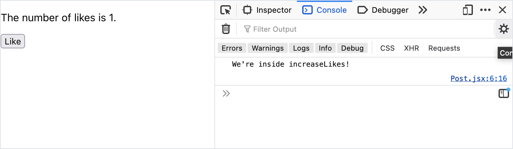
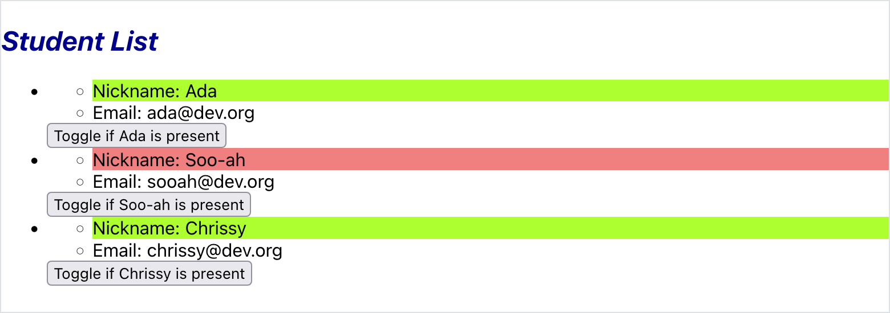

# Updating State

## Goals

As a continuation of managing state in React components, the goal of this lesson is to learn how to update state. This lesson will also apply our knowledge about handling events in React.

## Updating State

Let's assume that we have a component that has initialized a piece of state named `pieceOfState`:

<!-- prettier-ignore-start -->
```js
const [pieceOfState, setPieceOfState] = useState('Initial value for pieceOfState.');
```
<!-- prettier-ignore-end -->

In order to update state, we call the update function, and pass in the new value.

<!-- prettier-ignore-start -->
```js
setPieceOfState('New value of pieceOfState.');
```
<!-- prettier-ignore-end -->

| <div style="min-width:200px;"> Piece of Code </div> | Notes                                                                |
| --------------------------------------------------- | -------------------------------------------------------------------- |
| `setPieceOfState(...)`                              | **Replace this** with the function that was created with `useState`. |
| `'New value of pieceOfState.'`                      | **Replace this** with the new value for the piece of state.          |

This code will update a piece of state named `pieceOfState`, and its new value will be `'New value of pieceOfState.'`.

### Updating State Re-Renders the Component

Recall that pieces of state are responsible for managing how one piece of the component looks. For example, they can control if an element shows or hides or the classes that an element has.

**Every time a piece of state is updated, the component re-renders**.

### !callout-warning

## Working With State and Re-Rendering

Re-rendering a component is hard work! Firstly, setting state is _asynchronous_. Secondly, to repeat, _every time that state updates, the component re-renders_. These two facts will aid us when debugging state.

### !end-callout

## Updating State As Part of Event Handling

The best time to update state is in response to _handling user events_.

We can use our update functions inside an event handler.

### Example: Increasing Like Count

Let's imagine a `Post` component. It's responsible for displaying the number of likes that a post has.

Each post starts with zero likes. When we click the "like" button, the number of likes increases.

Let's consider the code we need to write for this:

1. The `Post` component should have a piece of state, `likesCount`.`likesCount` is ideally a piece of state, and not a `prop`, because state can be modified within a component.
1. We should also get a function to update this piece of state, `setLikesCount`.
1. The "like" button should listen for click events, using the attribute `onClick`.
1. When the "like" button is clicked, we should call an event handler function. We can name this function `increaseLikes`.
1. When our component increases likes in `increaseLikes`, we should update our state using `setLikesCount`.

<!-- prettier-ignore-start -->
```js
import { useState } from 'react';

const Post = () => {
    const [likesCount, setLikesCount] = useState(0);
    const increaseLikes = () => {
        console.log('We\'re inside increaseLikes!');
        setLikesCount(likesCount + 1);
    };

    return (
      <section>
        <p>The number of likes is {likesCount}.</p>
        <button onClick={increaseLikes}>Like</button>
      </section>
    );
};

export default Post;
```
<!-- prettier-ignore-end -->

When we look at our web app, our count of likes starts at zero:

  
_Fig. An app that reads "The number of likes is 0."_

When we click it once, we see that `increaseLikes` has been invoked... and the number of likes has increased! Our state has been updated!

  
_Fig. An app that reads "The number of likes is 1." and a "like" button. The browser Dev Tools are open. The console reads "We're inside increaseLikes!"_

Clicking on the "like" button five times continues to update state!

  
_Fig. An app that reads "The number of likes is 5."_

### Seeing Multiple `Post`s Manage Their Own State

Each instance of a component manages its own state, separate from other components.

Imagine this `App` component, which renders three `Post` components.

<!-- prettier-ignore-start -->
```js
function App() {
  return (
    <main>
      <Post></Post>
      <Post></Post>
      <Post></Post>
    </main>
  );
}
```
<!-- prettier-ignore-end -->

Our web app renders three posts, which all manage their own `likesCount` state.

  
_Fig. The web app with three different posts with three different counts of likes. The first post has 1 like, the second post has 8 likes, and the third post has 3 likes._

Here, we've clicked "like" on the first post once, the second post eight times, and the third post four times.

## Sofia's Journey: Changing Student Styles On Presence

Sofia is a teacher creating an attendance web app in React. She has the following components:

| <div style="min-width:200px;">Component</div> | Description                                                                                                                               |
| ---------------------------------------------- | ----------------------------------------------------------------------------------------------------------------------------------------- |
| `App`                                          | Holds the data of all students. Renders an instance of `ClassInfo` and an instance of `StudentList`, and passes the student data to them. |
| `ClassInfo`                                    | Presents information about the class.                                                                                                     |
| `StudentList`                                  | Renders a list of `Student`s, based on the student data.                                                                                  |
| `Student`                                      | Presents information about a single student: their `name` and `email`.                                                                    |

<br/>

<details>

<summary>Consider this initial implementation of the <code>Student</code> component.</summary>

```js
import PropTypes from 'prop-types';

const Student = (props) => {
  return (
    <ul>
      <li>Nickname: {props.name}</li>
      <li>Email: {props.email}</li>
    </ul>
  );
};

Student.propTypes = {
  name: PropTypes.string.isRequired,
  email: PropTypes.string.isRequired,
};

export default Student;
```

</details>

Sofia wants to add a feature of toggling the presence of a student.

When a student is present, their name is green. When a student is absent, their name is red.

For each student, there is a button to toggle if the student is present or not.

  
_Fig. Sofia's ideal end result. Ada has a red name because they are absent. Soo-ah and Chrissy have green names because they are present._

She'll need to update her app in the following ways:

1. Create two CSS classes: one that sets the name to green, and another to set the name to red
1. Create a piece of state in `Student` to hold if the student is present
1. Create a button in `Student` to toggle if the student is present
1. Create an event handler that updates state whenever the button is clicked
1. Use the CSS class in `Student`. One CSS class should be applied if the student is present, and the other CSS class should be applied if they're absent.

### CSS Classes

In `src/components/Student.css`, Sofia adds these two classes:

```css
.green {
  background-color: greenyellow;
}

.red {
  background-color: lightcoral;
}
```

### Create `isPresent` State in `Student`

In `src/components/Student.js`, Sofia adds these two lines to create `isPresent` state:

<!-- prettier-ignore-start -->
```js
import { useState } from 'react';
```
<!-- prettier-ignore-end -->

This line is in the `Student` component function, before the return statement:

<!-- prettier-ignore-start -->
```js
    const [isPresent, setIsPresent] = useState(false);
```
<!-- prettier-ignore-end -->

### Create the Toggle Presence Button in `Student`

Sofia updates the returned JSX in `Student`. She adds this `<button>`, with an appropriate label.

<!-- Simon note: I added the indentation to clue to the student that it is likely indented? -->
<!-- prettier-ignore-start -->
```js
    <button>Toggle if {props.name} is present</button>
```
<!-- prettier-ignore-end -->

### Create the Event Handler

Sofia now creates the event handler, which updates the `isPresent` state. This function is in the `Student` component function, before the return statement.

<!-- Simon note: I added the indentation to clue to the student that it is likely indented? -->
<!-- prettier-ignore-start -->
```js
    const togglePresence = () => {
        setIsPresent(!isPresent);
    };
```
<!-- prettier-ignore-end -->

#### Attach the Event Handler to the Button

She modifies her `<button>` JSX to include this click event listener:

<!-- Simon note: I added the indentation to clue to the student that it is likely indented? -->
<!-- prettier-ignore-start -->
```js
    <button onClick={togglePresence}>Toggle if {props.name} is present</button>
```
<!-- prettier-ignore-end -->

### Modify the JSX to Use Conditional CSS Classes

Now, Sofia wants to use conditional CSS classes.

In her `Student` component, she creates a variable which holds the value of the appropriate CSS class. This value is based on:

- The value of `isPresent`
- The names of the CSS classes she created earlier

First, she ensures that her CSS file is imported:

<!-- prettier-ignore-start -->
```js
import './Student.css';
```
<!-- prettier-ignore-end -->

Then, she creates a variable that holds the name of the (CSS) classes. She uses a ternary to express this. If `isPresent` is `true`, the variable should be `'green'`. If `isPresent` is `false`, it should be `'red'`.

This variable is in the `Student` component function, before the return statement.

<!-- Simon note: I added the indentation to clue to the student that it is likely indented? -->
<!-- prettier-ignore-start -->
```js
    const nameColor = isPresent ? 'green' : 'red';
```
<!-- prettier-ignore-end -->

Finally, she should ensure that this variable is used as a class name in her JSX.

<!-- Simon note: I added the indentation to clue to the student that it is likely indented? -->
<!-- prettier-ignore-start -->
```js
    <li className={nameColor}>Nickname: {props.name}</li>
```
<!-- prettier-ignore-end -->

### Sofia's Result

Here is Sofia's final `Student` component:

<!-- prettier-ignore-start -->
```js
import { useState } from 'react';
import PropTypes from 'prop-types';
import './Student.css';

const Student = (props) => {
    const [isPresent, setIsPresent] = useState(false);

    const togglePresence = () => {
        setIsPresent(!isPresent);
    };

    const nameColor = isPresent ? 'green' : 'red';

    return (
        <div>
            <ul>
                <li className={nameColor}>Nickname: {props.name}</li>
                <li>Email: {props.email}</li>
            </ul>
            <button onClick={togglePresence}>Toggle if {props.name} is present</button>
        </div>
    );
};

Student.propTypes = {
    name: PropTypes.string.isRequired,
    email: PropTypes.string.isRequired
};

export default Student;
```
<!-- prettier-ignore-end -->

When Sofia loads her web app, which has the student data of three students, she sees that the initial value of `isPresent` is `false` for all of them.

  
_Fig. The web app that lists three students. All three students have their names in a red background, to indicate that they are not present._

She can click on the buttons for each component, and toggle their presence!

  
_Fig. Ada has a red name because they are absent. Soo-ah and Chrissy have green names because they are present._

  
_Fig. Soo-ah has a red name because they are absent. Ada and Chrissy have green names because they are present._

We can even open up our browser Dev Tools and witness the CSS classes change.

  
_Fig. The attendance web app with browser Dev Tools opened. The dev tools show that the element containing Soo-ah's name has the class "red."_

## Check for Understanding

<!-- Question 1 -->
<!-- prettier-ignore-start -->
### !challenge
* type: multiple-choice
* id: 230fb1db
* title: Using State
##### !question

Which of the following options causes a React component to re-render?

##### !end-question
##### !options

* Reading a property in `props`
* Directly calling the component function
* Using an `if` statement
* Calling a function that updates a piece of state

##### !end-options
##### !answer

* Calling a function that updates a piece of state

##### !end-answer
### !end-challenge
<!-- prettier-ignore-end -->

<!-- Question 2 -->
<!-- prettier-ignore-start -->
### !challenge
* type: tasklist
* id: 057ac898
* title: Updating State
##### !question

Recreate Sofia's attendance button feature.

##### !end-question
##### !options

* Create two CSS classes: one that sets the name to green, and another to set the name to red
* Create a piece of state in `Student` to hold if the student is present
* Create a button in `Student` to toggle if the student is present
* Create an event handler that updates state whenever the button is clicked
* Use the CSS class in `Student`. The styles of a student's name should change, based on the state of the student's attendance

##### !end-options
### !end-challenge
<!-- prettier-ignore-end -->

<!-- Question 3 -->
<!-- prettier-ignore-start -->
### !challenge
* type: paragraph
* id: a714dce3
* title: Updating State
##### !question

Imagine a weather app.

There is a component that holds the value of the temperature in degrees, named `Temperature`.

In this component, there is a button to increase the temperature.

If the temperature is above 32 degrees F, the temperature should be **red**. If it's below or equal to 32 degrees F, the temperature should be **blue**.

Create a list of steps or pseudocode to implement this feature in `Temperature`.

##### !end-question
##### !placeholder

1. In the Temperature component, import...

##### !end-placeholder
### !end-challenge
<!-- prettier-ignore-end -->

<!-- Question 4 -->
<!-- prettier-ignore-start -->
### !challenge
* type: paragraph
* id: 1e5956e1
* title: Updating State
##### !question

Create a generic list of steps to follow to add event-handling to _any_ component.

##### !end-question
##### !placeholder

1. In the component, import...

##### !end-placeholder
### !end-challenge
<!-- prettier-ignore-end -->
