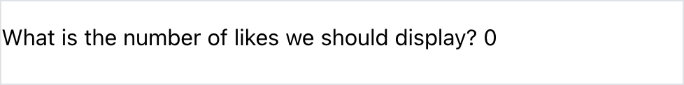

# Using State

<iframe src="https://adaacademy.hosted.panopto.com/Panopto/Pages/Embed.aspx?pid=23e4798e-124e-4b8b-8abd-ad490059026e&autoplay=false&offerviewer=true&showtitle=true&showbrand=false&start=0&interactivity=all" height="405" width="720" style="border: 1px solid #464646;" allowfullscreen allow="autoplay"></iframe>

## Goal

State is a key concept in front-end development, and the React library has a very specific way to manage state. The goal of this lesson is to introduce how to initialize state using React hooks.

## Introduction

`props` introduced a great way to pass data between components. With props, we're able to leverage the container component design pattern.

A container component can hold data. Then, it can pass parts of that data to any contained components.

However, `props` are read-only.

Consider the following front-end features:

- In a weather web app, a button that increases the temperature displayed from 31 to 32
- In a social media app, a button that increases the number of likes on a post from 10 to 11
- In an email app, selecting an email changes the view from an inbox to one email
- In a shopping app, a form that turns red if the input is invalid

All of these example features deal with the state of the front-end presentation:

| Example app      | Example state change                                                      |
| ---------------- | ------------------------------------------------------------------------- |
| Weather app      | The temperature number, going from 31 to 32                               |
| Social media app | The number of likes, going from 10 to 11                                  |
| Email app        | The view shows the inbox, versus the view showing one selected email      |
| Shopping app     | The form color changes based on the input, changing between green and red |

How do we capture the change of the state of our front-end?

## Vocabulary and Synonyms

| Vocab            | Definition                                                                                                                             | How to Use in a Sentence                                                                   |
| ---------------- | -------------------------------------------------------------------------------------------------------------------------------------- | ------------------------------------------------------------------------------------------ |
| "Under the hood" | An expression that means "the underlying implementation of something." The phrase refers to the mechanics of a car under the car hood. | "To find out how JavaScript implements `Array.sort()`, we'll need to look under the hood." |

## React Treats State Specially Because of Re-Rendering

Typically, in OOP programming, when we talk about state, we talk about how classes hold state and behavior. For example, an instance of a class `Customer` could contain a piece of state, `name`.

In those situations, we kept a class's state in its _instance variables_.

Will we represent the state of our front-end React layer in something similar? Are there "instance variables" for us to use in our React components?

We can't, because of how React renders components!

React is known for rendering UI really quickly! Under the hood, React achieves its speed by detecting changes in state, and re-rendering only those components that depend on that state.

Therefore, in order to hold, manage, and use state, we need to use React conventions.

## State is About Changing the UI

Whenever we introduce state in a component, we will need two things:

1. a variable to hold that piece of state
1. a way to update that piece of state

For example, let's imagine a `CollapsibleForm` component. This component needs to manage if the form is collapsed or expanded. For this piece of state, we need:

1. a variable such as `isCollapsed`, which can hold `true` or `false`
1. a way to update `isCollapsed`

## The `useState` Hook Generates a Variable and Update Function

The React library provides a number of built-in _hooks_. **React hooks** are functions that provide different features by cleverly _hooking into_ the under-the-hood React component lifecycle.

### !callout-info

## Hooks in General Programming

The "hooks" in "React hooks" refer to [hooks](https://en.wikipedia.org/wiki/Hooking) in general programming. However, React hooks are very specific. We can read more about them starting with [the official React hooks documentation](https://reactjs.org/docs/hooks-intro.html).

### !end-callout

The most common React hook we will use is the `useState` hook. It gives us the ability to manage and maintain state.

`useState` is a function. It returns an _array_ of two things.

1. In index `0` of the returned array, there is a _variable_ that references the piece of state we're managing
1. In index `1`, there is a _reference to a function_ for updating that piece of state

`useState` also takes a single argument.

1. The value used to initialize the piece of state, used _only the first_ time the component instance is rendered. This will become important when we look at updating our state value later.

Consider this code for an `App` component to prove that this is what `useState` does:

<!-- prettier-ignore-start -->
```js
import { useState } from 'react';

function App() {
  const resultFromUseStateHook = useState('initial value of a piece of state');

  console.log('A reference to the piece of state:', resultFromUseStateHook[0]);
  console.log('A function to update this piece of state:', resultFromUseStateHook[1]);
}

export default App;
```
<!-- prettier-ignore-end -->

Our browser console logs this. (This may differ slightly, depending on the browser of our choice.)

```
A reference to the piece of state: initial value of a piece of state
A function to update this piece of state: function dispatchAction()
```

Again, we can conclude that the `useState` hook returns an array of two items: a reference to some state, and a reference to a function to update that state.

### Using `useState`

The conventional way to use `useState` is to take advantage of _destructuring assignment_.

For every piece of state we want a component to have, we need to call `useState`:

<!-- prettier-ignore-start -->
```js
import { useState } from 'react';

function App() {
    const [pieceOfState, setPieceOfState] = useState('Initial value for pieceOfState.');
}

export default App;
```
<!-- prettier-ignore-end -->

<!-- available callout types: info, success, warning, danger, secondary, star  -->
### !callout-warning

## Ignore ESLint errors in snippets

If we drop some of the code samples in this section into a fresh Vite-created React application, we'll see errors underlining the destructured variables. The default ESLint rules used by Vite report errors for unused variables, and in these brief examples not all of the variables are used. It's safe to ignore those errors when they appear in sample code, but we should be sure to fix them in real application code.

### !end-callout

| <div style="min-width:200px;"> Piece of Code </div> | Notes                                                                                                                                                                                                                   |
| --------------------------------------------------- | ----------------------------------------------------------------------------------------------------------------------------------------------------------------------------------------------------------------------- |
| `import { useState } from 'react';`                 | In order to use `useState`, our code must import `useState` from React. This syntax uses object destructuring.                                                                                                          |
| `const [..., ...] =`                                | This is the syntax for array [destructuring assignment](https://developer.mozilla.org/en-US/docs/Web/JavaScript/Reference/Operators/Destructuring_assignment). This single line of code will assign a value to two variables. |
| `pieceOfState`                                      | **Replace this** with a name for the piece of state we are managing. Examples include `isCollapsed` or `likesCount`.                                                                                                    |
| `setPieceOfState`                                   | **Replace this** with a name for `pieceOfState`'s update function. Conventionally, this is named "`set<piece of state>`". Examples include `setIsCollapsed` or `setLikesCount`.                                         |
| `useState(...);`                                    | We invoke `useState`. This function takes in one argument: an initial value for the piece of state. This value is used _only the first_ time the component renders.                                                                                                                      |
| `'Initial value for pieceOfState.'`                 | **Replace this** with an initial value for `pieceOfState`. This can be a string, boolean, number, object, etc.                                                                                                          |

### Example: `useState`

Imagine a social media web app that has a list of posts. Each `Post` component needs to display the number of likes it has.

<!-- prettier-ignore-start -->
```js
import { useState } from 'react';

const Post = () => {
    const [likesCount, setLikesCount] = useState(0);

    return (
        <section>
            <p>What is the number of likes we should display? {likesCount}</p>
        </section>
    );
};

export default Post;
```
<!-- prettier-ignore-end -->

In this code, we use `likesCount` inside our returned JSX. We can read `likesCount` just like any other variable.

When we render one `Post` component, we see this text:

```
What is the number of likes we should display? 0
```

  
_Fig. The `Post` component can use its state like any other variable_

## Check for Understanding

<!-- Question 1 -->
<!-- prettier-ignore-start -->
### !challenge
* type: checkbox
* id: c4cdfdb0
* title: Using State
##### !question

Which of the following options are examples of state in React components?

##### !end-question
##### !options

* The URL to make a request to an API
* The connection string to a database
* The status of a form that is disabled from user input
* The animation of a loading screen that can play or stop
* The amount that a progress bar is filled when sending an email
* The number on a shopping cart icon

##### !end-options
##### !answer

* The status of a form that is disabled from user input
* The animation of a loading screen that can play or stop
* The amount that a progress bar is filled when sending an email
* The number on a shopping cart icon

##### !end-answer
##### !explanation

Pieces of state in a React component should be things that would change how a component renders.

##### !end-explanation
### !end-challenge
<!-- prettier-ignore-end -->

### !callout-info

## State Management With React Hooks vs. Classes

Before 2018, React managed state using classes, a state object, and lifecycle methods. We may see a lot of existing documentation, tutorials, and resources that manage state using classes.

<br/>

This lesson teaches managing state using React hooks. Both are valid ways to manage state. Using React hooks is considered better practice because this method is designed to improve our long-term ability to create independent, clean components. If we're curious, we can [read more about the motivation to use hooks in the official React docs](https://reactjs.org/docs/hooks-intro.html#motivation) anytime.

### !end-callout
