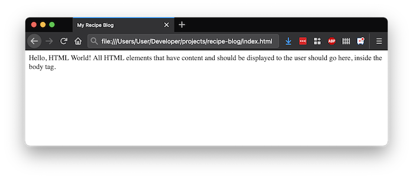
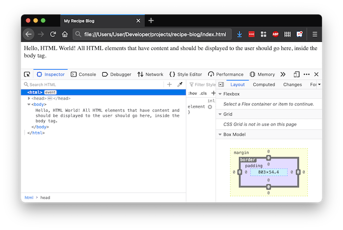

# HTML Walk-through

## Format

This lesson is meant to serve as a walk-through. It will cover:

1. Setting up the website project directory
1. Adding content using HTML
1. Verifying how the website looks like in the browser
1. Modifying content and HTML

We can practice the patterns of web development using this walk-through.

## Introduction

Our team is building a recipe blog. We're assigned the task to structure a recipe into HTML. We'll focus on rapid development, managing our HTML code and the browser at the same time, and experimenting with different HTML tags.

## Create the Project Directory

Websites with multiple files should be organized all within one project folder.

Let's create a folder named `recipe-blog`.

```bash
$ mkdir recipe-blog
```

## Create an `index.html` File

Inside this folder, create a file named `index.html` in the project root.

```bash
$ cd recipe-blog
$ touch index.html
```

Copy/paste this code into `index.html` to get us started, and save.

```html
<html>
  <head>
    <meta charset="UTF-8" />
    <title>My Recipe Blog</title>
  </head>
  <body>
    Hello, HTML World! All HTML elements that have content and should be
    displayed to the user should go here, inside the body tag.
  </body>
</html>
```

## Open the Site in the Browser

Let's see our rendered website by opening this file in a web browser!

We can do this by either:

1. Using Finder or any file explorer, find the file and clicking it
1. Using the command `$ open index.html`



It's our rendered HTML!

## Verify With Dev Tools

We could even take this moment to open Dev Tools and inspect the rendered HTML.



We can adjust our windows so we can focus on the HTML. The HTML should look familiar!

## Modify Our Content

Let's add some more content. We're building the recipe for chicken noodle soup.

Replace the content in the `<body>` tag with:

- A header that says "Chicken Noodle Soup"
- A description of the dish with this text:

> Chicken soup is a soup made from chicken, simmered in water, usually with various other ingredients. The classic chicken soup consists of a clear chicken broth, often with pieces of chicken or vegetables; common additions are pasta, noodles, dumplings, or grains such as rice and barley. Chicken soup has acquired the reputation of a folk remedy for colds and influenza, and in many countries is considered a comfort food.

<!-- prettier-ignore-start -->
### !challenge
* type: paragraph
* id: wQSCFy
* title: HTML Walk-through
##### !question

Copy and paste the entire contents of your `index.html` file here!

##### !end-question
##### !explanation

An example of a working site that meets the requirements is:

```html
<html>

<head>
    <meta charset="UTF-8" />
    <title>My Recipe Blog</title>
</head>

<body>
    <section>
        <h1>Chicken Noodle Soup</h1>
        <p>
            Chicken soup is a soup made from chicken, simmered in water, usually with various other ingredients. The classic chicken soup consists of a clear chicken broth, often with pieces of chicken or vegetables; common additions are pasta, noodles, dumplings, or grains such as rice and barley. Chicken soup has acquired the reputation of a folk remedy for colds and influenza, and in many countries is considered a comfort food.
        </p>
    </section>
</body>

</html>
```

##### !end-explanation
### !end-challenge
<!-- prettier-ignore-end -->

### !callout-info

## Default Styles Affecting Chicken Noodle Soup

Many browsers give a default style to `<h1>` elements and make their font size bigger and bolder.

### !end-callout

## Verify Our Changes

Let's return to our browser that has our website opened.

Our chicken noodle soup changes haven't shown up yet. Until we have different tools at hand, every time we want to see our updated HTML, we'll need to refresh the page.

Use `cmd + r` to refresh the page.

## Add More Content

Let's add in more content!

Take some time to structure this content into semantic HTML.

> Directions:
> Bring stock to boil for 2 minutes in a large, non-reactive stockpot with lid on, over high heat. Add onion, celery, and garlic. Lower heat and simmer for 2 minutes. Add noodles and cook 5 more minutes. Remove from heat and add herbs and salt and pepper, to taste. Serve with lemon halves and add squeeze of lemon juice if desired.

> Ingredients:
> 4 cups chicken stock, homemade or store-bought; 3/4 cup diced onion; 3/4 cup dice celery; 1 tablespoon minced garlic; 2 ounces dried egg noodles, cooked to al dente; 1/2 teaspoon finely chopped fresh tarragon leaves; 2 teaspoons finely chopped fresh parsley leaves; Lemon halves, for serving

## Verify Again

Refresh your browser again. Did you see what you expected to see?

Confirm that the browser's rendered HTML matches the HTML you wrote using Dev Tools.

<!-- prettier-ignore-start -->
### !challenge
* type: paragraph
* id: 1JNIP7
* title: HTML Walk-through
##### !question

Copy and paste the entire contents of your `index.html` file here!

##### !end-question
##### !explanation

An example of a working site that meets the requirements is:

```html
<html>

<head>
    <meta charset="UTF-8" />
    <title>My Recipe Blog</title>
</head>

<body>
    <section>
        <h1>Chicken Noodle Soup</h1>
        <p>
            Chicken soup is a soup made from chicken, simmered in water, usually with various other ingredients. The classic chicken soup consists of a clear chicken broth, often with pieces of chicken or vegetables; common additions are pasta, noodles, dumplings, or grains such as rice and barley. Chicken soup has acquired the reputation of a folk remedy for colds and influenza, and in many countries is considered a comfort food.
        </p>
    </section>
    <section>
        <h2>Ingredients</h2>

        <ul>
            <li>4 cups chicken stock, homemade or store-bought 3/4 cup diced onion</li>
            <li>3/4 cup dice celery</li>
            <li>1 tablespoon minced garlic</li>
            <li>2 ounces dried egg noodles, cooked to al dente</li>
            <li>1/2 teaspoon finely chopped fresh tarragon leaves</li>
            <li>2 teaspoons finely chopped fresh parsley leaves</li>
            <li>Lemon halves, for serving</li>
        </ul>
    </section>
    <section>
        <h2>Directions</h2>

        <ol>
            <li>Bring stock to boil for 2 minutes in a large, non-reactive stockpot with lid on, over high heat</li>
            <li>Add onion, celery, and garlic</li>
            <li>Lower heat and simmer for 2 minutes</li>
            <li>Add noodles and cook 5 more minutes</li>
            <li>Remove from heat and add herbs and salt and pepper, to taste</li>
            <li>Serve with lemon halves and add squeeze of lemon juice if desired.</li>
        </ol>
    </section>
</body>

</html>
```
##### !end-explanation
### !end-challenge
<!-- prettier-ignore-end -->
