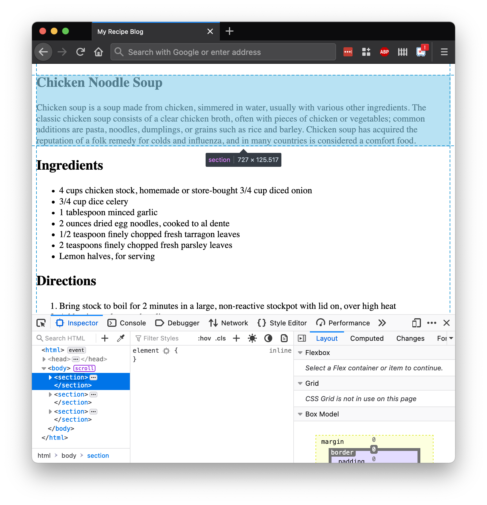
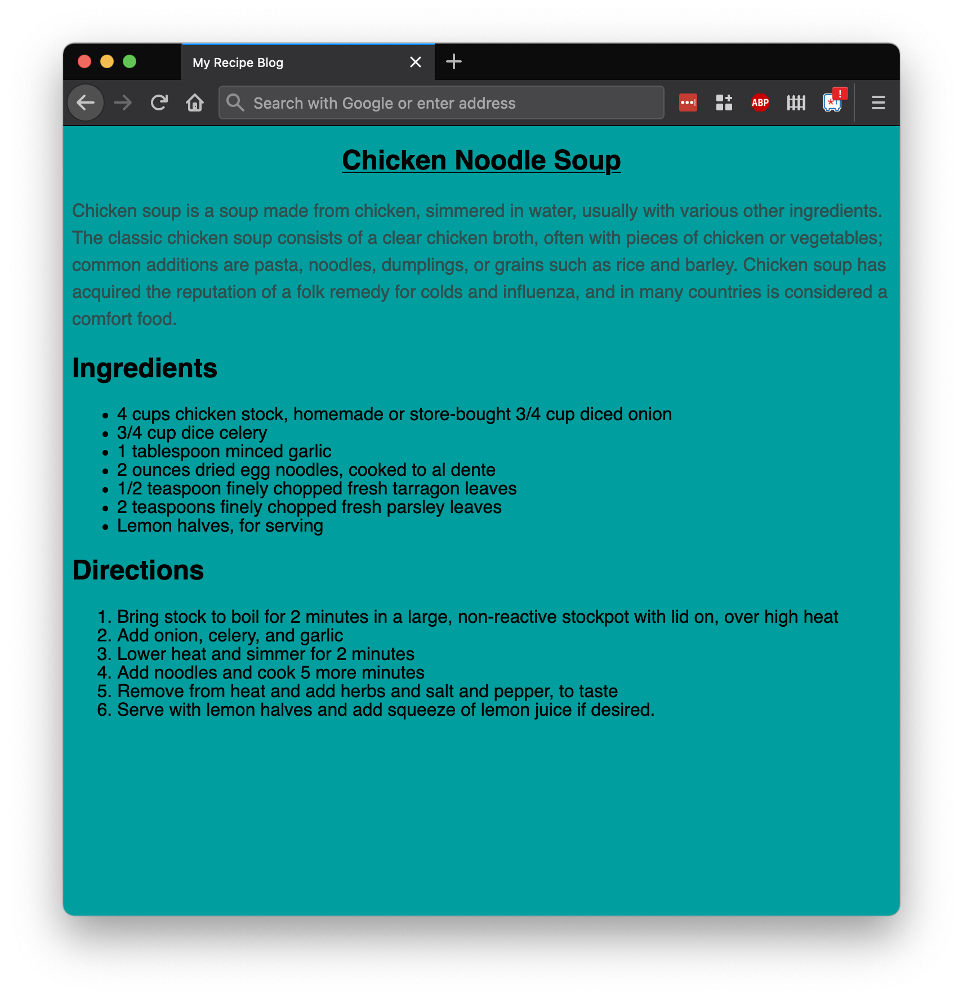
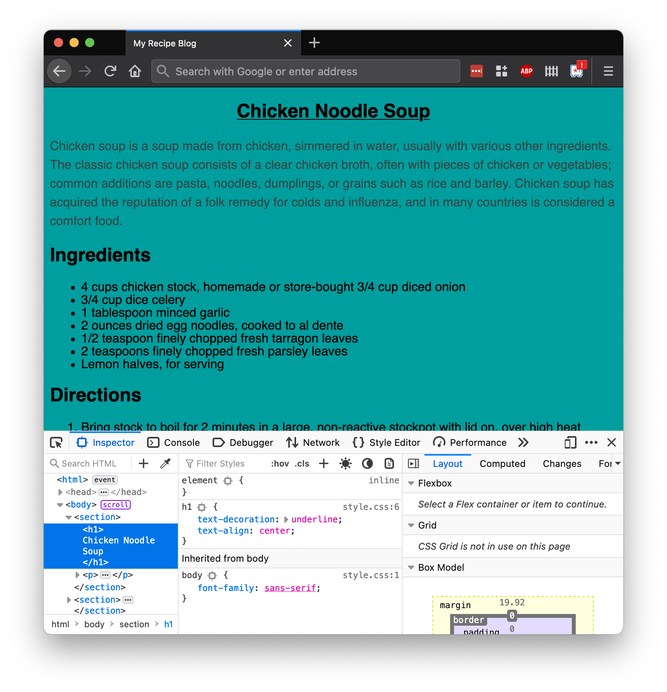
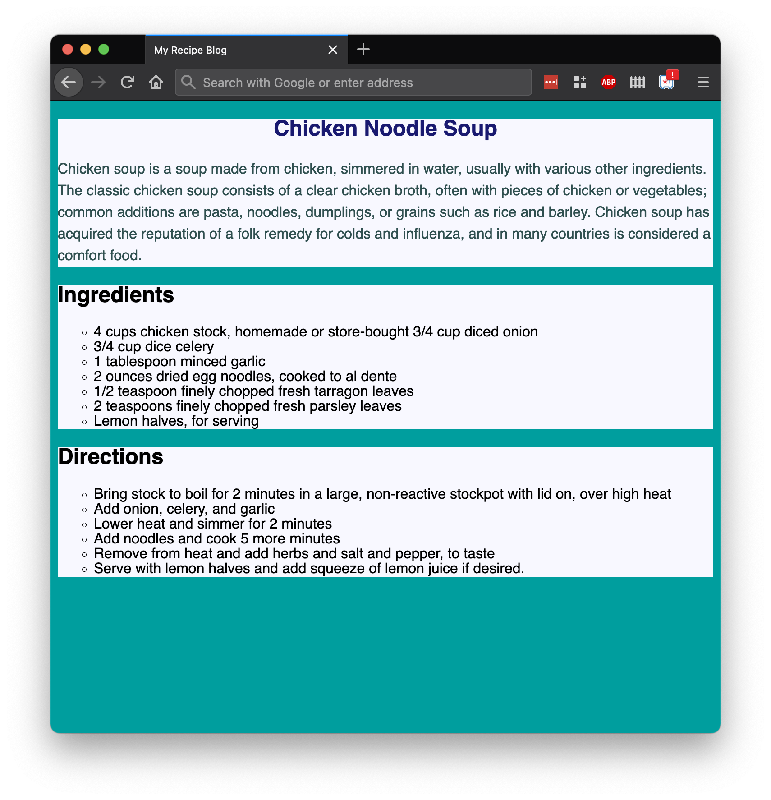
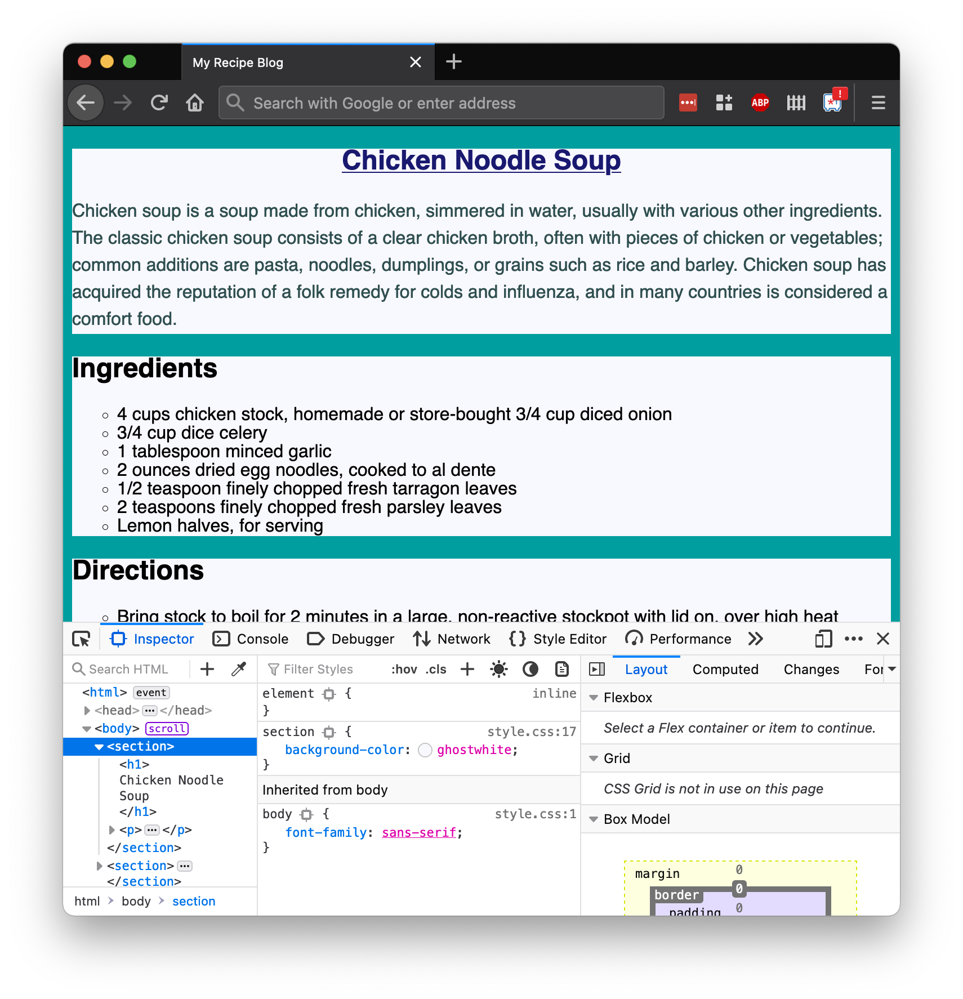

# CSS Walk-through

## Format

This lesson is meant to serve as a walk-through. It will cover:

1. Establishing a website project directory with an `index.html` file
1. Creating a CSS stylesheet
1. Connecting our CSS and HTML files
1. Verifying that our files are connected
1. Modifying our styles

This loop of checking CSS, our HTML, and the browser will drive a lot of our web development and styling.

## Project Directory and `index.html` Content

Our goal is to style one page of a recipe blog.

If you don't already have a similar project, create a folder named `recipe-blog` and an HTML file inside it named `index.html`.

<br/>

<details style="max-width: 700px; margin: auto;">

<summary>
    🥣✨ Copy/paste this content into index.html so we can focus on presentation and styling! 🥣✨
</summary>


```html
<html>

<head>
    <meta charset="UTF-8" />
    <title>My Recipe Blog</title>
</head>

<body>
    <section>
        <h1>Chicken Noodle Soup</h1>
        <p>
            Chicken soup is a soup made from chicken, simmered in water, usually with various other ingredients. The classic chicken soup consists of a clear chicken broth, often with pieces of chicken or vegetables; common additions are pasta, noodles, dumplings, or grains such as rice and barley. Chicken soup has acquired the reputation of a folk remedy for colds and influenza, and in many countries is considered a comfort food.
        </p>
    </section>
    <section>
        <h2>Ingredients</h2>

        <ul>
            <li>4 cups chicken stock, homemade or store-bought 3/4 cup diced onion</li>
            <li>3/4 cup dice celery</li>
            <li>1 tablespoon minced garlic</li>
            <li>2 ounces dried egg noodles, cooked to al dente</li>
            <li>1/2 teaspoon finely chopped fresh tarragon leaves</li>
            <li>2 teaspoons finely chopped fresh parsley leaves</li>
            <li>Lemon halves, for serving</li>
        </ul>
    </section>
    <section>
        <h2>Directions</h2>

        <ol>
            <li>Bring stock to boil for 2 minutes in a large, non-reactive stockpot with lid on, over high heat</li>
            <li>Add onion, celery, and garlic</li>
            <li>Lower heat and simmer for 2 minutes</li>
            <li>Add noodles and cook 5 more minutes</li>
            <li>Remove from heat and add herbs and salt and pepper, to taste</li>
            <li>Serve with lemon halves and add squeeze of lemon juice if desired.</li>
        </ol>
    </section>
</body>

</html>
```

</details>

## Create a Sub-Folder for Styles

A common pattern for organizing stylesheets is to create a sub-folder in our project named `styles`.

Create this folder:

```bash
$ mkdir styles
```

## Create a `styles.css` File

Create a stylesheet named `style.css`:

```bash
$ touch styles/style.css
```

Let's add in these CSS rule-sets:

```css
body {
    font-family: sans-serif;
    background-color: #009e9e;
}

h1 {
    text-decoration: underline;
    text-align: center;
}

p {
    line-height: 150%;
    color: darkslategrey;
}
```

## Verify the Styles Aren't Applied Yet

Even though we've filled in a stylesheet with CSS, we won't see our styles applied to our HTML yet.

Let's confirm that by opening our web page in our browser:

```bash
$ open index.html
```

We can even use our Dev Tools to begin looking at CSS. When we open Dev tools and inspect a specific element, we can see all CSS declarations that apply to this element.



We don't see any of our own CSS in here!

## Link Our Stylesheet in Our HTML

In order for our HTML file to retrieve the stylesheet, we need to add the `<link>` tag into our `<head>` element.

Add this line to your HTML (and mind proper indentation):

```html
<link href="styles/style.css" rel="stylesheet">
```

The order of the elements doesn't matter in this case-- it can go above, below, or between the existing `<meta>` and `<title>` elements, as long as it's within `<head>`!

Our resulting HTML's `<head>` element may look like this:

```html
<head>
    <meta charset="UTF-8" />
    <title>My Recipe Blog</title>
    <link href="styles/style.css" rel="stylesheet">
</head>
```

## Verify Our Styles Are Applied

Whenever there are updates in our HTML or CSS files that we want to see, we'll need to refresh the browser. Let's refresh the browser now!

Hooray! 🎉 Hopefully we see some ✨ styled elements ✨.



We can even open up Dev Tools! When we inspect an element that has CSS applied, our Dev Tools will list all the CSS rule-sets that apply to it.



If we don't see all of our styles, we can check:

- Our CSS has valid syntax
- Our HTML has the correct relative path to the stylesheet
- Our HTML has the elements that our CSS selects
- Our peers, TAs, and instructors!

## Extend Our Styles

Let's add a few more styles! 

Adjust the HTML and CSS to meet these requirements. Use research to determine which CSS properties are necessary.

- All `<h1>` text is `midnightblue`
- All sections have a background color of `ghostwhite`
- All lists have a list style type of `circle`

Our resulting website likely looks like this:



Let's take a moment to appreciate the CSS through the browser Dev Tools, too.



## Check for Understanding

<!-- Question 1 -->
<!-- prettier-ignore-start -->
### !challenge
* type: tasklist
* id: 17371044
* title: CSS Walk-through
##### !question

Check off all the topics that we've briefly touched on so far.

##### !end-question
##### !options

* Create a project directory with `index.html` and `styles/style.css`
* Added CSS rule-sets to our `styles/style.css` file
* Connect our HTML and CSS files by adding a `<link>` tag to the HTML
* Confirmed our styles were applied to `index.html`
* Added more CSS rule-sets

##### !end-options
### !end-challenge
<!-- prettier-ignore-end -->
