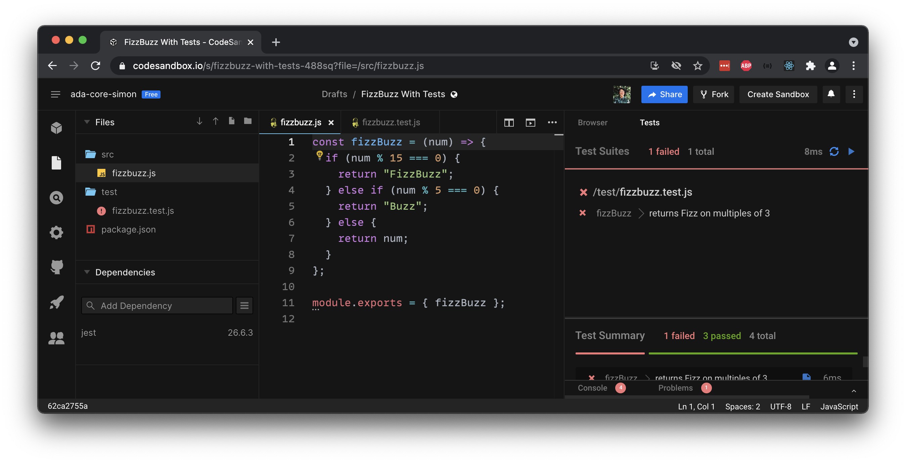
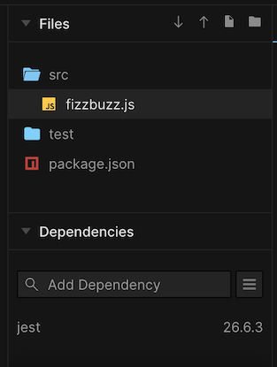
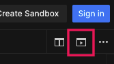

# Reading Tests

<iframe src="https://adaacademy.hosted.panopto.com/Panopto/Pages/Embed.aspx?pid=a19d9f9a-71d3-4893-9319-ad410038b93e&autoplay=false&offerviewer=true&showtitle=true&showbrand=false&start=0&interactivity=all" height="405" width="720" style="border: 1px solid #464646;" allowfullscreen allow="autoplay"></iframe>

## Goal

Unit testing concepts apply across programming languages! Everything we've learned about unit testing principles continues to hold true.

- Unit tests are responsible for verifying the correctness of our code, usually on a detailed level such as how a function behaves
- We regularly run unit tests as we code
- When using tests to guide our development work, we use failing test messages to determine how to move forward and pass the test
- The steps in a test can be described as:
  - Arrange
  - Act
  - Assert

When it comes to learning about testing in another programming language, we won't have a lot of new concepts!

This lets us focus on how we manage our transition into learning the syntax of another testing framework. Our goal for this lesson is to:

- Apply our understanding about unit tests in other languages to testing in JavaScript
- Practice reading code, such that we can jump into a new library
- Learn the syntax of Jest tests

## Introduction: Jest

There are _many_ JavaScript testing frameworks out there. To name a few:

- Mocha
- Jest
- Jasmine
- Protractor
- Karma
- Selenium

They all differ in testing philosophy, strengths, responsibilities, and context.

[Jest](https://jestjs.io/) is a popular JavaScript testing framework whose strength is its compatibility with many project-types and its lightweight setup.

This curriculum focuses on Jest additionally because:

- It is widely adopted in modern JavaScript projects
- It is built into several online editors, including [Replit.com](https://replit.com), which we have used before, as well as [CodeSandbox](https://codesandbox.io), which we'll explore a bit in this lesson.
- It is the default testing framework for the popular JavaScript library, React

## Vocabulary and Synonyms

| Vocab      | Definition                                                                                                                                                           | Synonyms                   | How to Use in a Sentence                                                                                                                                                                                                                                                                |
| ---------- | -------------------------------------------------------------------------------------------------------------------------------------------------------------------- | -------------------------- | --------------------------------------------------------------------------------------------------------------------------------------------------------------------------------------------------------------------------------------------------------------------------------------- |
| Test suite | A collection of tests that are typically validating a common feature, or should be run together. One test suite can contain many tests and setup or breakdown steps. | Collection of tests, tests | "Let's look at that test suite together, it has 29 passing tests and 18 failing tests," "I have two different test suites: one for my back-end, and one for my front-end," "Let's run that `edit-book-endpoint` test suite and see what tests are failing around the edit book feature" |

## Running JavaScript Tests

When we run JavaScript programs, including running test suites, we need to consider which runtime environment to use.

For this portion of the curriculum, we will run tests using:

- Replit.com
- Learn code challenges on this curriculum platform

When we have bigger projects with different environments, such as React JS projects, we will run tests on our local machines. As we get increasingly comfortable with Jest, we may even start writing our own tests. For now, we can focus on reading tests and building our skills to pass them.

## Reading Tests Without Learning Syntax

Leila is jumping into a JavaScript project. They're pairing with another developer, Nadia, who has been working on implementing FizzBuzz.

Nadia has already set up the tests for FizzBuzz. Leila wants to jump into coding, but they need to take a moment to read through the tests.

What can Leila determine from reading tests in a syntax they don't know? Let's read through one test and make predictions.

This is in a file named `test/fizzbuzz.test.js`

<!-- prettier-ignore-start -->
```js
describe('fizzBuzz', () => {
  test('returns Fizz on multiples of 3', () => {
    // Arrange
    const num = 9;

    // Act
    const result = fizzBuzz(num);

    // Assert
    expect(result).toEqual('Fizz');
  });
});
```
<!-- prettier-ignore-end -->

### The File Itself

First, Leila can quickly orient themself with the file name and where it's located. It seems like there is a `test` directory, and a file named `fizzbuzz.test.js` in it.

From this evidence, they can at least hypothesize this:

- This file is dedicated to validating the correctness of the `fizzBuzz` function
- It's unlikely that the `fizzBuzz` implementation is in this file, or even this folder

### !callout-info

## Confidently Make Hypotheses

As Leila works through this, they will need to make a lot of assumptions. Leila can take the time to fact-check all of their assumptions, which is a completely valid thing to do (and typically a good strategy for life). However, in this situation, Leila can _also_ confidently rely on their skills, intuition, context, and help from others to make theories about what's going on.

<br/>

"Maybe the `test` folder only holds test files, and we have a `.test.js` file for each function."

<br/>

Making theories like this will help Leila move forward in their learning. It will also help them correct themself and their working knowledge more easily!

### !end-callout

### Hypothesizing About `describe`

Let's look at the block of code that begins on the first line, and closes on the last line.

<!-- prettier-ignore-start -->
```js
describe('fizzBuzz', () => {
  // ...
});
```
<!-- prettier-ignore-end -->

Even though we don't know what `describe` means here, we can see that its syntax looks similar to a function call with two arguments:

<!-- prettier-ignore-start -->
```js
describe( ..., ...
);
```
<!-- prettier-ignore-end -->

We can also see that the first argument is the string literal `'fizzBuzz'`.

When Leila sees this, Leila questions, "What is this string literal used for?"

After scanning through the rest of the test code, they don't see any obvious place where this string literal is being used, so they set that question aside for the moment.

The second argument seems to be a large, anonymous arrow function with zero parameters, which contains even more unfamiliar syntax.

<!-- prettier-ignore-start -->
```js
() => {
    // ...
}
```
<!-- prettier-ignore-end -->

Let's approach the contents of this function piece-by-piece.

### Hypothesizing About `test`

Inside the anonymous function started in `describe`, there is a block of code that begins with `test()`.

<!-- prettier-ignore-start -->
```js
  test('returns Fizz on multiples of 3', () => {
    // ...
  });
```
<!-- prettier-ignore-end -->

This is also a function being invoked. This `test` function seems to take in two arguments, the string literal `'returns Fizz on multiples of 3'` and an anonymous arrow function.

Leila notices that this pattern feels very similar to the `describe` block. 🤔 They should keep that observation, because it's a good one!

### Arrange

Inside the next anonymous arrow function, we see the following code:

<!-- prettier-ignore-start -->
```js
    // Arrange
    const num = 9;
```
<!-- prettier-ignore-end -->

It's a comment indicating an "Arrange" step and a `const` variable `num` assigned to the number `9`.

Leila usually likes to deeply investigate any new concepts they encounter, and they could dig deeper into what this line means. However, this time, they decide to move on with the following hypothesis: the variable `num` will be used later in the test.

### Act

We can move on to reading the next set of lines:

<!-- prettier-ignore-start -->
```js
    // Act
    const result = fizzBuzz(num);
```
<!-- prettier-ignore-end -->

Leila recognizes this as the "Act" step in a test, where the behavior we're testing (a `fizzBuzz` function) should be "acted on," or invoked.

Here, we are invoking `fizzBuzz`, passing in `num`, and saving the return value into a `const` variable named `result`.

### Assert

Let's dive into the final line, which features some more unfamiliar syntax.

<!-- prettier-ignore-start -->
```js
    // Assert
    expect(result).toEqual('Fizz');
```
<!-- prettier-ignore-end -->

Leila knows that the assert step is the step that determines whether a test passes or fails.

They've seen the `test` block include the string "returns Fizz on multiples of 3," which Leila suspects is relevant to the Assert step of this test.

Reading the line from left-to-right, it seems like `expect(result)` is also a function call. The function's name is `expect` and we're passing in `result`.

However, the line doesn't stop there. Leila sees `.toEqual('Fizz')`. Recalling other JavaScript syntax, Leila suspects that this is a function call, where the function is named `toEqual` and the argument is `'Fizz'`.

It looks like this function call operates on an object. That object must be whatever is returned from the call to `expect(result)`. Leila doesn't know exactly what this object is, but they can tell that it must have a method called `toEqual`!

### Reading It Out Loud

Leila can now take a step back and read this line overall. They notice a sentence formed by the code: "Expect the value of `result` to equal `'Fizz'`."

The test will pass if `result`'s value is `'Fizz'`, and fail if it isn't.

### !callout-info

## Is It Safe to Jump to this Conclusion?

It may seem reckless to try reading this code as a sentence rather than code. After all, JavaScript doesn't know what any of these words mean, and it definitely doesn't know what a sentence is!

<br />

But we should remember that this test library was written by _people_ for other _people_ to use. They want their code to be understandable, and so they wrote it so that it makes intuitive sense, even before we have a deep technical understanding. We should attempt to write our own code in such an understandable style too!

### !end-callout

## Multiple Tests in One Describe Block

Leila really wants to get coding, but they just can't catch a break! After reading through the first test, Nadia presses Leila to continue with the next test.

Leila is disappointed, but then they realize they might be able to use this opportunity to validate or disprove some of their theories.

<!-- prettier-ignore-start -->
```js
describe('fizzBuzz', () => {
  test('returns Fizz on multiples of 3', () => {
    // Arrange
    const num = 9;

    // Act
    const result = fizzBuzz(num);

    // Assert
    expect(result).toEqual('Fizz');
  });

  test('returns Buzz on multiples of 5', () => {
    expect(fizzBuzz(25)).toEqual('Buzz');
  });
});
```
<!-- prettier-ignore-end -->

The first thing Leila notices is that the next test is a second `test` block, located in the same `describe` block.

This `test` block seems to be, ultimately, a function call: `test(..., ...);`

### First Argument of `test`

Leila sees that the first argument is another string literal, `'returns Buzz on multiples of 5'`. Now, Leila can draw a comparison to the other test, which passed in `'returns Fizz on multiples of 3'`.

Leila lets themself feel a little more confident in hypothesizing. They hypothesize that the first argument is a string that describes the intent of the test.

### Second Argument of `test`

Now, what's left for Leila to consider is the anonymous function.

<!-- prettier-ignore-start -->
```js
() => {
    expect(fizzBuzz(25)).toEqual('Buzz');
}
```
<!-- prettier-ignore-end -->

Drawing also from the first unit test, Leila concludes:

1. This assert step begins with calling `expect(...)` and passing in a value.
   - In the first test, the value was `result`, which was assigned the result of `fizzBuzz(9)`
   - In this second test, the value is the result of calling `fizzBuzz(25)`
1. The line continues, chaining on `.toEqual(...)`
   - In the first test, the argument was `'Fizz'`
   - In this second test, the argument is `'Buzz'`

To summarize, this second test expects the value of `fizzBuzz(25)` to equal `'Buzz'`.

## Example on CodeSandbox.io

We can run a version of this test suite on [this CodeSandbox project](https://codesandbox.io/s/fizzbuzz-with-tests-488sq?file=/test/fizzbuzz.test.js).

CodeSandbox.io is a platform for creating projects. We'll use this platform to read, write, and run our FizzBuzz unit tests.

### !callout-info

## CodeSandbox Is the Same, but Different

CodeSandbox provides an environment for editing code, just like Replit.com or even VS Code do. We should spend a few minutes looking around to identify where we can find some of the common features in any IDE. Some areas to keep an eye out for include:
- a list of files in the project
- a file editor view
- search tools
- output views
- configuration settings

<br />

We should feel comfortable exploring this environment until we feel like we have a general idea of where our main project areas are.

### !end-callout

These projects need to be configured to use the Jest package. Let's purposely skip over those details in order to focus on the tests. The tests in [this CodeSandbox project](https://codesandbox.io/s/fizzbuzz-with-tests-488sq?file=/test/fizzbuzz.test.js) are already set up.

  
_Fig. CodeSandbox UI that shows the overall structure of the FizzBuzz project_

This project has the following files:

| <div style="min-width:230px;">File</div> | Description                                                                                                                                                                                                                            |
| ---------------------------------------- | -------------------------------------------------------------------------------------------------------------------------------------------------------------------------------------------------------------------------------------- |
| `package.json`                           | Used by [Node JS](https://nodejs.dev/) projects. Determines project details, such as project dependencies. Because we are not focusing on configuration, we will use this file to list our one project dependency, the `jest` package. |
| `src/fizzbuzz.js`                        | The source file where we define our `fizzBuzz` function.                                                                                                                                                                               |
| `test/fizzbuzz.test.js`                  | The test file where we define our `fizzBuzz` unit tests.                                                                                                                                                                               |

We can navigate between files using the left-hand navigation menu, under the header "Files."

We may want to collapse the surrounding sections, such as "Dependencies."

  
_Fig. CodeSandbox UI that highlights the file navigation pane_

To run the tests, we use the preview pane, which automatically appears on the right.

We can toggle the visibility of the preview pane by clicking the icon on the top right.

  
_Fig. CodeSandbox UI that highlights the icon that toggles the preview pane_

When viewing the preview pane, instead of viewing the "Browser," we can view the "Tests."

  
_Fig. CodeSandbox UI that highlights the icon that runs the tests_

On the right side of the top bar, we see a refresh 🔄 icon. Clicking this icon reloads the tests, which is sometimes necessary for CodeSandbox. Next to it, we see a play ▶️ button. Clicking this icon runs the tests.

The tests automatically reload and re-run every time there is a change in the code.

A summary of the test results appears after running the tests. Details are output on the bottom-half.

We should see one failing test.

  
_Fig. CodeSandbox UI that highlights the summary of the test run_

We can use the error messages to figure out where to change our code and get the test to pass!

## Reading Jest Error Messages

Leila and Nadia need to read through the test failure and both get aligned with which test is failing, and how it's failing.

Consider this test failure message for the test "returns Fizz on multiples of 3":

```
expect(received).toEqual(expected) // deep equality

Expected: "Fizz"
Received: 9

   9 |     const result = fizzBuzz(num);
  11 |     // Assert
> 12 |     expect(result).toEqual("Fizz");
  13 |   });
  15 |   test("returns Buzz on multiples of 5", () => {
```

<!-- Markdown wrongly parses `> 12 |` as starting a new table column, so `|` is omitted -->

| <div style="min-width:200px;"> Piece of Output </div> | Notes                                                                                                                                                                                                   |
| ----------------------------------------------------- | ------------------------------------------------------------------------------------------------------------------------------------------------------------------------------------------------------- |
| `expect(received).toEqual(expected)`                  | This line helps us understand what Jest is referring to for the rest of the message. The value of `received` is what we passed into `expect`. The value of `expected` is what we passed into `toEqual`. |
| `Expected: "Fizz"`                                    | This test expected `"Fizz"`, but...                                                                                                                                                                     |
| `Received: 9`                                         | The value the test received is `9`.                                                                                                                                                                     |
| `> 12`                                                | The line that contains the failing assertion is highlighted with a `>`. In this case, the assertion on line 12 is failing.                                                                              |
| ` 13`                                                 | This is a line of code that surrounds the highlighted line, line 12. This line of code shows up to give context about the surrounding code.                                                             |

Without even looking at the test implementation, Leila and Nadia can understand the test failure! They both agree that the test failed because `fizzBuzz()` returned `9`, which is not the expected `"Fizz"`.

If they needed to inspect the test, they would go to line 12 of the test file.

## Check for Understanding

<!-- Question 1 -->
<!-- prettier-ignore-start -->
### !challenge
* type: paragraph
* id: ef5739b0
* title: Reading Tests
##### !question

Using your own words, describe a process or a set of steps to take when reading through unfamiliar tests.

##### !end-question
### !end-challenge
<!-- prettier-ignore-end -->

<!-- Question 2 -->
<!-- prettier-ignore-start -->
### !challenge
* type: paragraph
* id: c3b4ae26
* title: Reading Tests
##### !question

Using your own words, describe one thing that you would watch for while reading unfamiliar tests. This can include:

- Naming vocabulary and identifying functions
- Reading the code too quickly
- Understanding error messages
- Making confident hypotheses
- Attempting to learn everything too perfectly too quickly

##### !end-question
### !end-challenge
<!-- prettier-ignore-end -->

<!-- Question Takeaway -->
<!-- prettier-ignore-start -->
### !challenge
* type: paragraph
* id: 0c5b9845
* title: Reading Tests
##### !question

What was your biggest takeaway from this lesson? Feel free to answer in 1-2 sentences, draw a picture and describe it, or write a poem, an analogy, or a story.

##### !end-question
##### !placeholder

My biggest takeaway from this lesson is...

##### !end-placeholder
### !end-challenge
<!-- prettier-ignore-end -->
