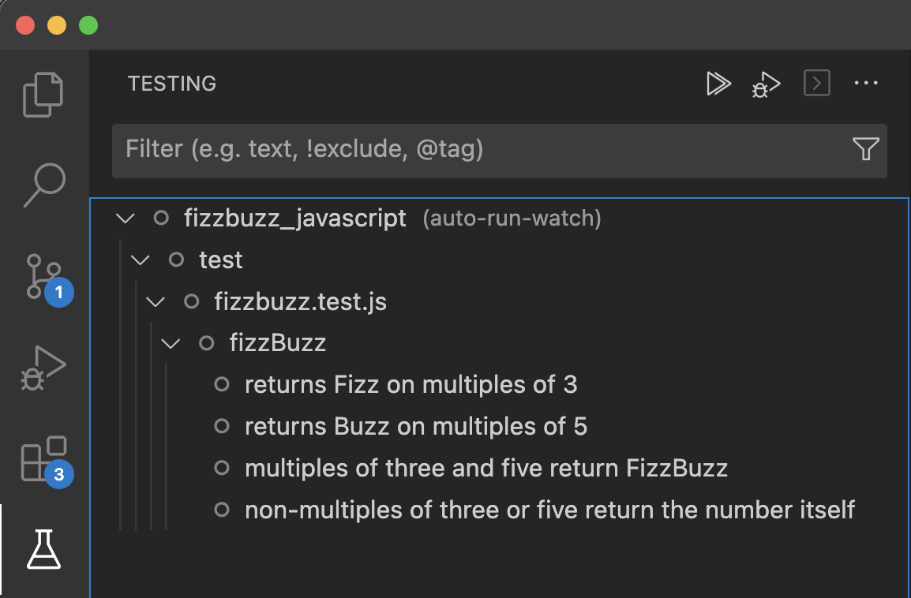

# Testing In Node.js

<iframe src="https://adaacademy.hosted.panopto.com/Panopto/Pages/Embed.aspx?pid=669a9f30-b65b-47ce-b80d-ade101895c32&autoplay=false&offerviewer=true&showtitle=true&showbrand=false&captions=true&interactivity=all" height="405" width="720" style="border: 1px solid #464646;" allowfullscreen allow="autoplay"></iframe>

## Goal

When writing any software, it is important to have confidence in the quality of the code. Tests can help us verify that our code is working as expected.

We have looked at Jest and experimented with tests in CodeSandbox.  However, we have not yet used them in Node.js. In this section, we will learn how to use tests in Node.js and debugging tests with VS Code.

Our goal for this lesson is to:

- Practice using `npm` to install dependencies
- Apply our knowledge of Node.js to examine the `package.json` file
- Use VS Code to examine and debug tests

## Looking at a Sample Node.js Application

Earlier in this lesson, we looked at a [CodeSandbox](https://codesandbox.io/s/fizzbuzz-with-tests-riytqu?file=/test/fizzbuzz.test.js) application testing the `fizzBuzz` function. We will use the same project as a `Node.js` application.  

To follow this lesson, clone the [FizzBuzz-JavaScript](https://github.com/AdaGold/fizzbuzz_javascript) repository. Forking isn't required unless you would like to be able to make changes, then push them up to your own repo.

### Install Dependencies

Examine the `package.json` file.  Under the key `"devDependencies"` we find a list of dependencies for the project.  Most of these are required for getting the tests to run with the modern JavaScript features.

- @babel/core
- @babel/node
- @babel/preset-env

By default Node.js handles importing and exporting JavaScript files using an older approach, but using Babel we can use more modern features of JavaScript.

<!-- available callout types: info, success, warning, danger, secondary, star  -->
### !callout-info

## Babel Enables Modern JavaScript

Don't worry about the details of configuring Babel for now. It's sufficient to know that it's involved with being able to use newer JavaScript features. Any project in the curriculum requiring it will have it already configured in the `package.json` file. As we work more with JavaScript projects on our own, we can learn more about Babel and how to configure it.

### !end-callout

We have also included `jest` as a dependency.  This is our testing framework.

To install these dependencies, we run the following command in the project home directory:

```bash
$ npm install
```

### Inspect the `test/fizzbuzz.test.js` file

Open the `test/fizzbuzz.test.js` file.  This is a simple test file that tests the `fizzBuzz` function.  

<br/>

<details>
<summary>How does the test import the <code>fizzBuzz</code> function?</summary>

The test imports the `fizzBuzz` function with the statement
```js  
import fizzBuzz from '../src/fizzbuzz';
```

</details>

### Running The Tests

Under the `"scripts"` key in the `package.json` file we find a command to run the tests.  This command is `"test"`.

To run the tests in the terminal we use following command:

```bash
$ npm test
```

We should get the following output:

```
 FAIL  test/fizzbuzz.test.js
  fizzBuzz
    ✕ returns Fizz on multiples of 3 (2 ms)
    ✓ returns Buzz on multiples of 5
    ✓ multiples of three and five return FizzBuzz
    ✓ non-multiples of three or five return the number itself (1 ms)

  ● fizzBuzz › returns Fizz on multiples of 3

    expect(received).toEqual(expected) // deep equality

    Expected: "Fizz"
    Received: 9

      12 |
      13 |     // Assert
    > 14 |     expect(result).toEqual('Fizz');
         |                    ^
      15 |   });
      16 |
      17 |   test('returns Buzz on multiples of 5', () => {

      at Object.<anonymous> (test/fizzbuzz.test.js:14:20)

Test Suites: 1 failed, 1 total
Tests:       1 failed, 3 passed, 4 total
Snapshots:   0 total
Time:        0.246 s, estimated 1 s
Ran all test suites.
```

Yay! The tests run!  We are on the **RED** stage of our red-green-refactor cycle.  We will now look at how to inspect and run the tests individually.


## Running Tests in VS Code

Let's open our project in VS Code with the `code .` command (remember to run it in the project root).  Our tests are in the `test` directory. Open the `fizzbuzz.test.js` file and inspect the tests.

Notice that the flask icon does not automatically detect our tests.  


Let's fix this by installing the [Jest Extension for VS Code](https://marketplace.visualstudio.com/items?itemName=Orta.vscode-jest). This will allow us to see the tests by clicking the flask icon in the editor, which switches us to the Testing panel.

After installing the extension, we should now see that the Jest extension has detected our tests, so click the flask icon to switch to the Testing panel.



Just like with Python we can now use VS Code to run our tests and even use breakpoints to inspect and debug the tests.

## Exercise

Try using the debugger to inspect the tests and identify the problem.  Then fix the `fizzBuzz` function so that it returns the correct value.  Lastly run all the tests again to make sure they pass.

## Summary

In this lesson we examined how to install dependencies and run tests in Node.js. We also looked at how to configure VS Code to run and debug tests.
