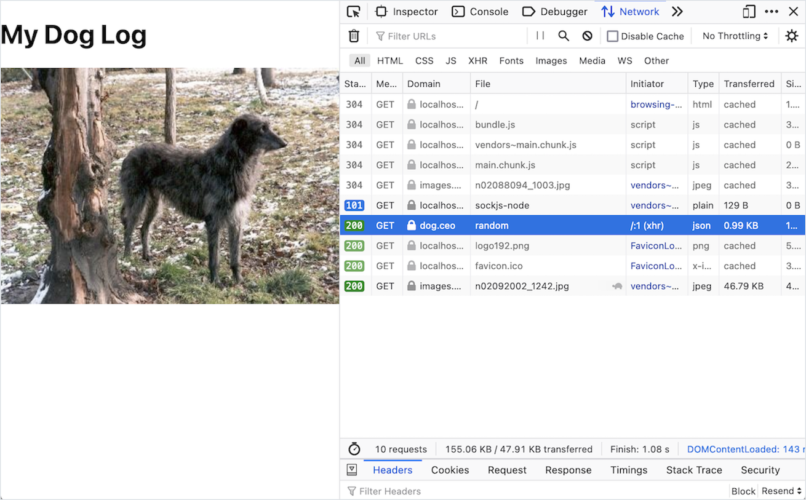

# Calling APIs from Components

## Introduction

Although there are countless variations, in a typical web app, there are three actors:

1. An end-user
1. A front-end layer
1. A back-end layer

In this flow, an end user browses a web app with their web browser, and interacts with a front-end layer. When the web app needs to get or change data, the browser will act as a client, and send an HTTP request to a back-end layer. The back-end layer, typically a web API, will receive this HTTP request.

The back-end layer talks to other services and databases, and forms an HTTP response. It sends this HTTP response to the front-end layer. In the end, the front-end layer presents any new information to the end user.

In order for the front-end layer to fulfill its role in this web app model, our front-end layer needs to send HTTP requests, and handle the HTTP responses!

In our React front-end layer, for each HTTP request we make, we need to determine:

- _When_ does the web app make an HTTP request
  - What component makes the HTTP request?
- _What_ happens when we receive an HTTP response
  - How does the UI change?

Two common situations when we make HTTP requests in a React app are:

1. When a container component mounts (initially renders)
1. When an event is handled, such as a button being clicked, or text field being changed

## Using `axios` in a React Web App

In order to call APIs in React, we can use the [axios package](https://github.com/axios/axios). To add axios into our project, we can run this command:

```bash
$ yarn add axios
```

The first time we run this command, it will modify the `package.json` and `yarn.lock` files. These two files facilitate dependencies (much like a `requirements.txt` in Python projects). Since we just added a dependency to our project, we should expect these two files to change! When these files are updated, we should be sure to commit them to our repository!

Every file that uses axios should be sure to import it:

<!-- prettier-ignore-start -->
```js
import axios from 'axios';
```
<!-- prettier-ignore-end -->

## Calling APIs After Render

Imagine a React app that needs to get a list of student data from an API, or an app that needs to get detailed data about one restaurant from a restaurant API.

In these situations, we should:

1. Determine a container component that is responsible for holding that data
1. Fetch the data when the component is mounted by using `useEffect` and an empty dependency list

Let's consider this example:

<!-- prettier-ignore-start -->
```js
import { useEffect } from 'react';
import axios from 'axios';

const SomeComponent = () => {

  useEffect(() => {
    axios.get('some great url to make an API call to')
      .then((response) => {
        console.log('The data we get back from the HTTP response:', response.data);
      })
      .catch((error) => {
        console.log('Anything that isn\'t status code 2XX is an error:', error.response.status);
        console.log('The data from response with an error:', error.response.data);
      });
  }, []);

  return (<h1>My Perfect Component</h1>);
}
```
<!-- prettier-ignore-end -->

| <div style="min-width:200px;"> Piece of Code </div> | Notes                                                                                                                                                                                      |
| --------------------------------------------------- | ------------------------------------------------------------------------------------------------------------------------------------------------------------------------------------------ |
| `import ...;`                                       | In order to use `useEffect` and `axios` in this file, we need to import them.                                                                                                              |
| `useEffect(..., ...);`                              | Within this component, we call `useEffect`, which has two parameters.                                                                                                                      |
| `() => { ... }`                                     | The first argument we pass into `useEffect` is a function, which by default will execute every time the component mounts or updates.                                                       |
| `axios.get(...)`                                    | When the component renders, we send a GET request with axios.                                                                                                                        |
| `.then(...)`                                        | Following axios patterns, we chain a `then()` call to describe what should happen when an HTTP response of status 2XX comes back.                                                                |
| `(response) => {...}`                               | The argument to `then()` is a function, which expects a parameter `response`. `response` will receive the result from calling `axios.get(...)`, the HTTP response.                                                        |
| `console.log( ... , response.data);`                  | **Replace this** with the logic that should happen after getting a successful HTTP response, including any updates to state. In this example, we are printing the data from the response to the console. |
| `.catch(...)`                                       | Following axios patterns, we chain a `catch()` call to describe how to handle errors and HTTP responses that are outside status 2XX.                                                      |
| `(error) => {...}`                                  | The argument to `catch()` is a function, which expects a parameter `error`. `error` will receive details about the error that occurred.                                                                                                                  |
| `console.log( ... , error.response.data);`                   | **Replace this** with what should happen with errors, including any updates to state. In this example, we're logging data about the error to the console.                                      |
| `[]`                                                | Because we want this API call to happen only when the component mounts, and not when any updates are made, our dependency list is an empty array `[]`.                                     |

### !callout-info

## Prevent `useEffect` From Running After State Updates

The goal of this API call is to call it only _once_, after the component mounts. Therefore, it's important to ensure that our dependency list for `useEffect` is an empty array `[]`.

### !end-callout

### Example: Dog CEO

Belinda is making a small React app for themself, to quickly cheer themself up with a random dog picture whenever they want one. They want to make use of the [Dog CEO API](https://dog.ceo/dog-api/documentation/random).

So far, they have an `App` component. It tracks an `imageUrl` in its state, the initial value of which is the URL to a dog picture. The component renders this image in an `` element.

<!-- prettier-ignore-start -->
```js
import { useState } from 'react';

function App() {
  const [imageUrl, setImageUrl] = useState('https://images.dog.ceo/breeds/hound-afghan/n02088094_1003.jpg');

  return (
    <div>
      <h1>My Dog Log</h1>
      <div>
        
      </div>
    </div>
  );
}
```
<!-- prettier-ignore-end -->

  
_Fig. The default My Dog Log dog image_

### Working With APIs

To use [the Dog CEO API](https://dog.ceo/dog-api/documentation/random) effectively, Belinda outlines the expected HTTP request and HTTP response first.

The HTTP request should be a GET request to `https://dog.ceo/api/breeds/image/random`.

When the HTTP response is successful, from the documentation, they expect the response to look like this JSON:

```json
{
    "message": "https://images.dog.ceo/breeds/basenji/n02110806_4216.jpg",
    "status": "success"
}
```

In this situation, they should update the image URL in their React app to the value of `"message"` in this JSON object.

If the HTTP response does _not_ give back a success status, Belinda's app should _not_ update the Image URL. It's helpful to still handle the error, so Belinda's app should display an error message to the user in the UI.

### Call Within `useEffect`

After outlining the desired HTTP request and response, Belinda implements their API call, which updates the value of `imageUrl`. They introduce a piece of state, `errorMessage`, as part of this work.

<!-- prettier-ignore-start -->
```js
import { useState, useEffect } from 'react';
import axios from 'axios';

function App() {
  const [imageUrl, setImageUrl] = useState('https://images.dog.ceo/breeds/hound-afghan/n02088094_1003.jpg');
  const [errorMessage, setErrorMessage] = useState('');

  useEffect(() => {
    axios.get('https://dog.ceo/api/breeds/image/random')
      .then((response) => {
        setImageUrl(response.data.message);
      })
      .catch((error) => {
        setErrorMessage(<section>{error.response.data.message}</section>);
      });
  }, []);

  return (
    <div>
      <h1>My Dog Log</h1>
      {errorMessage}
      <div>
        
      </div>
    </div>
  );
}
```
<!-- prettier-ignore-end -->

### Verifying

When Belinda runs this code, they see a random dog image! As the component mounted, the API call was executed, and then `imageUrl` was updated. When the `imageUrl` state got updated, React redrew the component, resulting in the new image URL being used in the `` tag.

  
_Fig. The My Dog Log app after loading a new random image_

To get another new image, we need to get the `App` component to mount again. For now, we can do this by refreshing the page. Refreshing the page will cause our components to get reinserted into the DOM from scratch.

We can even see the call happening if we open up our Dev Tools and go to the Network tab! Every time we refresh, we can observe an API call being made to the Dog CEO API.

  
_Fig. Axios requests appear in the Network tab of the browser Dev Tools_

### !callout-info

## Passing Data to Multiple Components

Imagine if Belinda's app had more than one component. Imagine if `App` was a container component responsible for making the API calls and managing data, and it passed this data to a presentational `DogImage` component.

<br/>

Our App code wouldn't change too dramatically! We would need to make sure that the right pieces of state were updated, and the right pieces of data were passed through `props`.

### !end-callout

Let's verify our error handling! One way we can force the API to give us back an error response is by intentionally causing a 404 Not Found error. If we temporarily change our URL to `'https://dog.ceo/api/thisendpointdoesntexist'`, we can see our error message appear:

  
_Fig. Intentionally causing an error with the request lets us test our error handling behavior_

### !callout-info

## Styling Opportunity: Error Messages

Error messages are important for the end user to see, so they can understand what's going on if there's a problem. Great web design should emphasize the importance of an error message! We could add styles such as a red border, yellow background color, large bold text, etc, to make our error message stand out.

### !end-callout

## Calling APIs in Functions

Imagine the following situations:

- Clicking a "Share to Twitter" button calls the Twitter API to create a new Tweet
- Pressing the "Search With Filters" button calls the Google API to get more search results
- Click a trash can icon next to a shopping item calls the back-end layer API to delete the shopping item

All of these situations happened because an event occurred. If we need to make an API call as part of event handling, we can make the API call inside an event handling function.

### Example: Dog CEO API

Belinda wants to improve their random dog image app. Instead of getting a random dog image every time the `App` component mounts, they should get it by a button press!

Belinda has started this work by rewriting the `App` component to include a new button.

<!-- prettier-ignore-start -->
```js
import { useState } from 'react';

function App() {
  const [imageUrl, setImageUrl] = useState('https://images.dog.ceo/breeds/hound-afghan/n02088094_1003.jpg');

  return (
    <div>
      <h1>My Dog Log</h1>
      <div>
        <button onClick={() => { console.log("The button was clicked!"); }}>Get New Random Dog Image</button>
        
      </div>
    </div>
  );
}
```
<!-- prettier-ignore-end -->

The `onClick` handler for this button is a one-line anonymous arrow function that logs "The button was clicked!" to the console.

  
_Fig. Adding a button that logs a message to the console_

### Event Handling With API Calls

Now, instead of logging to the console, they want to call the API and update state appropriately.

Belinda starts by reusing the logic they previously wrote for making a request for a random dog. They put the logic in a new helper method, `getRandomImage`. As before, they add a new piece of state to display any request errors, then clear or set the error message on success or failure. A successful request will update the `imageUrl` state, and re-render the component.

Belinda makes a dedicated event handler called `onButtonClick`. The only action it needs to take is to call the `getRandomImage` helper function to start the process of making the random dog GET request.

Belinda sets the `onClick` handler of the button to be the new `onButtonClick` function.

<!-- prettier-ignore-start -->
```js
import { useState } from 'react';
import axios from 'axios';

function App() {
  const [imageUrl, setImageUrl] = useState('https://images.dog.ceo/breeds/hound-afghan/n02088094_1003.jpg');
  const [errorMessage, setErrorMessage] = useState('');

  const getRandomImage = () => {
    axios.get('https://dog.ceo/api/breeds/image/random')
      .then((response) => {
        setImageUrl(response.data.message);
        setErrorMessage('');
      }).catch((error) => {
        setErrorMessage(<section>{error.response.data.message}</section>);
      });
  };

  const onButtonClick = () => {
    getRandomImage();
  };

  return (
    <div>
      <h1>My Dog Log</h1>
      {errorMessage}
      <div>
        <button onClick={onButtonClick}>Get New Random Dog Image</button>
        
      </div>
    </div>
  );
}
```
<!-- prettier-ignore-end -->

After these changes, whenever a user clicks on the button, `onButtonClick` runs. `onButtonClick` calls `getRandomImage`, eventually resulting in some state being updated, the control re-rendering, and a new dog being displayed.

  
_Fig. Clicking the button loads a new random dog_

  
_Fig. Viewing the network request in the browser Dev Tools Network tab_

### !callout-info

## Defining Our Event Handler Inline

The function `onButtonClick` is so small! 

<br/>

<details>

<summary>Could we define our event handler inline?</summary>

<!-- prettier-ignore-start -->
```js
import axios from 'axios';
import { useState } from 'react';

function App() {
  const [imageUrl, setImageUrl] = useState('https://images.dog.ceo/breeds/hound-afghan/n02088094_1003.jpg');
  const [errorMessage, setErrorMessage] = useState('');

  const getRandomImage = () => {
    axios.get('https://dog.ceo/api/breeds/image/random')
      .then((response) => {
        setImageUrl(response.data.message);
        setErrorMessage('');
      })
      .catch((error) => {
        setErrorMessage(<section>{error.response.data.message}</section>);
      });
  };

  return (
    <div>
      <h1>My Dog Log</h1>
      {errorMessage}
      <div>
        <button onClick={() => { getRandomImage(); }}>Get New Random Dog Image</button>
        
      </div>
    </div>
  );
}
```
<!-- prettier-ignore-end -->

<br/>

Our `onClick` handler is now a one-line anonymous function! When this anonymous function runs, it will do one thing: invoke `getRandomImage`.

</details>

### !end-callout

## Check for Understanding

<!-- Question 1 -->
<!-- prettier-ignore-start -->
### !challenge
* type: checkbox
* id: d1b44793
* title: Calling APIs From Components
##### !question

In order to make an API call from a component once when it's mounted, we should...

##### !end-question
##### !options

* Import axios
* Import `useState`
* Import `useEffect`
* Make an API call inside `useEffect`
* Make an API call inside JSX
* Set the dependency list of `useEffect` to axios
* Set the dependency list of `useEffect` to an empty array

##### !end-options
##### !answer

* Import axios
* Import `useEffect`
* Make an API call inside `useEffect`
* Set the dependency list of `useEffect` to an empty array

##### !end-answer
### !end-challenge
<!-- prettier-ignore-end -->

<!-- Question 2 -->
<!-- prettier-ignore-start -->
### !challenge
* type: checkbox
* id: b93f3944
* title: Calling APIs From Components
##### !question

In order to make an API call after an event happens, such as a button click, we should...

##### !end-question
##### !options

* Import axios
* Import `useState`
* Import `useEffect`
* Make an API call inside `useEffect`
* Make an API call inside some event-handling logic
* Set the dependency list of `useEffect` to axios
* Set the dependency list of `useEffect` to an empty array

##### !end-options
##### !answer

* Import axios
* Make an API call inside some event-handling logic

##### !end-answer
### !end-challenge
<!-- prettier-ignore-end -->

<!-- Question 3 -->
<!-- prettier-ignore-start -->
### !challenge
* type: checkbox
* id: 5a5315ea
* title: Calling APIs From Components
##### !question

When we make API calls in our front-end layer, as a result, we can...

##### !end-question
##### !options

* Update state
* Add new components to render
* Remove components from rendering
* Add or remove CSS classes from a rendered component
* Display a success or error message

##### !end-options
##### !answer

* Update state
* Add new components to render
* Remove components from rendering
* Add or remove CSS classes from a rendered component
* Display a success or error message

##### !end-answer
##### !explanation

We can do anything while working with an HTTP response! It's likely that we'll need to update the UI, or the data that powers the UI.

##### !end-explanation
### !end-challenge
<!-- prettier-ignore-end -->
