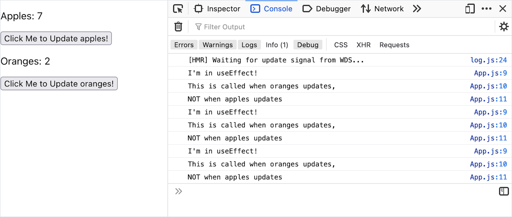
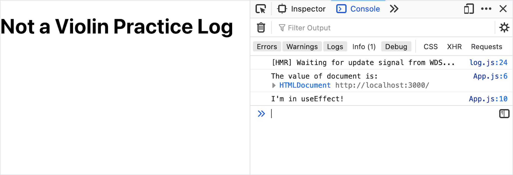

# useEffect After Render

## Introduction

During the first time that an instance of a component appears, the component initializes state (if it has any). After that, every time that component's state updates, the component re-renders.

This React feature is extremely useful! It allows us to rely on React reliably keeping the UI up to date.

However, there are certain situations where this feature _causes problems_. Here are some examples:

1. A `Timer` component that is responsible for starting and keeping an uninterrupted ten-minute timer, even if the appearance of the timer changes
1. A `RestaurantList` component that gets a list of restaurants from the Yelp API once. The API call to the Yelp API should only be made once, even when the user marks a restaurant as a "favorite."
1. A `VideoPlayer` component that loads a large movie file from an API once, even if the volume bar is adjusted.

In each of these examples, we can expect the state of the component to change, but we need more control over what happens during each re-render. What do we need to learn in order to build these features?

## The Component Lifecycle

Under-the-hood, the React library manages components through a process called _[the component lifecycle](https://reactjs.org/docs/react-component.html#the-component-lifecycle)_. **The component lifecycle** is the name of the three stages that each React component goes through:

| Stage            | Description                                                                        |
| ---------------- | ---------------------------------------------------------------------------------- |
| Mounting Stage   | Occurs when an instance of a component is being created and inserted into the DOM. |
| Updating Stage   | Occurs when a component is being re-rendered.                                      |
| Unmounting Stage | Occurs when a component is being removed from the DOM.                             |


During each stage, each component calls a set of different and unique functions that are defined under-the-hood. These functions are hidden from view.

During the mounting stage, a component will calls these functions, in this exact order.:

1. `constructor()`
1. `getDerivedStateFromProps()`
1. `render()`
1. `componentDidMount()`

On the other hand, during the _updating stage_, components call this different set of functions in this order:

1. `getDerivedStateFromProps()`
1. `shouldComponentUpdate()`
1. `render()`
1. `getSnapshotBeforeUpdate()`
1. `componentDidUpdate()`

Finally, during the _unmounting stage_, components call this function:

1. `componentWillUnmount()`

Again, we haven't seen these before because all of these functions are defined and invoked under-the-hood in the React library.

Becoming aware of the stages and phases in the component lifecycle gives us more insight for our code. The most important functions be aware of are:

1. `componentDidMount()`
1. `componentDidUpdate()`
1. `componentWillUnmount()`

We can visit [this official interactive diagram showing the lifecycle methods](https://projects.wojtekmaj.pl/react-lifecycle-methods-diagram/) as a starting place for more research.

### !callout-warning

## The Balance of "It's Not Important Until it Is"

Why didn't we learn about the component lifecycle before? This knowledge describes when and how a component is rendered! And how much are we supposed to learn about the component lifecycle now? Is awareness of the different stages and phases really enough? The answer is: details about the component lifecycle aren't important, until they are!

<br/>

It may be frustrating to hear that knowledge about the component lifecycle isn't important until it is. What does "it's not important until it is" even mean? It isn't the last time we'll hear the phrase! This phrase comes up when details usually won't help us solve the problem at hand. When we're coming up against a new problem to solve or debug, we can re-evaluate the relevance of the component lifecycle.

<br/>

What do we, as developers, do when we come across this phrase? We:

1. Gain awareness of the topic and when it comes up
1. Keep refining our question-asking debugging skills

<br/>

Targeted questions will bring us back to this topic when we need to. Imagine debugging a React app. We may find ourselves asking, "I think this bug is related to when the component renders, when does React render a component?" or "This occurs the first time a component appears, but not when a component re-renders, is there a difference in React?" When we work on code, if we can ask specific questions such as these, we'll eventually find a reason to learn more about the component lifecycle.

### !end-callout

## `useEffect` Executes After Render

Different [React hooks](https://reactjs.org/docs/hooks-intro.html) allow us to "hook" into specific parts of the lifecycle.

The [**`useEffect` hook**](https://reactjs.org/docs/hooks-effect.html) is a hook function that runs during these lifecycle steps:

- `componentDidMount`
- `componentDidUpdate`
- `componentWillUnmount`

This means that the `useEffect` hooks runs:

- once in the Mounting stage, after the component is successfully inserted into the DOM and fully renders
- once in the Update stage, after the component fully updates and re-renders
- once in the Unmounting stage, right before the component is removed from the DOM

There is an important pattern here: both `componentDidMount` and `componentDidUpdate` occur **_after_** a component fully renders.

In summary, we can say that `useEffect` is called after a component renders.

## Calling `useEffect`

To use the `useEffect` hook, we call the `useEffect` function with two parameters:

1. A function that describes what to do _after the component fully renders_ during `componentDidMount` and `componentDidUpdate`.
1. A "dependency" array. The array contains references to any _props or state_ to _watch_. Whenever any watched props or state update, `useEffect` will run as part of `componentDidUpdate`.
   - If we don't define this array, `useEffect` will be called during _every_ `componentDidUpdate`.
   - This array can be empty `[]` to indicate we are not watching for any updates.

### Syntax: Executing `useEffect` After Specific Values Change

Firstly, each file that uses `useEffect` should import it:

```js
import { useEffect } from "react";
```

Now, observe this example of `useEffect`:

<!-- prettier-ignore-start -->
```js
import { useState, useEffect } from 'react';

function App() {

  const [pieceOfState, setPieceOfState] = useState(0);

  useEffect(() => {
    console.log('I\'m in useEffect!');
    console.log('This will be called whenever an instance of this component mounts');
    console.log('or whenever pieceOfState is updated');
  }, [pieceOfState]);

  return (<div>
    <button onClick={() => setPieceOfState(pieceOfState + 1)}>Click Me to Update pieceOfState!</button>
  </div>);
}
```
<!-- prettier-ignore-end -->

| <div style="min-width:200px;"> Piece of Code </div> | Notes                                                                                                                                                                                               |
| --------------------------------------------------- | --------------------------------------------------------------------------------------------------------------------------------------------------------------------------------------------------- |
| `import { useState, useEffect } ...`                | In this example, we're importing both `useState` and `useEffect` from React. Continuing to use valid object destructuring, we can list comma-separate them.                                         |
| `const [pieceOfState ... ;`                         | As part of this example, we are creating some state named `pieceOfState`, with an initial value of `0`.                                                                                             |
| `useEffect(..., ...);`                              | Within our component function, we use this hook by invoking it.                                                                                                                                     |
| `() => { ... }`                                     | The first parameter of `useEffect` is a function.                                                                                                                                                   |
| `console.log ...`                                   | **Replace these statements** with the logic to run after a component mounts or updates. In this example, we are printing several things to the console.                                             |
| `[pieceOfState]`                                    | **Replace this** with an array of dependencies. Whenever any item in this array updates, the `useEffect` function runs. In this example, `useEffect` will run in every time `pieceOfState` updates. |
| `return (...);`                                     | This component function still needs to return a JSX object.                                                                                                                                         |
| `<button ...>...</button>`                          | In this example, we are creating a button. When the button is clicked, it runs an anonymous one-line function that updates `pieceofState`.                                                          |

When we run our app, we'll see this console output after the `App` component initially renders, as part of `componentDidMount`!

```
I'm in useEffect!
This will be called whenever an instance of this component mounts
or whenever pieceOfState is updated
```

We'll also see it whenever we click the button, which updates `pieceOfState`.

#### Dependency Arrays With Selective `useEffect` Calls

Let's observe an example to demonstrate the dependency list even more. In this case, we have two pieces of state: `apples` and `oranges`.

<!-- Simon note: Awkward grammar, but I want the "we've specified ... when oranges is updated" explanation first, before pointing out it was through the syntax [oranges]. Open for suggestions if the order of "info revealed" remains. -->

We've specified that `useEffect` should _only_ run when **`oranges`** is updated. We accomplished this by passing in `[oranges]` as the second parameter to `useEffect`.

<!-- prettier-ignore-start -->
```js
import { useState, useEffect } from 'react';

function App() {

  const [apples, setApples] = useState(0);
  const [oranges, setOranges] = useState(0);

  useEffect(() => {
    console.log('I\'m in useEffect!');
    console.log('This is called when oranges updates,');
    console.log('NOT when apples updates');
  }, [oranges]);

  return (<div>
    <p>Apples: {apples}</p>
    <button onClick={() => setApples(apples + 1)}>Click Me to Update apples!</button>
    <p>Oranges: {oranges}</p>
    <button onClick={() => setOranges(oranges + 1)}>Click Me to Update oranges!</button>
  </div>);
}
```
<!-- prettier-ignore-end -->



In this example, we've clicked on the "apples" button seven times, but we don't see seven print statements from `useEffect`. Instead, we only see our print statements three times: once after the component mounted, and two more times from clicking the "oranges" button.

If we wanted `useEffect` to run when _either_ `apples` or `oranges` updates, we should pass in `[apples, oranges]`.

### Executing `useEffect` Only After Mounting, Not After Updating

Sometimes, we have logic we want to execute **only** after the component is initially mounted, and we don't need it to run on update.

To achieve this, we should ensure that our second parameter, the dependency list, is an empty array.

<!-- prettier-ignore-start -->
```js
import { useState, useEffect } from 'react';

function App() {

  useEffect(() => {
    console.log('I\'m in useEffect!');
    console.log('This will be called ONLY when an instance of this component mounts');
    console.log('because our dependency list is empty');
  }, []);

  return (<h1>Demonstration of useEffect only called during mounting stage</h1>);
}
```
<!-- prettier-ignore-end -->

| <div style="min-width:200px;"> Piece of Code </div> | Notes                                                                                                                                                                           |
| --------------------------------------------------- | ------------------------------------------------------------------------------------------------------------------------------------------------------------------------------- |
| `useEffect(..., ...);`                              | We still call `useEffect`                                                                                                                                                       |
| `() => { ... }`                                     | Our first argument is still a function that should execute after the component is rendered                                                                                      |
| `[]`                                                | The second argument is an empty array, to express that there _are no dependencies_ to watch for. Essentially, there are _no_ dependencies that should cause `useEffect` to run. |

## Example: Changing `document`

Let's explore an example React app that will showcase the importance of when `useEffect` runs.

Just like static-site development using HTML, CSS, and vanilla JS, JavaScript can execute faster than the DOM is built.

In vanilla JS, we handled this problem by listening for the event "DOMContentLoaded":

<!-- prettier-ignore-start -->
```js
document.addEventListener("DOMContentLoaded", () => { console.log('We can manipulate the DOM now!'); });
```
<!-- prettier-ignore-end -->

React encounters the same problem! Imagine this `App` component, where we access the global variable `document`, and print it to the console.

<!-- prettier-ignore-start -->
```js
function App() {

  console.log('The value of document is:', document);

  return (<div>
    <h1 id="title">Violin Practice Log</h1>
  </div>);
}
```
<!-- prettier-ignore-end -->


_However_, if we try to directly manipulate the DOM as part of our `App` component function...

<!-- prettier-ignore-start -->
```js
function App() {

  console.log('The value of document is:', document);
  document.getElementById('title').textContent = "Not a Violin Practice Log";

  return (<div>
    <h1 id="title">Violin Practice Log</h1>
  </div>);
}
```
<!-- prettier-ignore-end -->

We'll get an error stating that `document.getElementById('title')` is `null`!

```
Uncaught TypeError: document.getElementById(...) is null
```


### Switching to `useEffect`

In order to directly manipulate the DOM in our component, we need to wait for the DOM to fully build, and our components to finish rendering.

This is a great use case for `useEffect`! We can:

1. Import `useEffect`
1. Move our logic into a new function, which we pass into `useEffect`

<!-- prettier-ignore-start -->
```js
import { useEffect } from 'react';

function App() {

  console.log('The value of document is:', document);

  useEffect(() => {
    document.getElementById('title').textContent = "Not a Violin Practice Log";
    console.log('I\'m in useEffect!');
  }, []);


  return (<div>
    <h1 id="title">Violin Practice Log</h1>
  </div>);
}
```
<!-- prettier-ignore-end -->

With this adjustment, we can confidently observe that the DOM was successfully manipulated _after_ the component rendered, as part of `useEffect`.



### !callout-info

## Manipulating `document` in `useEffect`?

Our above example successfully manipulated the DOM using the `useEffect` hook. This isn't necessarily a realistic example! In practice, we'd likely _not_ manipulate the DOM directly, and if we did, we'd likely use a different hook, `useRef`. Follow your curiosity!

### !end-callout

### Using `useEffect` to call APIs

Our primary use for the `useEffect` hook will be to make API calls after a component mounts.

We could make API calls inside a component function without caring about the lifecycle, but then API requests would run every time our function was called (i.e., every time the component get re-rendered).

Further, the API call might delay the rendering of our component leading to the app "hanging," and not responding to the user.

It's more advantageous to make API calls asynchronously after the app is fully rendered on the screen. The user gets immediate feedback that the page is loaded and data can appear as it is retrieved.

## Check for Understanding

<!-- Question 1 -->
<!-- prettier-ignore-start -->
### !challenge
* type: checkbox
* id: b4873684
* title: useEffect After Render
##### !question

Check all lifecycle functions where `useEffect` function is called.

##### !end-question
##### !options

* `constructor()`
* `getDerivedStateFromProps()`
* `render()`
* `componentDidMount()`
* `shouldComponentUpdate()`
* `getSnapshotBeforeUpdate()`
* `componentDidUpdate()`
* `componentWillUnmount()`

##### !end-options
##### !answer

* `componentDidMount()`
* `componentDidUpdate()`
* `componentWillUnmount()`

##### !end-answer
### !end-challenge
<!-- prettier-ignore-end -->

<!-- Question 2 -->
<!-- prettier-ignore-start -->
### !challenge
* type: checkbox
* id: 7e4ff3f0
* title: useEffect After Render
##### !question

Consider this code:

```js
import { useState, useEffect } from 'react';

const Timer = () => {
  const [currentTime, setCurrentTime] = useState(0);
  const [isEnabled, setIsEnabled] = useState(false);

  useEffect(() => {

  }, [isEnabled]);
}

```

`useEffect` will run every time certain value(s) update. Which values will cause `useEffect` to run?

##### !end-question
##### !options

* `currentTime`
* `isEnabled`
* `Timer`
* None of the above

##### !end-options
##### !answer

* `isEnabled`

##### !end-answer
### !end-challenge
<!-- prettier-ignore-end -->

<!-- Question 3 -->
<!-- prettier-ignore-start -->
### !challenge
* type: checkbox
* id: d19f14f4
* title: useEffect After Render
##### !question

Consider this code:

```js
import { useState, useEffect } from 'react';

const Timer = () => {
  const [currentTime, setCurrentTime] = useState(0);
  const [isEnabled, setIsEnabled] = useState(false);

  useEffect(() => {

  }, [isEnabled, currentTime]);
}

```

`useEffect` will run every time certain value(s) update. Which values will cause `useEffect` to run?

##### !end-question
##### !options

* `currentTime`
* `isEnabled`
* `Timer`
* None of the above

##### !end-options
##### !answer

* `currentTime`
* `isEnabled`

##### !end-answer
### !end-challenge
<!-- prettier-ignore-end -->

<!-- Question 4 -->
<!-- prettier-ignore-start -->
### !challenge
* type: checkbox
* id: 4e323978
* title: useEffect After Render
##### !question

Consider this code:

```js
import { useState, useEffect } from 'react';

const Timer = () => {
  const [currentTime, setCurrentTime] = useState(0);
  const [isEnabled, setIsEnabled] = useState(false);

  useEffect(() => {

  }, []);
}

```

`useEffect` will run every time certain value(s) update. Which values will cause `useEffect` to run?

##### !end-question
##### !options

* `currentTime`
* `isEnabled`
* `Timer`
* None of the above

##### !end-options
##### !answer

* None of the above

##### !end-answer
### !end-challenge
<!-- prettier-ignore-end -->

### !callout-danger

## Our Examples Don't Utilize a Cleanup Function

On the subject of `useEffect` syntax, the `useEffect` hook also supports defining a _clean-up_ function. "Clean-up functions" describe functions responsible for "cleaning up potential side-effects," such as closing database connections.

<br/>

In the examples in this curriculum, there will not be many or any examples that use the cleanup function meaningfully.

<details>

<summary>For those curious, here's an example of defining a clean-up function.</summary>

In React, clean-up functions will run during `componentWillUnmount`. To define a clean-up function, we must _return_ the clean-up function inside our `useEffect` callback function.

<!-- prettier-ignore-start -->
```js
import { useEffect } from 'react';

function App() {

  useEffect(() => {
    console.log('I\'m in useEffect!');
    console.log('This will be called whenever an instance of this component mounts');

    return () => { console.log('useEffect calls the returned function during componentWillUnmount') };
  }, []);

  return (<h1>Demo of Clean-up Function Syntax</h1>);
}
```
<!-- prettier-ignore-end -->

In this example, our `useEffect` callback function returns a one-line, anonymous arrow function, which prints to the console.

</details>

### !end-callout
