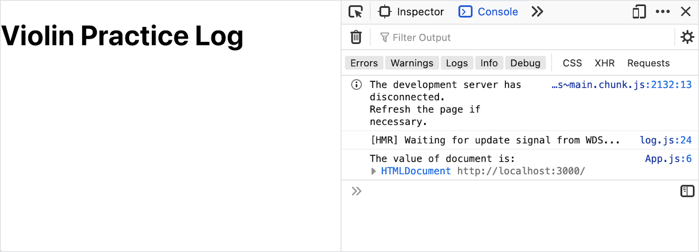

# useEffect After Render

<iframe src="https://adaacademy.hosted.panopto.com/Panopto/Pages/Embed.aspx?pid=a0db263e-e20d-4f45-95df-ad5100fd35d5&autoplay=false&offerviewer=true&showtitle=true&showbrand=false&start=0&interactivity=all" height="405" width="720" style="border: 1px solid #464646;" allowfullscreen allow="autoplay"></iframe>

## Introduction

During the first time that an instance of a component appears, the component initializes state (if it has any). After that, every time that component's state updates, the component re-renders.

This React feature is extremely useful! It allows us to rely on React keeping the UI up to date in response to state changes.

However, there are certain situations where this feature _causes problems_. Here are some examples:

1. A `Timer` component that is responsible for starting and keeping an uninterrupted ten-minute timer, even if the appearance of the timer changes. We don't want to restart the timer any time the visual appearance of the `Timer` updates.
1. A `RestaurantList` component that gets a list of restaurants from the Yelp API once. We don't want to make an api call to retrieve the data again simply because the user marks a restaurant as a "favorite."
1. A `VideoPlayer` component that loads a large movie file from an API once. We don't want to start downloading the movie again simply because the volume bar is adjusted.

In each of these examples, we expect the state of the component to change, but we need more control over what happens during each re-render. We need to know more about how React renders controls!

## The Component Lifecycle

Under-the-hood, the React library manages components through a process called _[the component lifecycle](https://reactjs.org/docs/react-component.html#the-component-lifecycle)_. **The component lifecycle** is the name of the three stages that each React component goes through:

| Stage            | Description                                                                        |
| ---------------- | ---------------------------------------------------------------------------------- |
| Mounting Stage   | Occurs when an instance of a component is being created and inserted into the DOM. |
| Updating Stage   | Occurs when a component is being re-rendered.                                  |
| Unmounting Stage | Occurs when a component is being removed from the DOM.                           |

React class components have specific [lifecycle methods](https://reactjs.org/docs/react-component.html#the-component-lifecycle) that we can use to hook into the component lifecycle. For React Hooks, we can use the `useEffect` hook to execute code during the `Mounting Stage`, `Updating Stage` and `Unmounting Stage`.

### !callout-warning

## The Balance of "It's Not Important Until it Is"

Why didn't we learn about the component lifecycle before? This knowledge describes when and how a component is rendered! And how much are we supposed to learn about the component lifecycle now? Is awareness of the different stages and phases really enough? The answer is: details about the component lifecycle aren't important, until they are!

<br/>

It may be frustrating to hear that knowledge about the component lifecycle isn't important until it is. What does "it's not important until it is" even mean? It isn't the last time we'll hear the phrase! This phrase comes up when details usually won't help us solve the problem at hand. When we're coming up against a new problem to solve or debug, we can re-evaluate the relevance of the component lifecycle.

<br/>

What do we, as developers, do when we come across this phrase? We:

1. Gain awareness of the topic and when it comes up
1. Keep refining our question-asking debugging skills

<br/>

Targeted questions will bring us back to this topic when we need to. Imagine debugging a React app. We may find ourselves asking, "I think this bug is related to when the component renders, when does React render a component?" or "This occurs the first time a component appears, but not when a component re-renders, is there a difference in React?" When we work on code, if we can ask specific questions such as these, we'll eventually find a reason to learn more about the component lifecycle.

### !end-callout

## `useEffect` Executes After Render

The [**`useEffect` hook**](https://reactjs.org/docs/hooks-effect.html) is a hook function that runs during these lifecycle steps:

- `Mounting Stage`
- `Updating Stage` - When specific props or state variables change
- `Unmounting Stage`

This means that the `useEffect` hooks can run:

- Once in the `Mounting Stage`, *after* the component is successfully inserted into the DOM and fully renders
- In the `Update Stage`, after a prop or state variable changes
- Once in the `Unmounting Stage`, right before the component is removed from the DOM

In summary, we can say that `useEffect` is called after a component renders.

## Calling `useEffect`

To use the `useEffect` hook, we call the `useEffect` function with two parameters:

1. A callback function that describes what to do _after the component fully renders_ just after the `Mounting Stage` or during `Update Stage`.
1. A "dependency" array. This array contains references to any _props or state_ to _watch_. Whenever any watched props or state update, `useEffect` will run.
   - If we don't define this array, `useEffect` will be called during _every_ `Update Stage`. That is, every time the component re-renders.
   - This array can be empty `[]` to indicate we are not watching for any updates.
     - This means that the given callback function will only run once, when the component first renders.

### Syntax: Executing `useEffect` After Specific Values Change

First, each file that uses `useEffect` should import it:

```js
import { useEffect } from "react";
```

Now, consider the following example of `useEffect`.

Keep in mind that this should not be taken as an example of how to log output in response to a button press, since we could simply do that directly in an event handler. Instead, we can imagine there being multiple ways that the monitored state value could be updated. And rather than logging, we could take any number of actions in response to the state change.

<!-- prettier-ignore-start -->
```js
import { useState, useEffect } from 'react';

function App() {

  const [pieceOfState, setPieceOfState] = useState(0);

  useEffect(() => {
    console.log('I\'m in useEffect!');
    console.log('This will be called whenever an instance of this component mounts');
    console.log('or whenever pieceOfState is updated');
  }, [pieceOfState]);

  return (
    <div>
      <button onClick={() => setPieceOfState(pieceOfState + 1)}>Click Me to Update pieceOfState!</button>
    </div>
  );
}
```
<!-- prettier-ignore-end -->

| <div style="min-width:200px;"> Piece of Code </div> | Notes                                                                                                                                                                                               |
| --------------------------------------------------- | --------------------------------------------------------------------------------------------------------------------------------------------------------------------------------------------------- |
| `import { useState, useEffect } ...`                | In this example, we're importing both `useState` and `useEffect` from React. Object destructuring syntax lets us list multiple comma-separated values.                                       |
| `const [pieceOfState ... ;`                         | As part of this example, we are creating some state named `pieceOfState`, with an initial value of `0`.                                                                                           |
| `useEffect(..., ...);`                              | Within our component function, we use this hook by invoking it.                                                                                                                                   |
| `() => { ... }`                                     | The first parameter of `useEffect` is a function.                                                                                                                                                 |
| `console.log ...`                                   | **Replace these statements** with the logic to run after a component mounts or updates. In this example, we are printing several things to the console.                                           |
| `[pieceOfState]`                                    | **Replace this** with an array of dependencies. Whenever any item in this array updates, the `useEffect` function runs. In this example, `useEffect` will run every time `pieceOfState` updates. |
| `return (...);`                                     | This component function still needs to return a JSX object.                                                                                                                                       |
| `<button ...>...</button>`                          | In this example, we are creating a button. When the button is clicked, it runs an anonymous one-line function that updates `pieceOfState`.                                                        |

When we run our app, we'll see this console output after the `App` component initially renders, as part of `componentDidMount`!

```
I'm in useEffect!
This will be called whenever an instance of this component mounts
or whenever pieceOfState is updated
```

We'll also see it whenever we click the button, which updates `pieceOfState`, since `pieceOfState` is listed as a dependency for the `useEffect` call.

#### Dependency Arrays With Selective `useEffect` Calls

Let's examine another example to deepen our understanding of the dependency list. In this case, we have two pieces of state: `apples` and `oranges`.

<!-- Simon note: Awkward grammar, but I want the "we've specified ... when oranges is updated" explanation first, before pointing out it was through the syntax [oranges]. Open for suggestions if the order of "info revealed" remains. -->

In the example below, the callback function passed into `useEffect` will _only_ run when the `oranges` state variable changes. This is because we have specified `[oranges]` as the dependency array.

<!-- prettier-ignore-start -->
```js
import { useState, useEffect } from 'react';

function App() {

  const [apples, setApples] = useState(0);
  const [oranges, setOranges] = useState(0);

  useEffect(() => {
    console.log('I\'m in useEffect!');
    console.log('This is called when oranges updates,');
    console.log('NOT when apples updates');
  }, [oranges]);

  return (
    <div>
      <p>Apples: {apples}</p>
      <button onClick={() => setApples(apples + 1)}>Click Me to Update apples!</button>
      <p>Oranges: {oranges}</p>
      <button onClick={() => setOranges(oranges + 1)}>Click Me to Update oranges!</button>
    </div>
  );
}
```
<!-- prettier-ignore-end -->

  
_Fig. Console output after clicking the apples button seven times and the oranges button twice_

In this example, we've clicked on the "apples" button seven times, but we don't see seven print statements from `useEffect`. Instead, we only see our print statements three times: once after the component mounted, and two more times from clicking the "oranges" button.

If we wanted `useEffect` to run when _either_ `apples` or `oranges` updates, we should pass in `[apples, oranges]`.

You can experiment with this code in a [Code Sandbox](https://codesandbox.io/s/apples-and-oranges-xwr8w?file=/src/App.js).

### Executing `useEffect` Only After Mounting, Not After Updating

Sometimes, we have logic we want to execute **only once** after the component is initially mounted, and we don't need it to run on update.

To achieve this, we should ensure that our second parameter, the dependency list, is an empty array.

<!-- prettier-ignore-start -->
```js
import { useState, useEffect } from 'react';

function App() {

  useEffect(() => {
    console.log('I\'m in useEffect!');
    console.log('This will be called ONLY when an instance of this component mounts');
    console.log('because our dependency list is empty');
  }, []);

  return (<h1>Demonstration of useEffect only called during mounting stage</h1>);
}
```
<!-- prettier-ignore-end -->

| <div style="min-width:200px;"> Piece of Code </div> | Notes                                                                                                                                                                           |
| --------------------------------------------------- | ------------------------------------------------------------------------------------------------------------------------------------------------------------------------------- |
| `useEffect(..., ...);`                              | We still call `useEffect`                                                                                                                                                       |
| `() => { ... }`                                     | Our first argument is still a function that should execute after the component is rendered                                                                                      |
| `[]`                                                | The second argument is an empty array, to express that there _are no dependencies_ to watch for. Essentially, there are _no_ dependencies that should cause `useEffect` to run. |

## Example: Changing `document`

Let's explore an example React app that will showcase the importance of when `useEffect` runs.

Recall that in static-site development using HTML, CSS, and vanilla JS, we saw that our JavaScript code can execute before the DOM is completely built. This meant we couldn't be certain that any particular DOM element was available when our script ran.

In vanilla JS, we handled this problem by listening for the "DOMContentLoaded" event:

<!-- prettier-ignore-start -->
```js
document.addEventListener('DOMContentLoaded', () => { console.log('We can manipulate the DOM now!'); });
```
<!-- prettier-ignore-end -->

We can encounter a similar problem in React.

What if we had a component with logic to locate and update a particular page element. Let's assume this element is rendered using the JSX result from our component.

How can we get a reference to the desired element from the DOM if our JSX hasn't been rendered yet?

We might try logging the value of the global `document` object to the console to see whether it looks like the DOM structure is available.

<!-- prettier-ignore-start -->
```js
function App() {

  console.log('The value of document is:', document);

  return (
    <div>
      <h1 id="title">Violin Practice Log</h1>
    </div>
  );
}
```
<!-- prettier-ignore-end -->

  
_Fig. Logging the value of `document` to check whether the desired elements are available_

The browser tools display a live reference to the `document` object. If we expand the `document` object, it might look like our content is in the DOM, available for us to access.

_However_, if we try to directly manipulate the DOM as part of our `App` component function...

<!-- prettier-ignore-start -->
```js
function App() {

  console.log('The value of document is:', document);
  document.getElementById('title').textContent = 'Not a Violin Practice Log';

  return (
    <div>
      <h1 id="title">Violin Practice Log</h1>
    </div>
  );
}
```
<!-- prettier-ignore-end -->

We'll get an error stating that `document.getElementById('title')` is `null`! Note that the exact wording of the error may vary depending on the browser we are using.

```
Uncaught TypeError: document.getElementById(...) is null
```

  
_Fig. Accessing the specific DOM element caused a null reference error_

### Switching to `useEffect`

In order to directly manipulate the DOM in our component, we need to wait for the DOM to fully build, and our components to finish rendering.

This sounds like a job for `useEffect`! We can:

1. Import `useEffect`
1. Move our logic into a new function, which we pass into `useEffect`

<!-- prettier-ignore-start -->
```js
import { useEffect } from 'react';

function App() {

  console.log('The value of document is:', document);

  useEffect(() => {
    console.log('I\'m in useEffect!');
    document.getElementById('title').textContent = 'Not a Violin Practice Log';
  }, []);


  return (
    <div>
      <h1 id="title">Violin Practice Log</h1>
    </div>
  );
}
```
<!-- prettier-ignore-end -->

With this adjustment, our DOM manipulation was successful! `useEffect` doesn't run until after the DOM is ready and our components are rendered.

  
_Fig. The DOM is successfully updated after moving the manipulation into an effect_

### !callout-info

## Manipulating `document` in `useEffect`?

Our above example successfully manipulated the DOM using the `useEffect` hook. This isn't a realistic example! In practice, we'd likely _not_ manipulate the DOM directly. With React, we do not directly access the DOM. Instead, we use the `ReactDOM` API and React components to add, update, and delete DOM elements.

Try thinking of a different way we could have updated the heading content in the previous examples _without_ getting a DOM element reference.

<br/>

There are still times where we might need a reference to an element that our control renders. In that case, we'd likely use a different hook, [`useRef`](https://reactjs.org/docs/hooks-reference.html#useref). Follow your curiosity!

### !end-callout

### Using `useEffect` to call APIs

Our primary use for the `useEffect` hook will be to make API calls after a component mounts.

We could make API calls inside a component function without caring about the lifecycle, but then API requests would run every time our function was called (i.e., every time the component gets re-rendered).

Further, the API call might delay the rendering of our component leading to the app "hanging," and not responding to the user.

It's more advantageous to make API calls asynchronously after the app is fully rendered on the screen. The user gets immediate feedback that the page is loaded and data can appear as it is retrieved.

## Check for Understanding

<!-- Question 1 -->
<!-- prettier-ignore-start -->
### !challenge
* type: checkbox
* id: 7e4ff3f0
* title: useEffect After Render
##### !question

Consider this code:

```js
import { useState, useEffect } from 'react';

const Timer = () => {
  const [currentTime, setCurrentTime] = useState(0);
  const [isEnabled, setIsEnabled] = useState(false);

  useEffect(() => {
    console.log('useEffect callback is running!');
  }, [isEnabled]);
}

```

`useEffect` will run every time certain value(s) update. Which values will cause the `useEffect` callback to run?

##### !end-question
##### !options

* `currentTime`
* `isEnabled`
* `Timer`
* None of the above

##### !end-options
##### !answer

* `isEnabled`

##### !end-answer
### !end-challenge
<!-- prettier-ignore-end -->

<!-- Question 2 -->
<!-- prettier-ignore-start -->
### !challenge
* type: checkbox
* id: d19f14f4
* title: useEffect After Render
##### !question

Consider this code:

```js
import { useState, useEffect } from 'react';

const Timer = () => {
  const [currentTime, setCurrentTime] = useState(0);
  const [isEnabled, setIsEnabled] = useState(false);

  useEffect(() => {

  }, [isEnabled, currentTime]);
}

```

`useEffect` will run every time certain value(s) update. Which values will cause `useEffect` to run?

##### !end-question
##### !options

* `currentTime`
* `isEnabled`
* `Timer`
* None of the above

##### !end-options
##### !answer

* `currentTime`
* `isEnabled`

##### !end-answer
### !end-challenge
<!-- prettier-ignore-end -->

<!-- Question 3 -->
<!-- prettier-ignore-start -->
### !challenge
* type: checkbox
* id: 4e323978
* title: useEffect After Render
##### !question

Consider this code:

```js
import { useState, useEffect } from 'react';

const Timer = () => {
  const [currentTime, setCurrentTime] = useState(0);
  const [isEnabled, setIsEnabled] = useState(false);

  useEffect(() => {

  }, []);
}

```

`useEffect` will run every time certain value(s) update. Which values will cause `useEffect` to run?

##### !end-question
##### !options

* `currentTime`
* `isEnabled`
* `Timer`
* None of the above

##### !end-options
##### !answer

* None of the above

##### !end-answer
### !end-challenge
<!-- prettier-ignore-end -->

### !callout-danger

## Our Examples Don't Utilize a Cleanup Function

On the subject of `useEffect` syntax, the `useEffect` hook also supports defining a _clean-up_ function. "Clean-up functions" describe functions responsible for "cleaning up potential side-effects," such as closing database connections.

<br/>

In the examples in this curriculum, there will not be many or any examples that use the cleanup function meaningfully.

<br/>

<details>

<summary>For those curious, here's an example of defining a clean-up function.</summary>

<br/>

In React, clean-up functions will run during `Unmounting Stage`. To define a clean-up function, we must _return_ the clean-up function inside our `useEffect` callback function.

<!-- prettier-ignore-start -->
```js
import { useState, useEffect } from 'react';

const ComponentWithCleanup = () => {

  useEffect(() => {
    console.log('I\'m in useEffect!');
    console.log('This will be called whenever an instance of this component mounts');

    return () => { console.log('useEffect calls the returned function during Unmounting Stage') };
  }, []);

  return (<h1>Demo of Clean-up Function Syntax</h1>);
};

function App() {
  const [showComponent, setShowComponent] = useState(true);

  const childComponent = showComponent ? (<ComponentWithCleanup />) : (<h1>Removed!</h1>);

  return (
    <div>
      { childComponent }
      <button onClick={() => setShowComponent(!showComponent)}>Update</button>
    </div>
  );
}
```
<!-- prettier-ignore-end -->

<br/>

In this example we define a `ComponentWithCleanup` component, which logs a message to the console in its cleanup function. The `App` component has a button that toggles whether to include the `ComponentWithCleanup` in the rendered output.

You can see a running example of this app in [CodeSandbox](https://codesandbox.io/s/green-violet-pwksu?file=/src/App.js).

<br/>

When the app is rendered, we see the messages logged to the console through the component's `useEffect` function. Then when we click the button, the component is removed from the rendered output, and we see the cleanup message appear in the console log.

</details>

### !end-callout

## Summary

The `useEffect` hook, allows us to define a function which will execute at specific points in the lifecycle of a component. In particular a `useEffect` callback function can be executed at the following points:

- `Mounting Stage`
- `Updating Stage`
- `Unmounting Stage`

This allows us to do things like:

1. Make an API call to retrieve data.
1. Close a database connection
1. Respond to changes in a prop or state variable value

Our primary use of the `useEffect` hook, will be to handle API calls.
