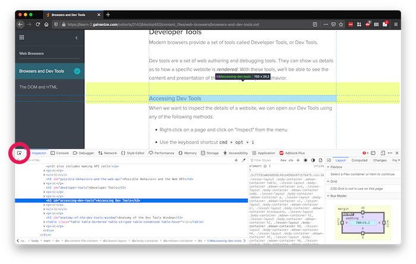

# Browsers and Dev Tools

<iframe src="https://adaacademy.hosted.panopto.com/Panopto/Pages/Embed.aspx?pid=2f2f7cd6-109d-49f3-b39e-addb01227e59&autoplay=false&offerviewer=true&showtitle=true&showbrand=false&captions=true&interactivity=all" height="405" width="720" style="border: 1px solid #464646;" allowfullscreen allow="autoplay"></iframe>

## Vocabulary and Synonyms

| Vocab     | Definition                              | Synonyms | How to Use in a Sentence                                                                                                                   |
| --------- | --------------------------------------- | -------- | ------------------------------------------------------------------------------------------------------------------------------------------ |
| Rendering | Displaying something visual to the user | Showing  | "How the Firefox browser renders that web page may be different compared to how Google Chrome renders it. That's why they look different." |

## The Browser Platform

The _browser_ is the platform that runs web apps in front of an end user.

When we develop the front-end layer for our web apps in code, the _browser_ is the platform that _renders_ it for the user. **Rendering** is the process of displaying it to the user.

As web developers, familiarity with the browser will help us understand its abilities and limitations. Understanding what the browser can and can't do will help us make usable, exciting, and reliable web apps!

## Developing for Web

As web developers, we will write code for our browser to render or run.

There are three separate responsibilities to consider when making a website:

1. Content
1. Presentation
1. Behavior

### Content

The _content_ of a website is all of its text, paragraphs, links, sections, headers, images, videos, etc.

Imagine a recipe blog. The contents of a recipe blog include:

- The paragraphs of story before the recipe
- The list of ingredients
- The directions and steps to take
- All images and photos related to the recipe
- Navigational links
- The logo of the recipe website and a link to go home
- The footer content that lists contact information about the author

### Presentation

The _presentation_ of a website is how the content looks on the page. This includes colors, fonts, layout, background images, and more.

In our fictional recipe blog, the presentation of the blog determines:

- The typeface, font size, and text color of the recipe
- Whether the list of ingredients is displayed vertically or horizontally
- The border and sizing of all images and photos
- Whether the navigational links are on the side of the website, on top, or on bottom
- Whether the logo changes colors when the cursor moves over it

#### Browser Default Styles

It's part of our job to decide how content is presented.

However, all browsers have _default styling_ which will affect our web app presentation. Over time, we'll become familiar with which styling comes from browser defaults.

### Behavior

The _behavior_ of a website is how the website acts, usually as a result of user interaction.

This includes what to do when forms are submitted, how to present and close any pop-up UI prompts (often referred to as modals), moving or re-arranging content, changing presentation, and more.

It also includes making API calls!

Our fictional recipe blog might have the following behavior:

- Listing ingredients that are needed based on the user inputting what's in their fridge
- Scrolling to the top of the page slowly after the user clicks "Scroll to Top"
- Rearranging recipes so that favorite recipes are listed first

#### Possible Behaviors and the Web API

A web browser keeps track of many things beyond rendering our websites. For example, browsers know where the mouse is positioned on the screen and they keep track of any [cookies](https://developer.mozilla.org/en-US/docs/Web/HTTP/Cookies).

## Introduction to Developer Tools

Modern browsers provide a set of tools called Developer Tools, or Dev Tools.

Dev tools are a set of web authoring and debugging tools. They can show us details as to how a specific website is _rendered_. With these tools, we'll be able to see the content and presentation of the site, and possibly the behavior.

### !callout-info

## Foreshadowing: Dev Tools Are for HTML, CSS, and JS development

Dev Tools are useful when we dive into the details of HTML, CSS, and JavaScript. But we haven't learned about them yet! For now, the best thing we can do is get familiar with what the tools look like and anticipate what they can do for us in the future.

### !end-callout

### Accessing Dev Tools

When we want to inspect the details of a website, we can open our Dev Tools using any of the following methods:

- Right-click on a page and click on "Inspect" from the menu
- Use the keyboard shortcut `cmd + opt + i` (⌥⌘`I`)
- Using the browser menu
  - In Mozilla Firefox, we use Tools > Browser Tools > Web Developer Tools
  - In Google Chrome, we use View > Developer > Developer Tools

Once we do that, the Dev Tools show us details about the current page we're on.

  
_Fig. Using Dev Tools to view details of a Learn lesson_

### Anatomy of the Dev Tools Window

There are two main sections to navigating the Dev Tools window to focus on right now:

1. The tabs. Each tab contains a different set of tools, which are useful in different situations.
1. The content area, which shows the details of whatever tab is selected.

  
_Fig. A closer look at the Dev Tools window. Notice the variety of tabs available, including Inspector, Console, Debugger, and many more!_

| Tab Name               | Description                                                                         |
| ---------------------- | ----------------------------------------------------------------------------------- |
| Inspector or Elements  | Contains details on the rendered HTML elements                                      |
| Console                | Has a JavaScript console using which we can interact with the current page                                  |
| Sources (Chrome)       | Contains details about static resources (HTML, CSS, and JS) loaded by the current page |
| Network                | Contains details about HTTP requests and responses that occur, in real-time            |
| Performance            | Contains tools for recording and testing the performance of rendering               |
| Memory                 | Contains details about memory usage and allocation, and tracking memory leaks          |
| Storage or Application | Contains details about things like local storage, cookies, cache, etc.                 |

When developing HTML and CSS, the most relevant tab is the Inspector/Elements tab.

Over time, we should explore our Dev Tools. We should open and use Dev Tools whenever we ask ourselves:

- What does the rendered HTML of this website look like?
  - What kind of HTML tags exist?
  - What are their attributes?
  - How are the HTML elements organized? For any given HTML element, what's nested inside it? What element contains it?
- What does the rendered styling of this website look like?
  - What are the CSS rules that are applied to our elements?
  - What is the position of our HTML element?
  - Why does our element look a certain way?

These questions will be more relevant to us as we dive deeper into front-end development.

### Inspecting Elements

We can inspect each element in our web page using Dev Tools. The Inspect tool will become more relevant as we explore HTML development.

We can use our cursor to select an element, or right-click and select "Inspect" to see its details.

  
_Fig. Using the Inspect tool (circled) to investigate a page_

### Positioning the Dev Tools

Dev Tools obstruct our view of the web page. We can make ourselves more comfortable by positioning our tools intentionally.

We can change the arrangement of our tools and how it docks into our browser. The three dots on the top right of the Dev Tools give us options to dock the tools to the bottom, left, or right of our browser, or open it in a new window.

  
_Fig. Accessing the dock controls for the Dev Tools_

We can make individual panes bigger or smaller by dragging their edges to the desired size.

## Check for Understanding

<!-- Question 1 -->
<!-- prettier-ignore-start -->
### !challenge
* type: multiple-choice
* id: 58ee6425
* title: Browsers and Dev Tools
##### !question

Which of the following is the most accurate definition of "default styling"?

##### !end-question
##### !options

* Default styling is the base set of styles that a webpage owns.
* Default styling is the set of principles of the bare minimum amount of styling we need to do in order to have a usable website.
* Default styling is an outdated set of principles used in older web development, where styles used to come from the browser only.
* Default styling describes a browser's set of styles. The browser applies these styles to every web page by default.

##### !end-options
##### !answer

* Default styling describes a browser's set of styles. The browser applies these styles to every web page by default.

##### !end-answer
##### !explanation

Browsers apply styles on the elements in a web page by default.

##### !end-explanation
### !end-challenge
<!-- prettier-ignore-end -->

<!-- Question 2 -->
<!-- prettier-ignore-start -->
### !challenge
* type: checkbox
* id: 4982f066
* title: Browsers and Dev Tools
##### !question

Check the main, separate responsibilities to consider when developing a website.

##### !end-question
##### !options

* Syntax
* Environment
* HTML/CSS
* Content
* Presentation
* Behavior

##### !end-options
##### !answer

* Content
* Presentation
* Behavior

##### !end-answer
### !end-challenge
<!-- prettier-ignore-end -->
