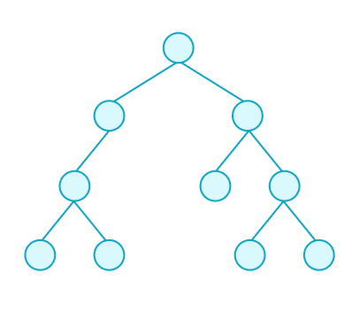

# The DOM and HTML

## Vocabulary and Synonyms

| Vocab   | Definition                                                                                                                                                          | Synonyms                  | How to Use in a Sentence                                                                                                                                          |
| ------- | ------------------------------------------------------------------------------------------------------------------------------------------------------------------- | ------------------------- | ----------------------------------------------------------------------------------------------------------------------------------------------------------------- |
| DOM     | A representation of the content of a webpage in the form of a tree data structure. The root node is an object that represents the document, or the entire web page. | Document Object Model     | "The DOM shows us how content on a web page has nested relationships with each other."                                                                            |
| Tree    | A data structure that resembles an upside down tree. Each piece of data is represented by a node, beginning with a root node.                                       | -                         | "The DOM is in a tree structure because it describes content nodes that point to other content nodes," "Tree data structures are used in some search algorithms." |
| Node    | A unit of data in a tree, which contains the data itself and a list of other nodes it points to. Each node can only have one parent node.                           | Branch or Leaf            | "A node can point to other nodes, which make them children nodes," "All nodes have a parent node except for the root node."                                       |
| HTML    | A markup language used to structure the content of a web page.                                                                                                      | Hypertext Markup Language |
| Element | A unit of content in an HTML document. These are represented as nodes in the DOM.                                                                                   | HTML Element              |
| Sibling | In a tree structure, a sibling node is a node that shares a parent with another node                                                                                |

### !callout-info

## Web Pages Are Documents

Some contexts may refer to a web page as a document.

### !end-callout

## The DOM

The Document Object Model, also known as **the DOM**, is a representation of the structured content on a web page.

The DOM is a _tree structure_. Each part of the document (or web page) is represented as a node in the tree.

### Trees

Trees are data structures which organize data through nodes and branches.

There is one root node. The root node has children nodes.

Those children nodes can also have their own child nodes! However, each node can either have exactly zero or one parent node.

When a web page is represented in the DOM structure, the root node of the tree is always a document object that represents the document itself.

Elements and pieces of content become children nodes to the document.

## HTML Elements Define Document Structure

We organize the content of a webpage using _HTML_.

**HTML**, or Hypertext Markup Language, is a language used to describe how the content is structured.

Using HTML, we will turn every piece of content into **HTML elements**. Each _element_ of content will be organized in the document as a child and/or sibling node. How we structure our content in HTML will have a direct effect on the structure of the DOM.

### Nested Elements

When an element is nested inside another element, we represent this in the DOM by forming a parent-child relationship between the elements.

### Sibling Elements

When two elements share a parent node, they are considered to be _sibling elements_.

## Example DOM and Relationships

Consider the following example DOM. Each node is an HTML element with a name.

In this diagram, the `html` element is the root element.

It has two children:

1. A `head` element
1. A `body` element

The `head` and `body` elements are siblings with each other.

The `head` element is contained inside the `html` element. It's a child of the `html` element. This `head` element itself, though, has three nested children elements:

1. A `title` element
1. A `meta` element
1. A second `meta` element

The `title`, `meta`, and `meta` elements are siblings with each other.

## Check for Understanding

<!-- Question 4 -->
<!-- prettier-ignore-start -->
### !challenge
* type: checkbox
* id: 6fc24d1e
* title: The DOM and HTML
##### !question

Consider this diagram that shows an example DOM.

Check each option that is true.

##### !end-question
##### !options

* The `ul` element contains three `li` elements
* The `h1`, `p`, and `ul` elements are siblings
* The `h1`, `p`, and `ul` elements are parents
* The `a`, `li`, `li`, and `li` elements are siblings
* The parent of the `a` element is the `p` element
* The `h1` element's parent is the `body` element
* The `body` element has three children elements
* The `title`, `meta`, `meta`, `h1`, `p`, and `ul` elements are all siblings

##### !end-options
##### !answer

* The `ul` element contains three `li` elements
* The `h1`, `p`, and `ul` elements are siblings
* The parent of the `a` element is the `p` element
* The `h1` element's parent is the `body` element
* The `body` element has three children elements

##### !end-answer
### !end-challenge
<!-- prettier-ignore-end -->

<!-- I'd love to add a second one of these if I could. :( -->
